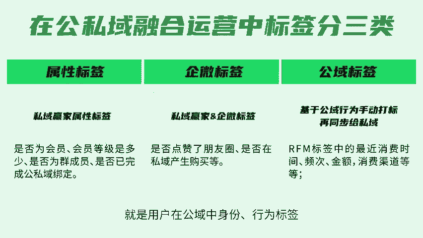
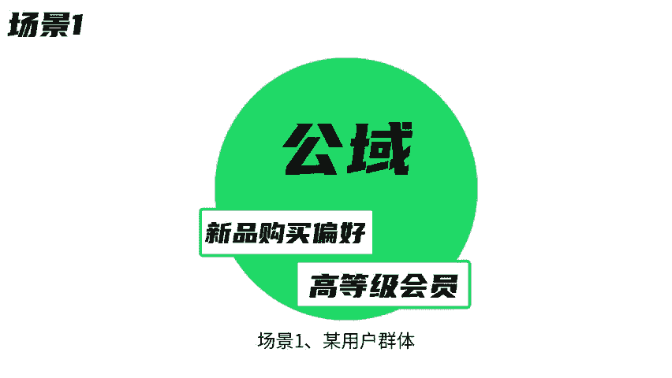
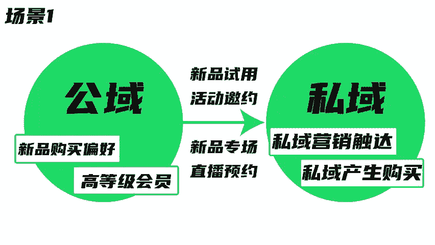
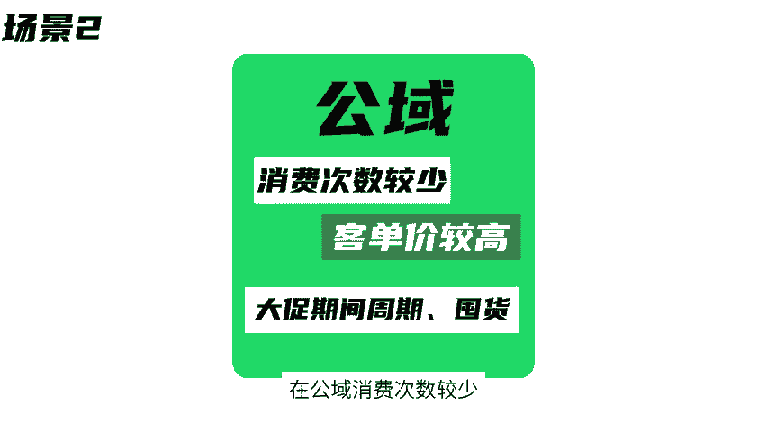
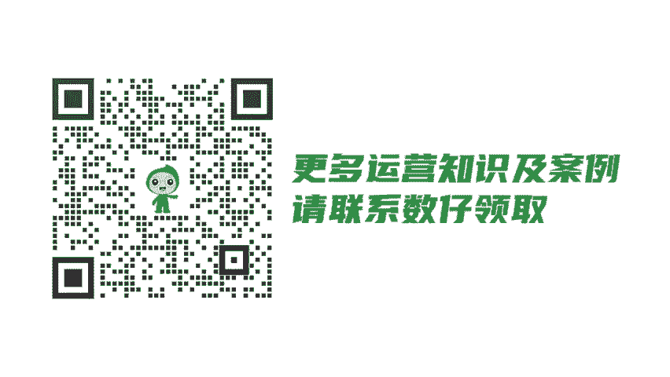

# 公私域融合运营，这样做人群分层才有效！ - P1 - 数云营销学院 - BV1WHHSetEzg

🎼做人群分层简单，但做有效的人群分层就难了。所谓有效就是能对运营、产品、营销、销售工作有帮助。比如我们区分定义了三类客户，可到底该怎么服务触达他们。什么时间什么场景，什么活动。

公司与融合运营的价值点之一，就是基于强大的标签体系，实现有效的人群细分，达到消费者精细化运营。一、标签应用。传统的私域运营，只能利用私域标签，数云公司与融合方案可以利用私域标签属性标签。

公寓标签做更精准的人群圈选。在公司与融合运营中标签分为三类，其中属性标签是基于用户身份巨大的标签，企为标签则是基于用户在私域中的行为巨大的标签。公域标签就是用户在公寓中身份行为标签。2、人群分层应用。

场景一，某用户群体在公寓有明显的新品购买偏好，且是高等级会员，但在私域。

🎼还未产生过购买，可在新品上新时通过私域进行营销触达，引导消费者在私域产生购买。场景2，某用户群体在公寓消费次数较少，但客单价较高，且固定在大促期间，具备周期或囤货属性。在大促期间。

品牌可以通过私域发送大促专属优惠券。在私域进行预售和尾款催付等通知，促进公寓成交转化。3、客户案例。

🎼某宠物品牌有核心商品组力猫粮和核心连带商品主力猫砂。从属性来看，二者皆有比较强的复购和囤货属性。二者目标客户重合度高，品牌希望能基于公司与运营，提升两个商品组的购买交叉率。品牌做了以下四个动作。

实现用户交叉下单率大步提升商品数据分析，制定核心策略，公寓达标，私域圈选人群触达。🎼总结来说，人群分层不是简单的对于人群的分类，而是需要结合业务实际需求进行的针对性分析和运营为前提。更多运营知识及案例。

请联系数载领取。

