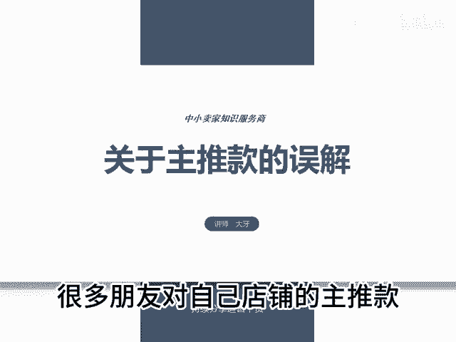
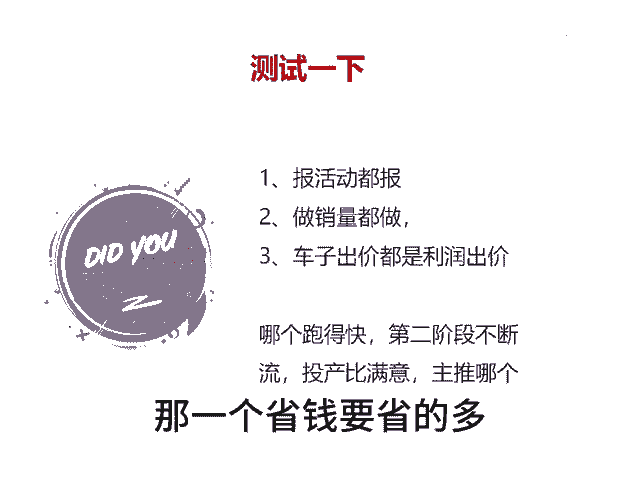

# 关于主推款的误解 - P1 - 千优电商教育 - BV1Gd2cY7ECZ

很多朋友对自己店铺的主推款他有误解。很多人他经常说吗，他我计划推这个链接。其实我想说的是呢，你计划推它没用啊，需要看平台想不想推你的链接。再一个是看消费者对你这个链接有没有需求。

所以我们永远不要自己指定主推款，愿让平台来选择呢，怎么选择呢？其实如果是非标品，那么你多上链接就可以。如果是标品同一个链接，你把它裂变成5个，那怎么裂变就标题不一样，价格不一样，SQ不一样。

轮播图不一样啊，然后呢我们测试一下嘛。有些朋友说我要不要做销量，如果做都做，如果不做销量都不做啊，如果报活动都报，如果不报都不报，然后车子出价呢，都按照利润出价，然后就观察就可以看哪个链接跑得快。

并且呢在第二阶段不断流，而且投产，你还相对满意的话，那么可以主推哪一个如果你说我这五个链接都跑不动。😡。

啊，或者说投产都不满意，那么你再上几个链接啊，在测试的时候多花的时间，这无所谓。测试的时候花点钱，这也无所谓。给你推广起来一个它根本不可能盈利的链接啊，那个省钱要省得多。我是讲师大牙。

欢迎大家扫码添加我的微信，不方便扫码的朋友可以添加我的微信号，80221430。在这里给大家准备到了一套新手运营入门的大礼包，希望能够帮助大家。😡。

