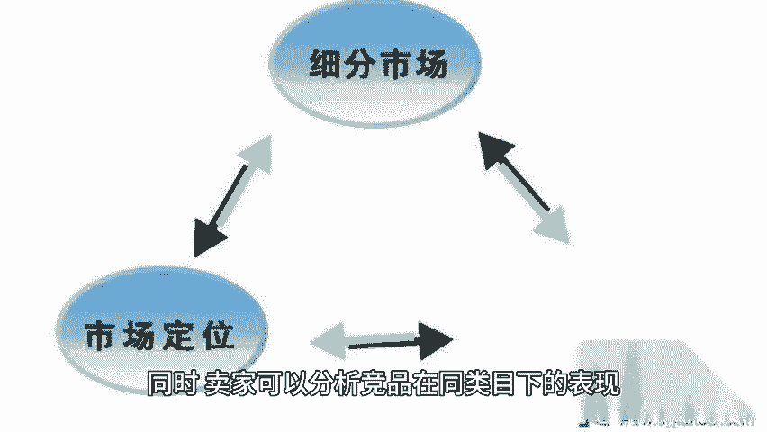

# 关键词转化率和类目转化率应该这样算！ - P1 - 小猛龙跨境俱乐部 - BV1ZtxLeFEMQ

🎼关键词转化率是指通过特定关键词广告点击后产生的订单数与该关键词广告点击数的比例。本期给大家分享关键词转化率和类目转化率算法，同时为大家准备了提高转化率和类目转化率的实操策略文档。老规矩回复转化率。

我来安排亚马逊计算公式为关键词转化率等于通过该关键词广告产生的订单数除以该关键词广告的总点击数乘以100。这个指标直接反映了关键词广告的效果，即广告点击转化为实际销售的能力。在亚马逊运营过程中。

高转化率意味着产品具有竞争优势。因为高转化率意味着你的产品有优势，可能会获得更多的流量，为了提高转化率，卖家需要根据数据情况进行分析。制定优化策略。

卖家可以通过亚马逊卖家后台的广告报告或第三方广告管理工具来获取这些数据，登录亚马逊卖家后台。

🎼导航至广告报告部分。🎼查找与关键词广告相关的报告。通常这些报告会列出每个关键词的点击次数、订单数量等详细信息。根据上述公式计算关键词转化率。由于亚马逊平台并不直接提供类目转化率的具体数值。

卖家需要通过一些间接方法来估算或了解这一指标，以下是一些常用的方法，利用品牌指标需要品牌备案，在亚马逊卖家后台的广告活动管理页面中的洞察和规划部分可以查看自己品牌在对应类目的平均转化率。

这里的品类中位数可以视为该类目下，品牌转化率的一个参考。但请注意，这并非严格意义上的类目转化率。而是品牌在该类目下的平均表现。通过亚马逊的商机探测器或其他市场分析工具。

搜索关键词并查看对应细分市场的发展趋势和搜索转化率数据。虽然这些数据是基于搜索量而非点击量。

🎼计算的，但可以作为类目转化率的一个间接参考。同时，卖家可以分析竞品在同类目下的表现，包括竞品的广告策略。

🎼产品定价、评价数量和质量等，以此来推测类目转化率的大致范围。结合销售数据和市场趋势，卖家可以结合自己的销售数据和市场趋势来估算类目转化率。例如观察一段时间内，该类目下产品的平均销量和点击量，通过计算。

得出一个大致的转化率范围。如果条件允许卖家可以咨询行业专家或机构来获取更准确的类目转化率数据。这些专家或机构通常具有丰富的市场经验和数据资源，能够提供更专业的分析和建议，篇幅有限。

获取高转化率和类目转化率的实操策略文档以及更多亚马逊运用小技巧，点赞关注评论。带你出海不迷路。