# 兼职第一步：如何注册微信公众号 - P1 - 渝粤题库 - BV1FxeAepEuv

hello，各各位好友们，各位粉丝朋友们，大家好。那我们今天呢就是说一下我们2024年下半年那个计划，就是我们愉悦教育的合伙人升级了，就是说合人计划升级了。就如果说你们是。在大学的在读书的。

那也有想或者就是你想提升学历的。就是说。😔，你们在做呃加入我们娱乐教育乐体库做这个。呃，之后呢是可以申请的一部分补贴的一部分补助。那我们今天呢就是重点是在于说一下这个微信公众号的注册。

因为很多小伙伴们呢就是说他们在注册公众号的时候是不会的。就是走了一些很多的弯路。我们今天来指一下这个。呃，公众号是怎么注册？那首先呢我们是先要找到这个微信公众平台。如果大家没有就是直接的链接呢就。

在百度搜索一下叫微信公众平台。我们首先是要注册这个。那一般呢就是问到我的呢，我会直接发这个链接给大家，大家直接去注册就好了。那，我们看一下啊，这里。记住啊，就是上面很多这个百度的广告。

大家就不要去对打理一下，看什么广告啊什么都仔细一点。那这里叫微信公众平台，你点击打开。打开了之后呢，这里可以看到一个立即注册。还没有就这个位置啊，我们。点击。点击了之后呢，就是说这里面有4种类型。

我们要的是。呃，公众号也就是公众号呢就是一个叫订阅号，一个叫服务号。如果是个人呢。他都是只能注册个人，以个人信息注册的话，只能注册订阅号。如果说你不是有营业执照的，不管是个体户还好。

还是那个公司的营业执照，那就可以注册呃。这个服务号也可以注册订阅号。就是说如果是个人只能就注册订阅号。如果是企业，就是这两个都可以注册。我们是因为是用嗯那个我们就直接我们是企业嘛，我们直接就点。6月号。

我个人推荐是订阅号。嗯。那我们这里先。点这里就是把自己的密码输进去。您先把这些密码输入进去啊。那这里开始一个验证码，验证码呢就是我们先要点击激活邮箱，激活邮箱。

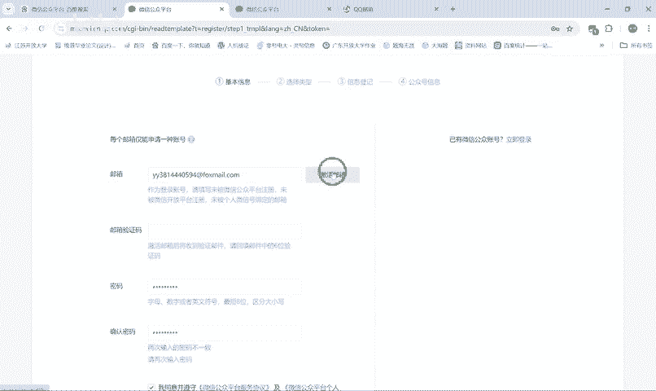

啊，这里输一个验证码。

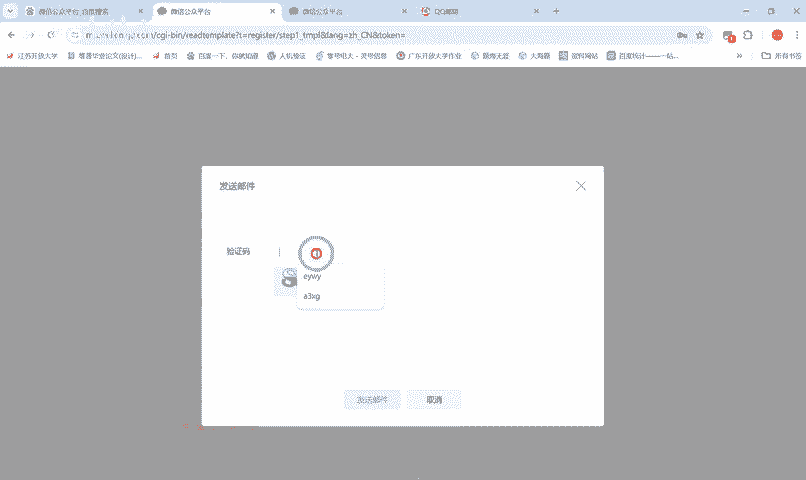

看没有这跳转的邮箱呢，邮箱这里等于说你在发送了之后呢。他就会收到一个这样一个验证码，6位数的验证码。看没有。下面有我们这样就点击开始注册了。一般的邮箱我都是推荐的是QQ邮箱的，QQ邮箱就可以了。

你有点击中国大陆，这肯定是中国大陆的。好了没有？订进来了之后有订阅号、服务号。和企业微信。😔，这几种我们因为是企业嘛，企业可以注册订阅号和服务号两种。那我们就是。服务号呢仅限于企业注册。

我们因为是需要呃频繁的去发一些通知啊啥的，所以说我们就用订阅号。确定。之后呢，就是如果说没有营业执照，这执照的朋友呢，就选个人，有营业执照的就选企业。我们这些都是以前输过的，所以说我们直接。

演牺上了这里间法人。好，我们现在看到没有？输完这些信息之后呢，要开始扫码，这是这是要扫码确认的。大家就是打开自己的微信扫码就可以了。来点确定，像这里还要发送一个验证码到你手机上。当你收到验证码了之后呢。

就输入进去就好了。这些就是不是这些都是选填，看到没有？整天就不用管了。

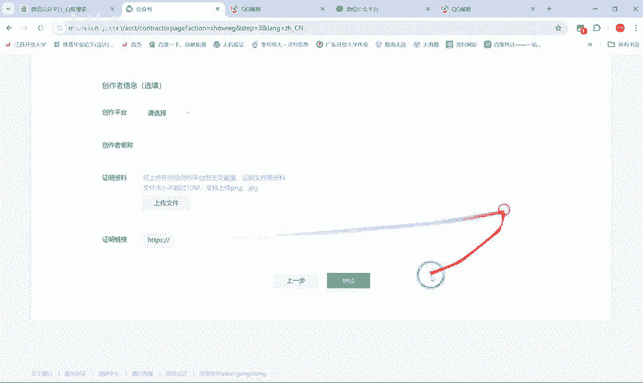

得点继续。那我们这个已经上线了，我们可以提交一下申请，申请多注册很多。

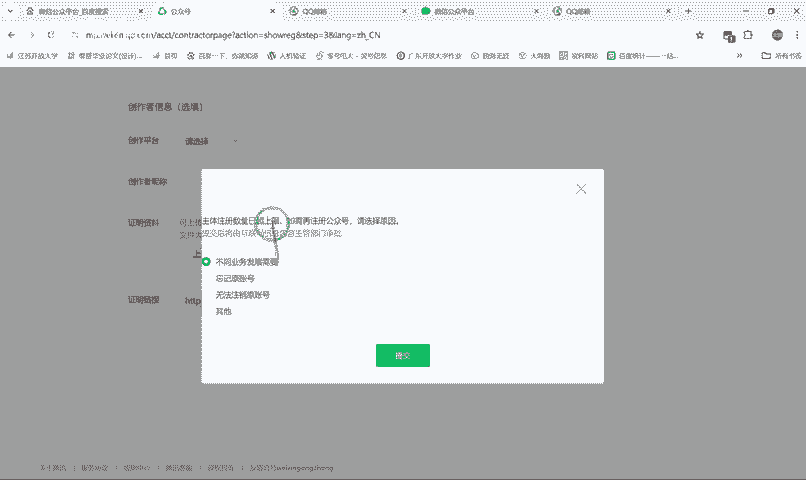

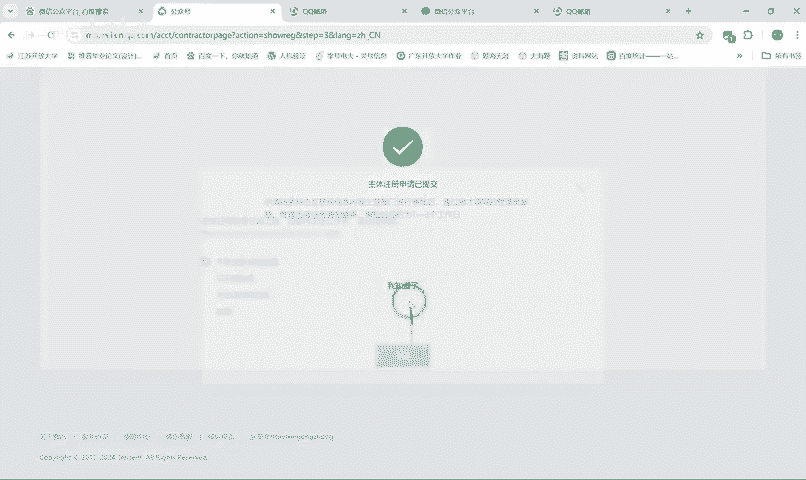

但是我们这边呢不妨碍，我们继续，我们可以换个。嗯，换个营业执照继续注册。

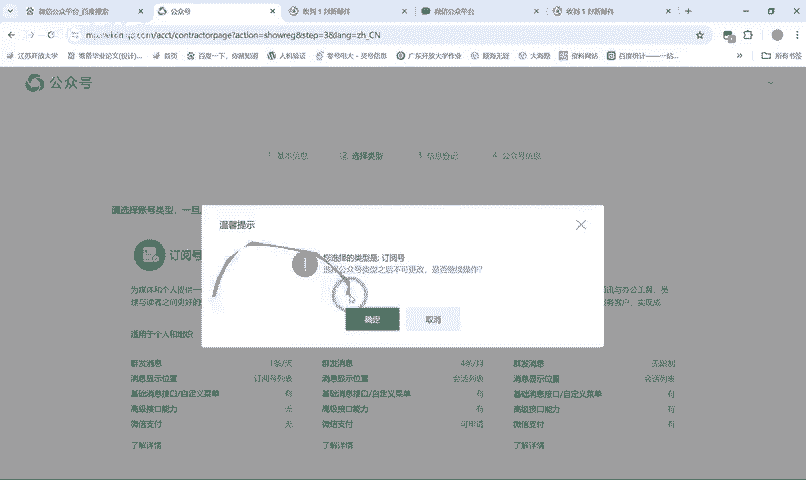

去注册就可以了。因为我们刚才那里是没有没有通过的。如就是说看到没有？没有绑定为银行卡是不能不能。不能做识别的。所以说就是。需要用法人的绑定微信，绑定银行卡的微信来。获取。来识别。

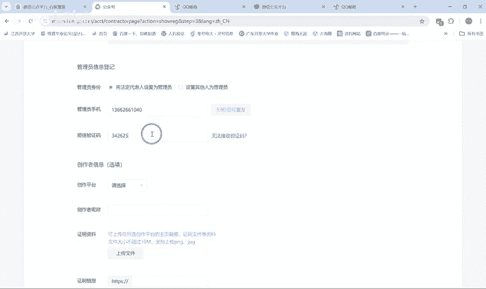

没有好，我们继续。看一下能不能通过。

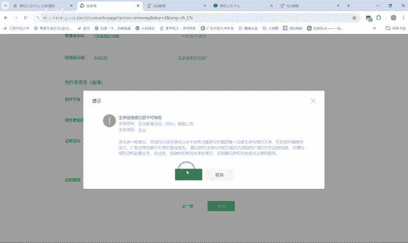

OK这通过了。那像在这里取名字的时候呢。要根据大家的习惯，我们一般是比如说是某某收题。嗯但是如果说我们这里是叉叉是写的某某，大家可以就是根据自己的习惯去去做一些修改呀啥的。那这里功能性介绍呢，我们都是。

都是复制，我都是复制我们以前的编编写好的一些公众号的。哎，这还复制不了。那反正就是反正复制就可以了，把这些弄弄下来。软件截图。可能，因为我们。嗯，这个。你截图截多一点吧。

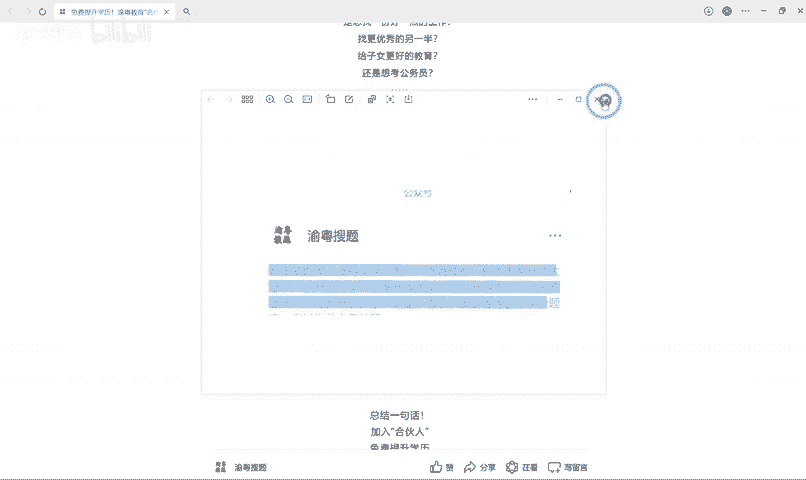

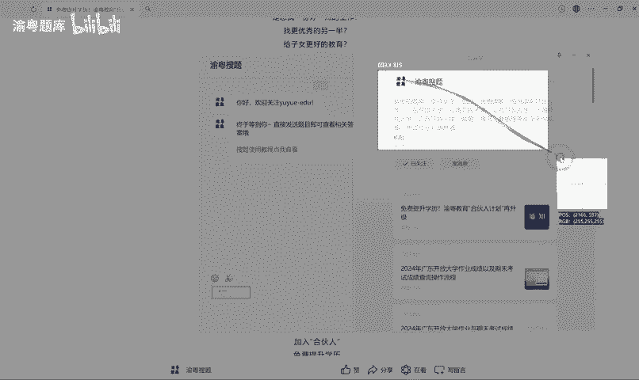

这样微信都是可以就截图下来，可以复制里面的文字。嗯。嗯，这里添加内幕呢，就是随便选这个倒无所谓。

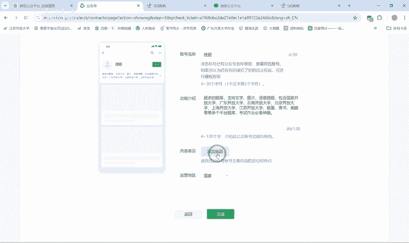

啊，看根据自己的去选就行了，选一个选三个都是可以的。选选选一个A也是可以的，反正自己选择选择。

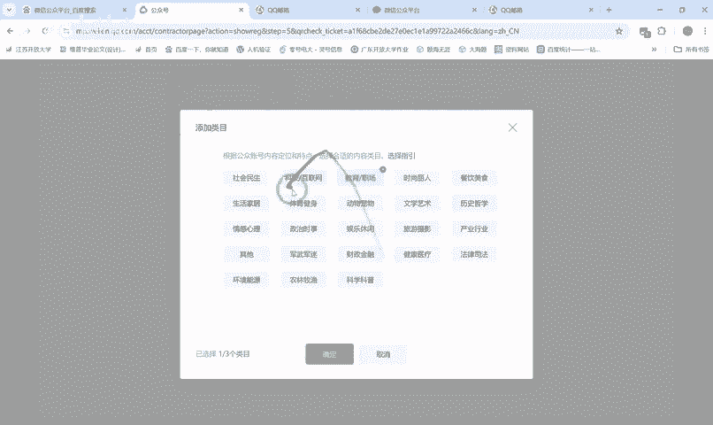

想着选多少就选多少，国家这肯定是中国的，我们是中国人。对不对？广东。我们也可以点江苏、重庆、海南、海边也都可以选的，这无所谓。那我们都是取名叫。马某某搜题。😔，把某某题库。啊。

怎么样的那这里我们取个什么名字呢？就叫。嗯。看一下名字有没有重复的。好，这里看到没有？这里是有重复名字的。大都可以看得到的，就是重复名字是肯定不能通过的。那我们想一个叫。叫什么呢？嗯。叫叫叫叫叫叫。

那比如说实在想不到名字啊，我们可以根据他自己所报的学校。嗯，来取名。比如说比如说从大。搜题对不对？你是重庆大学的，哎，写个重淡搜题。比如说你是我最近想娶一个什么呢？😔，嗯。对，还有就是你报名的机构。

那些机构很大，你叫什么名事？嗯。Ming。哎，那个这个叫什么名字来着？中公收题。可不可以，我们看一下。嗯，这是肯定是有点疑问题的。因为他会这样提醒。你中工的话是一个比较大的一个机构。嗯。嗯。

比如说我们这里取一个什么。比如说华为肯定也会提示哎，这个这个怎么怎么样。嗯，校园收题的名字重复的账号。也都是有的。QQ收钱。嗯哼。我们这里取个什么？Yue。😔，し。飞月搜题吧。那就直接就可以通过了。

因为名字呢我觉得是。

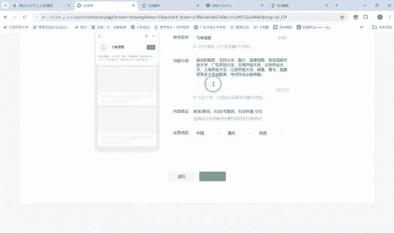

只要叫某某收题都是可以通就可以了，不用太多的行那个。

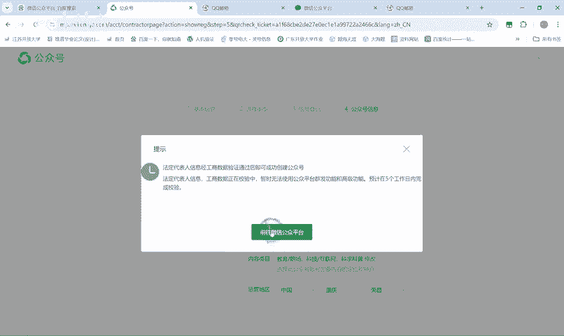

看到没有？我们这里就注册注册成功了，然后我们进来。进来基本上就看一下账号的情况。看没有，然后再设置一下微信号，设置一下头像，基本上就没什么弄的了。大也可以看一下。那基本上就是这么一个流程。

反正在注册的时候呢，大家根据自己的情况填就行了。现在注册什么东西都是。呃，是比较简单的，就跟着跟着填啊填啊填就可以了。好，我们说公众号注册的话就说到这里了，谢谢大家。

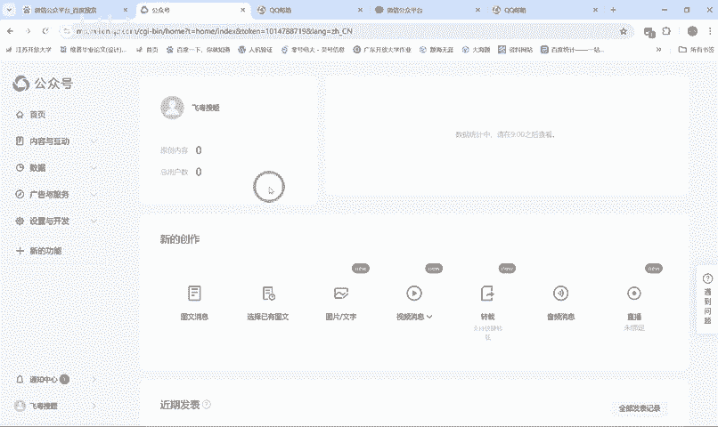