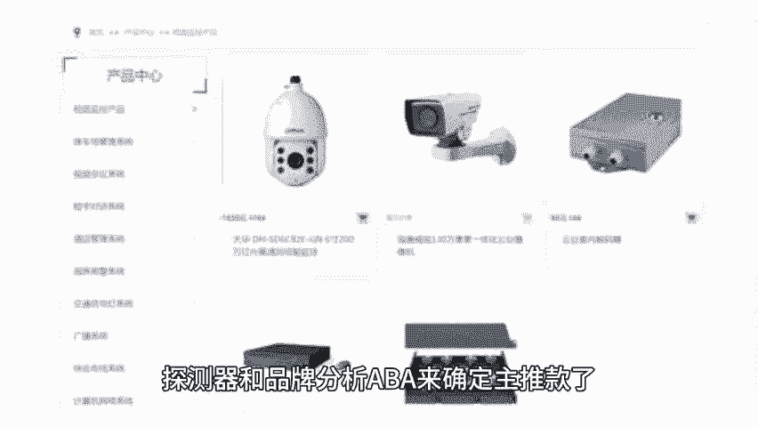
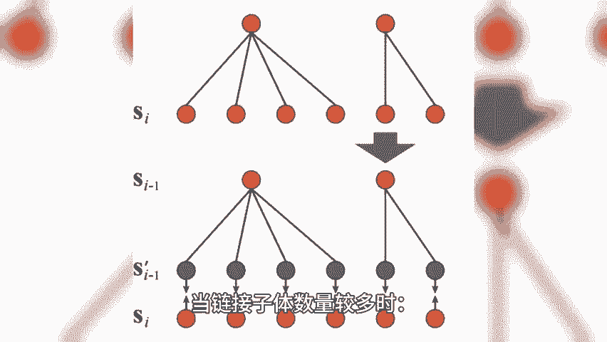
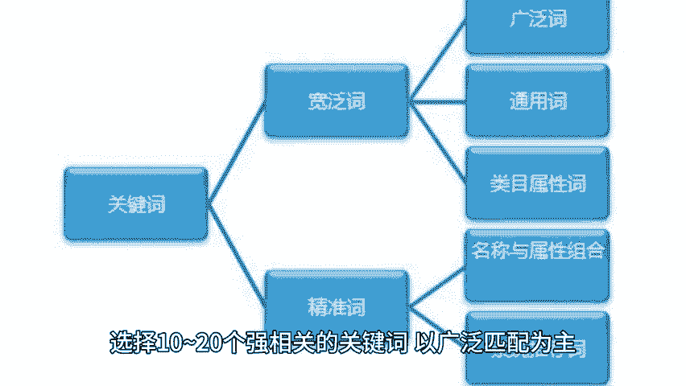

# 再谈亚马逊多变体广告策略 - P1 - 小猛龙跨境俱乐部 - BV1y4sbe5E1f

🎼早在7月份已经发布过关于多变体广告策略的文章以及策略。其中提到一些观点，本期给大家分享亚马逊多变体广告打法策略，同时给大家准备了亚马逊多变体广告实操流程，老规矩回复亚马逊变体，我来安排。

详细的可以去关注小猛龙跨境俱乐部官方公众号进行详细了解，但是截至现在还是有很多卖家朋友追问亚马逊多变体广告的打法。下面继续分享更详细的多变体广告策略。问题一，新品刚上线，如何确定产品的主推款。

产品的主推款是哪个判断的维度是什么呢？简单粗暴的维度就是销量，想要更加细化的可以是成功率和竞争环节。这些信息可以通过商机探测器和品牌分析ABA来确定，重点推广主推款的投放策略。

主推款是整个链接需求量最大的子体。采取重点推广主推款核心。🎼就是把大部分预算花到主推款，实现推动整个链接类目排名不断靠前。所以需要确保主推款是整个链接中价格最低的。

🎼确保主推款的库存是充足的，可以使用多种竞价策略投放各类关键词。该策略占据总预算70%。🎼虽然在投放之前，卖家已经通过商机探测器和品牌分析ABA来确定主推款了，但是这些判断都是基于过去的数据。

市场是在变化的，所有确保万一，然后需要自动广告进行数据准确性把握。策略如下，当链接子体数量不多时，开启自动广告，针对每个商品分别开启一个自动广告，并采用建议竞价，将预算控制在较低的范围进行推广。

当链接子体数量较多时，开启自动广告，将需要测试的所有相似商品放在同一广告活动中，并采用建议竞价，开启手动广告，将需要测试的所有相似商品放在同一广告活动中，选择10到20个强相关的关键词，以广泛匹配为主。

并采用建议竞价。该策略占据总预算之10%。

🎼其他子体互补流量策略如下，专属关键词开手动精准广告，采用建议竞价最高价，拦截低成本的长尾流量。广告位要求靠前开启手动广告商品投放品类，帮助多个子体间互相引流，不同子体获得曝光展示机会。

开启手动广告商品投放S应定投帮助多个子体间互相引流。不同子体获得曝光展示机会。该策略占据总预算20%。有些卖家会问，如上策略中为什么没有SDSB广告因为这个广告策略只针对多变体产品新品期的广告策略。

新品期更加建议卖家使用SP或得关键词流量从而推动关键词的自然排名。SDSB广告在这方面是比较薄弱的。🎼天幅有限，获取亚马逊多变体广告以及更多亚马逊运营小技巧，点赞、关注、评论，带你出海不迷路。

