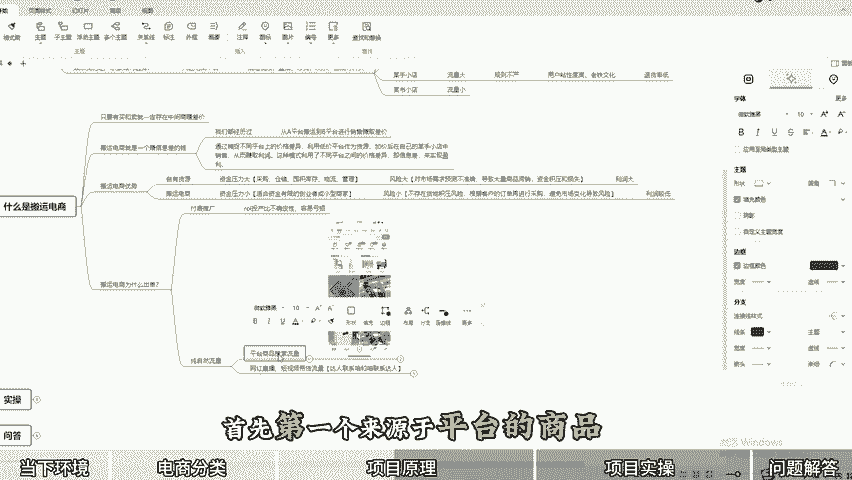
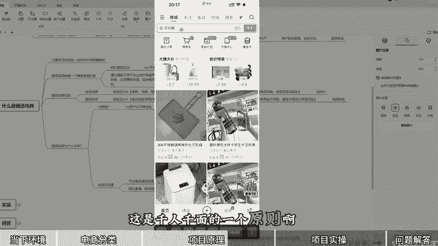
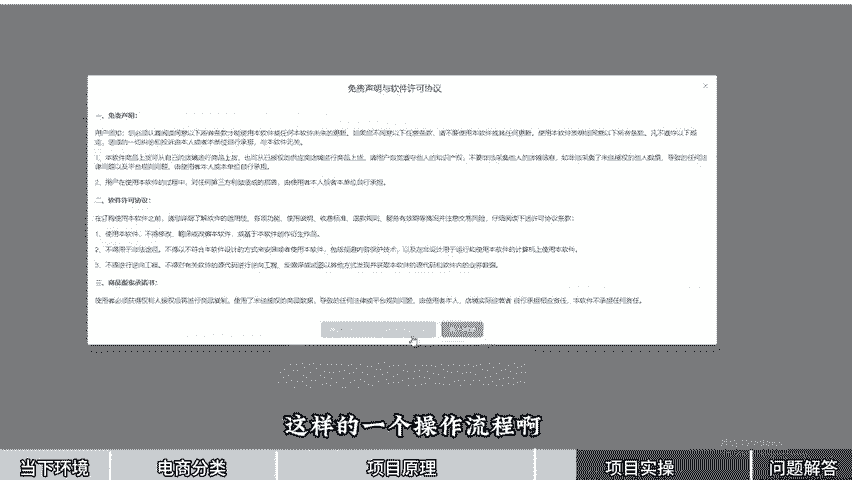
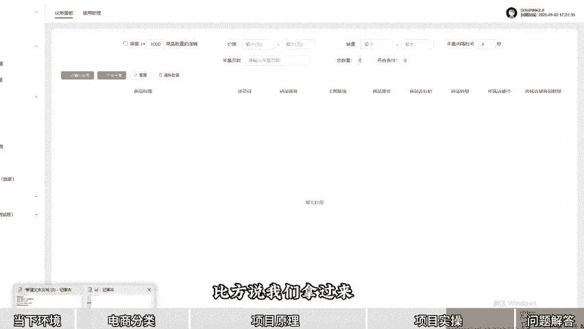
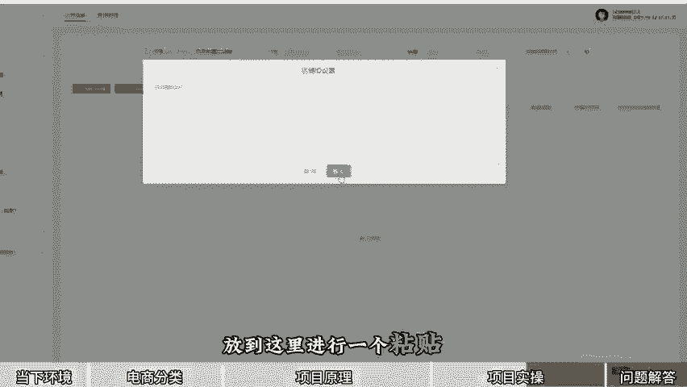
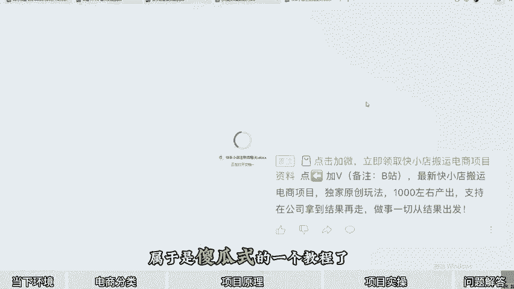

# 冒si上传！全网最良心的搬运电商保姆级运营教程！（纯干货，超详细！） - P1 - 雨哥电商 - BV1pRsXeVEX6

🎼一个人一台电脑，一个手机日入800家是一种什么样的体验？你知道现在有一小部分挣大钱的人在什么平台开网店？我已从业十年的经验呢跟大家一起来聊一聊。

也会把我们现在做店的思路放在视频下方的置顶评论区给大家进行一个分享。那现在互联网电商平台大体分为两种。第一种呢称之为传统的电商平台。也就是大家所熟知的某宝某东某多多等。第二个呢叫做兴趣电商平台。

我们经常被刷到的某银毛收没收。哎，那么问题来了，我们适合是传统电商平台，兴趣电商平台。回答这个问题之前，我们不妨先思考一个问题。🎼如果我们自己是厂家，那么如何来快速的实现订单的收益呢？

我们是去传统的电商平台打价格战，还是去兴趣电商平台找一些达人帮我们推一波，哪个来的更快，传播效率更高呢？我相信大家心目当中啊都有一个正确答案叫做兴趣电商平台。那么兴趣电商平台里面，我们再细分一下。

我们究竟是合某一某手还是某书呢？那好多人讲短视频带货，直播带货图文带货。那真正能做起来的人又有多少。还不如在这几个兴趣电商平台里面，我开个网店靠谱一些。那就目前而言，某手小店无疑是一个蓝海版的存在。

你相比某音某一个大面积的内卷以及平台规则的苛刻性。还有就是某书的受容人群是比较少，用户呢相对较少。🎼所以讲现在某手小店无疑是蓝海版的一个存代，并且这个平台的用户的忠诚度是最高的。老话叫做老铁们妈。

而且其中最重要的一点这个平台的开店的人比较少。一想想，用户又这么多，粘性度还高，开店的人就少，所以称之为蓝海项。那么我总结一句话，叫做每个店铺的背后都是一个家庭。接下来呢给大家实际看一下。

我们整体的办公环境和具体的店铺利润。接下来给大家看一下我们自营店铺单笔定大。🎼说一起。🎼这个店铺呢我们卖的这是一个什么产品？一个热熔机是吧？热熔机客户是实付了34块钱，我们采购的成本呢是15-1。🎼嗯。

单笔订单的利润呢是挣了18。9啊，18。9块，利润率呢达到了55点嗯，将近56%。下面这个订单呢应该是一个太阳能的一个充电户外的一个那个什么快充实付款是109，成本是84，利润呢是24。7块。

利润率呢20%以上。OK我们再把这两个店，一周的一个利润产出率给大家看一下。你看一下，从16号一直到22号整体的销售额，减去我们的一个采购金额，就是我们的一个实际的一个利润。

一周左右的一个时间是2639。71OK啊，这是我们其中两个店的一个情况。🎼然后我们看到这个店应该是新开的一个店铺。新开这个店铺的这位小兄弟也是我们线下的一个合作伙伴。当然还有很多的工妹。

大家都可以起来共同创业。🎼新起店铺上的一个什么品，我们一起来看一下啊。然后卖的是一个服装客户啊，付给我们的钱是143。🎼成本采购成本是61。98块，利润呢是达到了一单，挣了81%啊，利润率是将近60%。

那这种订单不用多，一天来个十摊八单就够用了。然后下面呢是挣了8。7块啊，依据你的客单价来决定。然后最下方应该是一个短裙的吧，对吧？实付是50块钱，成本呢是13啊，上家都是包邮的，利润呢是36。

这个利润比较包一些。然后我们接下来再看一下我们自营的另一组店铺的一个数据。🎼嗯，这个界面呢大家都了解，然后你具体看一下这个利润。🎼这是一个什么品？🎼空气炸锅的一个盒是吧？🎼客户实付是100110。

🎼成本是30，一旦挣80660还是给有错的。🎼这个是59%的一个利润啊。🎼上面退款啊，当然退款也是我们销售的一部分。客户给我们48成本19。6块，利润是28。85块。🎼那当然呢还有很多我们其他一个店铺。

然后接下来呢我会将我们的嗯开店的流程以及相应的店铺设置放在我们视频置顶的评论区。那么接下来呢给大家进行电脑端的展示一下。🎼啊，我们具体的一个项目拆解，将由我李春雨给大家展示我们整体的一个项目拆解。

啊那首先呢简单介绍一下自己啊，抖拼科技有限公司董事长啊，电子商务培训师高级呃，十余年的电商运营及管理经验啊，服务运营超5000余家店铺。这个呢大家了解一下即可啊。然后接下来我们进行啊。

我给大家进行一个仔细的一个拆解环节啊，以思维导图的形式给大家呈现出来。🎼一共呢分为几个步骤，呃，电商的分类，什么是搬运电商以及选品上货的一个实操，还要给大家进行一个问答，以及领取我们的一个开店啊。

店铺设置啊、运营的一些资料啊，我会放在视频的置顶的评论区，大家领取即可。本次的拆解的内容时间比较长啊。有新的小伙伴呢可以提前拿出笔和纸或者是我们的记事本啊，手机来进行一些关键性的操作和记录。🎼好。

首先我们开始我们讲一下电商的一个分类。什么叫做搬运电商。那我们这么多人天天在干什么啊？大体的电商呢我总结来讲啊，一共分为两个部分。第一部分呢叫传统电商。第二部分呢是近几年比较火的，叫做兴趣电商。

传统电商呢呃像大家都比较熟知的淘系，比方说某某某猫啊，某巴巴啊，这些都有还有某东某多，啊，这些呢都属于传统电商的一个平台。那么兴趣电商是什么呢？兴趣电商包括某手某音某叔哎等等，这些都属于兴趣电商，对吧？

那么他们都是各有利和弊的，你比方说传统的电商平台。这些电商平台呢，它的整体的流量增速已经到达一个顶峰了。😊，🎼啊，就是他们的用户群体已经到达顶峰了。那么相对于兴趣电商来讲，我们如果要是厂家的话。

我们该如何进行选择呢？比方说我们想要我们生产出来的产品，能够快速的实现订单呃实现订单的放大以及最大的一个收益，会选择传统电商还是兴趣电商去做呢？🎼我相信现在啊我们24年马上啊这个十1了。

那么在这个阶段来讲呢，我们更倾向于的是兴趣电商，为什么呢？🎼因为传统电商价格战是比较内卷啊，流量呢已经到封顶。🎼那么兴趣电商呢，比方说我找一个大主播大网红去带我们这款产品，有可能迅速的会火遍全网。

给我们带来的订单呢非常大，而且它是不内卷。大家会发现呢兴趣电商某一某手母叔上面的很多的产品确实要比传统电商这些平台的产品价格要贵。🎼啊，所以说我们在进行选择的时候呢，大致如果让我现在入局电商。

那么我肯定会选择兴趣电商其中的一项某手某音某叔等等啊。然后呢，接下来我们再看一下兴趣电商。近几年呢通过兴趣电商，包括某音某手啊变现的达人太多了。🎼对吧无论是通过拍短视频啊、直播、带货呀。

甚至娱乐、有点才艺啊，你唱歌好听啊等等，或者是你作为一个游戏主播，你都可以在兴趣电商上面怎么样去变现。那么问题又来了。如果我们想做电商，我想做兴趣电商。但是呢我没有团队，我也没有那么多的资金。

我也没有上镜这样的一个感觉，然后呢嗯一句话来总结吧，就是说1000个网红里面，现在能产出一个能挣着钱的网红就已经很不容易了，对吧？因为现在时至今日了，跟以前不一样了。

以前有可能你拍拍生活当中的有有些搞笑的事情啊，你就可以这个成为网红，然后进行带货进行挣钱。但是现在呢大家都知道网红都已经慢慢的怎么样再进行一个打压。所以说我们要想做兴趣电商。

我们不是非得去拍短视频去直播，我们可以通过不拍视频，不直播的方式，在兴趣电商方面，我们普通人也可以去赚钱。那我们普通人怎么来赚钱呢，我们来看。😊，🎼看一下啊。🎼就是你没有直播拍短视频做IP的一个能力。

我们可以去做某音的小店，某首的小店，某红书的小店都可以。🎼这个大家懂吧？就是说我们没有网红那样的一个团队等等支持，说吧我也不适合当网红。但我还想变现怎么办呢？我们可以做这几个平台的小店。

那这个小店也有这个呃不一样的地方。你比方说某音小店呢流量是比较大，某手小店流量还非常大。嗯，大家要知道啊，是先有的某手后有的某音，某叔的小店呢相对来讲这两个平台啊，某叔的流量还是比较小。😊，🎼啊。

因为比较年轻的呃人愿意去看这个某叔这个小店啊，所以说流量相对来讲是比较小。第二个呢，我们来看一下平台的一个运营规则，呃，兴趣电商平台里面我们要做其中的哪个平台的小店呢？嗯，某音的小店呢。

目前来讲规则是非常非常严格的啊，动不动就扣这个风险保证金等等，付款有可能都扣了啊，出现违规的情况。那某首小店呢是属于现在呃用户比较多，然后呢开某手小店的人还比较少，所以说它的平台运营规则呢不是特别严。

呃，某音的小店的用户年性是比较一般的。😊，🎼嗯，这个怎么来讲呢？给大家举个例子啊，比方说我作为呃年轻人也好，中年人也好，那我又有频，那我在刷屏的时候刷腻了，我会刷什么呢？我会玩一玩手啊，有别音的人呢。

他会去手也逛一逛看一看，对吧？但是有手的大部分的人，他都不会去看某音看某书，他基本上都手上去进行这个呃浏览哪，对吧？购物啊等等。所以说他的用户粘性都比较高，老百姓讲就老铁文化。

还有一点就是某音的退货率啊，要比某手的退货率要高。😊，🎼为什么这么讲呢？因为某手的退货率很低呀。😡，🎼它基本上某手很多都是下沉市场，比方说三四五线的人群。🎼有的他买完了以后，他退都不会退。😡，🎼啊。

这一点大家要理解，因为我是实质啊从去年5月份一直运营到现在啊，这个某手小店我们实操下来以后，它的退货率哎是比较低的。然后在这里面呢，我们要进行一个选择。通过这几个对比性啊。

也是我们做网店所要求的这几项考核来讲，某手小店呢是现在比较适合我们普通人去进行操作的那某手小店O那我开完店了以后，谁来买我的品呢？我的品又怎么来呢？这个是大家首先要考虑的一个问题。🎼我去哪里选品。

我的产品在哪里，我适合什么样的个类目，我怎么卖，我怎么能出单，我怎么实现我的利润，你的利润率又有多少？OK接下来到达我们第二个环节叫什么是搬运电商。呃，搬运电商呢了解之前给大家分享一句话。

就是这个世界上只要有买和卖，就一定存在中间商去赚差价。这个大家一定要理解啊，我给大家举个例子，就平时包括我们在这个呃日常生活中网购的过程当中，有可能你在某一某手买的东西，一模一样的东西，😊。

🎼你再去多多看的时候，你会发现哎某多它以产品的生产商品牌产品都是一模一样的。但是某一某手的价格怎么样就要高一些。😡，🎼对吧他厂家都是一个，所以说这个呢就存在一定的信息差，叫中间商啊，就有这个差价可赚了。

那么搬运电商呢就是一个赚信息差的钱。🎼啊，我们都经历过，就是从A平台搬运到B平台进行一个销售，赚取这个差价。大家都了解。你比方说我们明明知道某手这个东西就是贵，某多呢那个东西就是便宜。

我们能不能把某多东西放到某手呢也可以呀，对吧？因为很多某手的消费的群体，这帮用户，他们基本上下单了以后，他们不会去某多呀，或者是某宝啊进行一个多平台那个底价，很多人都不会。

所以说我们有这个空间来赚取这个差价。😡，🎼那么通过官话来讲呢，叫做通过捕捉不同平台上的价格差异，利用低价平台作为会源，加价后在自己的某手小店中去销售，从而赚取利润。这种模式呢。

利用了不同平台之间的价格差异，即信息差来实现盈利。这个呢就叫做我们的搬运电商啊，很好理解，我们把这个平台的东西搬运到另一个平台高价去卖，我们赚取中间的差价即可。那么搬运电商的优势，我们自己来看一下啊。

比方说目前我们要是做某手小店的话，分为两个情况。第一个呢是自有货源。第二个呢就是我们主讲的叫搬运电商，有哪些优势呢。🎼嗯，自有货源的话，你是第一点，资金压力是比较大的，因为包括了采购仓储啊。

囤积库存的物流管理等等啊，整个场的管理，包括你个小工厂，你得需要管理，对吧？很大的压力。那么搬运电商则不同，它是适合资金有限的创业者或者是小型商家，因为我们省去了很多物流啊。

采购仓储等等人员这些所有的流程都不需要了，对吧？客户在我的店铺里下单了以后，已经把这个钱放到我们店铺的后台了，那么我知道他比方说买了一瓶水花了10块钱。那么我再去下家去进行一个采购，能理解哈。

第二个这就关乎到我讲的下一个知识点啊，那么你自有货源呢风险是比较大的。😊，🎼因为你自己的生产的产品，你得需要对市场进行一个预测。如果你的预测不准确，会导致大量的商品滞销，资金积压甚至造成损失。

那么搬运电商的优势在于就风险小，因为我们不存在货物积压的风险。😡，🎼对吧我先拿着这些商品，我也不进货，我先放到我的平台上面进行售卖。有客户在我的店铺下单了以后，我直接去货源平台，哎，直接以底价的方式买。

再买就可以啊。根据客户的订单再进行购买，避免啊市场上的变化导致的一些风险，对吧？因为有的时候我们也没法判断这个市场啊。比方说现在有一款水杯特别好。奥运期间，比方说这个水杯大家都比较流行。😡。

🎼突然之间我们就开始大量的进行生产，投入的所有人力物力。到后来呢这阵风过去，这就是对市场的一个不确定性，对吧？然后呃自有会员呢当然也有优点，最大的优点是什么呢？就是利润大啊，你自己开厂子。

你自己开那个小作坊呢，肯定是要比我们搬运电商的利润要大一些啊，当然我们搬运电商的利润呢是较低的，肯定没有工厂去大。但是呢我们资金压力和风险都相对于较小。呃，接下来再讲一下。

比方说我们通过呃兴趣电商里面的某首小店来进行盈利的话，盈利了以后呢，我们通过搬运的电商的一种形式来进行一个操作。那如何进行出单呢，接下来给大家重点梳理一下搬运电商它为什么能够出单。首先大家要了解啊。

比方说我们开个网店。无论是传统电商也好，兴趣电商也好，都是分为两个部分。第一部分呢叫做付费推广。也就是说我们作为商家来讲，我在这个平台开了这个网店，我们可以付费去。😊，🎼推广我店铺里面的商品。那当然了。

付费推广呢当然就涉及到1个RY投产比的一个不确定性。因为如果大家都知道啊，我投钱打广告，我就能百分之百盈利的话，那大家就比谁钱多，谁投的多就OK。🎼净是因为我们不见得你投的多，你就挣得多。

有可能甚至还亏损。你广告钱有可能都白搭，对吧？这是付费推广，当然我们不做付费推广啊，跟大家首先先铺垫一下，我们做的呢都是纯自然流量。那很多小伙伴说，哎呀，纯自然流量，你不花钱推广。😡。

🎼你怎么来这个客户呢？怎么在你这里下单呢？对吧？会有这个疑虑。接下来呢我给大家简单看一下啊，我们的纯自然流量来源于哪里。首先第一个来源于平台的商品搜索流量。接下来给大家开一张图片啊，这个图片呢。

🎼就是我用手啊这个小程序啊，手这个APP截的一个图片。正常呢在右半部分它会有一个推荐。🎼啊，还有一个关注发现同真好友，还有一个商城，这是我们的口的一个界面。很多口的用户呢都会选择点击商城。

然后在商城这里面，比方说搜索打印纸啦，搜索袜子啦等等，很多我们日常生活当中的需需要购买的商品，他都会通过关键字进行购买。🎼如果嗯各位有有这个误区的话，我们可以实际展示一下，都有是吧？打开我们以后，嗯。

你点击首页，然后左上角第一个就是商城，我们在商城里面搜索框当中直接输入袜子男这三个字，你输入完了以后，你会发现我们所有人啊，输入的字三个字都是一样，但是展现出来的商品怎么样都不一样，记住了啊都不一样。

这个是各个平台都有自己的大数据分析。如果你是高消费的人群，给你展现出来的价格客单价都是比较高。如果你是相对低消费的人群，那么给你展现出来商品的价格怎么样哎就比较低。啊，相信大家都有这个干悟啊。

然后接下来我们会看到销量几百的啊也排在前面，然后销量15万的加的呢也在后面还有66万的，还有一个已拼41件的，还有一个已拼两件。🎼啊，都会在前面。那么消费者就先根据我们啊这个首张图片进行一个选择。

然后进行点击去进行一个购买。🎼在这里呢就提到一个小小的知识点，并不是说你的店铺已经有了很大的销量基础了。🎼就一定会展现在前面，不信你自己看一下你手机。😡，🎼并不是说你销量越高就在前面啊。

这个是依杰大叔最进行一个分析的。有可能你们这个产品才销售两三单，也可以在首页。😡，🎼对不对？这是千人千面的一个原则啊，这一点大家懂就可以。然后他就一定下单。如果要是选到咱们的店铺。

对咱们店铺的产品的手这个价格啊，图片都满意，ok他就直接进行一个下单。这个呢就叫做一个搜索流量啊，是纯自然流量。那么引导出选品的重要性。😊。

🎼我们要学会反推，这一点是啥意思？就是说我们要站在客户的角度来运营我们的店铺，来进行我们的一个选品。🎼有句话讲叫做七分靠选品，三分靠运营。所以说电商来讲，选品是重中之重。那么产品需要什么呢？

是需要具备搜索这个产品的人多，然后卖的这个店铺卖这个商品的店还比较少。这种品称之为什么品称之为蓝海品，而且这种品有很高的一个利润，因为卖的人少嘛，竞争压力比较小。这一点啊。

我们稍后放到选品里面给大家进行一个讲解啊，当然类目选择也很重要。我当然建议大家去做这个百货类目。🎼啊，做百货类目，因为不像食品，它有保质期，对吧？服装啊退货率太高了，新手小白根本就干不了。

所以说百货呢相对来讲前期比较好入手一些。那么当然纯自然流量，除了平台的商品搜索流量以外，还有第二个就是网红直播、短视频带货流量。😊，🎼有些达人呢会主动联系咱。第二种呢就是咱们主动去联系达人。

让达人去帮我们带货。大家记住啊，所有。🎼某手某音上面的网红，他们挣钱都是靠怎么样，就带货主播都是靠带货挣钱。那这个货从哪里来呢？都是从某音小店和某手小店上面进行选择的。😡。

🎼这一点大家要懂一个最基础的逻辑啊，逻辑在哪呢？给大家说一下。🎼主播他是一定挣钱的。比方说我们这个产品卖100块钱。😡，🎼如果我们给他设置的佣金是20%，那他卖出去一单。😡，🎼他就得200块钱。

🎼他不挣钱，不可能带咱们的产品，对吧？所以说这一点很重要。然后我们看一下啊，当我们店铺出现什么呢？就是你这个利润还比较够，而且呢还是一个比较爆的一个品。😊，🎼我们这种品呢直接就上到官方的快分销里面。

就像某音的一个竞选联盟一样。我们在里面设置达人的佣金比例，让达人去代货。因为他们的量是非常大的。无论他们是通过直播也好，还是自己拍短视频的也好，都可以，都给我们放大这个订单量呃，给大家举个例子啊。

要不然有的人比较懵。比方说我店铺。😡，🎼啊，这一个键盘卖100块钱，然后呢，我的上游平台呢嗯我的会员平台呢有可能才卖50块钱。🎼对吧你的利润率呢50%，如果100块钱我们挣50的情况下。

我们完全可以放到快分销里面。我们设这个达人佣金，给达人佣金设置个20%。🎼也就是说，我们100块钱拿走20%，拿走20块钱给谁呢？给达人，让他给我们批量带货，这样就可以了。我们自己能挣多少。

我们能挣30啊。😡，🎼对不对？🎼啊，这个量还是非常大的啊，稍后呢有时间的话都给大家进行一个展示啊。🎼这是搬运电商为什么出单？我们采取的就是纯自然的一个流量来进行一个出单啊。

接下来呢到达我们的一个实操环节。🎼好，我们看一下实操啊。🎼13环节。那么第一个呢就是说想要做此项目的，想要了解的必须具备以下几点。第一个呢得有电脑，有手机，还得有号。嗯，开店呢简单跟大家说一下啊。

是分为两步的，你用个体身份证呢，也可以用个体的营业执照也可以。如果你要是呃公司企业性质的营业执照呢，不建议啊，因为是需要走这个对公账户的。我们个体执照和个人呢都是可以直接提到我们法人的银行卡里的。

这是没有问题的啊。当然你一个个人的身份证，只适合开通两个小店的。你个体营业执照，你像我们是团队进行一个协作，那我们一定要有自己的个体的营业执照啊，个体的营业执照呢呃一个执照就可以开5个小店。🎼啊。

这样我们开的店啊就比较多了。然后再说一下这个保证金，一个店呢是500到2000啊，百货的类目就是500到2000。现在呢500到1000，平均呢我们正常交一个店铺的保证金。

当然交给平台的啊是1000到2000左右啊，当然200了，你上的百货的品类有可能会非常多啊。然后还有一个最重要的一点，项目的要求呢就是态度的问题。😊，🎼啊，讲了这么多年，无论做某多也好，某宝也好。

还是我们的某手小店也好，最重要的一点就是得做得住，对吧？这个不难理解啊，因为你也不费脑，也不费力，最主要你得能做得住电脑啊。第二个呢就是任学认干。前期呢你先一比一的去复刻模仿就可以了。

后期呢我们再进行一个呃自己的一个升级就可以了。然后呢，接下来到达我们的一个选品。🎼啊，也是本次项目拆解非常非常干的一个部分啊，选品呢分为几个部分。比方说我们做某手小店。🎼那品从哪里来呢？

我们采取的搬运的形式。那我们搬运哪个平台啊，某某多呀或者是某巴巴呀都可以。但是这个操作来讲呢会比较简单啊，比方说我们会有一个相应的一个软件啊，简单的给大家看一下啊。

🎼嗯，给大家看一下我们的某88上到某手小店的啊这样的一个操作流程。

🎼啊，还是比较简单的啊。进来了以后呢，有一个某88的一个低价货源推荐。在这里面，我们可以选择啊7天无理由退货，包邮一件代发的48小时发货的这样的一个货源。然后我们选择店铺代发订单量，哎，3000以上。

同时呢我们还可以输入我们的一个价格，比方说我们想货源价格，我们是从15，对吧？到500之间，我就可以进行一个筛选。🎼啊，筛选筛选完了以后，我们往下滑动啊，因为一页在这里面可以选择啊。

你是选择20个品还是50个品，对吧？我们选择全选，然后批量铺货，这样就可以了。看铺货任务已提交，然后紧接着你点击搬家上货，就可以把刚才我们选的这20个品，通过软件的形式自动化就上架到我们店铺了。

那么在店铺的上架的过程当中呢，我们也可以设置相应这个价格配置啊，稍后我也会展示，你比方说它的货源价是1。5，那比呃15块钱，对吧？一件代发嘛，一件包邮的价格是15块钱。😊，🎼这个活力28的爆炸眼啊。

现在特别特别火。那我上到某首小店呢，我会以1。2倍的进行一个上架。1。2倍。那我卖的时候卖多少卖1卖18块钱，1。2倍啊，1。2倍。😡，🎼卖18了，就是这个意思啊，这个呢就给大家进行深度展示了啊。

这是基础的啊，非常基础的一个某某某88啊上到我们的一个小店。那当然像我们团队来做的话，不可能做市面上都了解的一种形式。那我们怎么能实现这么多人实现这么大的一个利润。

🎼接下来我们的选品啊称之为叫做超级节流。超级节流是什么意思呢？就是我不去上某吧某宝某多的品。🎼我怎么办呢？🎼我去先看整个我们某手小店的一个平台，这个平台当中有哪些我们的同行店铺，他们都是出哪些单子。

他们出单的品有没有利润。如果他要是出单了，卖的挺好，然后还有利润，我们完全可以卖跟他一模一样的什么商品，然后我们怎么出单呢？我们比他卖的怎么样便宜些。比方说他卖100，烫到这20，那我就卖95。

我挣头上我挣15，这个能理解了吗？所以说叫做超级节流。就是说这个技术来讲的话，搭配的很多的软件也好，商货软件也好，很多的技术层面啊，在这里不够多不做过多的讲解啊，做过的人当然理解其中的一个含金量，啊。

叫超级节流，然后给大家演示一下，我们啊是如何来进行一个选品。接下来呢打开我们的一个快采集啊，快采集，一给我们的选品的软件。这里面我们集合了很多啊，有可能大家刚开始看的时候。🎼看不明白啊，呃分为整店采集。

整店采集呢就是说我们把很多哈呃同行的店铺已经出单了店铺的ID。😊，🎼啊，比方说我们拿过来把这个ID拿过来了以后，放到这里进行一个粘贴，然后保留相应的一些数据啊。在这里呢我方便演示啊。

我在这里就不卡一定的价格和销量了。紧接着呢我们就点击开始采集，这个呢就是整店采集的一个结果啊，整店采集的一个结果。当然还有口令转换采集关键字都可以。你比方说现在我们马上到秋冬季节了，对吧？已经天冷了。

我可以卖一卖秋裤啊。

🎼对吧卖卖帽子啊，我们可以通过关键字进行获取到同行的商品。🎼这个大家注意啊，这是非常重要的。这是前期的话，我们先去整店，后期的话就结合我们店铺出单的那几个品。😊，🎼每个品都有它的标题。

每个标题里面都有它的关键字，它的关键字就是它的主词。我们通过主词或者通过它的下来词，我们就可以反向去选品啊。同行标题图案预测以及1688选品以及某宝的一个选品。😡，🎼都可以啊。

在这里我给大家先展示一下我们最重要的一个叫做超级激流的一个方法。通过他的店铺ID我们可以获取到他店铺里面啊已经出单的这么多个品，对吧？他店铺有多少个品，你看一下，一共有921个，这是他的一些商品。

接下来呢我们就可以把商品的链接怎么样复制下来，复制下来以后呢，我们进行一个上架。OK嗯，到这里呢我给大家展示的就是一个选品的一个过程，当然了，这里面我们还会获取到在他的店铺里面啊有销量的是多少个，对吧？

我们只要他卖出去的商品。😊，🎼记住啊，我们只上传他卖出去过的商品，他都没卖出去，我们没必要上能理解吧？就是因为我的店铺ID比较多嘛，这么多呢好多个。🎼啊，好多个这个呢就是通过同行的标题呀。

同行的预测呀等等这些来筛选出来。当然这些呢都是结合的呃很多的一些方式方法来进行操作啊，这是选品OK选品选完了以后呢，接下来到达我们那个上货啊，超级节流的含义，我不再给郭多讲了啊。

我就把很多同行出单的品我拿出来。接下来到达上架部分。😊，🎼好，我们打开我们的一个上户软件。嗯，上户软件，我们比方说刚才很多商品我们点击批量导入商品，导入好我们之前的一个店铺数据啊，选择打开即可。

打开了以后呢，我们进行一个全选打勾，然后选择到你对应的一个店铺。接下来呢直接点击开始上传即可啊。这些呢都是我刚才刚上传过的。好，接下来我们点击开始上传，这样的软件就会自动的进行一个上传。

这里面为什么会有一些违禁词呢，这个违禁词是非常重要的。啊比方说鞋衬衫这些东西是不允许在因为我们卖的是什么？我们卖的是百货，不是服装，服装退货率太高了，还有一些是官方的违禁词我们是不进行上传啊。

所以说大家会看一下啊，上传的整体的速度是非常非常快。🎼OK啊，作为一个演示呢，我先点击一下停止操作即可。🎼这就是我们上货简单的一些步骤啊，上货简单一些步骤。嗯，还有一句话跟大家讲清楚，所有的选品上架啊。

从整体的运营思路，包括软件，都是我们整个团队自研团队啊开发设计实操出来。🎼啊，因为我们主要做的就是呃某手小店这样的一个搬运电商这样的一个运营。🎼OK啊，那么讲到这里以后呢，我们接下来呃问答环节。

也就是说很多小伙伴啊，包括我们家的客服老师总在问我的几个问题。🎼给大家做一个汇总。首先呢第一个就是起垫周期。起垫周期呢大部分到5到15天，什么叫做起垫周期？

就是说你的利润每天能有个二三0百块元了啊20二三百块钱了。这个时候呢就叫做起垫。😡，🎼啊，有的快的呢50天慢的呢就在15天左右。回款周期呢，快手平台的回款周期是在15天到23天。🎼所有的平台都一样啊。

都得超过15天。当然你再加上嗯物流的时间，基本上长的也就二十三四天左右，这个款就回过来。还有一个说项目周期很多人也在考虑，对吧？你这个项目能玩多久，那我在这里跟大家可以讲一句负责任的话。

平台在我们这个项目就一直在啊，只要网购平台存在，我们就一直可以操作。如果有新的平台呢更好，对吧？比方说有一天出了一个新的平台能够超越。😊，🎼摸一摸手啊更好。还有一个就是操作时间。

操作时间呢是依据你店铺的数量啊，还有你出单出的单量来计算。比方一天就十单二十单的那你一天有个4个小时，你兼职就可以干，对吧？一单不用多，一单挣个10块20的对吧？一天二三0百块钱。

到时候那么一旦要是50加以上，比方说嗯我雇人做也好，或者是我自己全职干也好，你五六十单的话，那你一天的利润基本上呃至少得在600到1200左右，🎼啊，这就属于全职操。全职操作的话。

从早上的10点嗯到中午的12点半，下午2点一直到晚上的4点。嗯，4点之前所有的订单当天都能发出去货。然后紧接着从5点嗯吃完饭了以后嗯6点从6点到8点，我们进行一个呃店铺分析呀。

店铺诊断呢不合格的商品下掉，我们再进行上品的等等一系列的操作啊，时间就是这样的安排。利润率啊，刚才呢大家也看到这个每个订单的截图了，基本上我们的利润率是在20%最低到50%之间啊。

还有一个就是很多小伙伴问，你这个有没有复制性啊。比方说我就一台电脑我一天就挣当二300块钱，我感觉有点呃没意思，或者是少，我多开店铺的话也可以。那我能不能复制是可以复制的，可批量复制多个店铺，多个电脑。

多个客服甚至团队进行协作。🎼比方说我们就是对吧？比方说一个客服老师的话，我们以我们这里的薪资标准来讲的话，是呃4000块钱啊，然后再加上提成。🎼再加上满勤奖。🎼啊，再加上任务完成奖励。呃。

一个月他的薪资呢，基本上因为我们他给咱带来的利润也比较大。你比方一天最迟最迟给咱挣个600到800的话，一个月呢剩多少钱，对吧？剩这钱了以后给他提成加底薪，咱还是有这样算啊，而且你要是雇多个客服。

像我们似的，对吧？一共有七八个客服，那你带来的利润怎么样就会更大，然后呢，在我们本次拆解视频的最后呢，给大家啊留了几个资料，我们一起来看一下，一个是小店的一个注册流程，对吧？你用手机也好，电脑也好。

都可以注册。你开完了以后，你的小店的后台设置。🎼啊，都会有教程。然后呢，接下来就是我们的整体运营。你做这个店铺的运营，你前中后怎么来实间操作，售前售中售后都有啊，给大家进行一个发放。比方说快手店。

基本上我们这个教程属于是傻瓜式的一个教程了，大家可以看一下。

🎼基本上你识字啊基本上就能都能啊，是以图文的一个形式啊，特别方便，你直接就可以观看了。OK啊，那么这些资料呢会放在我们本次视频的呃第一条啊置顶大家领取即可。

