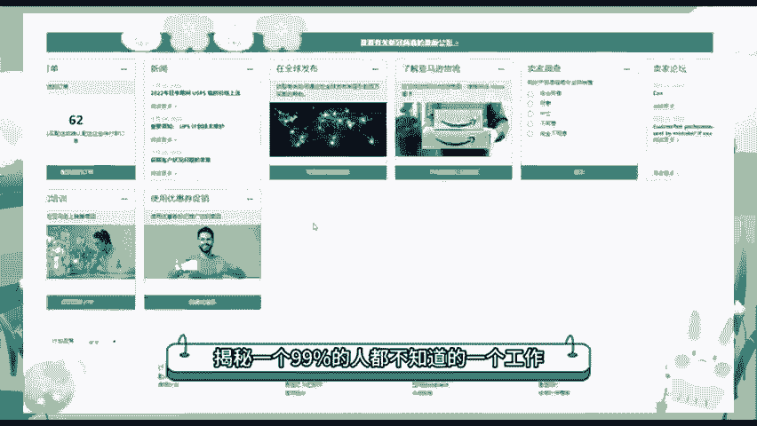
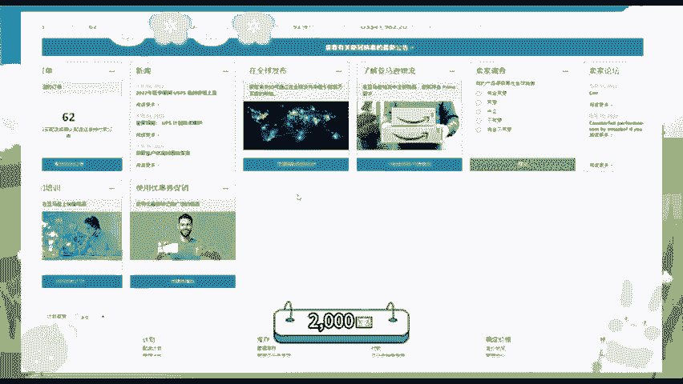
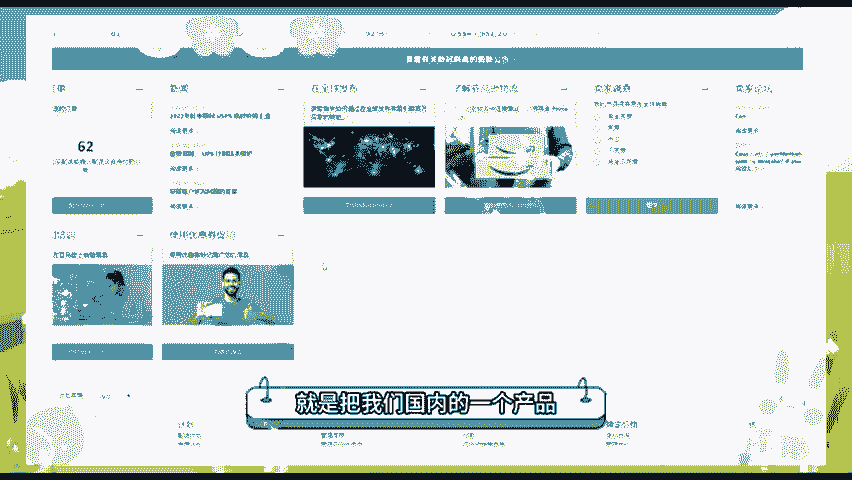
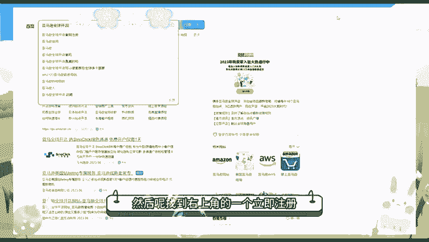
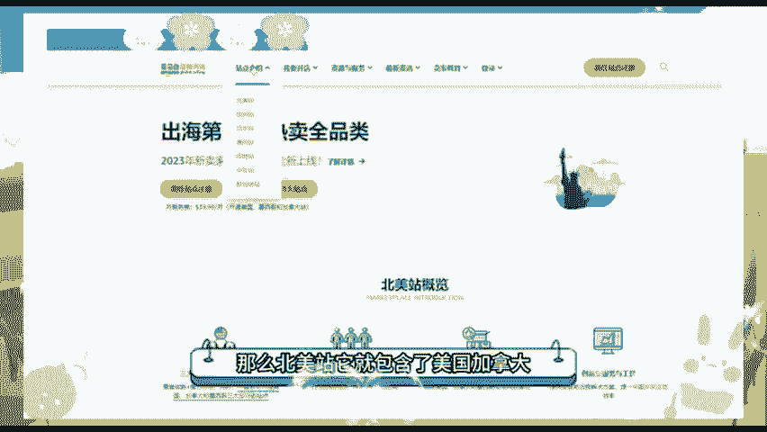
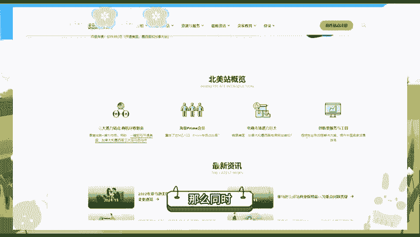

# 冒死上传10遍！《跨境电商亚马逊运营教程》，目前可能是B站最全入门流程，耗时700小时整理，分享学习亚马逊运营干货 - P1：跨境电商 - 羊哥哭着上链接 - BV1ZXmwYwEmu

🎼。🎼今天的话给大家揭秘一个99%的人都不知道的一个工作呀。他们说呢一个小时有800来块的收入啊，我来测试差不多两个多月的一个时间啊，最高的话一天也有2000块钱。他们说有800块钱一个小时。

说实话还真的是有可能的。但是呢确实比较困难。像我昨天的话也是花了4个小时的一个时间，也是呢有1300多美元的一个收入。不过的话我还没有局促，我的一个成本，只是我一个纯销售额。那我付出的代价呀。

就是有一个多月都没有出过门。那如果你们不嫌弃我的话呢，可以给我一个白给了三年，我把我的方法分享给大家。其实呢非常的简单，就是把我们国内的一个产品给它搬运到国外的亚马逊上面。

那么第一步我们去浏览器搜索亚马逊全球开店。然后呢找到右上角的一个立即注册，转择北美站注册即可。那么北美站，它就包含了美国加拿大、墨西哥三个国家。如果我们开。

🎼开通这个北美站，那么同时即可在这三个国家进行一个销售了。然后呢，我们再到国内的1688世界工厂网啊这些货源网站上面去找一个产品，尽量的找那种差价大的海外爆款的产品，找好产品之后呢。

然后复制它的一个图片啊标题详情，然后加价上传到我们刚刚注册的一个亚马逊店铺上面。如果有老外下单过后我们直接选择一件代发就可以赚取差价的。然后呢，既不需要你囤货，也不需要你压资金呢。

那比如说我店铺里面卖的这款比较好的爆款泡泡枪，在我们国内呢一个拿货价顶多就是49块钱左右。那我通过亚马逊卖到美国，它的一个售价呢，就可以达到39。99美金啊，相当于人民币280多块钱了，扣除一个成本呢。

我一单的利润在200块钱左右啊。虽然这份工作看起来比较枯燥乏味，但收入确实挺不错的。听到这里的一个朋友，如果你不太明白我的一个。

🎼操作方法呀，可以在下方扣一个学习。我呢可以把我这两个月学到的一个详细的运营笔径免费的分享给大家。如果你从现在开始做呀，估计用不了多久就会有一个结果。那本期的视频就给大家分享到这里，我们下期再见，拜拜。

