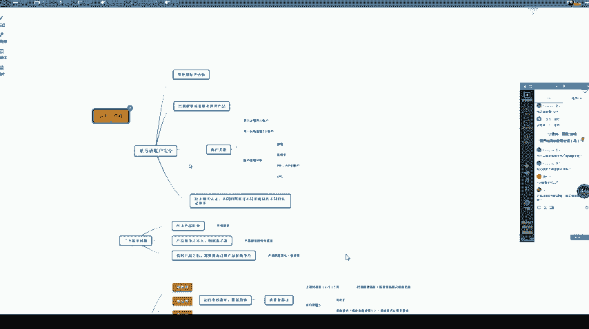
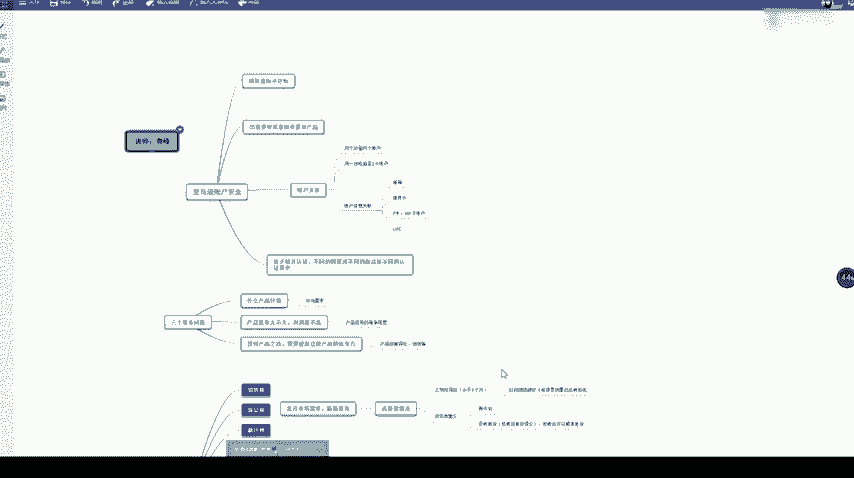
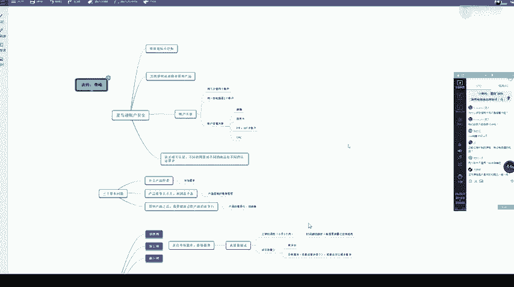
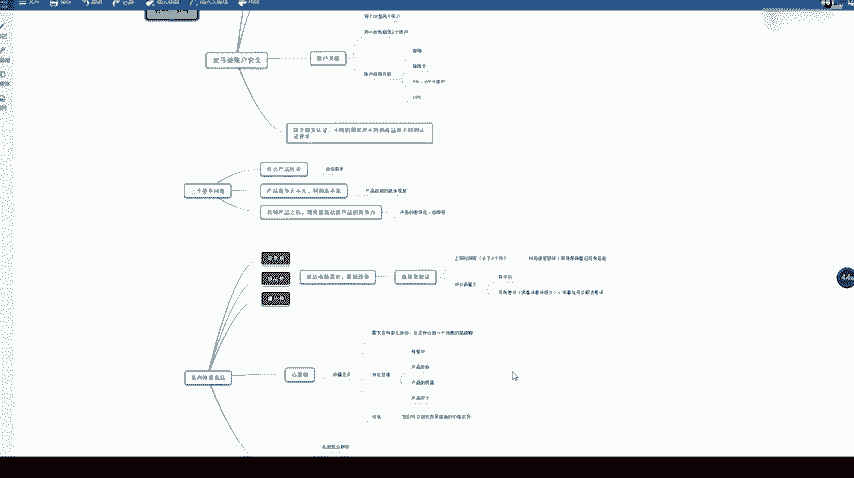

# 冒死上传10遍！《跨境电商亚马逊运营教程》，目前可能是B站最全入门流程，耗时700小时整理，分享学习亚马逊运营干货 - P26：1. 账户安全 - 小卡勇往直前 - BV1Mw2wYVEdB

系。那我们如果做亚马逊的话，一定要注意这个亚马逊的一个账户安全啊。因为你如果说一不注意这个账号就被移除了销售权，移除销售权就是说你这个店被关掉了。那如果你电被关了，你如果是发了FBA。

那美国那边仓库还堆了很多货，那这个号就很麻烦。货也没了，账号也没了，对不对？那我们账号被移除销售权限的话，主要这四种情况，一个是绩效不达标，绩效指标不达标。那就是说我们一个产品的退货率啊。

或者说一个差评率过高了，或者说。你这个产品质量有问题，买家收到之后跟亚马逊那边投诉。如果投诉有好几个投诉，那亚马逊可能就是觉得你这个产品有问题。会把你这个。店铺的一个销售前限一处啊，就是观点。

或者说我们出售了一个侵权，或者说跟麦一个侵权的产品啊。那跟麦的话也是亚马逊区别其他平台的一个特色，就是跟麦跟麦。后续的话课程会给大家讲到。那我们做跨境平台呢，跟做我们国内。

我们做跨境平台跟我们做国内的平台是最大的区别呢，就是说国外知识产权这一块是很注重的。像我们在淘宝上，如果说你看到一件T恤。上面有hello kitty的，或者说有那个米老鼠啊。

迪士尼那种冰雪冰雪奇缘的图案，这个好像大家都在卖啊，也没什么关系啊。那如果说你是在跨境平台上卖，不管是速卖通也好，还是亚马逊或者说无意识啊拉自达其他平台。那这个都是一个很严重的侵权。

一旦你说出售一些侵侵。侵犯别人知识产权的这个。产品之后呢，你这个点基本上会被关掉。

像维识这些平台的话，不仅关店啊，你这个钱也是拿不到的。

所以说大家以后做了去选品的时候，一定要注意，千万不要去买侵权的产品。不不只是图案侵权，或者说你这个外观有点近似，长得差不多的，但实际不一样的，这种也算是侵权的，不一定要一模一样。那一旦侵权了。

你这个销售前任。基本上是没有了。还有一个就是说账户关联。账户关联。那我们亚马逊的话是就是说要求我们每个公司呢最好是一个公司经营一家店铺。那有些公司呢可能就是说会经营好几个账号。那如果被亚马逊查到了。

那这个就是属于一种关联。那什么情况下才会被亚马逊查到关联呢？那比如说我们同个IP登两个账户。IP呢就是说同同一个网络下面。你把两个账户都登了。那这个时候就会查到一个关联，或者说你一台电脑，一个主机上。

登了两个亚马逊账户，或者说你这个这台电脑之前登过一个亚马逊账号。然后你后来又登了另外一个，那这个也是查得到的。所以说。大家做亚马逊的时候，千万不要在公共的网络或者说一些网吧。

或者说酒店里的电脑上登我们的一个亚马逊账号，这个是很危险的一个事。很危险的一个是，一旦出现了关联。一旦出现账号关联，会有什么后果呢？就是把两个账号都给关掉。还有一个就是账户信息关联。

账户信息关联的话就是我们比如说你有两个营业执照，那你想去注册两家美国站。那我们注册的时候，如果两家两个美国站点都用了同一个邮箱，那这个就是被关联了。呃，我看一下同学的问题啊，两个账户不是两个站点的店铺。

两个章，如果是一个美国站，一个英国站，那是没关系的。这节课的话前面大概讲一下，后面的话我会把后半节课是上次没讲的，也会讲一下。还有一个就是说信用卡关联，就是我们刚才说的一个双B信用卡。

如果你这张信用卡已经用来注册过这个美国站了，你如果后续想开另外一个美国站，你再用这张信用卡的话是不可以的，这个也是一个关联。那之后的话是一个P卡WF卡这个账户。关联。P卡和WF卡的话。

就是我们用来一个收美金的一个账户啊，就好比我们国内的一个支付宝。那我们一般账号注册下来了，后台会绑定一个第三方的一个收款工具。那亚马逊钱会打到我们绑定的P卡上或者WF卡上，到时候我们。钱的话。

直接从P卡里面把钱提到我们一个人民币账户上，就是提到一个银行卡上。那如果说你两个。不一样的美国站，你用了同一个收款账号，那这个也是一个关联。最后一个的话就是1个UPC关联。亚马逊如果你没有品牌备案。

那我们传每一个产品都是需要1个UPC的。比如说一个鞋子，它有5个尺码，那我们这个鞋子就需要5个UPC。如果说。你传产品的时候，就是说你两家店铺用了同1个UPC，那这个就有可能形成一个关联。那UPC的话。

我们一般去淘宝买差不多呃五六毛1个UPC。还有一点呢，就是说缺乏相关认证。认证的话，就比如说玩具这个类目啊，因为玩具的话大部分是小孩的，所以说亚马逊会对这个类目呢会有一些认真要求。比如说一些健康啊。

或者说你这个玩具的成分之类的，有没有危害啊，需要通过一些认证。你如果没有认证，你也是卖不了的。

