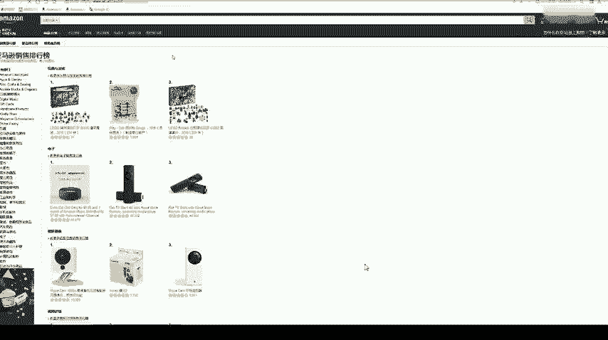
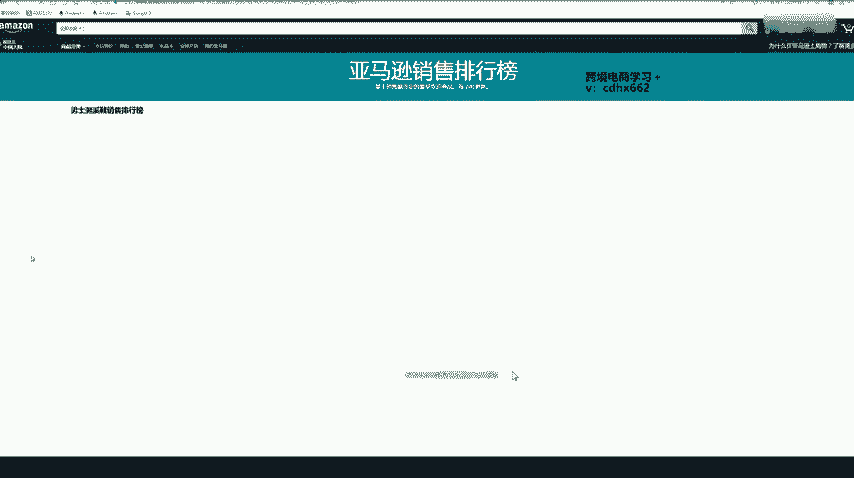
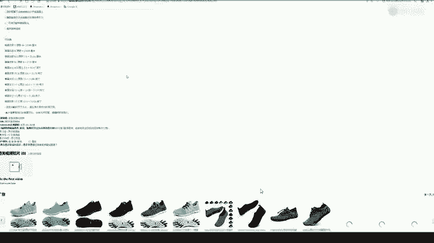
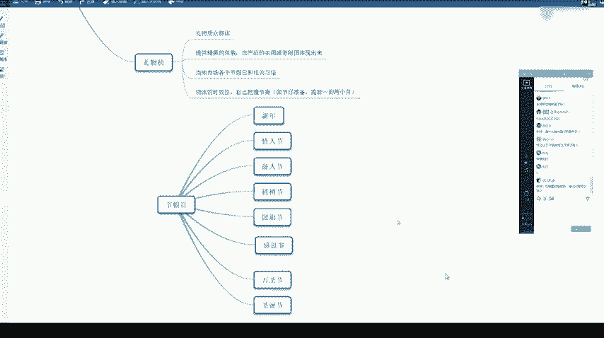

# 冒死上传10遍！《跨境电商亚马逊运营教程》，目前可能是B站最全入门流程，耗时700小时整理，分享学习亚马逊运营干货 - P27：2.站内榜单选品 - 小卡勇往直前 - BV1Mw2wYVEdB

那我们涉及到选品了，那我们肯定首先是想什么产品好卖，那产品好不好卖，那它这个是由市场需求来决定的，消费者来决定。消费者喜欢什么？那市场上就是什么产品好卖。那如果我们找到了这款好卖的产品。

我们就要看它一个竞争大不大，利润高不利润高不高。既然大家选择了做亚马逊，那肯定是奔着他一个高利润的目标去的。因为相对来说，相对其他平台来说，亚马逊是最有潜力的。然后利润最大的一个平台。

如果说你做亚马逊利润就只有10%几，或者说20%左右。那这个这个的话利润太低了一点，那还不如尝试做一下其他平台。还有一个产品竞争大不大，那就是说我们找到这款产品，如果。他的产品。竞争太大，卖的人太多。

那也是不适合我们去卖的。如果我们找到这款产品之后。哎，发现它的竞争力是不大的，但是利润还是蛮高的。那我们。就要考虑啊我们还能不能提高这款产品的竞争力。就是说别人也在卖这款，那我们去卖的时候。

我们能不能增加一点我们这款产品的竞争力，这样买家会不会更愿意来我们店里买？那比如说我们可以做一个产品的差异化或者创新等等。比如说别人卖一件T恤，它是只有白色和。白色和黑色的那我们如果卖的时候。

是不是可以增加一个橙色或者说蓝色。这样买家做选择的时候，会不会更加考虑我们的店铺，或者说你在。T恤里面卖一些不同图案的T恤，那这个就是一个创新。啊，自我放大一点。这个可以吗？呃。

亚马逊可以卖没有品牌的东西吗？就是说你这个亚马逊卖的时候呢，你品牌呢不一定要注册。那我们。我们后台传产品的时候，有有一个选项是要填一个品牌的那你这个品牌呢可以自己。虚拟的造一个品牌出来。

就是说但是别人是不可以有这个品牌的。多少才算卖的多啊，那就是说我们下面会讲怎么看一个产品，这个行业竞争大不大。那我们上节课的话是讲过了一个站内榜榜单选品。那我们亚马逊的榜呢一共有5个榜。

一个销售榜、新品榜榜、飙升榜、心愿榜和礼物榜。那我们这些榜单呢去哪个网站看呢？就是这个网站啊。我给大家梳一下。这个网站。字还能再大一些吗？啊，还可以再大一些。这个网站。我们进去之后呢。

看到下面下面它有一个美亚销售榜，美亚新品榜和美亚飙升榜。那这个就是亚马逊的一个榜单啊，最下面呢大家也可以看一下最下面。最下面的话它就是一个时间啊，距离万圣节还有4天，距离感恩节还有31天。

距离黑色星期五还有32天，距离圣诞节还有58天。那万圣节的话是一个亚马逊很重要的节日。那如果说现在有。呃，个人账号注册起来的同学呢，可以去考虑做一下圣诞节的一些产品啊，圣诞节的一些产品。

那比如说我们点进去啊，点进去这个。美亚销售榜。那这个就是这样一个销售排行榜，新品排行榜标，还有一个。标升牌，如果是大家转成英文的话，那还会有一个有另外两个出来啊。一个心愿榜，一个礼物榜出来。

那这个进去之后呢，我们就选类目啊，我们。上次的话是选这个啊服饰鞋靴珠宝类目。因为这次的话呃我都转成了中文啊。因为上节课有同学要求啊，可能英文有些同学看不太懂，大家看一下。

这个就是说服装鞋靴和珠宝饰品的一个销售排行榜。大家看一下有看到什么不一样的吗？

有看到。大家可以看一下第二个这个是什么东西，这个是一个面具，对不对？那我刚才说了，大家看这个AMZ123网站，看一下下面距离万圣节还有4天，对不对？所以说他这个面具呢是。用来那个万圣节用的。

所以说很多卖家呢都是根据一个亚马逊的节假日去买产品的。他这个面面具居然排到了整个服饰鞋靴珠宝饰品大类目里面的第二名啊，就是说已经排的很高很高了。那我们可以看一下，可以看一下这个面具的上架日期。

上节课有讲到上架日期怎么看。大家看一下上架日期。10月2日2019年10月2日，10月2日，今天是几号？10月28号是不是才上架了，一个月不到？他就已经排到了我们整个。这个大类目的第二名啊就是说很强大。

所以说大家以后选品的时候呢，也是可以根据这个节假日去选品。当然这个我们要提前一段时间，现在万圣节只剩下5天了，我们再去卖这个的话，肯定是来不及的。那我们这个下面的话就是看一个男士。服装呃。

我们还是看鞋类，因为上节课也是讲的一个鞋类啊。鞋类户外鞋靴就是说大家一个一个类目这样点进去，点到最后你点不了为止。那就是说是我们这个最小的一个类目下面的一个排行榜。那比如说我们点到这里，点到一个。

水鞋水鞋可能就是说一些在沙滩上穿的，或者说潜水穿的一个鞋子。那这个点下去，我们就下面就点不了了。那这个100个产品呢，就是说100个产品就是说我们整个。这个水鞋类目下的一个排行。

基本上我们销售榜新品榜和趋势榜就是说反映一个市场一个需求，一个最新趋势就好比现在要万圣节了，是不是万圣节很多万圣节的产品就已经排到了这个销售榜的很前面啊，甚至说第二名都排上去了。所以说我们如果。

要选品的话，这个类目是最重要的，大家可以都多去看一下。那第一个就是我们采取一个。直接复制法直接复制法的话，我们一般就是说要找一个上架时间短，小于3个月的。然后呢，当然是时间越短越好。

前提是它是不仅要上架时间短。其次呢他这个。销量也是要有一些起色。然后呢，评价数量比较小的。评价是要有的。没有差评，或者说差评很少。就是说我们我们找到的这款产品呢，就是比如好比是这款。

这款大家可以看一下上架时间啊，我们进去看一下。上架时间。呃，这款的话已经是很久了，那这款的话就不适合我们做了。这款的话是2018年7月20号上架的，所以绝对我们不适合我们去做。

我们再看一下这款啊，一般的话就是说我们要找一些上架3个月内3个月内的一个产品。然后呢，评价不是很多。有差评也是可以的。就是说大家看产品的时候呢，要看它的一个差评的原因说了什么。

如果说你自己可以去解决这个差评问题的那你去卖好了。有些那就是说这个鞋子尺码太乱了，那太乱了，你自己也解解决不了，是不是本身这个供货商这个鞋子的尺码造的比较乱，那也没办法，那这种产品就不是很好。

那这个的话网络可能有点不好啊，那整个思维方向就是这样，大家就去。看一个首先看一个上架时间要短的要小于3个月内，然后呢看他一个评价数量。还有一个心愿榜。心愿榜呢就是说我们平时说的啊。

就是说我们在淘宝上可能看中了一个东西，加入了一个收藏夹，然后没去购买。那没去购买呢，首先可能就因为我们需求没有那么迫切，还没有达到一个消费的高峰期，就好比。现在离那个圣诞节还比较远。

我们可能看到圣诞节的产品，可能现在仅仅只是把它加入一个收藏夹，对不对？那这个时候如果说大家看新愿版的产品呢，可以看到一个相对来说一个未来的趋势啊，也能看得到。大家可以去。如果说。

心愿榜里万呃圣诞节的产品比较多了，那就说明啊大家都开始要准备了。那我们自己也可以准备卖圣诞节的产品。或者说。他加入他收藏是一个存在犹豫的犹豫，一方面就是有差评。有差评，那我们就需要。

看一下这个差评的原因。如果有一款产品它收藏的人很多。但是呢买的人是比较呃比较少的。然后呢，差评。又是比较多的那我们可以看一下这个差评，我们看一下能不能解决这个差评。就是说这款产品呢大家都挺喜欢的。

但是有可能因为某些差评原因呢，大家都不敢去买。那如果我们解决了这个差评，是不是就开发出来的一款很好的产品？还有一个就是说一个产品的参数或者产品的质量。那产品的参数可能说这款产品没有介绍的很详细。

那我们如果说在一个产品详情页里面把产品的参数。和它的一个质量。都介绍的很详细了，那大家买家的话可能更愿意来购买了。或者说一个产品的尺寸。比如说我们卖一个桌子的时候。这个桌子是一个大桌子。

其实买家更希望能小一点。所以他先收藏的。等到以后如果有一个小的尺码出来了，他可能就去买了。这个时候如果我们就是说发现这一点的话，我们就可以去卖一个稍微小一点的桌子。那这个时候出单的几率就会比较大一点。

那最后一点的话就是还是因为一个价格啊，那价格这个其实是最重要的，有可能加入收藏了，就是说等着这个产品降价。那我们可以对比一个资源基地的价格优势啊。这个怎么说呢？就是说比如说福建那边。福建那边的话。

鞋子是比较多的那我们如果说找货源去。直接去福建的供货商那边找鞋子的话，那相对来说这个价价格优势是比较大的，对不对？要找到一个价格优势，价格当然是所有平台里面一个卖产品。

决定买家买不买也是很重要的一个原因啊。呃，如果是你360浏览器的话，你直接用这个浏览器。然后你右键右键它这里有一个翻译成中文啊，右键点一下，翻译成中文，它就翻译成中文了。接下来就是一个礼物榜。

礼物榜的话，看看这个榜单名字就知道肯定是受礼的那受礼的首先第一个跟一个礼物的受众群体有关，对不对？比如说父亲节的礼物。父亲节的礼物肯定是男性的那母亲节肯定是女性的，或者说儿童节儿童节的时候。

那肯定是针对小孩子的。既然是礼物，那我们肯定要给他提供一个很精美的包装。大家自己平时也送过礼都知道。作为一个礼物啊，它这个包装是非常重要的。如果说你能给买家提供一个很精美的包装。

那买家肯定很乐意去购买这个产品。但是你要提供这个精美的包装的话，一定要让买家知道。不是说你在呃描述里面说一句话，说我们提供精美的包装，这样没什么用，一定要让这个买家看到。所以如果我们有精美的包装。

我们一定要在这个产品的主图或者副图里面体现出来，一定要拍的比较好，这样让买家有一个购买的欲望。可以的，店铺里面就是说。亚马逊是一个重产品轻店铺的概念，所以说店铺可以是一个杂货铺的。

还有一个就是说当地市场各个节假日和相关习俗啊节假日。那我们都是就刚才我跟大家说的一个万圣节，是不是就是跟着节假日走？相关习俗，那我们肯定每个国家都有不同的习俗。有些国家呢喜欢。

一种颜色或者说不喜欢一种颜色，不喜欢某个图案。如果你这个产品上。有他们忌讳的一个图案了，那这个产品绝对是出不了单的。还有一个就是说一个物流的时效性。尤其是做礼物榜的那礼物榜的话。

大家都是要奔着送礼的目标去的，是不是？那你如果说这个物流时效性不行。那别人买个东西。本来都是急着送你的，你还很慢很慢，那这样肯定不行。或者说我们做一个节假日的。比如说万圣节快到了，现在还剩下5天了。

虽然说排在前面的很多都是万圣节的产品了，那我们现在去准备一个万圣节的产品来得及吗？肯定是来不及了。那我们至少要提前1到2个月，就好比我刚才说的，我们现在呢就可以准备一下我们一个圣诞节的一个产品啊。

圣诞节的一个产品。刚才这里有看到圣诞节还有几天，还有58天，差不多刚刚好这个时间大家可以去选一些圣诞节的产品，然后准备起来。而且呢不能说你做一些节日的产品，不能让它卖着卖着断货啊。你像这种万圣节。

本身就是卖一一段时间的。你如果中间还断货了，那等万圣节过了，你这个产品销量会少很多很多。不是说我们节假日过了，就把这个产品下架。还是会有人买的。然后呢，我们产品放在那边，如果是产品正常出单流动的。

也不会给我们收一个长期仓储费啊，这个大家放心啊。

