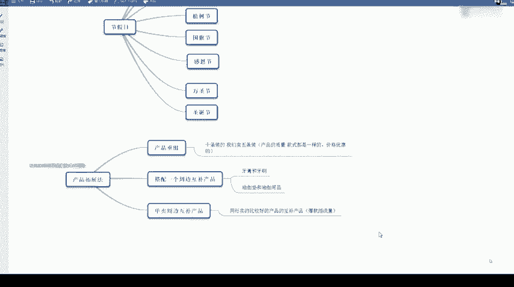
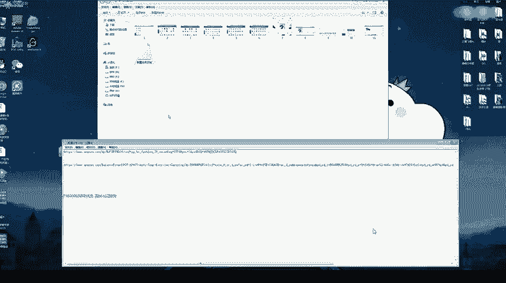
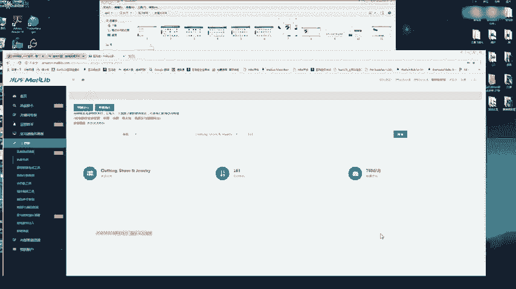
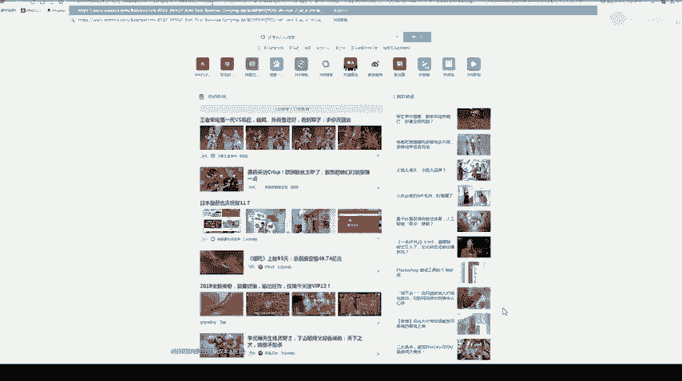
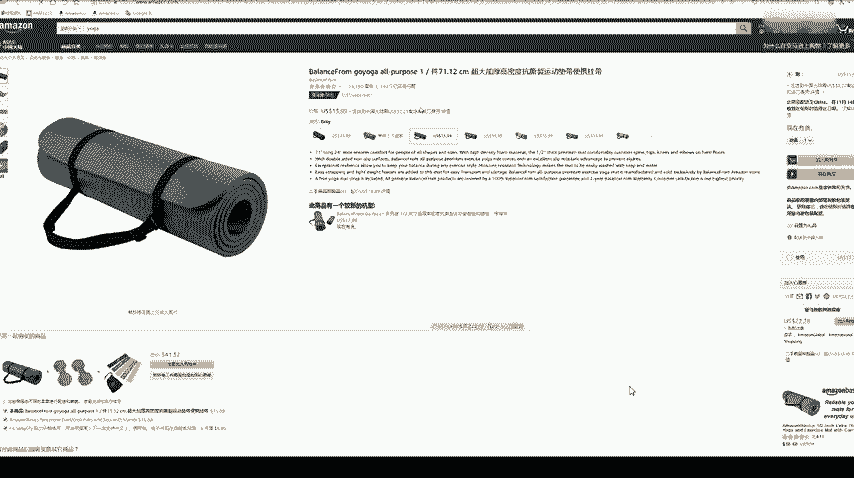
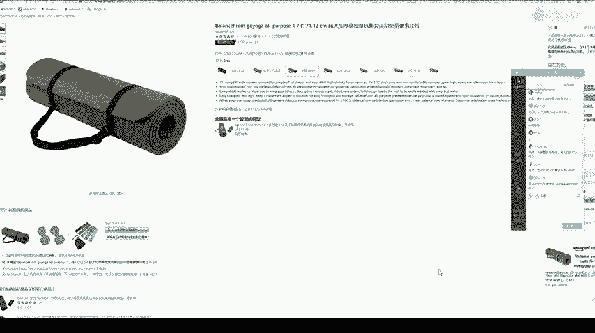

# 冒死上传10遍！《跨境电商亚马逊运营教程》，目前可能是B站最全入门流程，耗时700小时整理，分享学习亚马逊运营干货 - P28：3.产品拓展法 - 小卡勇往直前 - BV1Mw2wYVEdB

那我们产品选出来之后呢。我们是不是可以优化一下这个产品？那首先第一点呢就是说一个产品重组啊，比如说我们一款产品。是他是卖这个大卖家是卖十双袜子的，我们是不是可以考虑卖五双袜子？比如说他十双20美金。

那我们去考虑卖五双10美金。那这样本身我们。产品是跟它的质量是一样的，款式也都是一样的那算下来价格其实是优惠了。就是说我们1010美金的，可能买家更愿意来尝试一下，对不对？那这个就是一个产品的重组。

还有一个呢，或者说我们搭配一个周边互部产品来卖互补产品。比如说牙膏和牙刷，我们就可以放在一起来卖。或者说瑜伽垫和瑜伽用品，我们放在同一家店。来卖，可能买家买瑜伽的同瑜伽垫的同时呢会。

看一下你店里其实有其他瑜伽用品，那可能顺带的买一下。那最后一个呢就是说一个。丹卖我们一个周边的一个互补产品。这句话什么意思呢？就是说我们去卖一个同行卖的比较好的一个互部产品。就是。简单的说就是一个爆款。

一个蹭流量。我这里给大家。

看一下。

比如说这个瑜伽垫是不是卖的很好了，已经卖13380个。那我们。亚马逊的留频率一般是1%，就是卖出100个会大概有一个来留评。那这个等于说差不多卖了140万个了。那大家看一下这里啊。

这里有一个经常一起购买的，经常一起购买的。这里有一个瑜伽垫，一个哑铃，一个弹力带。其实这三个产品都是三家不同的店。然后最后亚马逊这里加起来。

这里加起来的话是有一个总价41。32美金。那其实这个41。32美金的话，就是这三三个商品的价格加起来。并不是说我亚马逊推荐你买这个三个商品，然后呢，这个价格会优惠一点，没有优惠还是一样的。

之所以会出现这种组合在这个爆款下面呢，就是说很多买家购买这个瑜伽垫的同时也会买这个哑铃，也会买这个弹力带。亚马逊记录了这个用用户的一个购物行为啊。所以说。当我们买的时候呢，他会给卖家推荐一下这么卖。

那如果说我们看到。一个爆款产品他卖的很好，那我们去也可以去看一下。它的一个周边互补产品，就是说这里搭配的这两款产品，我们可以去看一下。如果说这两款产品。它的评价不是很多。

然后上架日期也是比较新的那我们就可以考虑去卖一下这个产品。如果说我们自己的产品。上架的这款互补产品卖起来了，有机会。被亚马逊推到。这个。经常一起购买商品的组合里面，那这个流量是很恐怖的啊很恐怖。

所以这个的话也是一种方法。呃，没有的也没有。也没不会说推荐一个自己店铺里的组合啊。因为亚马逊它本身一个是一个重产品轻店铺的一个概念。就是说大家。有时候呢可以就是说在同一个链接里加一个组合这样去卖。

图片呢如果是1688上的图片，我们是可以用在亚马逊上的。但是如果说是亚马逊里别的卖家的图片，你不可以去用他的图片，不可以用它的图片。一般亚马逊我们图片要求都是白底图啊，都是比较简单的图片。

不会像我们国内的一些淘宝啊、天猫啊这些图片，美工做的很厉害，很简单，都是白底图。

