# 冒死上传10遍！《跨境电商亚马逊运营教程》，目前可能是B站最全入门流程，耗时700小时整理，分享学习亚马逊运营干货 - P29：4.产品二次筛选法 - 小卡勇往直前 - BV1Mw2wYVEdB

那接下来的话我们就开始讲上节课没讲的没讲的那我们要做一个二次筛选法。就是我们上面经过这一步步啊，经过这一步步。站内榜单啊。比如说找到一个比较合适的产品，然后呢，我们可以去用。产品拓展法给他一个产品重组。

然后呢，但是最后呢我们还是要给他一个做一个筛选。那筛选的话主要筛选什么呢？首先呢。看他有没有法律方面的问题。那这个是说什么呢？就是说我刚才说的侵权。大家一定要注意你一款产品选出来之后呢。

你一定要看它有没有侵权。我们要避免一个。商标。或者外观专利的侵权。有可能你这款产品刚上架的时候，其实是侵权的，但是亚马逊没有管你，那只是说暂时没有查到。如果说等你后续卖起来了，或有一定的销量了。

亚马逊查到了。那这个也是有可能直接把你整个店铺的销售权限移除的。所以说大家千万要注意啊，这个是重中之重啊，不要去侵权。那还有一个就是我们看一个市场容量。就是说我们这个产品。在我们这个。

市场的市场容量有多少？那这个的话就是说我们要看这个类目top10的。产品。的评价数量。如果说我们找到了一个类目，是不是？那他排在第一个的产品，它的产品评价数量就只有两300个。

那这个产品的市场容量是很小的，就说明是一个很小的类目。就是说我们就算去做了，可能说这个量，就算它起来了也不会很大。那我们要大概看一下这个top10top10就是说排名前十的一个产品啊，这个类目下面。

比如说我们这个水鞋的。这个水鞋的那top10那就是到这里啊，top10到这个位止。那大家可以看。这个呃这个还不是水仙啊，水仙还在下一个类。那水贴就是这个top10。

这个4000多个78700多个800多个。这个也有2000多个啊，这个类目就相对来说是比较大的。前面的评价都是有4000多个，2000多个，对不对？那稍微还不错的一个类目。

如果说我们找到的那个类目就只有排在第一的，如果就只有95都是两三百这样的，那就是说一个比较小的类目也不是很好。那第一个就是说看一个产品评价的数量。那第二点我们就可以。借助其他平台。

上节课给大家有说到一个叫米库的米库的。

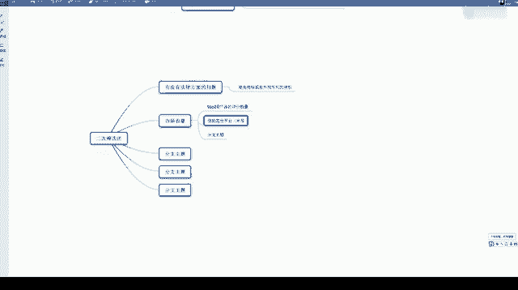

米库的一个软件。这里给大家看一下，那这个就是我们一个米库啊。我这边链接的话给大家发一下链接给大家发一下。

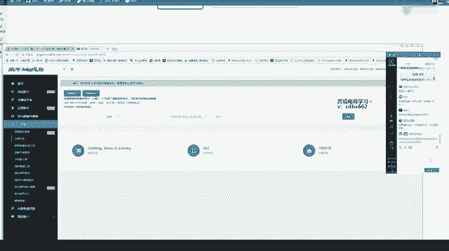

呃，这次课是。不是第一节课不是第一节课。如何判判断商品外观有没有侵权？这个的话要自己去比较一下。那首先呢你看如果说卖的卖家多不多，如果说好几家都同时在卖，那基本上这个产品是没有什么问题的。如果是做视频。

外观都差不多，怎么算侵权？就是我们第一个方面，那自己你卖这个产品肯定心里要有数的。你看一下国际上有没有别的大牌跟这个差不多的。如果有，那肯定是涉及到一个近似侵权了。如果说好几家店都在卖的。

并且说销量都还可以的那这个产品一般来说是没什么问题的。如果说。这个产品基本上都没什么人在卖的，然后呢又长得跟某些大牌呢有点差不多的那这种牌子呢就这种外观呢就肯定比较危险啊比较危险。借助于其他平台。

比如说我们看这个产品。看这个刚才那个第一个吧，看他第一个水习。我们看一下。它这里的话是一个排名第几？在服装鞋鞋靴、珠宝首饰里面排名174名，是不是我们打开这个软件啊，这个叫。

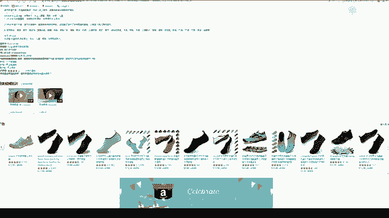

米库米库的软件，它这里工具箱里面有一个销量预测。

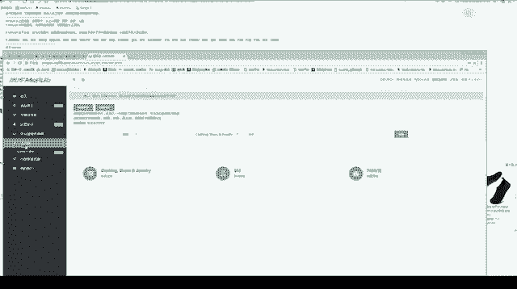

销量预测。这个网络有点卡，那这个的话。呃，他卡也没关系啊。那刚才的话我是看了一下，因为。

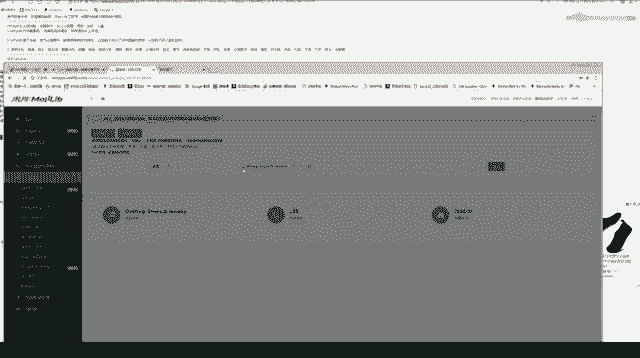

刚才我看了一款产品，它是排名，应该也是一款鞋子，它是排名。

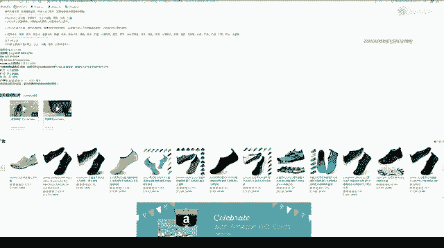

100那个63啊，现在可以了。那比如说这款我们看下来。

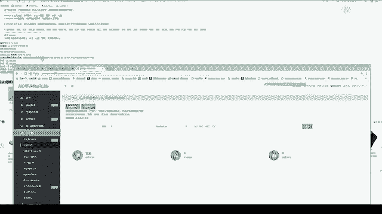

它是一个排名，排名是在这里看啊是在这里。

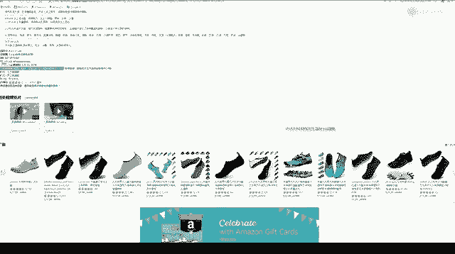

亚马逊热销商品排名啊，它是174名。我们去看一下174。174。啊，这个类目还没选，我们的类目是一个。服饰、鞋子、珠宝。他这个销量预估就是说。7440双一个月啊，就是说大概给估了一下这个产品的话。

一个月差不多卖。7000多双7000多双。他如果说。一双。赚20的话，他一个月就是大家可以自己算一下。就一个产品啊，他一个月可以赚十几万，一个月就赚十几万啊。所以说。亚马逊这个量起来了是很恐怖的。

而且这个鞋子只是说我们刚才也看到我操作了，就是说我们这样一个个类目点进去啊，它是在很里面很里面的一个类目，是不是？这个类目点进去下面的一个类目，再下面再下面的一个类目。点到已经很里面的一个类目了。

如果说你做的好的话，这个销量也是很恐怖的。那这个的话就是看一个。top10。产品销量。我们可以借助一个第三方平台。看一下这个产品的销量，那我们可以自己做一个表格，表格里面呢就写一下产品的标题。

产品的链接，然后产品的一个销量排名，然后还有一个销量预估啊，大家都可以用这个这个去查，包括。他这里的话是可以查一个商标的。

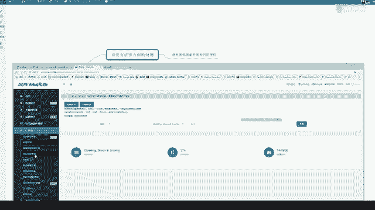

那比如说我们这个这个品牌。它是这个商标啊，那我们查一下。那这个的话就涉及到我们以后一个跟麦的问题啊。看一下他这个商标有没有在美国注册。

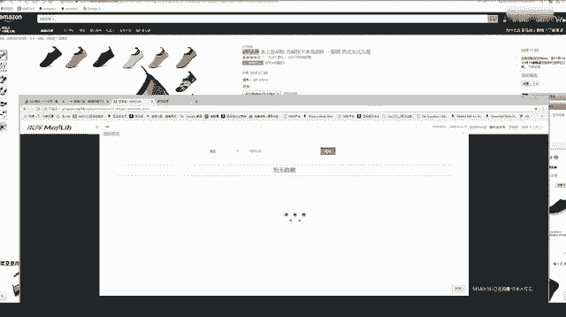

那这个商标它是有注册了，有注册了。就是说我们后续如果说跟卖一个产品，你就不要去跟卖这种。

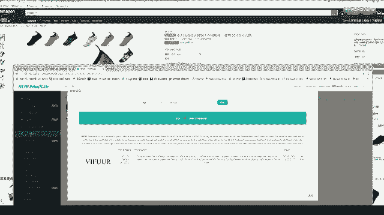

已经注册商标了的产品啊，这个就会出问题。这个涉及到后面。那接下来我们要看一个竞争垄断。竞争垄断的就是我们看top100。产品品牌。的集中度。这个什么意思呢？就是我们看一下这100个产品里面。

这100个产品里面。有多少个产品是同一家店在卖，同一个品牌在卖。如果说我们这个100个产品里面3分之1或甚至说一半的产品啊，都是同一个大卖家在卖。那这个产品基本上就这个市场就基本上已经被垄断了。

就算我们做进去，也很难把这个量做起来。就是说这一类。产品。一小呃一半啊，那我们按50个来算，50个都是一个买家，一个买家在哪。那这个就是说这个这块市场基本上已经被他垄断了，就算我们做进去也很难。

分到一杯羹啊，就是说那这个类目我们基本上不会去考虑了。一般来说呢。我们品牌是越砸越好。越砸越好。然后呢。小卖家、大卖家各种品牌都有，就是说明。这类品牌还没有形成。这类产品还没有形成一个垄断。

那我们最好是各种。小品牌。大品牌都有。那这个品牌怎么看呢？我们看一个标题就知道了。那这个是这个牌子，这个牌子是不是标题前面都是不一样的，都是不一样的牌子。大家看一下，比如说这个。这里的。

这个是HEETA品牌。那标题标题最前面的基本上都是一个产品的品牌啊，那基本上都是不一样。那这种类目的话就相对来说比较好，没有形成一个垄断。那有些类目呢确实是会有这种现象的。

所以说大家做的时候也要做一个筛选。

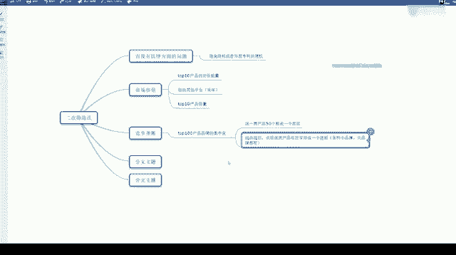