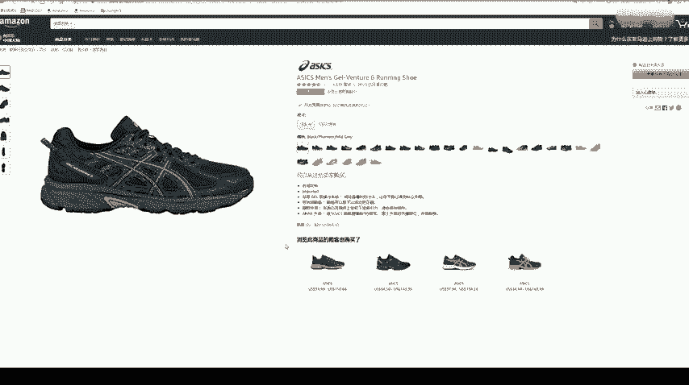
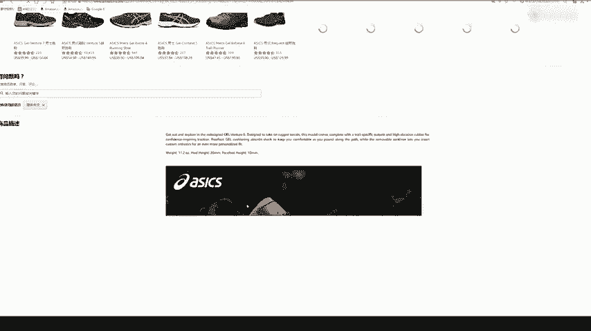
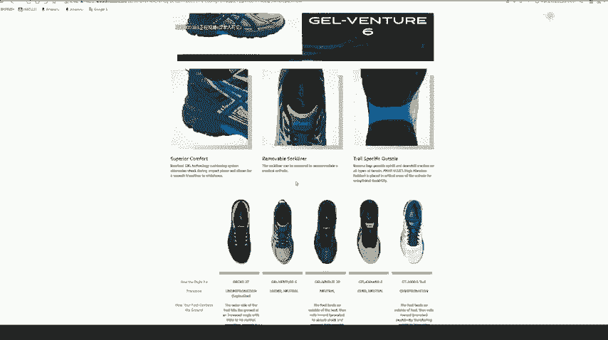
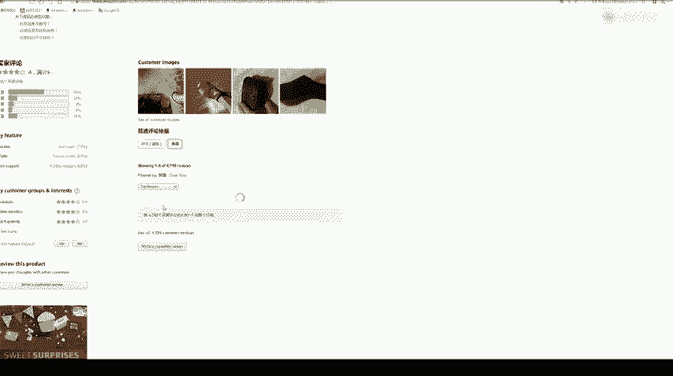
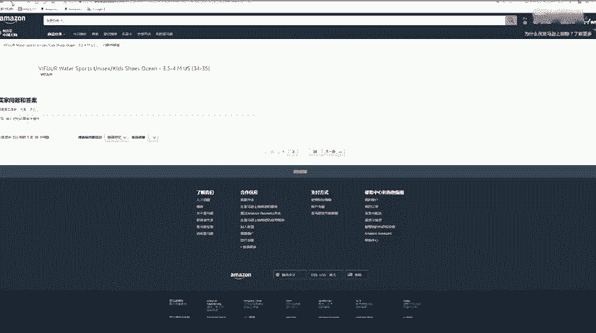
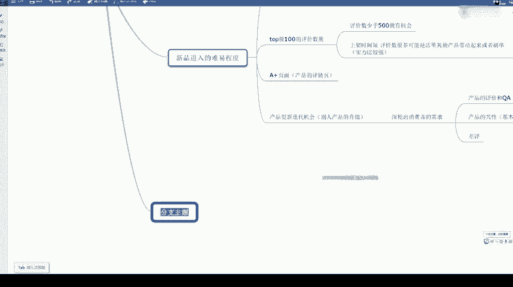

# 冒死上传10遍！《跨境电商亚马逊运营教程》，目前可能是B站最全入门流程，耗时700小时整理，分享学习亚马逊运营干货 - P30：5.新品进入的难易程度 - 小卡勇往直前 - BV1Mw2wYVEdB

还有一个呢就是说我们一个新品进入的难易程度。这个这句话什么意思呢？就是说我们如果去卖这个产品，我们。进入这个类目，进入这个市场。我们做起来的难度大不大？就是我们要去判断一下这个。那这个怎么判断呢？

主要也是分四点。首先一个呢，我们就是要看一个类目。top100。lame top100的产品上架时间。一般来说啊，我们看上架时间呢，主要看他是否在上架在3个月内。如果是上架。在3个月内。的产品很多。

那就是说。这个类目的话。是比较还是比较好做的。就是说我们进去的话也不是很难。那他这个是说明新品。新品在该类目。该类类目里的占比啊，我们要去判断这一个那就是根据一个。产品的一个上架时间。

就是说如果这个类目top100里面上架在3个月内的产品很多啊，那就是说很多都是一些卖家，就是新上传进去的。如果说你基本上没几个3个月内的，那基本上都是老卖家在卖。那既然都已经老卖家，人家卖了很久了。

那我们再挤挤进去，那这个肯定是很有难度的。还有一个就是说。Pop泡。前100的评价数量。刚才我也说了，就是说如果这一个类目它评价数量第一名的，就是说是大家都很少的。

比如说都90的一两百的那这个类目就是一个比较小的类目，它的潜力上限也是比较小的那如果说一个类目我们点进去看都是这样四五千的或者说两三千0的，基本上前10百的都是很高的，或者说1000多的。

都是这么高的那这个类目就是很难的一个类目啊。那这个很难就是说都是大卖家在卖了。你都是评价很多。我们判断的一个标准呢就是说。评价数。少于。500的。就有机会啊。如果说这top前100里面的产品啊。

评价数量少于500的还是比较多的那我们这个类目还是有机会的，就可以去做一下。那评价数的话就是在这里看。比如说这个评价数就是625，这里有只有10个。400多、100多200多的都有。像这种的话。

类目其实还算不错。因为它。评价数量多的也有，少的也有。然后呢，占比呢它还是比较均匀的。如果说。如果说啊一个产品它是在上3个月内。上架的他可能上架了一两个月，但是他这个评价很高啊，评价很高。

上架时间比较短，评价。数很多，那可能。是。可能是某一个大卖家，是他大卖家里。店铺里面其他产品带动起来，或者说它的一个刷单。那就说明其实这个类目里面有比较。有比较牛的一些卖家在卖啊这个意思。

如果说我们这个类目里面就是说有出现很多这种上架时间短，但是评价数量很多，那我们这个竞争也是很大的。因为一般都是比较有实力的。按如果说按照正常情况下去卖的话，这种状况是很难出现的。不会说你上架三个月以内。

你评价数量就有一两千这样了，对不对？基本上很少会出现，如果出现多了，那就是说肯定这个类目有好几个大卖家在做。那这个时候我们如果去竞争的话，是压力会比较大。还有一个就是说A加页面。那什么是A加页面？

A加页面就是一个产品的详情页。产品的详情给大家看一下。什么是A加一呢？那这个产品就是没有一个A加A加页面的。我们再看一下，随便看一下有有没有这款产品，有没有A加页面。再换一款啊换一款这款。

A加页面呢就是说我们产品的一个详情描述里面，它是需要有一个图片的。

如果说你没有A加页面的话，它只是一个文字。比如说像这一款，它中间是不是出现了图片？

是不是出现了图片图文描述，那这个详情页面就是我们所说的A加页面。像刚才这个它只有文字，它只有这里的文字。那这个他就是说他这个店铺没有做一个A加页面。

那什么时候才能？做一个A加页面呢，A加页面就是说你有一个美国产品，美国商标，并且把它。加到了一个亚马逊里面了，备案了，相当于这个时候你就可以做一个A加页面出来。那相对来说我们AA加页面一个出单的。

概率回避。不做A加页面的要高一点啊，这个都是很正常的。大家肯定如果说你产品详情里面有图片展示，那肯定很多买家愿意去买。那这个也是一方面，大家如果说以后做到后面了，也可以说去申请一个美国商标。

美国商标的话，一个美国商标价格大大概是在呃2000到3000元左右。因为我刚才说了，亚马逊的话本身就是一个市市场很大很大。刚才给大家大概算了一下这个水鞋的类目是不是它这一个个分类点下去。

点到最后面一个小类目，它的排名第一个产品。他一个月如果这款鞋子大概算一下，一个月也能赚十几万，对不对？如果说真的你一款产品做起来了，它这个利润是很恐怖的。还有一个就是说产品。更新迭代的机会。

那就是说别人产品的升级。刚好是别人这款产品卖的好的，然后呢，你发现了这款产品，然后你去找货源的时候呢，哎，发现市场上其实有他的一款升级的产品，刚刚出现在这个时候。那这个时候。你去卖的时候，是不是？

大家都会来选择买你的。本身它的产品。对，这个市场需求是很大的，是不是大家要注意观察产品的一个更新迭代。要深挖一个。深挖。出消费者的需求啊。消费者的需求。那这个我们去哪里看呢？怎么看一个消费者的需求呢？

一般就是看一个产品的评价。和1个QA。产品的评价很好看，就是说我们一个产品的好评啊、差评啊之类的。那就是说这里的展示的一些评价。那如果说大家到时候看不懂，或者说翻译也可以啊，这里如果说他。

直接翻译出来呢，有点问题啊。应该。翻出来有点问题。那就是说在这里面看大家看一个差评。

然后QA是什么呢？

QA的话就是说一个买家。和卖家的一个问答，或者说买家与买家之间的一个问答。那么就是在这里。这里的话应该是点这个。比如说这个。测量鞋垫的最佳方法，它这个就是说一个买家一个提出的问题啊。

那一般的话都是说这种是。我们卖家回答或者说一些买过的买家可以回答。那我们如果说看产品的时候，也去可以去看里面的一些问题啊，这些问题往往都是说买家比较关注的一些问题。你看比如说这个问。

这些是在哪里制造的中国或者说。我我正在进行1一次7天的巡航，这些会在海滩什么就是能用这么久吗？然后可以做一个回答。如果说。直接回答我们这款产品都是能做到的那买家的下单以望肯定是很高的，对不对？

那这个就是说一个产品的评价和QA。还有一个呢。产品的一个共性。就是产品的一个基本属性。那既然是一个产品迭代的，那两款产品的基本属性基本上要差不多的那就是说它是一个在这款产品上的一个升级啊。

那基本属性是要一样的。还有一个就是说差评。看差评呢，大家选品的时候一定要去看产品的差评。差评是最容易体现出我们这款产品的问题出在哪里？你能不能去。但。改掉这个产品的产品，这个很关键。

然后这个的话就是一个新品进入的难易程度。还有呢我们要看一个其他问题啊，其他问题。

