# 冒死上传10遍！《跨境电商亚马逊运营教程》，目前可能是B站最全入门流程，耗时700小时整理，分享学习亚马逊运营干货 - P31：6.产品二次筛选的其他问题 - 小卡勇往直前 - BV1Mw2wYVEdB

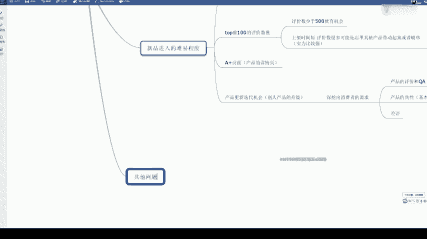

其他问题的话就是说一个是看一个成本。

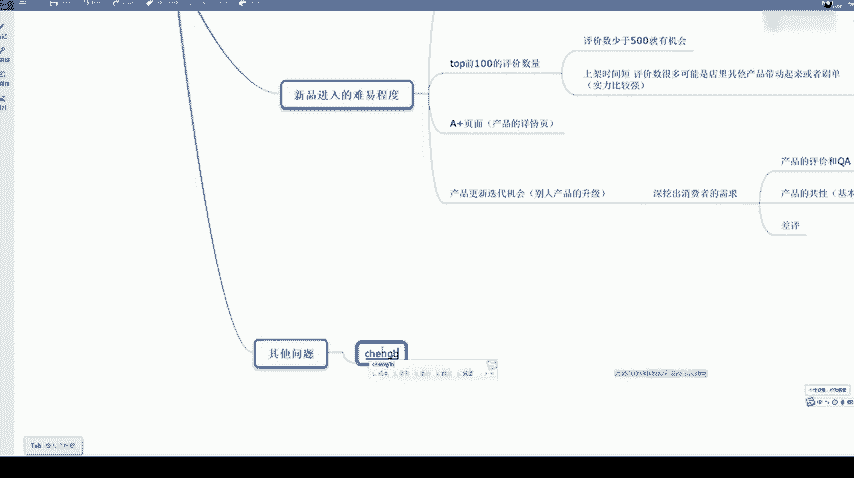

那当然成本有了，还要看一个利润。

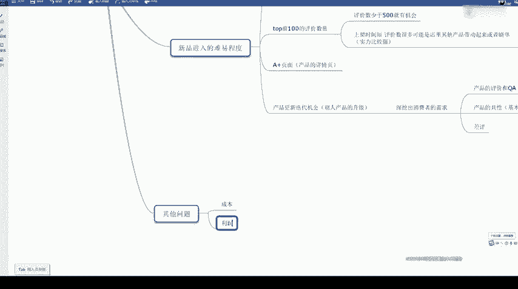

产品呢我们成本呢我们有哪哪几点呢？一个产品本身成本。

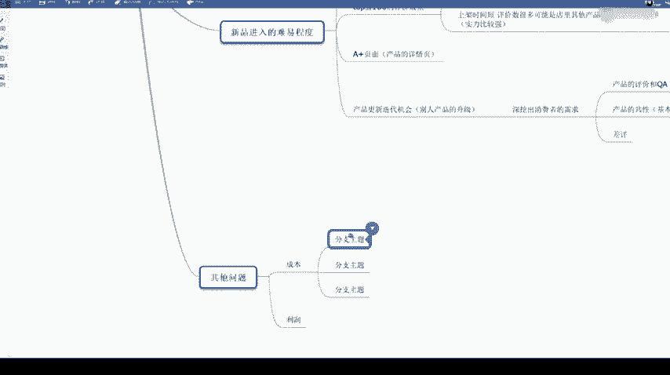

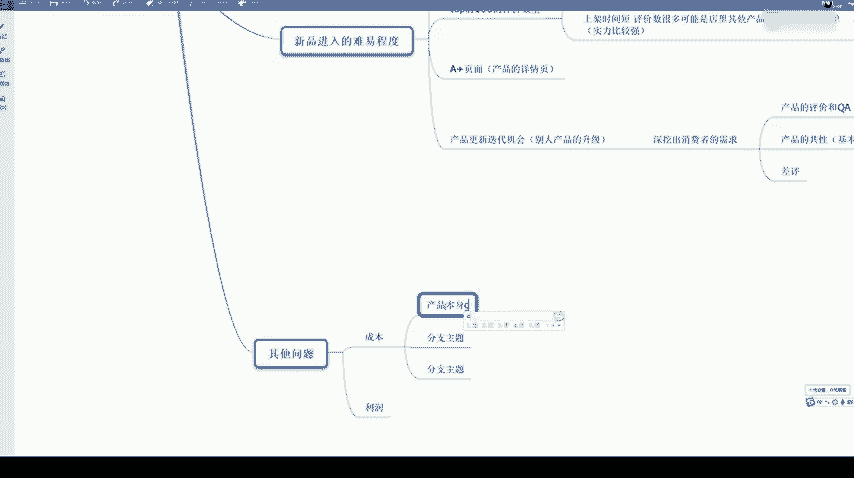

还有一个呢。头层的成本。什么叫头程的成本呢？头程就是如果我们是发FBA的，就是我们把货发到亚马逊FBA仓库的一个运费，就叫头程成本。还有一个。FBA派送。成本。这个也叫后乘成本，就是说我们出单了。

是FBA那边给我们派送的那FBA会收一个派送费。这个派送费呢，按照一一件T恤来说，一般是3美金左右，一般一件比较比较小的东西都是说3美金左右。

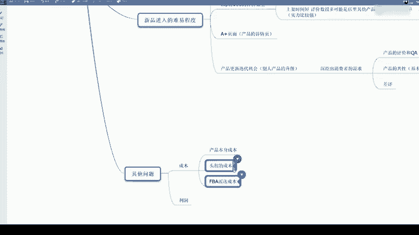

那我们产品本身的成本，大家买货的时候肯定知道啊，那头层成本很多时候呢。

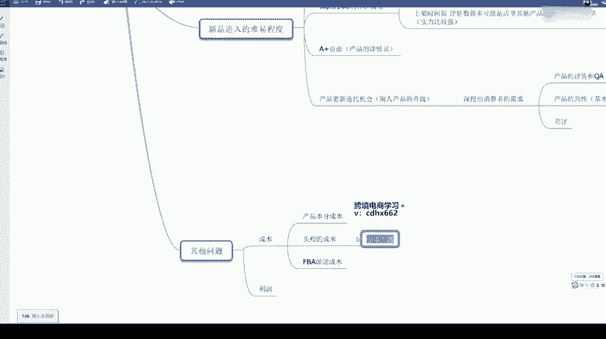

如果你能做到一个运费。

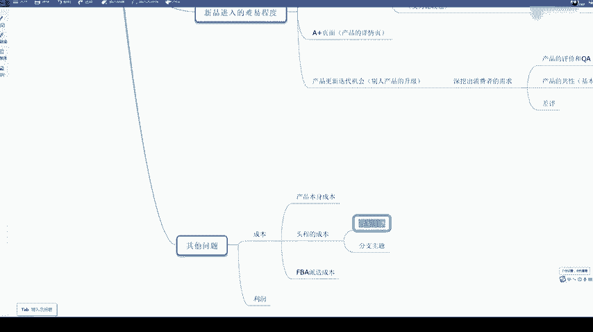

比较低。那整个产品的价格是不是降下来了？那我们头程的话分两种，一个空运，一个是海运，海运的话就是说。

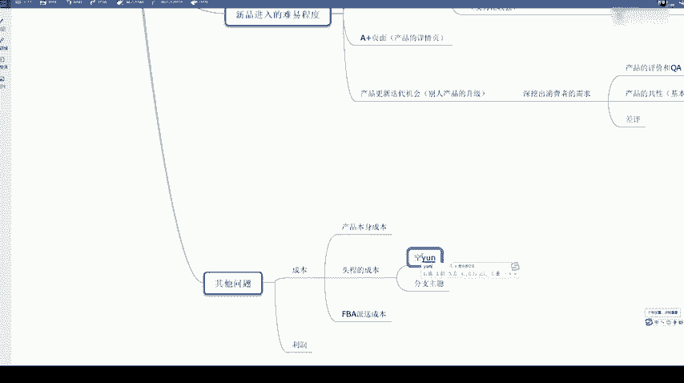

时效比较慢。那我们需要一个提前备货。海运就是船运过去，通过船运过去空运的价格，我给大家大概讲一下。如果说你是发商业快递，比如说DHL啊，EMS这些商业快递20千克左右的一箱货的话，它的价格差不多是。

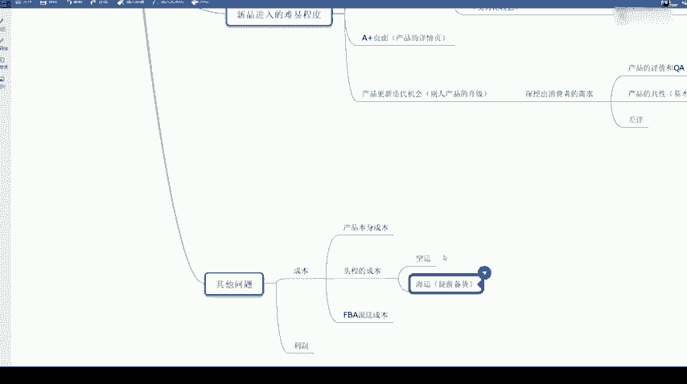

40元每千克。40元每千克。然后是如果是海运的话，差不多是十几块钱每千克。但是海运的话这个量要很大。大家如果说以后做起来了，成为大麦了，可以往海运这边考虑。那一般一开始的话就是说肯定是以一个空运为主啊。

那有些人可以看到一些大卖家。

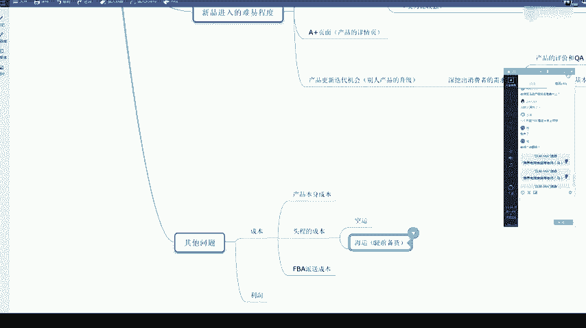

你就你就觉得奇怪，你算一下，其实大家拿货的成本其实差不了多少。但是这个大卖家他这个价格就是卖的很低啊，就可能你觉得是亏本了。其实他可能是他是走了海运，他这个物流成本是低了很多。

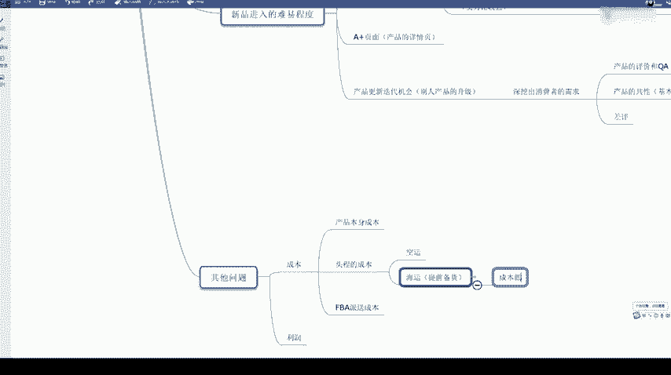

那还有个利润，利润的话，我们一般都是一个。

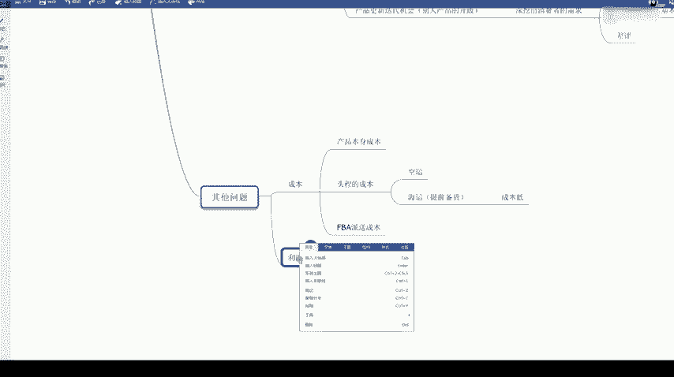

至少要大概是30%啊，30%的利润就是一个售价的30%。那我们知道亚马逊是30天无理由退货的，所以他的退款率是所有平台里面最高的。所以我们这方面呢是。这个利润要高一点。

那亚马逊给大家简单讲一下亚马逊退款是怎么样的。比如说他买了一件衣服，他觉得太大了，他想退回来。那这个衣服退回到仓库之后，亚马逊会重新包装。如果能卖的话，还会继续放到仓库里卖。那退款的时候呢。

我们卖出这个产品的时候，亚马逊会是不是给我们收了一个派送费？如果这件衣服买家要退款的。那我们需要承担的一个费用就是一个亚马逊的派送费啊，其他费用的话就是不需要承担。就是说我们如果说一个买家退了一件衣服。

那我们就会损失一个派送费，差不多20块钱左右。

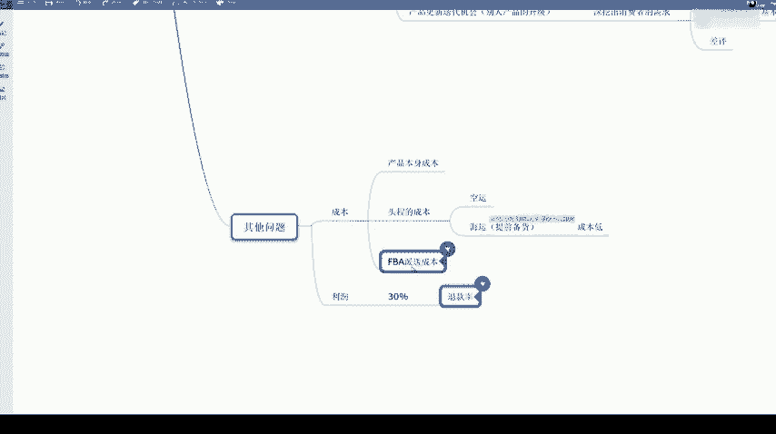

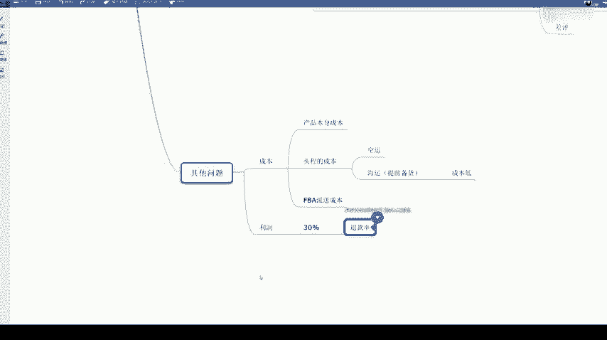

那这个的话大概就是所有的一个系列啊下来。

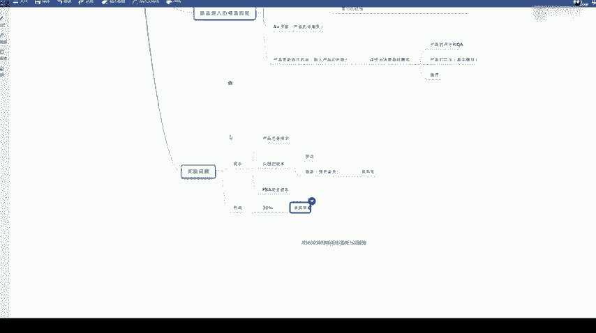

根据我们一个平台的一个。

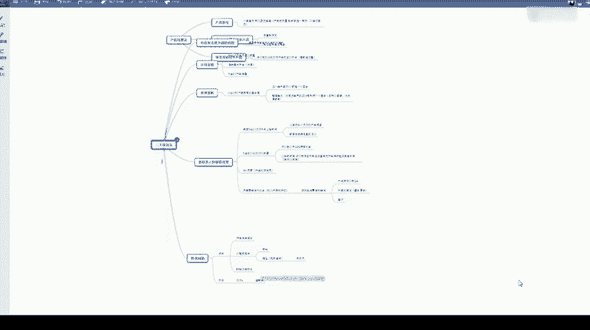