# 冒死上传10遍！《跨境电商亚马逊运营教程》，目前可能是B站最全入门流程，耗时700小时整理，分享学习亚马逊运营干货 - P32：7.一键代发 - 小卡勇往直前 - BV1Mw2wYVEdB

平台的一个站内保单选品，然后到最后的一个二次参选法。然后我这边跟大大家讲一下，因为很多同学呢是做一个。个人站对不对？个人站其实个人站你说自发货去做的话也是可以的那我这边的话给大家介绍一个网站。

一个很好的网站。

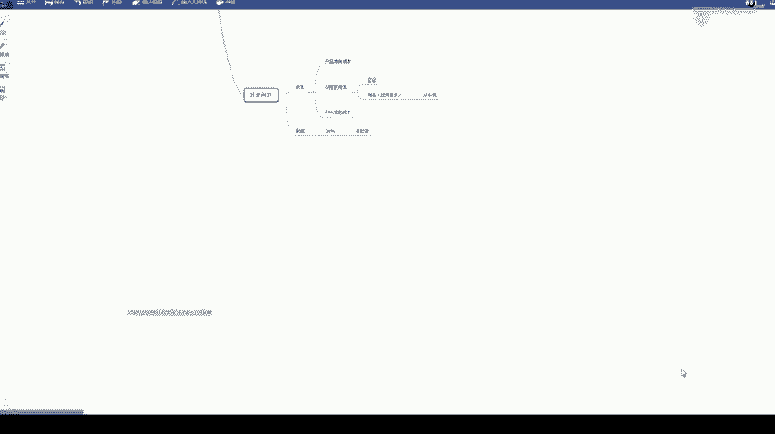

叫一个越狱大卖网，我这边群里发一下。群里发一下。FBA是什么？FBA就是亚马逊的一个仓库啊，亚马逊就类似京东自营一样的，就是我们FBA就是亚马逊的很多仓库的一个统称，就也就是一个海外仓。

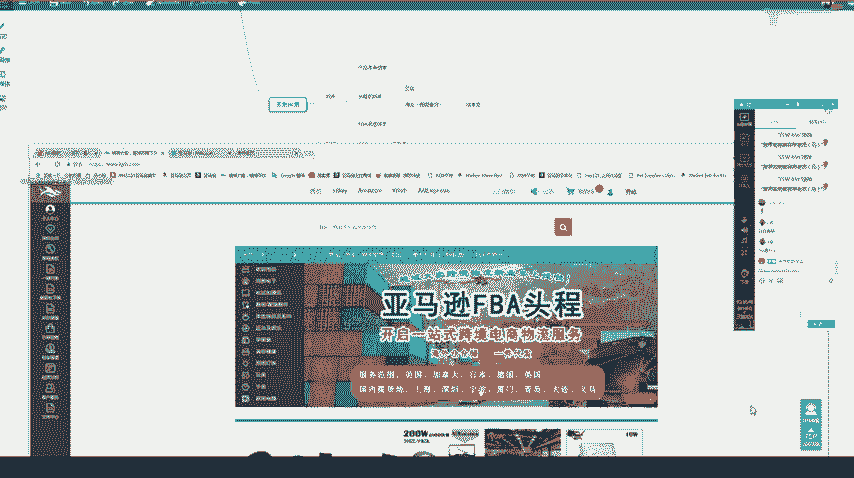

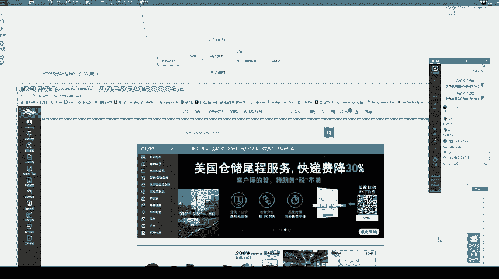

我看一下。刚刚那个怎么看？

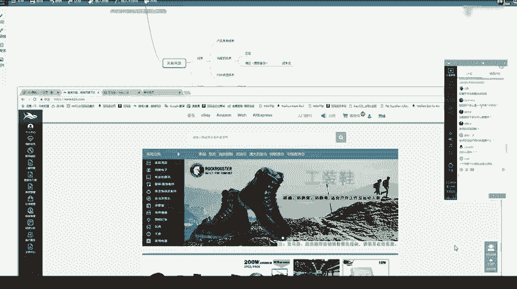

呃，一个月卖7千双的，我这里给大家讲一下。这个网站是不是发给大家了，是不是发给大家了？然后呢。

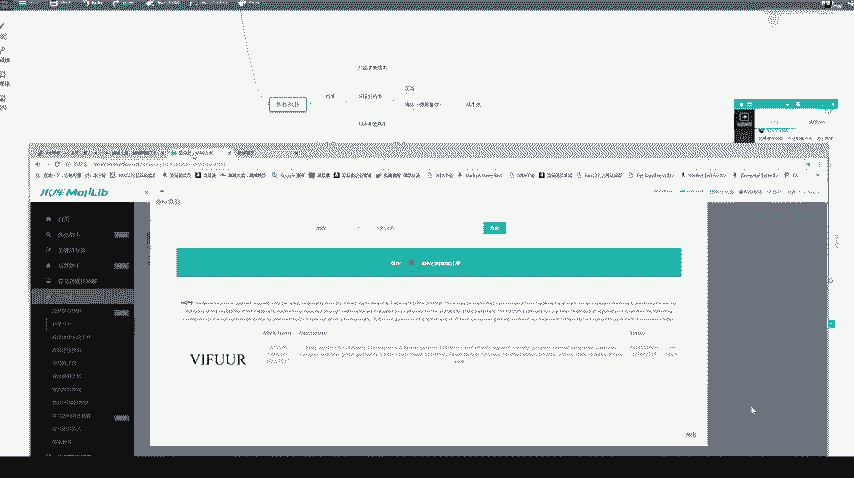

这里有个工具箱，工具箱点进去，它这里有一个销量预测，销量预测。我们找到我们刚才的那个类目是不是服饰鞋子类目，然后这里就是我们一个。

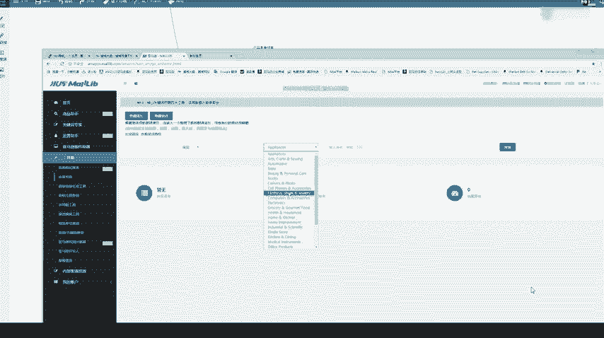

鞋子的排名啊，鞋子，比如说这双鞋子。我们在这里排名是不是174名？

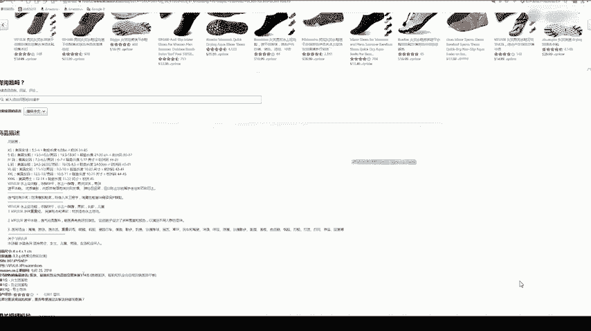

第174名，我们把这个170输进去。他不是大概估出来7400多双吗？是不是这个也是预估啊。产品排名是靠什么？那产品排名就是靠我们一个销量。如果我们每天都有出单，就稳定出单了。

我们这个产品排名会慢慢上去的就是看产品销量。那产品排名每天都会变动的。2000人民币是什么意思？可以问问题啊，大家。有问题中一般大部分我们是发一个呃空运快递或者专线啊，FBA需要压货。

就是我们可以发一点点货过去。那自发货。呃，相对来说比FBA优势少一点。但是我们如果说新卖家如果说你还没有接触这个行业过，那我们可以说自发或尝试着做一下。我给大家这里推荐一个网站就是。

报单的时候再补来得及吗？一般是报单之爆单之前，你都是心里有一个预算的，他不会一下子马上爆起来，肯定是每天慢慢的慢慢的你单子越来越多，你这个排名会越来越高。那就是一个过程的。不会说你今天就五六单。

明天变成56单了，这这种情况是比较少的。他这个排名的话，它不是它是每天都会变动的，每天一天都要变动好几次的，是根据你一个当下的实时的一个销售量。

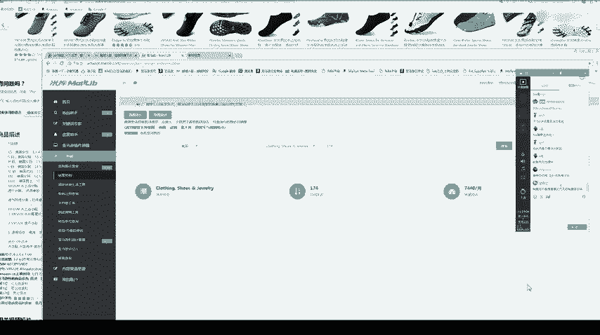

这边这个网站呢比较好啊，就是说一个一件代发的叫一个。越狱网大麦越狱网，那这个怎么好呢？我们看一下，我们点这个亚马逊进去。大家看一下这里的产品呢。看一下点一下，他这里有个美国仓，对不对？

这个的话我就专门针对于就是说一些自发货的同学讲一下，如果说大家要做自发货，可以去了解一下这个平台。那我们这比如说这款产品。他们平台上是。卖多少73元免邮费。那我们点进去看一下。

那比如说这款免邮费110块钱。是不是产品图片都是有的。然后我们再看一下它整个商品的描述都是有的商品的描述，然后包括这商品的5点特征都是有的。然后呢，还有个商品属性里面，商品的标题也给大家做好了。

商品的标题啊。那他这个这个仓库呢，就是说在美国的一个洛杉矶仓的，就是说大家如果说。可以去卖这个平台的产品。如果你出单了。这个就是说他们帮你发货，他而且他们的仓库就是在美国的一个。

洛杉矶洛杉矶那边就直接可以帮你发货。然后这110块钱呢，就是说已经包含了我们一个物流费了，就是说你出110块钱，他会帮你把这个货送到这个买家手里。然后他这里也说了，一般就是两天内发货。两天内发货。

也可以说啊大家看一下这个平台里面的产品，然后呢。

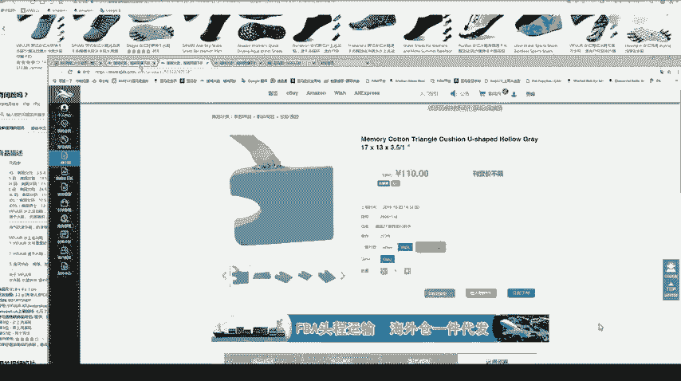

你如果不想用买他们家的产品，那你可以去1688上找类似的产品，找到找到了一样的。你图片或者描述可以用他们家的。因为我看有些同学可能说英语这一块不太好，那这方这里面呢他都给你准备好了。

一般他们平台呢都是说一些做亚马逊做的比较久的一些运营啊，就是说他们每个月都会更新一些产品。比如说2019年10月份的一些好卖的产品。那像这种产品。

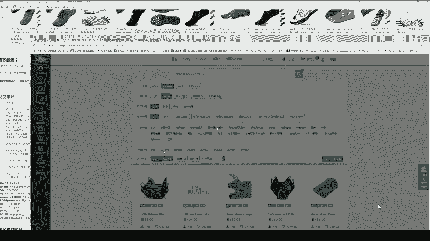

就属于圣诞节了，是不是可以提前准备起来？虽然虽然说比较贵一点，大家如果说出单了，他们也是直接是美国那边海外仓给你派送的。所以说这个发货时间也是很快的。大家可以去参考一下。

不一定说一定要去1688上找货啊。呃，这个说。那肯定是任何平台都是越早开店越好，因为你越晚开店，开的卖家越多啊，竞争也就越大。这个网址我再发一下我再发一下。大家可以去了解一下，但是不一定。

这个网站是这个网站是人民币啊，这个这个人民币435元。这个就是说有些自发货的同学啊，这样做起来是很方便的。不是啊，不是说自发货了。只能用我说的那个平台。我的意思就是说，我们做自发货的同学呢。

可以把他们平台上的图片产品下载下来，然后再一模一样呃，再一样的上架到亚马逊上。如果你出单了，你去他们店里把这个钱付给他们，然后呢。让他们帮你把这个货发到那个亚马逊卖家手里，这个意思听明白了吗？现在。

中国族啊。这个这个的话。这个的话我也不太了解，反正亚马逊的话，相对其他平台来说是卖家最少的一个啊。因为亚马逊本身它需要呃怎么说呢？后续要需要做1个FBA之类的，相对来说更专业一点。

然后呢潜力更大一更大一点。这个的话就是类似一件代发。是我因为我发现有有些同学就是。一开始不想做FBA，那我给大家就是说一下，其实一件代发的话，这个平台也是比较适合大家的。对，这个行为就是就是他说的一样。

这里面卖400多，我们在亚马逊卖多少钱呢？亚马逊的佣金是15%左右啊，呃，15%，佣金是15%。一件代发，那他们这里的产品基本上不会有侵权产品的侵权的问题的。你看一下他们这里卖的产品不会有那种。

容易侵权的东西都是比较普通的产品啊，不会有。像这种箱子啊，什么家具上面也不会出现卡通的图案的，大家可以去尝试一下，可以去了解一下。当然我们自己也可以去1688上找啊。能不能看一下亚马逊是卖多少钱。

我可以给大家大概算一下大概算一下。如果说。比如说这。这一个呃，400块钱的东西是不是？400块钱的东西，我们要赚30%的利润，那就是乘以1。3，那就是变成520块钱。

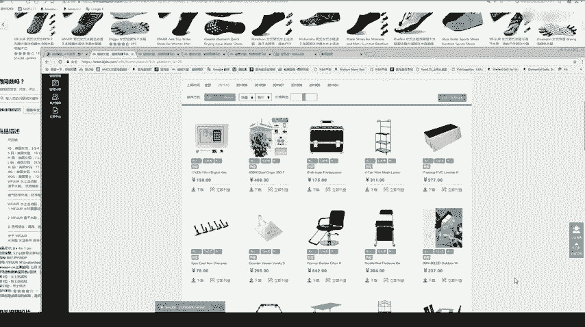

520块钱，那亚马逊的一个佣金。佣金是0点呃，85%15%，我们再出1个0。85。520除以0。85，那就等于610块钱，610块钱我们再把它换算成美金，差不多卖88美金啊。那这个东西差不多卖88美金。

价格的话呃，后续的课也会跟大家讲一下怎么算价格。基本上就是说一个利润的30%。呃，这个一件代发也是也是自发货的一种，不是说一定要自己发货。那我们亚马逊分自发货和FBA自发货又叫FBM吗，是这个意思。

他们发过去不用啊，美国他们是美国的仓库，发过去可能三四天就到了。对，自发货就叫又叫FBM。那大家有问题可以再问一下，因为我们还有一部分时间。

