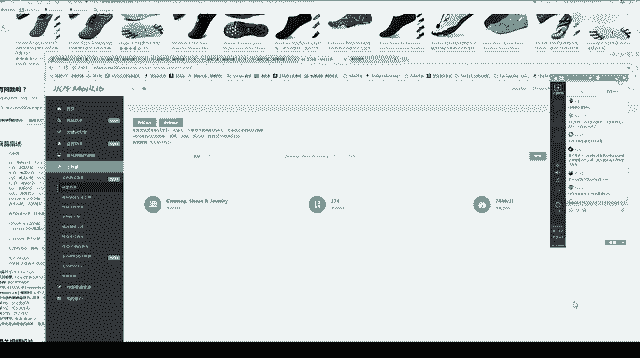
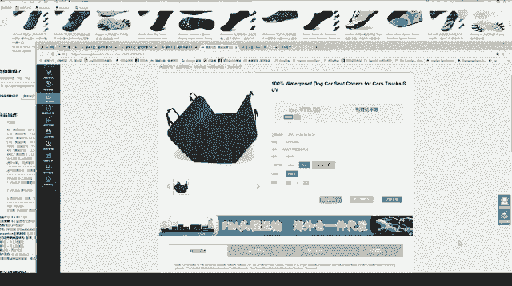

# 冒死上传10遍！《跨境电商亚马逊运营教程》，目前可能是B站最全入门流程，耗时700小时整理，分享学习亚马逊运营干货 - P33：8.问题解答 - 小卡勇往直前 - BV1Mw2wYVEdB

亚马逊付款多久时间？你呃亚马逊付款。亚马逊是这样的，一个月会给我们打两次钱，差不多15天打一次钱啊，他15天结算一次，就是我们如果做了，会15天收到一次亚马逊打过来的钱。啊，这次课差不多讲完了。

如果有问题的同学，大家可以问一下。然后到时候这个录的课件呢会传到传给大家。自发货是我们直接发给卖家。不会发给亚马逊那边。个人店铺是可以升级企业店铺的。

所以说大家如果说想要先从个人店铺做起来的那你可以先个人店铺尝试一下。如果你觉得。你可以做得起来的那你后续注册公司去做企业也可以。呃，网上操作也会教的。还有一个同学说米库的链接啊，米库的链接我再发一下。

米库的是免费的，不是收费的。自发货的话一般不会退货啊，不会退货，很少会有退货。如果说自发货，你如果说买家不喜欢的话，一般都是给你个差评，然后就这样。升级企业店铺不麻烦不麻烦。呃，家里有两台电脑啊。

这样是可以的。但是呢你千万要注意。两台电脑要配两个独立的网络，然后呢。这两个账号不能。两台电脑，你这个账号这个电脑登一下，那个电脑登一下，这样就形成一个关联，不可以这样。差评会影响店铺信誉吗？呃。

亚马逊有两个评价，一个是店铺评价，一个是产品评价，差评只是产品评价，不会影响店铺的，大家放心啊。刚刚图片侵权怎么查侵权？图片侵权的话，就是你自己要看你这个产品有没有侵权。那你可以比较一下大家。

如果说这款产品大家都卖的还不错，然后卖的人也比较多的，一般都是没什么问题。如果说这款产品你看着跟某个大牌有点类似，然后呢，又没什么人卖的，往往这种产品都是侵权的。呃，这个公式的话，如果是算价格的话。

大家到时候可以问一下，我们也会有一节课专门会讲一下，到时候产品上架价格怎么算的。亚马逊也可以的，亚马逊不是说进入呃，对，也是有进入我的店铺的。但是亚马逊是重。产品清店铺的。自发自发货为什么没有退货？

因为大家知道我们比如说一件T恤，你寄到美国那边，可能只要20二十几块钱。如果说美国人把这件T恤退回来寄给我们，他这个运费是很贵的，可能要十几美金或者二十几美金。所以说如果要退货，美国人基本上不会退的。

😊，商家。商家登录操作啊，这个这个是什么意思？跟官网是同一个。店铺有权重期吗？那如果说你店铺的绩效比较差了。那肯定是说会影响你整个产品的整个产品的曝光的。这个大家注意啊，所以说店店铺有一个绩效考核的。

我们都用一一件代发那个图片。那这个图片就是说大家都可以用的。如果说大家都用一件代发了，那是不是大家图片都一样了，那这个就是没有一个差异化了。就是我之前说的，我们选品呢要做一个差异化。

你可以也体现在这个图片那里，大家都用图片了。我们用一下不一样的图片。

日本的话目前没有啊，日本。

这里的话主要是美国和澳大利亚、澳大利亚。大家也可以去里面的找产品，然后对应的去1688上找。因为他们这里的产品比较好，大家如果找到16881样的，可以那个可以用。用他们的图片或者描述。怎么吸引美国人。

买买我的商品，那可能就是说你要在选品选的好。然后呢，你后期的话可能图片要拍的好一点。买家账号没事的，只要这台电脑没有登过卖家账号啊。这里不是啊，大家都是新学员一起上课。呃，这个也不是啊。

不是说可能店铺刚开起来那那一会儿呢，大家。新产品发过去呢，就是说产品会流量会稍微高一点。呃，这个没事，到时候的话课件会。会发给大家的会发给大家。大家如果说。如果说没有听懂。

后续课还会听一下那图片是可以听的。没有这个产品质点。好了，时间的话再给大家再给大家4分钟啊，4分钟我们就结束了这个课。同1个IP是可以登录不同的站点，包括你一台电脑上，你可以登美国站。

也可以登你英国站日本站的账号，但是不可以登两个美国站的账号。呃，因为大家问题可能比较多，所以我再延延长4分钟啊，4分钟讲完我们就下课。呃，资料如果大家都准备好了，我建议大家就去都去。

如果说自注册的那就你自己注册后台有问题的，可以来问我们。如果说你是企业账号的那你可以去找招商经理去注册啊。大家切记，如果你是想找招商经理注册的，你千万不要拿你那个企业的营业执照去尝试着自注册。

千万不要去尝试啊。一旦你尝试自注册了，你后续招商经理不会管你的。招商经理的话，我们后来后后面也会联系一些招商经理呃，对接给大家的。因为张商经理本身就是说他们是一个免费给我们卖家服务的。张商经理的话。

我到时候联系方式会发发一些给大家。个人账户是不需要找张商经理的。那个人账户是没有一个月租费的，我们一个企业账号的话是39。9美金。个人注册就是在亚马逊后台啊，大家可以百度一下亚马逊美国站注册那。

也是注册的。张商经理是帮我们扶持一个自然年。对，是这个意思。现在如果说找张商经理注册的店铺。那我们店铺开起来的话，是1月1号1个自然年。就比如说你如果说是10月28的那我们今年的自然年就到12月31日。

那今年的话差不多招商经理都不会管了。所以说都是要1月1号开始开。就算招商经理11月份发给你注册链接。那他。让你开店，把你这个店铺激活，也是要1月1号激活的。注册不难的，大家不要想着注册很难。

我们难的是怎么选品，怎么出单，怎么赚钱啊。呃，你如果说。个人已经扣了钱了。啊，这个没事啊这个没事，你如果注册好了，没有卖东西，你这个月租亚马逊，你跟后面你跟亚马逊的后台跟客服讲一下，他这个钱会退给你的。

你没有销售的那一部分钱，他会退给你的。比如说你两个月没卖东西，你跟客服说一下，他们会把这个两个月80美金退给你的。个人已扣。那你可以后台联系这个亚马逊的客服啊。月租是可以退的，可以退的。好了，呃。

时间也差不多了，个人注册是不需要费用，个人注册我们就是按照卖出一个产品，亚马逊收多少钱这样。