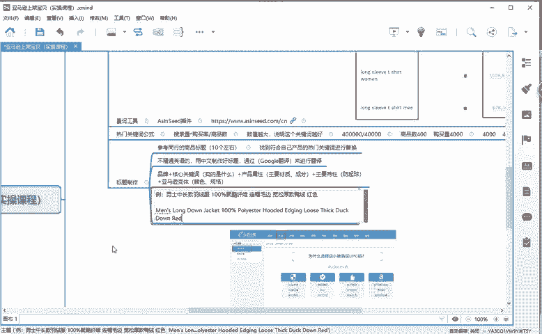
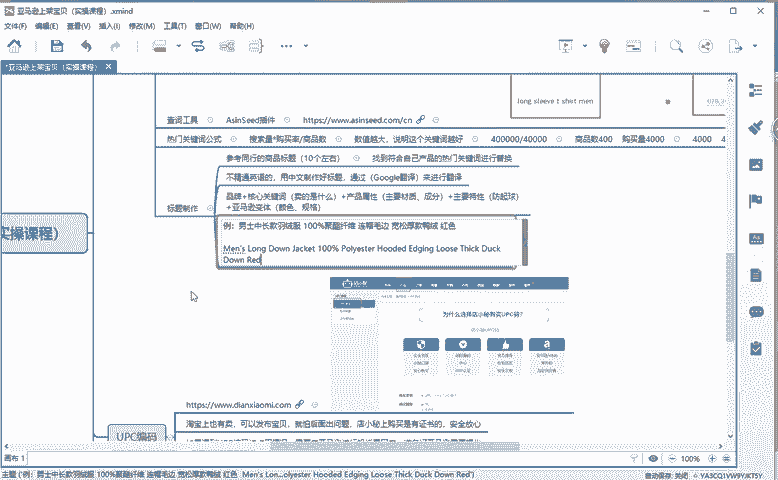
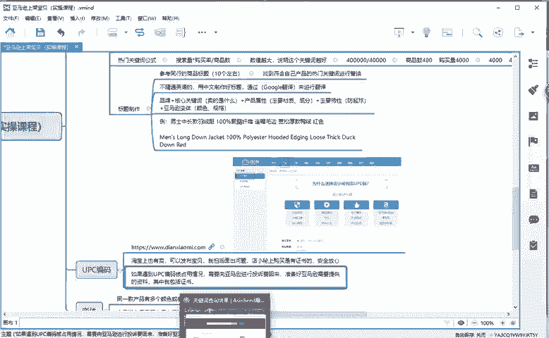
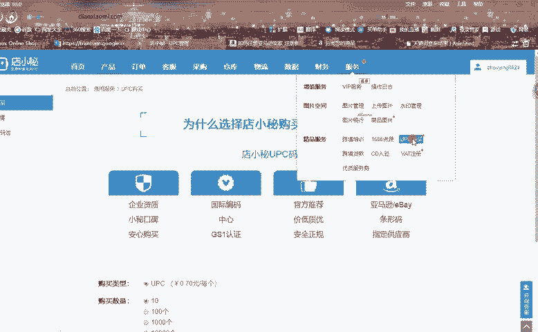
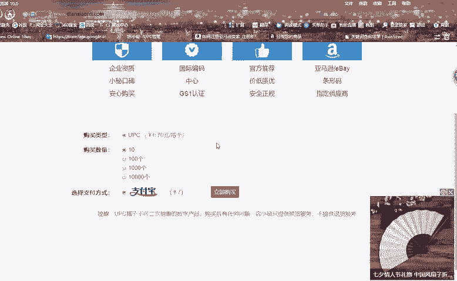
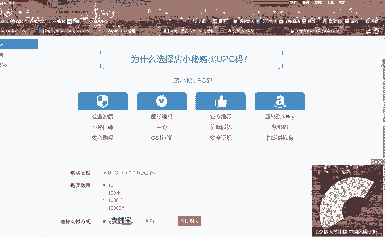
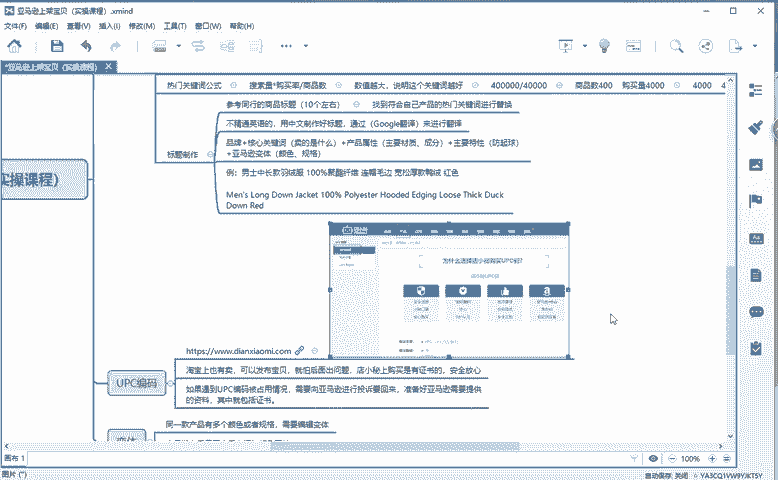
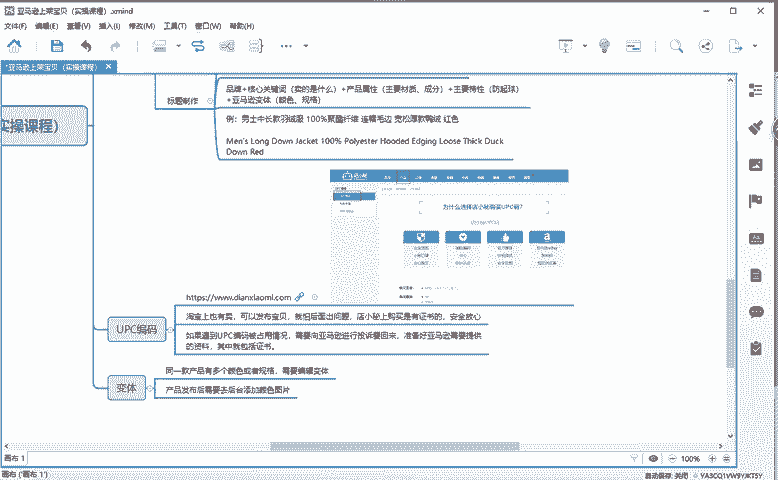

# 冒死上传10遍！《跨境电商亚马逊运营教程》，目前可能是B站最全入门流程，耗时700小时整理，分享学习亚马逊运营干货 - P34：upc编码 - 小卡勇往直前 - BV1Mw2wYVEdB

那么我们在发布宝贝的时候。像亚马逊，它会需要1个UBC1个编码，对吧？我相信很多同学的话可能会在淘宝上去购买。淘宝上的话也有很多也很便宜，几毛钱一个，对吧？😡。

这里面的话我给大家一个链接啊，你们把这个链接保存一下。为什么我会给你们发这个链接？😡，因为淘宝上有的啊这个UPC编码的话，它是没有证书的。也就是说没有认证的，没有通过啊认证的。😡。

万一后面我们发布了之后出现了问题。😡，我们没有证书啊去申诉。所以说通过这个店小蜜的话，我们购买的。😡。

我们点击点进来啊，点进来之后，你注册一个账号，注册一个账号在我们的右上角它有个服务，我们点击这个服务，它有个UPC购买，我们点击这个UPC购买就可以看到啊这样的一个页面。😡。

他自里没的话。😡，一次啊最少购买10个7元钱一个啊，7元钱一个。

他是有证书的啊，有证书的。也就是说，如果我们的产品万一后面出现问题，我们要向亚马逊进行申诉啊，对吧？要进行申诉。那我们申诉的时候，需要提供的一个资料，就是我们的一个证书，就是我们这个证书。好吧。

所以说我给大家推荐这个链接去购买。你后面的话，你们需要的时候啊，可以通过这个去购买。有很多同学说啊，老师。

这个软件不会是你做的吧。首先我给大家讲清楚啊，这个东西不是我做的，我只是给大家提供一个信息，你们可以通过这个去购买。当然有的同学说老师我就想在淘宝上购买，那么你们就去淘宝上购买就好了，好吧。😡。

好，那么接下来的话我们就啊来发布一个产品，好吧，来给大家演示一遍。

