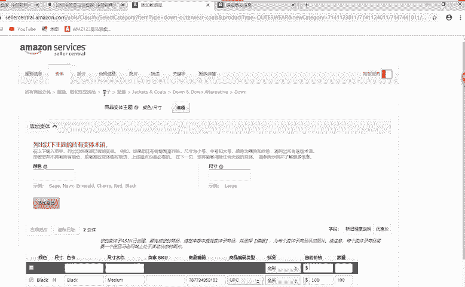
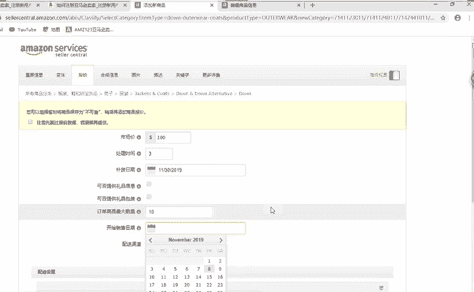
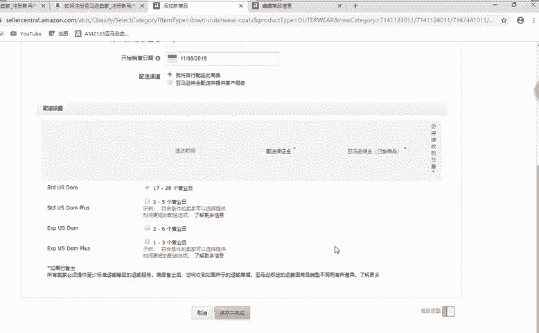
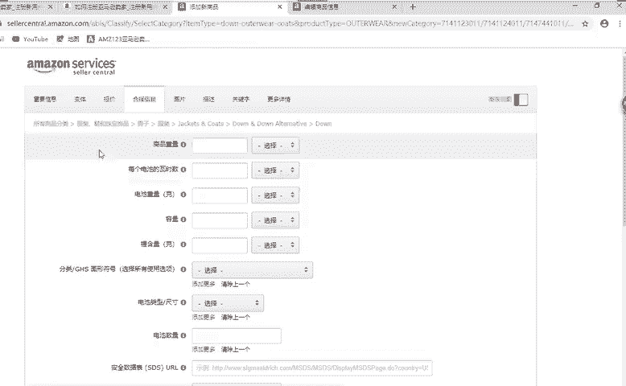
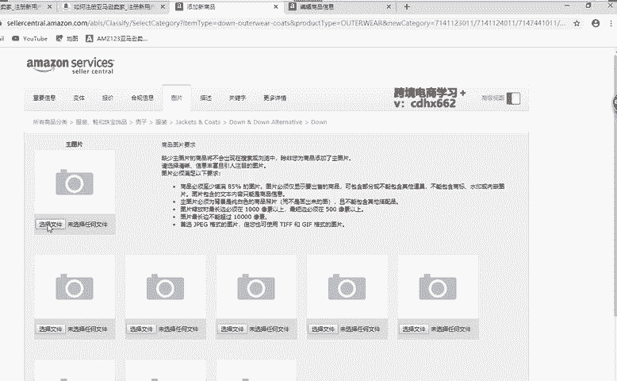
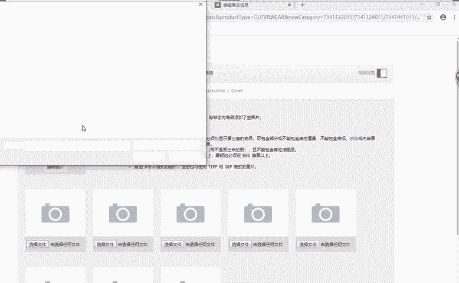
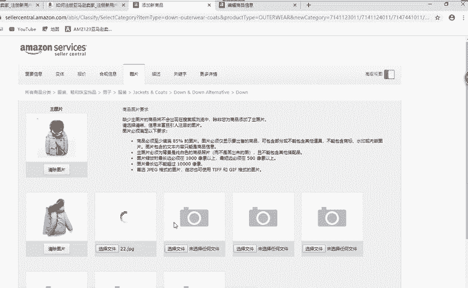
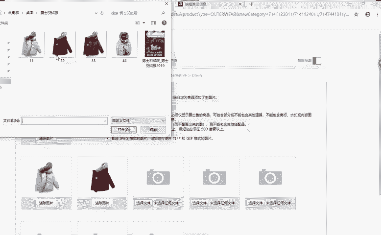
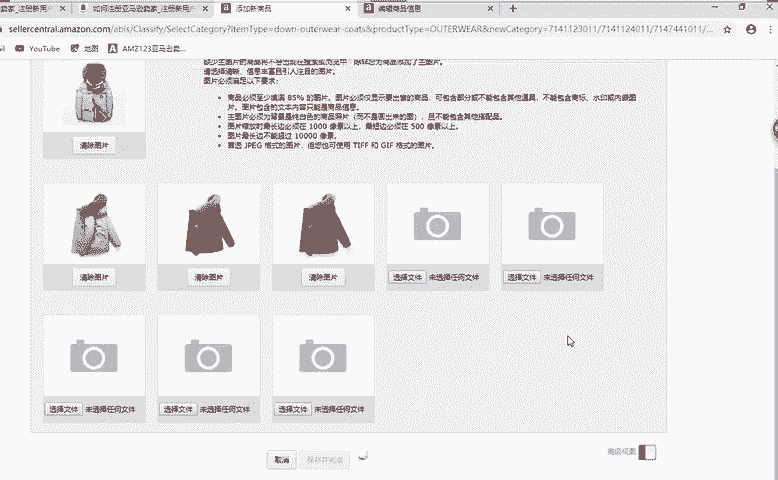

# 冒死上传10遍！《跨境电商亚马逊运营教程》，目前可能是B站最全入门流程，耗时700小时整理，分享学习亚马逊运营干货 - P35：创建新商品：报价和图片 - 小卡勇往直前 - BV1Mw2wYVEdB

好，继续添加继续添加。刚刚我们市场价是100啊。处理时间这个处理时间的话，就是说我们这个产品。你从你。买家下单之后啊，你要花多长时间能够给他们发货啊，能够给他们发货。这个是天数啊，几天几天。

然后补货日期。你根据你们的库存来计算啊来计算。这里面的话可否提供礼品啊，包装，包括信息。这个的话，如果你是。专业型的店铺的话，你就可以啊，专业的你就可以选择。不个人的话就不用选择了。

因为选择的话也没用啊，选择了也没任任何意义，好吧。订单商品最大数量就是这个买家他在你店铺啊购买这一款产品最大最多能购买多少件？啊。开始销售时间的话，这个就很简单了啊，就什么时候开始发布啊。

发布我们这个产品，好吧。😊。

然后合规信息的话，这里不用填啊。合规信息的话，像服装的话，它没有什么电池啊，没什么啊。

非运呃不好运输的一些产品啊，像什么电子产品的话，它就不能上飞机的啊。那么这个主图我们选择啊，我提前给大家。

在开课的时候啊。把这个图片已经复制过来了。我话费。把它添加进来。

第一个。对对对，如果你有两个颜色，两个两个码数就需要4个UPC啊。对的对的。🤧嗯。

家人确保。

就是说。

