# 冒死上传10遍！《跨境电商亚马逊运营教程》，目前可能是B站最全入门流程，耗时700小时整理，分享学习亚马逊运营干货 - P40：创建新商品：重要信息 - 小卡勇往直前 - BV1Mw2wYVEdB

然后我们进来之后，把我们刚刚啊。

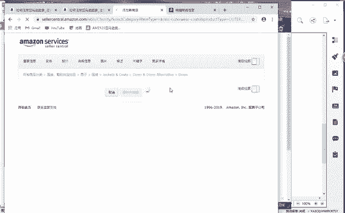

这里面的话为了上课的一个呃时间的一个问题啊，我这边的话，因为这边之前标题有讲过啊，我就做了一个标题，直接把它复制过来了啊。

对呀，是用谷歌谷歌更好啊，我用的也是谷歌啊，看到没有？谷歌和和360我同时在用啊。360的话我是用来翻译的。谷歌的话我用来发布的，懂了吧？😡。

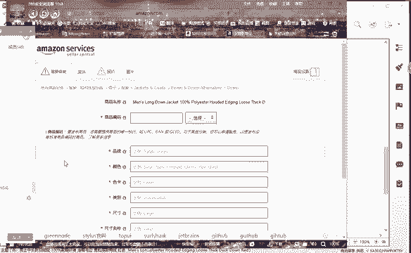

能不能明白？因为这个亚马逊的话，它用的是美国的一个服务器啊，用的是美国的服务器，用谷歌的话会更好一些。所以说360的话，我用来是做翻译。好吧，然后他这里面的话有个商品编码。

就是我们刚刚说的啊UPCUPC的话啊，今天我在发布的时候，我我也我也购买了几个啊，我也购买了几个。😊，然后我复制一过来啊。

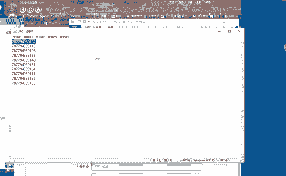

复制1个UPC过来。把它复制在这个商品编码里面啊，然后选择UPC啊。能够看到吗？😡，能够看到吗？页面能够看到吗？😡，对对对，UBC都需要自己购买的啊，很便宜，几毛钱一个啊。好好好。😊，可以看到是吧？好。

这里面的话它会设计了一个品牌。😊，有很多同学说，哎，老师啊，我这个产品它本身就没有品牌，对吧？没品牌怎么办？😡，没有品牌的话。那么你就随便输个品牌，当然你不能输现在已经有的一个啊。

现在有的品牌你是不能输的。那么像我这个产品，我现在没有品牌，那我我用社淘啊，我用社淘输上去。好，那如果我这个产品有品牌，那是什么品牌，你就输什么品牌。好吧。😡，添加。防止的话被如果你。

用了别人的品牌啊会造成侵权。所以说大家一定要注意啊一定要注意。那么颜色的话，那我看一下我这个产品它有什么颜色啊，红色、黑色啊，那么。怎么确认随便起的品牌啊，等会我给你一个链接啊。

等会我给你一个链接好不好？好，不要着急啊。我既然讲的这个肯定会有啊，肯定是可以查到的，好吧。好，那颜色我现在要红色黑色。那老师我这个红色黑色我也不知道怎么写，对不对？好。

那么我们就在谷歌上面的话啊输入进来就可以了啊，黑色。

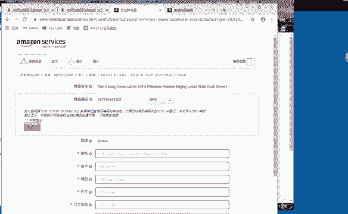

红色。它就会自动翻译出来。好，那这边前面是黑色，后面是红色啊，我把它复制过来。😊。

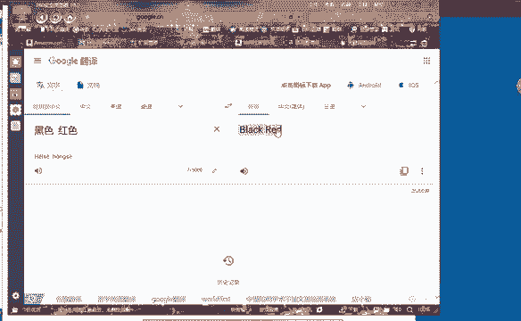

复制过来的话，我就粘贴到这个啊谷歌这个浏览器这里面啊，谷歌浏览器这里面。用个啊分号把它隔开。色卡啊选一个，那么我后面的先这个不添加了，等会我用变体的时候，添加进去好了。好。😊。

类别我这个是男士的啊男士的。尺寸啊，我们看一下看一下我们这个产品，它的尺寸。我在跟你们讲课之前的话，在1688找的一个产品啊。

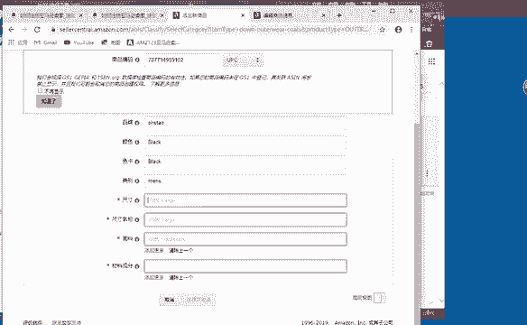

我看一下。1688找的到。要用变体啊，变体是下一步啊，变体是下下一步，我还没到变体这一步，好吧。然后还有。对对对。这个同学说的没错啊。哎，我们瑞123里面的话有商标查查询的啊。好。

我这个是在啊1688找的一款产品。那么我们看一下它有哪些尺寸啊，我们把它尺寸的话，把它添加上来。

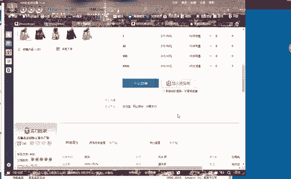

那了。我就添加两个啊，因为添加多了啊，等会会涉及到一个。呃，编码的问题啊，我没有这么多编码给大家好吧。然后面料面料我们看一下啊。

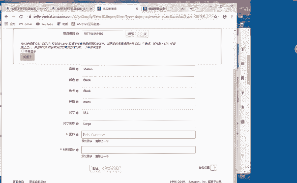

进入到这个。页面我们看一下它的面料，然后把它添加上去。

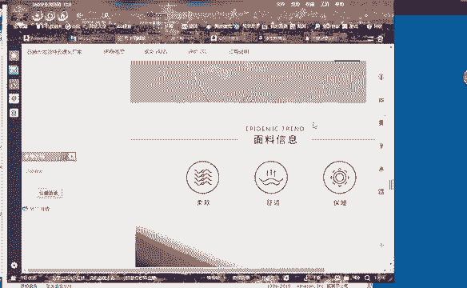

百分百聚酯纤维啊聚酯纤维。那么好，聚酯纤维。把它翻译一下。

把它复制过来啊复制过来。😊，面料面料成分，白鸭绒啊。白鸭绒。这个衣服不会侵权啊，因为我不会把它的商标放在上面啊，不会把它的商标放在上面。

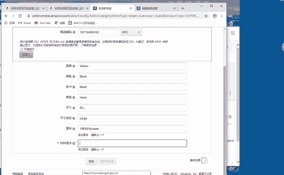

好。

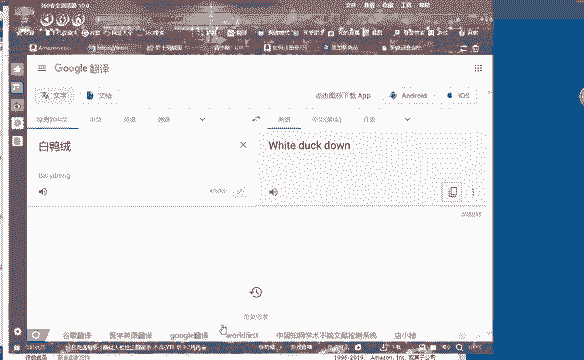

把高级视图打开啊，高级视图打开。

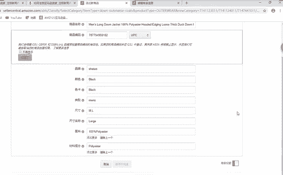