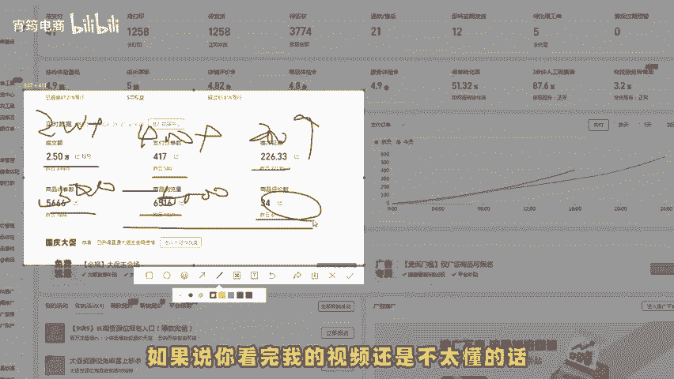
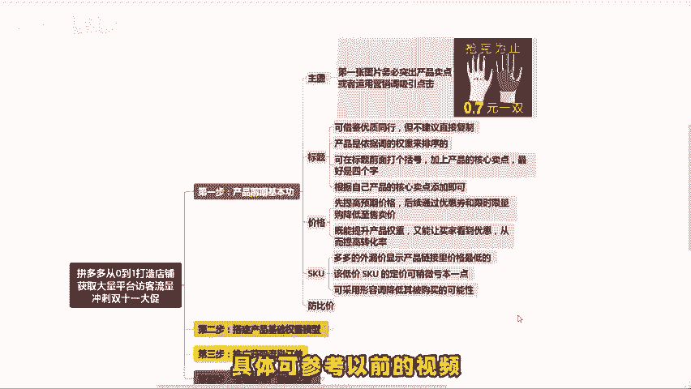
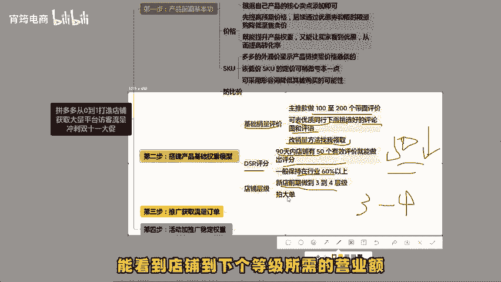
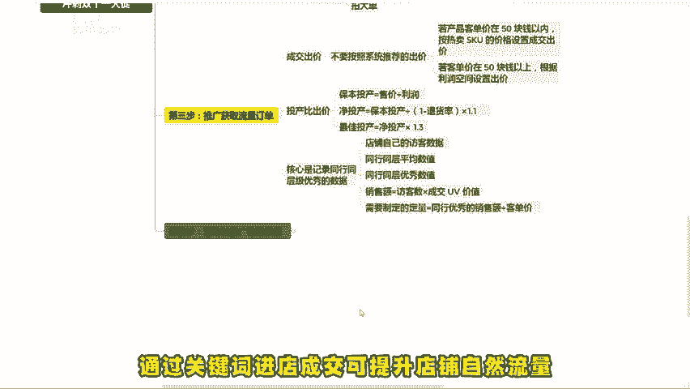
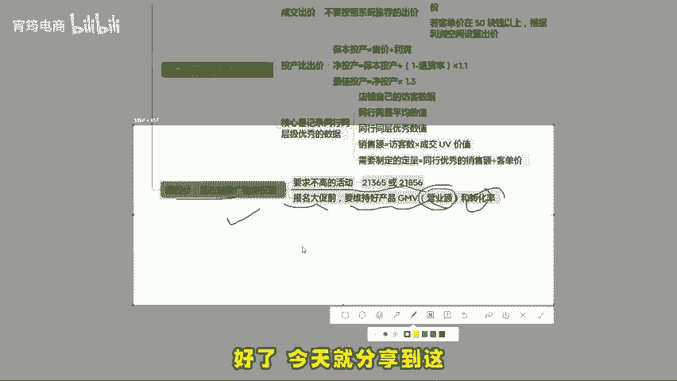
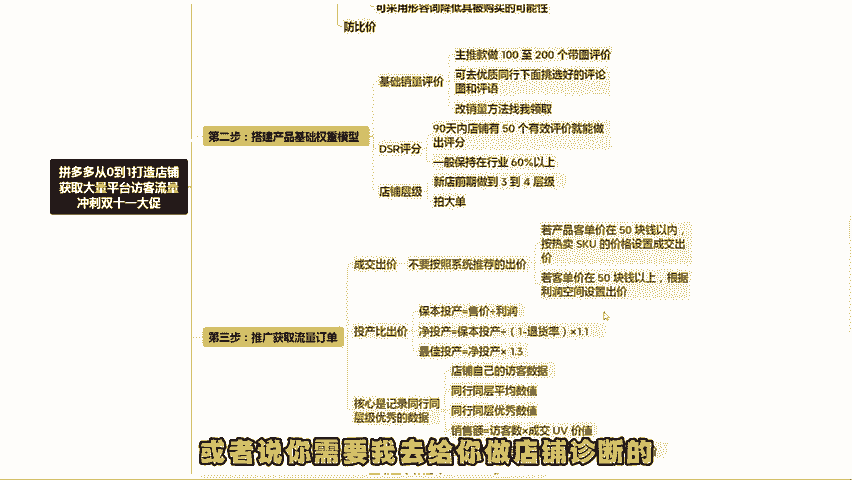

# 冲刺双十一，获取大量拼多多平台访客，直接爆单（拼多多运营｜拼多多开店｜拼多多实操｜拼多多新手） - P1 - 宵筠电商 - BV1vB1RYvENf

如今已步入拼多多的黄金时期，若想做好店铺，斩获下半年的平台流量与大促订单，不妨按照以下流程操作。此玩法适用于新老商家，我将从产品上架逐步讲到如何打造爆款，再到如何报名大促，且避免大幅度压价。

一一传授给大家。如果说你看完我的视频还是不太懂的话，我也准备了各个类目的实操文档以及最新玩法的拆解步骤，你也可以根据实操文档来操作。第一步，产品前期基本内功之产品主图，大多数消费者都是先看图片。

再决定是否点击产品。所以第一张图片务必突出产品卖点，或者用营销词来吸引点击。比如看这个卖的稍好的产品主图，就是靠营销词来提升点击率的，标题可以借鉴优质同行，但不建议直接复制。

因为产品是依据词的权重来排序的。一般优质同行会想到好的词，我们就无需费力去找了。另外，标题有个小技巧，可以在标题前面打个括号，加上产品的核心卖点。最好。

示四个字，比如凸显正品凸显加厚等等。根据自己产品的核心卖点添加即可。价格方面，不建一开始就设置为预期售卖价，建议先提高预期价格，后续通过优惠券和限时限量购，降低至售卖价，这样既能提升产品权重。

又能让买家看到优惠，从而提高转化率。SKU方面呢多多的外露价显示产品链接里面价格最低的。比如我们卖橙子规格有一斤2斤3斤4斤，可用一斤做低价SKU且该低价SQU的定价可稍微亏本一点。

若有人担心低价SKU被大量购买，可采用形容词降低其被购买的可能性，例如整箱一斤小果试吃运费贵。一般消费者买水果不会选择国小且运费还贵的规格，最后要做好防比价，具体可以参考以前的视频，这里不再赘述了。

第二步，搭建产品基础权重模型，基础销量评价方面，可以找他人为主推款做100至200个带图评价，可去优质同行下面。

挑选好的评论图和评语，毕竟90%的消费者会先看评论再决定是否下单。销量对于很多新手商家来说，可能不知道是可以改的。你们可以找我领取改销量的文档。DSR评分要在做评价期间最好。

店铺有50个有效好评就能出评分，一般保持在行业60%以上可稳定店铺流量。若低于50%就得在做些好评提升评分。店铺层级方面呢，新店前期做到3到4层级就可以了。因为每个层级承接流量的水平是不同的。

点击层级后能看到店铺到下个层级所需的营业额。此时可拍一个大单突破营业额。第三步，推广获取流量订单，直通车推广设置技巧，首先是成交出价，开直通车时有两种出价方式，一种是成交出价，一种是按投产比出价。

成交出价设置时，不要按照系统推荐的出价。若产品客单价在50以内，按热卖的SQU的价格来设置成交出价。如果客单价在50以上，根据利润空间设置出价。例如。

客单价100，利润只有40，成交出价最高可设到40，按投产比出价，要先了解投产计算公式，保本投产等于售价除以利润。比如产品成本是20块，卖到30块，利润一单就有10块。

那么保本投产就是3前期按照投产比出价，可先按保本投产出价，把直通车开起来，有定成交数据后，得知产品实际退货率，假设退货率是20%。根据保本投产算出净投产，净投产等于保本投产除以一减去退货率再乘以1。

1%。有了权重后呢，要算出最佳投产，假设成本是20，卖30，退货率有20%。那么前期推广出价是保本投产3拉数据后呢，投产要拉到4。13至5。36之间才是有效数据。核心是记录同行同层级优秀的数据。

打开商家后台可看到店铺访客数据和成交UV价值数据有3条线，分别是店铺自己的访客数据，同行同层平均数值和同行同层优秀数值运用。式销售额等于访客数乘以成交UV价值，拿同行优秀的访客数乘以同行的UV价值。

得到同行的优秀销售额，再除以客单价，得到需要制定的定量。通过关键词进店成交，可提升店铺自然流量。第四步，活动加推广稳定权重。新手前期适合参加一些要求不高的活动。比如说21365或者是21856活动期间。

注意店铺整体转化率，既然提升店铺权重，也为未来报名大促奠定良好的基础。报名大促前呢要维持好产品营业额和转化率。这样平台在活动报名时才不会大幅度压价。避免报名上的活动却赚不到钱。好了，今天就分享到这。

如果看完这个视频还是不太懂的话，可以找我领取实操文档，也可以提问。或者说你需要我去给你做店铺诊断的，也可以来找我。最后就祝大家早日报单。

