# 分享一周内加2000好友，私域引流的步骤！ - P1 - 古圣科技王 - BV1wLY4eWEsa

今天呢给大家分享一个一周以内加两进好友的私域营的步骤。有四步。我们一步一步再来看一下。第一个人群定位。首先要明确你的目标受众是谁，然后为这些特定的人群去设计一些合适的引流的产品。因为你的目标受众。

可能是宝妈、学生以及企业的高管都是有可能的。所以呢我们要设定一个明确的核心目标，然后了解目标人群的需求和兴趣。这个呢是制定成功策略的一个关键。

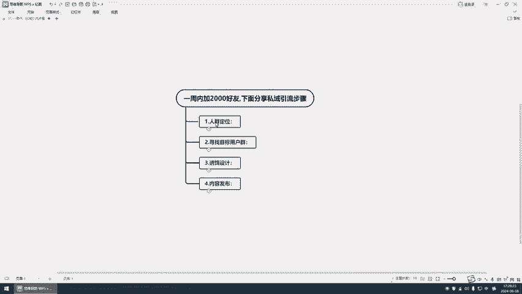

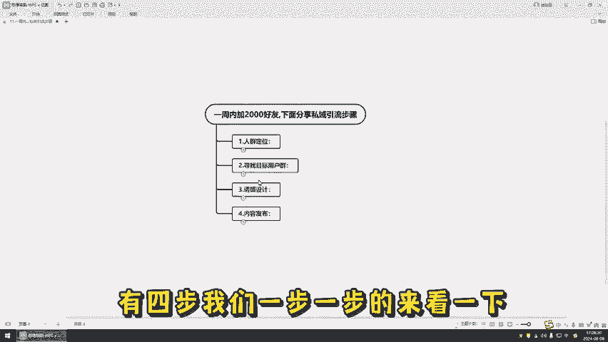

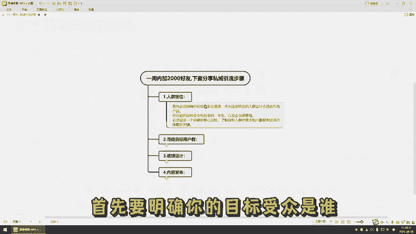

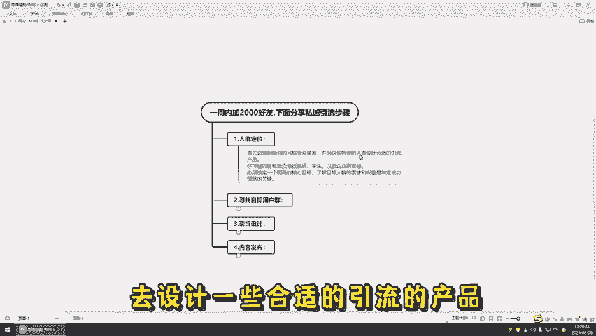

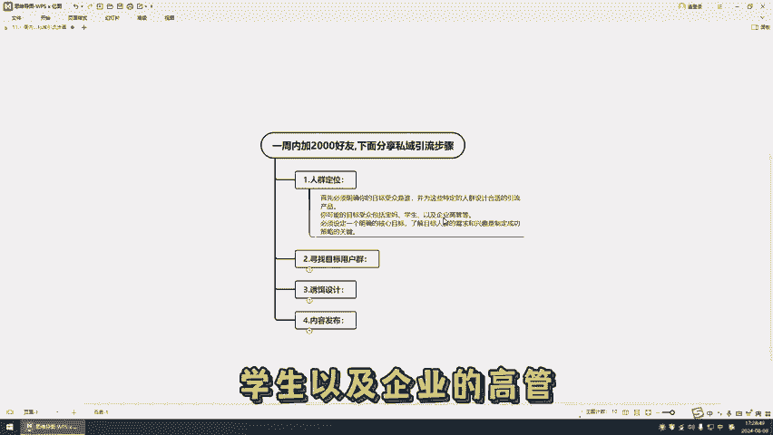

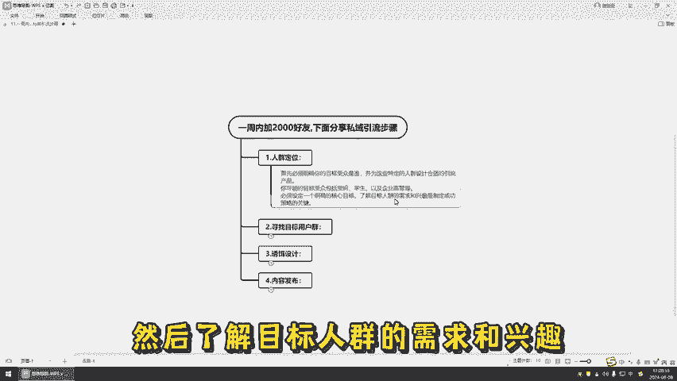

这个呢是人身定位。然后第二个，然后我们就要去寻找目标的用户群。确定目标人群之后，你需要在相应的鱼塘中去引流。所谓的鱼塘呢指的就是能聚集目标用户的特定的场所或平台。比如说一些博主，他们可以通过粉丝的群体。

或者是视频的直播，这些呢都是潜在的目标鱼塘。通过这些的鱼塘中呢去进行有效的引流活动。然后可以更容易的去接触你的目标受众，找到目标的用户群呢，我们就可以去放诱饵的设计。当用户开始对你的产品的信任时。

需要通过一些策略来加速的。

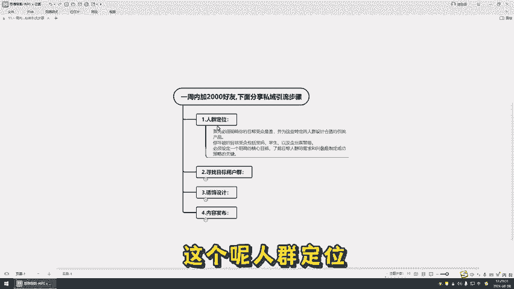

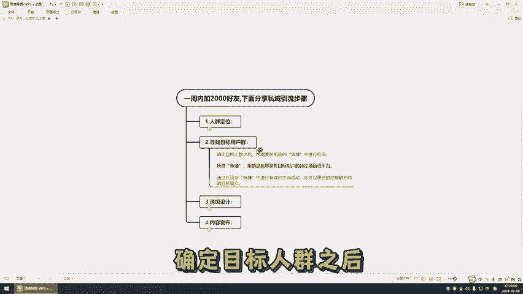

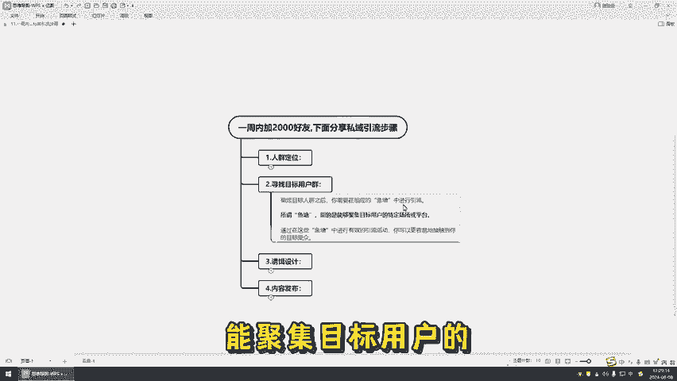

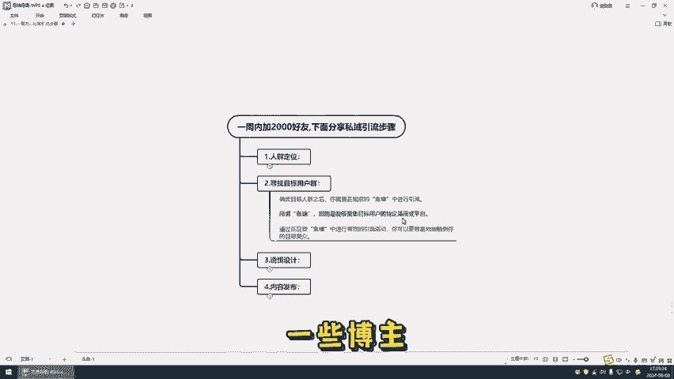

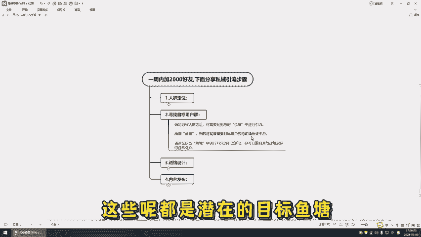

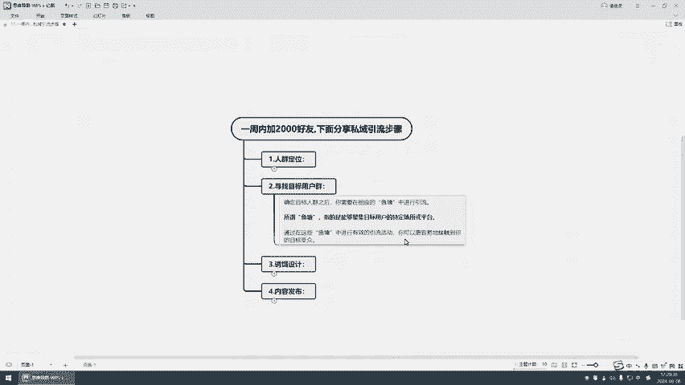

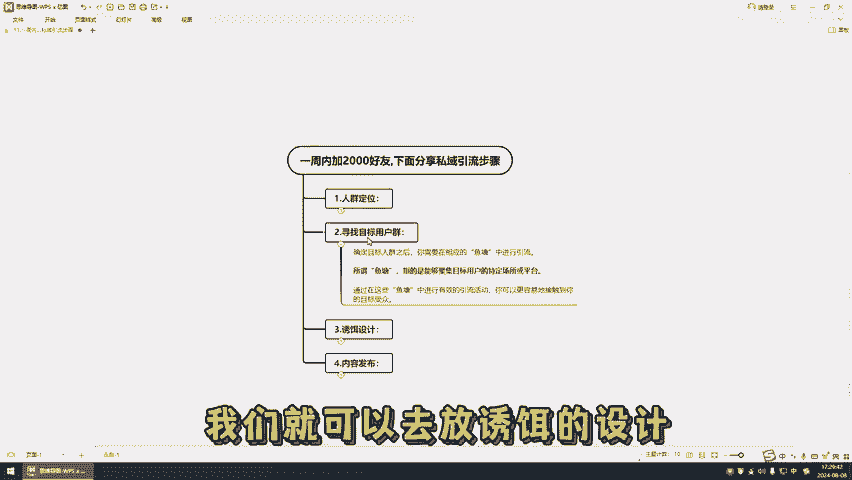

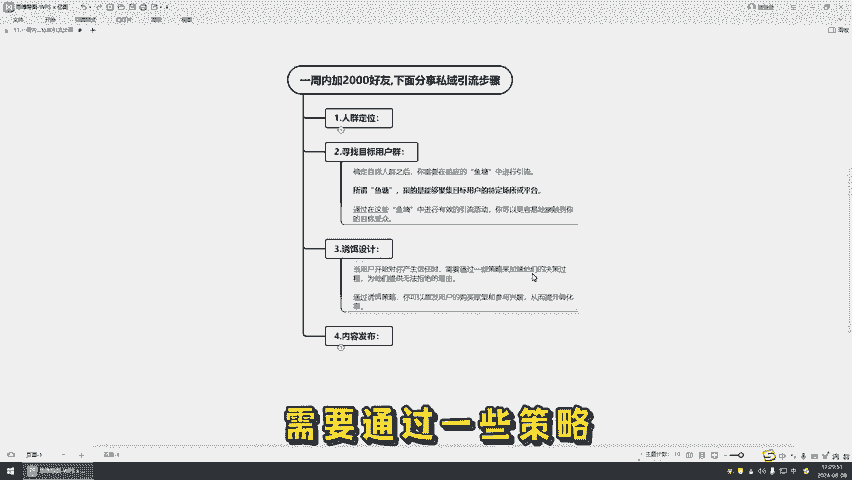

决策过程为他们提供无法拒绝的理由。然后通过诱饵的策略，可以激发用户的购买欲望和参与的兴趣，从而提升转化率。有几种常用的诱饵的设计方法啊。比如说什么价格的诱饵的数量的诱饵和实物的诱饵，它都是有的。

然后我们设计好诱饵之后，我们就可以内容去发布。在发布内容的时候，应该根据不同的平台的特性去进行调整，确保内容简洁能了，并包含吸引目标人群的一些引流的钩子。我们放了钩子之后。

我们就可以把用户引导我们的思域。

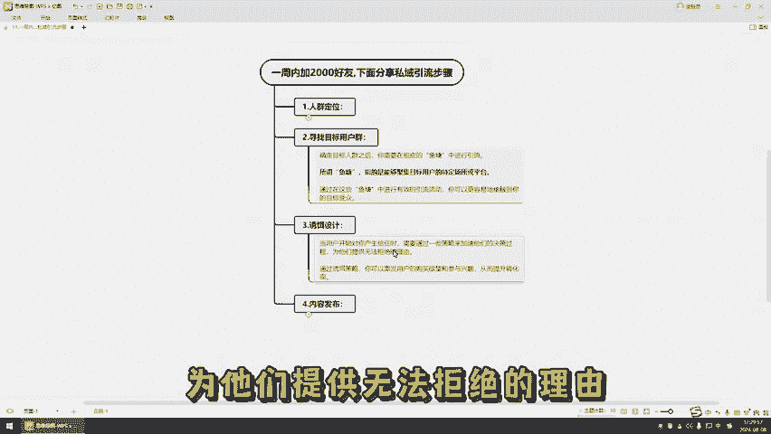

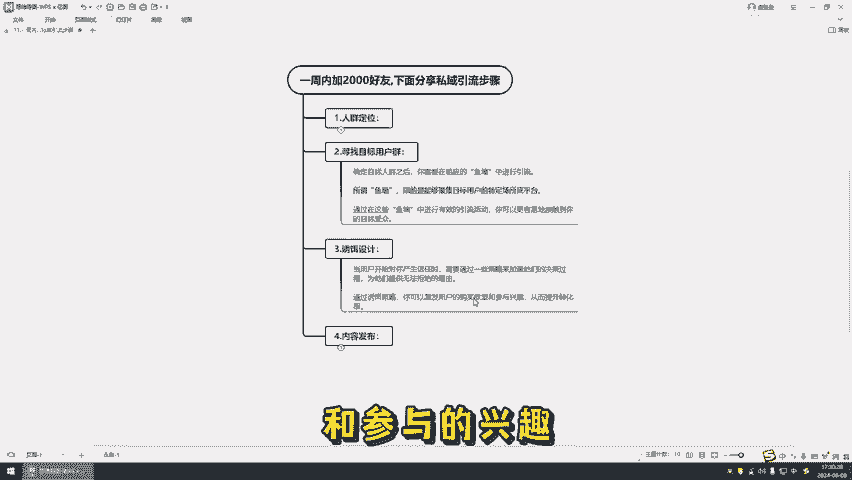

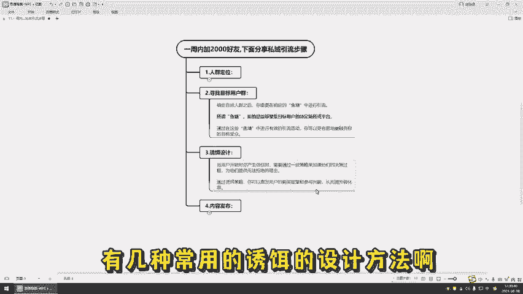

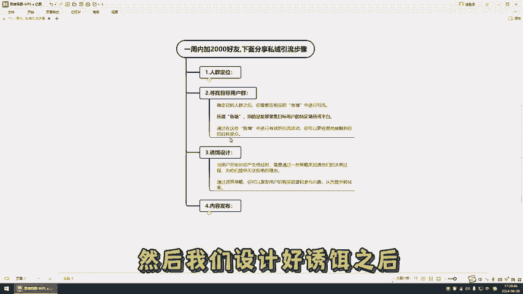

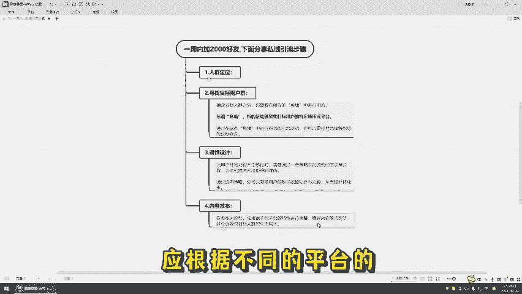

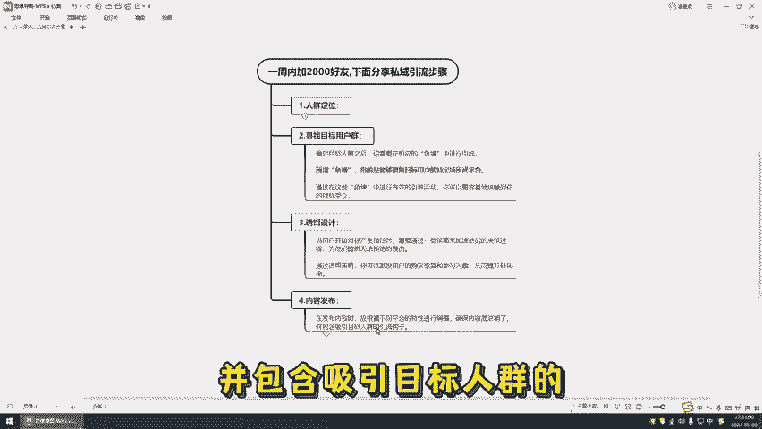

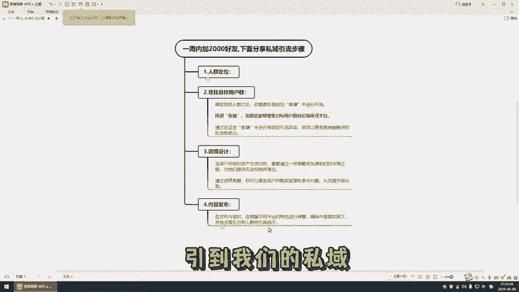

当然呢还有一些隐面的小工具啊，这个呢各平台的都有，然后想要了解的就可以评论999或者关注上学社都是可以的。所有的行业都可以使用，想要了解，可以在后台找我。

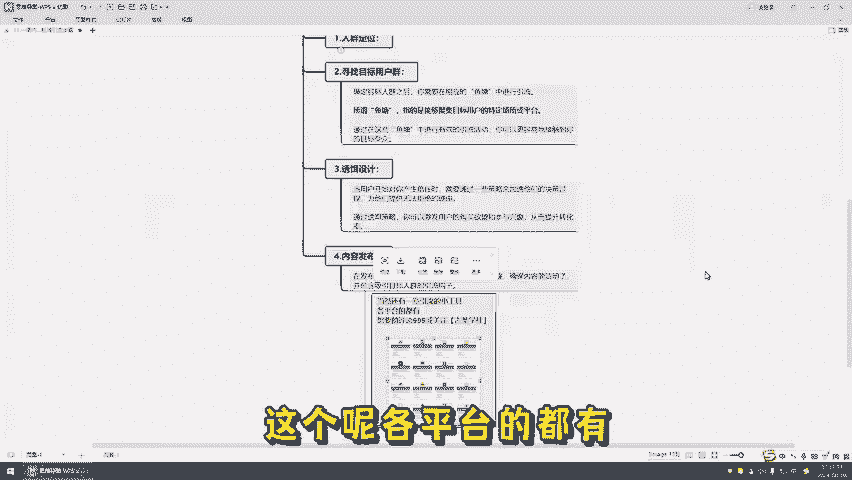

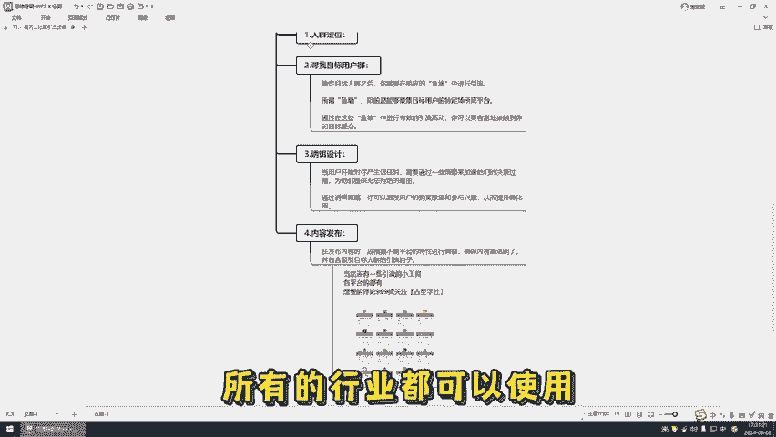