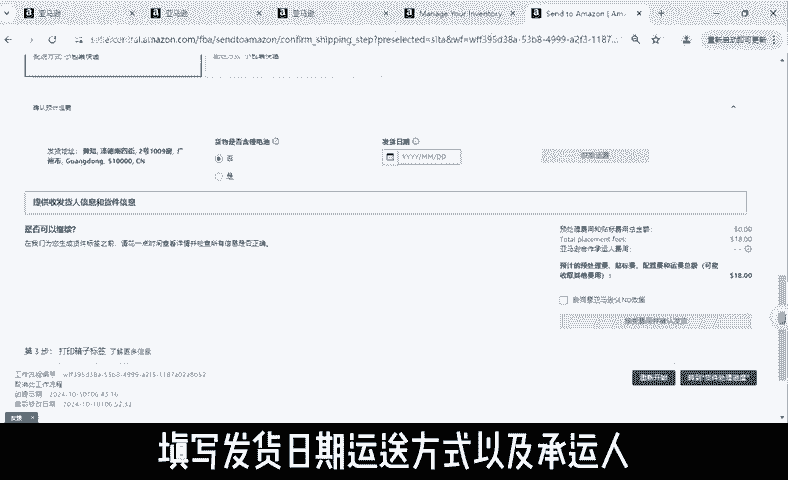

# 分享亚马逊物流FBA货件创建实操 - P1 - 猎人科技 - BV1R922YLEbk

🎼分享一个跨境电商珍藏SBA货件创建流程。首先我们进入亚马逊卖家平台，在管理库存页面，将产品转换为亚马逊配送，在弹出的页面里确认一下，发布为亚马逊物流商品，选择亚马逊条形码，点击发布为亚马逊物流商品。

等待跳转到亚马逊库存工具页面，接着选择要发SB的产品，选择发补货，或者点击库存那边的货件，在页面顶端选择在M页面上，按照页面提供的步骤完成创建货件。

选择要处理的S在包装详情下拉菜单中点击创建新的装箱模板，接着输入相关信息，并点击保存，在对应的SU右侧输入包装箱数量，然后点击准备发货，接着将页面滚动至底部，点击打印所有SU标签，以便贴标。

然后核对准备运送的S您可以再次检查相关信息，或直接点击确认并继续完成后进入下一个页面选择如何提供箱内物品信息，使用。😊。

🎼表格或以excel文件形式批量上传，填写好后，点击提交，按照页面中的指引，选择运输方式，入库配置服务，填写发货日期、运送方式以及承运人OK我祝大家天天报单。

