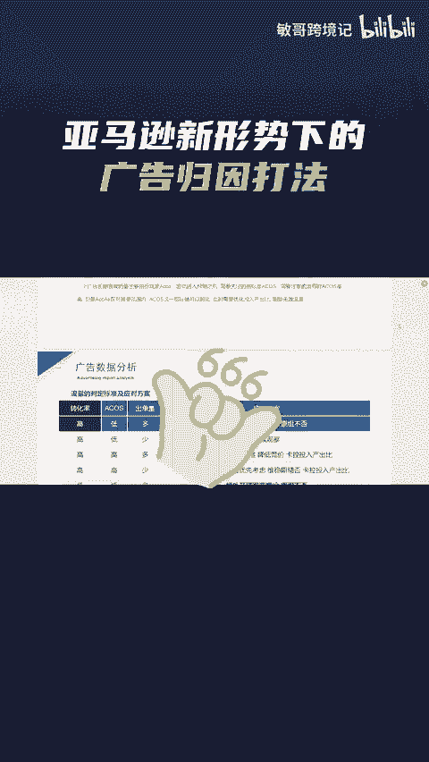

# 分享亚马逊的广告归因周期结构打法，助你打造爆款！ - P1 - 敏哥跨境记 - BV1r9tZeFEKN

🎼亚马逊上的大卖都是如何布局广告策略的？今天敏哥分享一个亚马逊新形势下的广告归因周期打法内容主要包含四个部分，不同广告形式的抓取逻辑，广告归因周期的具体分析，不同时期的广告结构如何搭建以及广告数据分析。

每个步骤都配有具体的实操案例，需要完整资料的卖家，点赞评论666给你安排。

