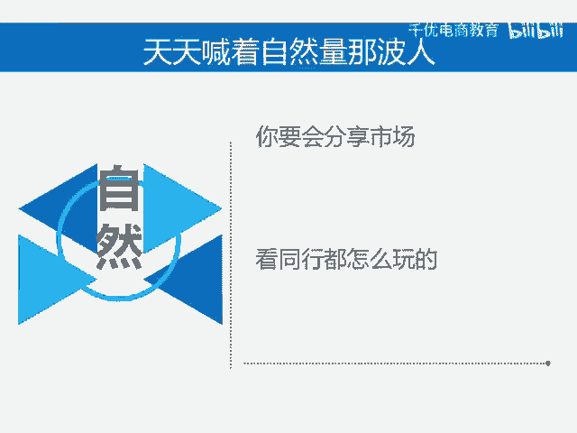
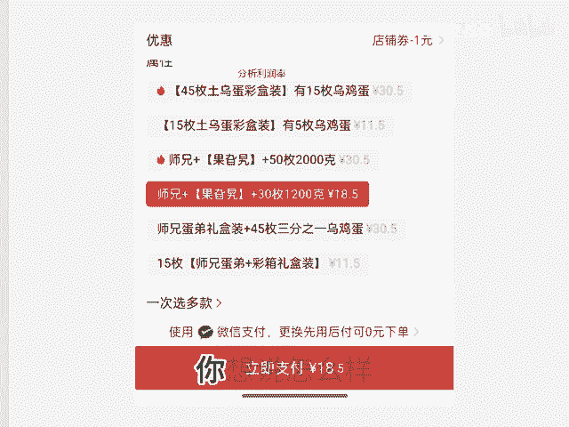

# 分析市场确定玩法 - P1 - 千优电商教育 - BV1872gYNEnu

我发现很多商家呢他异想天开，他说怎么样呢？我要做自然流，我要做落付费。其实我想说的是玩法不是你想怎么样就怎么样。首先，如果你的利润40%以上，并且分析同行之后，你有价格优势。

那这事儿你要做强付费强付加活动加内容。如果呢你的产品没有价格优势，那你就强付费加内容。所谓内容呢，就是短视频或者是直播，因为现在短视频带货的能力也非常强，然后天天喊着做自然流量那波人，你要学会分析市场。

你不要想我做落付费，我做自然流。这玩意它不是你想就能做的那怎么分析市场呢很简单，找到你的行业的榜单，然后看他们的订单量，你像这个像24小时999加人拼单，就是日发签单嘛，像这种日发签单，并且价格很低。

10块8块的，那么它有可能做自然流量。为什么？因为它市场需求大嘛。那么我们还需要做进一步的分析，点开你的同行的SKU如果。😡。

他们的每个SKU利润都很低，20%左右，那么你才可以确定你的行业它有可能做自然流量或者是落付费，否则那你就老老实实的强付费玩法，它不是你想说怎么样就怎么样。我是讲师大牙，欢迎大家扫码添加我的微信。

不方便扫码的朋友可以添加我的微信号，80221430。在这里给大家准备到了一套新手运营入门的大礼包，希望能够帮助大家。😡。

