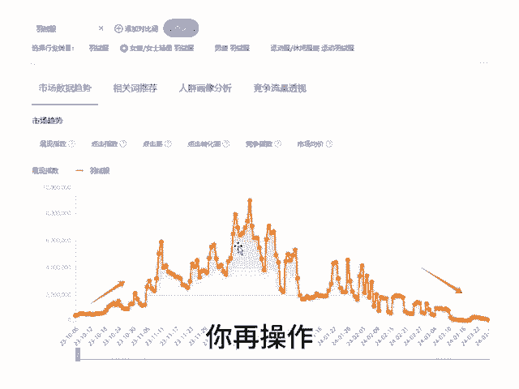

# 切入点的问题 - P1 - 千优电商教育 - BV1WD2nYpELM

很多朋友做店呢，他不看大盘，弄了一个链接就开始拉升。那我们说什么时候拉升链接合适啊，其实跟随大盘一起成长最合适。我们看这一个产品在10月份开始流量上升，到双十一呢，流量达到一个高峰，到双十二又一个高峰。

但是很多朋友做店的时候呢，他经常比别人晚半拍，别人做起来之后他又做，其实这时候别人权重已经很高了，你再跟的话嗯做起来有点难。所以呢现在不管你做什么产品，一定要到淘宝的万向台呃。

流量解析这个工具看一下这个工具出来的数据，其实淘宝和多多是通用的。因为毕竟消费者的需求习惯是一样的嘛。就是你一定要。😊，在你的流量上升期打造爆款，不要在下降期，也不要等到别人再做起来之后，你再操作。

那样总是慢半拍吗？我是讲师大牙，欢迎大家扫码添加我的微信，不方便扫码的朋友可以添加我的微信号，80221430。在这里给大家准备到了一套新手运营入门的大礼包，希望能够帮助大家。😊。

