# 创业风向标 从零带你做私域—引流素材制作篇，从引流到变现 - P1 - 克里斯同学18 - BV1dYphecEKy

🎼，🎼hello，大家好，我是有点好玩社去的克里斯同学。今天和大家快速且详细的分享一下新人如何做私域。我将从引流方式、素材制作、变现模式、钩子技巧为大家拆解常见的引流方式。

大致分围、视频类、图文类、矢量图，以上都需要寻找对标账号作为参考。视频类需要一定的剪辑基础。如果新人没有基础，只能慢慢去学习，剪辑视频比较常用的功能，关键帧音效、画中画、特效、滤镜、文字母板。

文字动画效果，可以逐个搜索教程学习。😊。

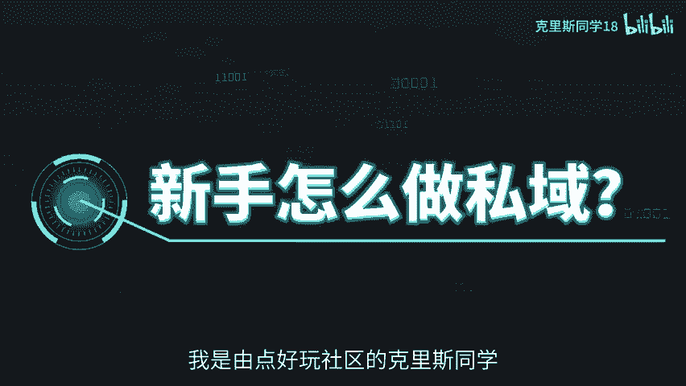

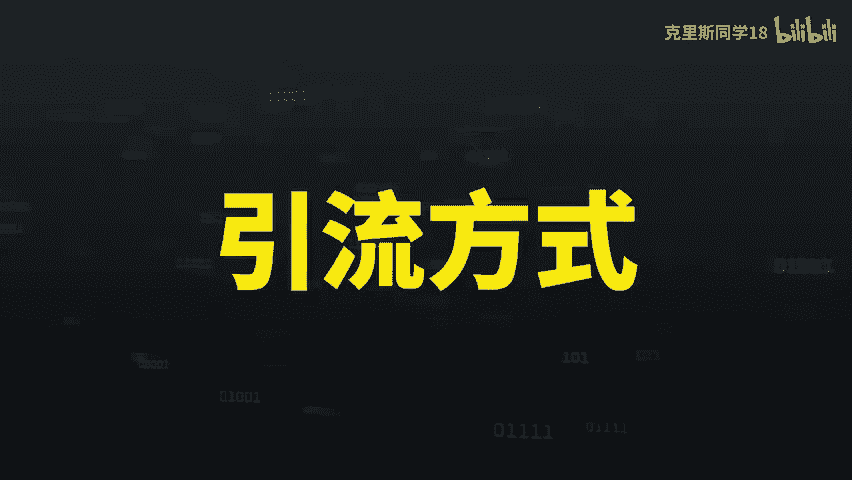

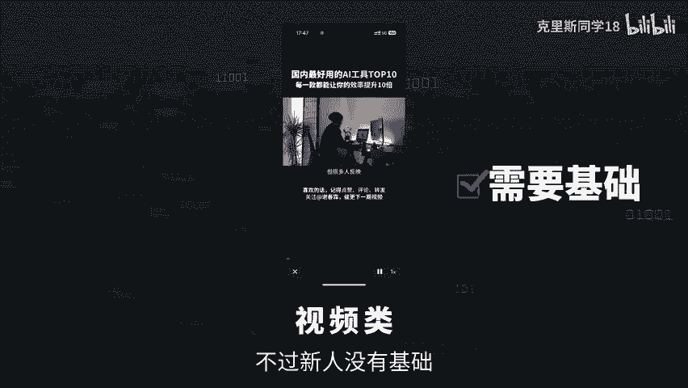

🎼图文类制作门槛就会低很多。如果你不会PS，那么推荐你三款作图工具，美图搞定设计以及刻画里面都包含了大量的素材模板可以使用。最后就是矢量图，也是需要一定的剪辑基础，并且里面所需的素材。

也需要自己去寻找这类视频真是需要剪辑基础，很多人做不了，但是它的流量也是非常大。那么视频类账号该如何去剪辑，有两种方法。第一种，直接拿手机对着所要呈现的内容拍摄，简单粗暴，很接地气，也不需要配音。

直接加背景音乐或者一边拍一边读文字即可。

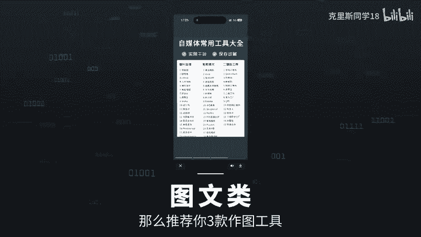

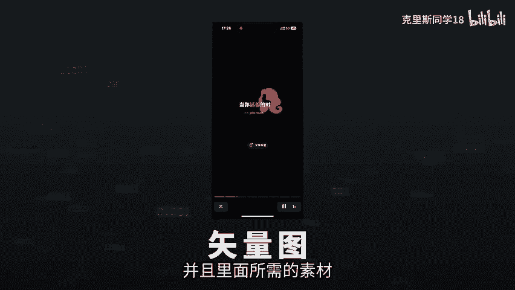

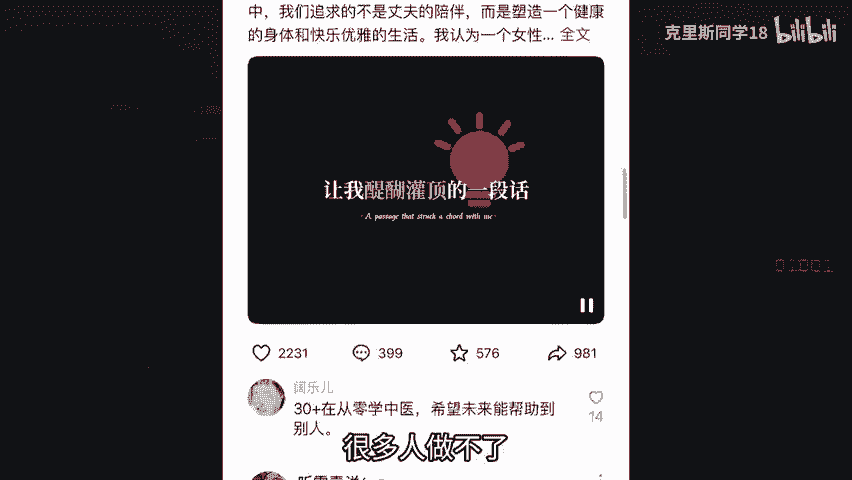

🎼第二种画中画加录屏，这种也叫不出镜账号，只是需要一定的剪辑基础。部分素材这一方面可以直接使用剪映里面的新手小白可以慢慢进行优化，找找感觉。如果你不会剪辑，我也准备了剪映教程。

包含了手机版和电脑版会放在评论区免费自取。第二种图文类如何剪辑，先找对标账号搜索图文类工具分享来寻找你要的账号，然后将文字打在搞定设计的模板上就可以。这样也可以原创图文就产生了。第三种矢量图。

先给大家分享一个网站，阿里巴巴矢量图，里面包含了很多的素材可以使用。然后找到需要的矢量图，直接导入到剪映即可，再就是画面动画跟踪音效、文字模板的处理。

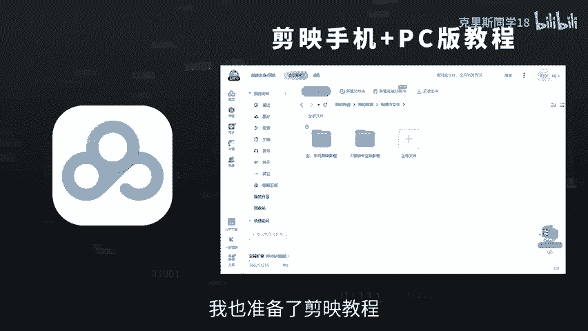

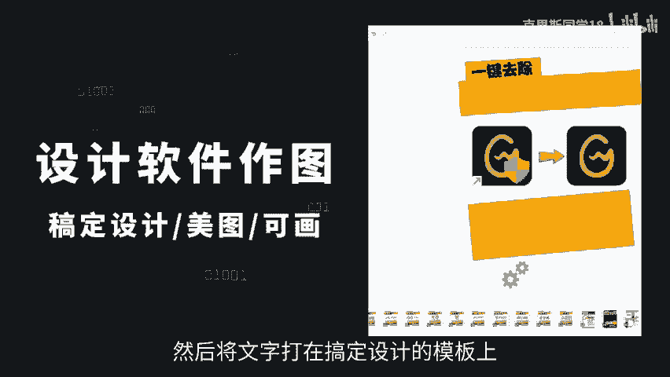

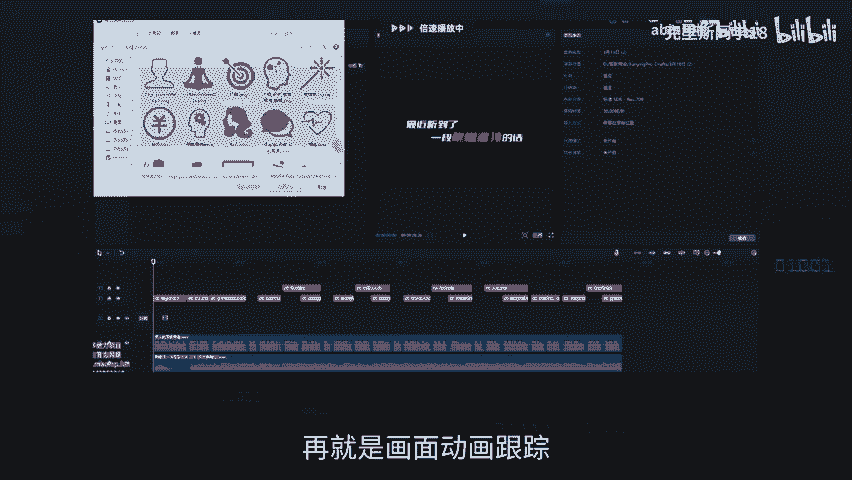

🎼由于这种账号是讲认知的，所以我们得去寻找对标账号。第一步，搜索让你醍醐灌顶的一句话。🎼就会联想出很多关键词，选择一个视频，将链接复制到创作猫软件中，选择链接转文字，将视频文字复制下来进行二创。

如果你无法使用GPD同样可以使用奏包AI写作都是免费的，切记开头第一句话一定要和原视频一样，最近看到的醍醐灌顶的一段话，然后手动修改一下，最后就是把配音导入到剪映里面。

这样就完成了一个原创矢量图认知视频。本期视频就到这里，下一期视频将和大家分享变现模式和钩子技巧，另外我还准备了一份搞前秘籍，关注我，免费获取，咱们下期见。

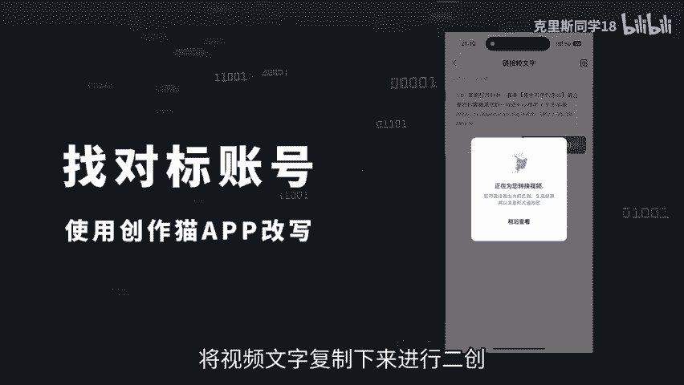

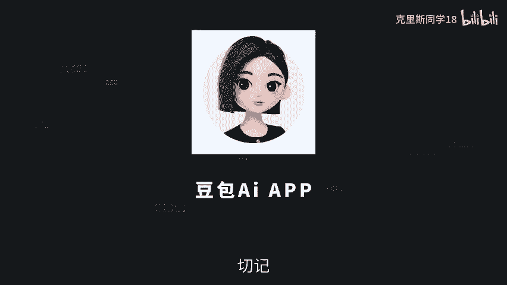

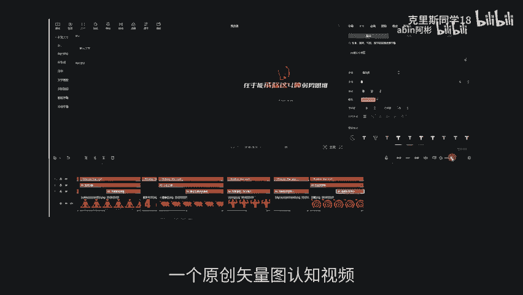

