# 初云链超强私域引流工具多平台跳转助力企业构建私域流量池精准营销开启增长抖音小卡片直接跳转微信 - P1 - 大飞哥软件自修室 - BV1KRsFeYEjG

观众朋友们，大家好。今天呢给咱们大家带来的是一节可以将公域流量转化为私域的抖音私信小卡片跳转到微信的实现方法。

它呢支持从抖音、快手、知乎浏览器等跳转到我们个人的微信微信群、小程序、公众号、QQ号或者是QQ群，帮助我们的高效的推广营销私域引流。它呢是一款什么样的软件呢？我们呢先来通过一个案例呢，给大家展示一下。

这个呢是我的一个抖音。它呢通过一个私信这样的一个小卡片，可以直接呢点击进行一个跳转。例如我这个呢直接点击打开，它可以跳转到我们的。😊。

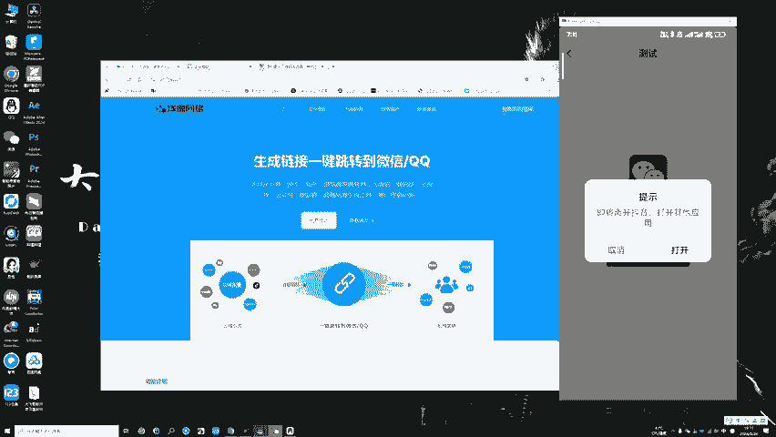

这个微信啊企业号来进行一个客服的咨询，我们就可以直接在抖音里面跳转到我们的这个。微信企业号啊进行一个客服咨询了啊，就是这样一个跳转工具。那么它呢支持多种跳转，那么我们给大家进行一个一一的演示。

首先呢这是我们网站里的一个简介啊，这个呢是主要的一些功能。

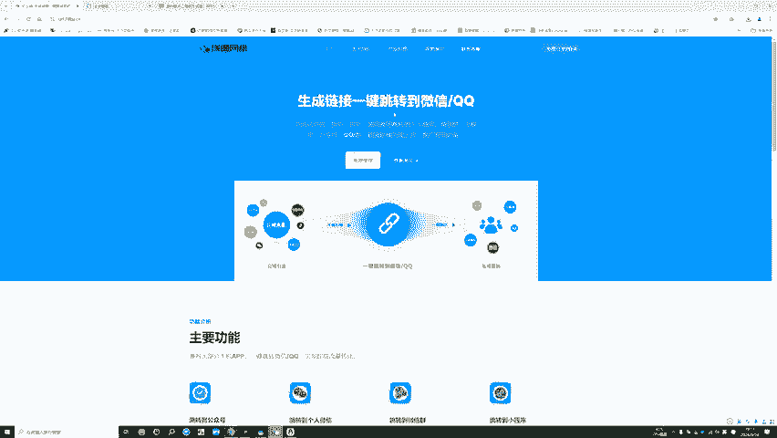

啊，可以在手机上实现这些跳转。好，这里呢就不过多的赘述。然后我们点击最右上角这里点击免费注册啊，然后没有账号的，先去注册一个账号，注册完成之后呢，就可以进行登录了。

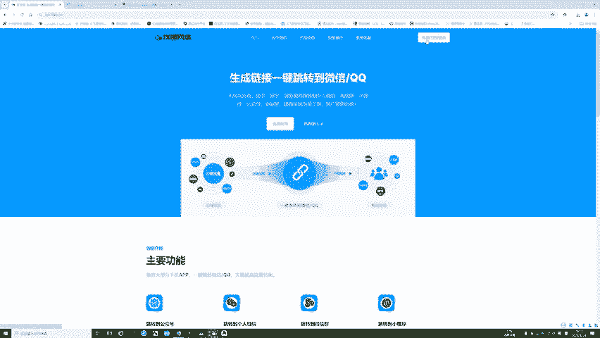

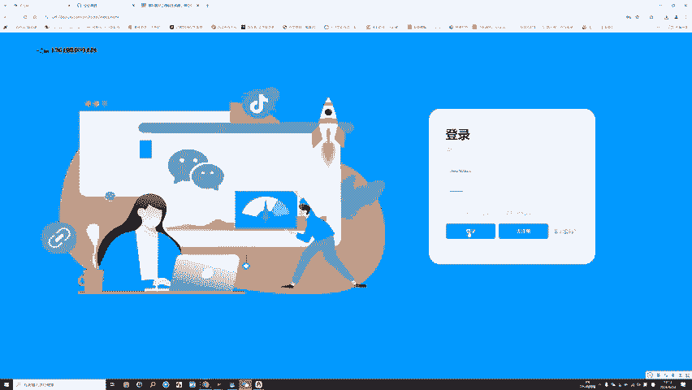

登录之后呢，来到我们的这个后台啊，它呢分为几大板块。第一个呢是一键跳转小卡片。第二个板块呢是活码管理啊，这里面呢有这些子的分类。还有个呢第三项呢是自定义这个落地页啊，可以自定义的去生成一个跳转连接。好。

那么我们先来看第一个板块。啊，支持跳转到小程序呃，跳转到微信二维码，跳转到金山文档啊，跳转到草料二维码，跳转到企业微信啊，或者是底下的这些啊公众号啊呃微信分享卡片啊，QQQQ群啊。

支付宝红包以及跳转到浏览器啊，那么先来看一下这个刚才那个呢是跳转到咱们的企业微信。咱们先来呃再来看一下，跳转到这个金山文档啊。这个为什么不直接跳转到这个微信二维码的微信二维码呢。

它是这里呢是需要有一个落地小程序啊，就是类似于我们这个金山文档或者草料二维码啊，我们可以自己添加自己的这个呃落地小程序。但是我们的小程序呢呃需要把我们小程序这些配置呢进行一个添加添加完成之后呢。

我们在这个这个里面呢去跳转，才能把这个地址添加进去。然后把我们的二维码呢填上去。😊。

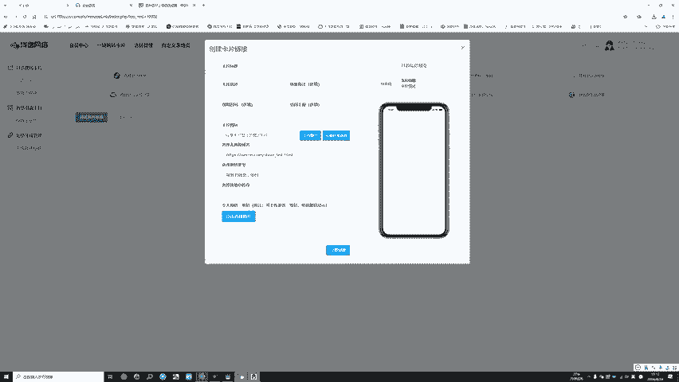

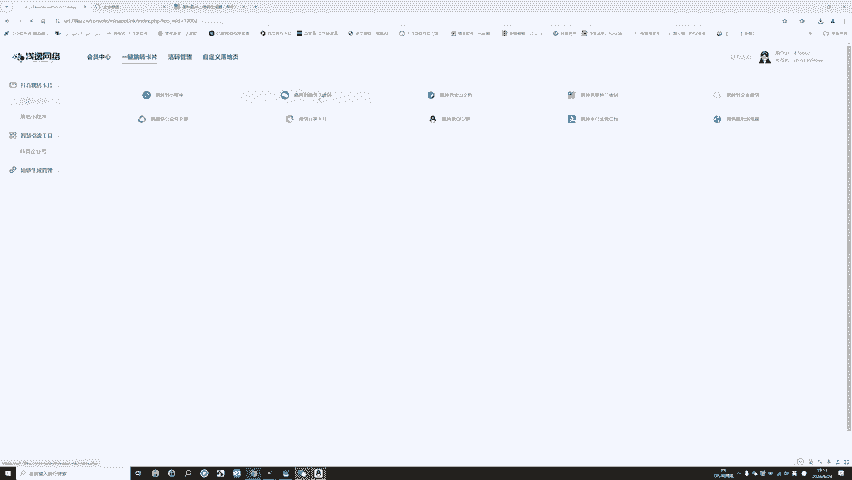

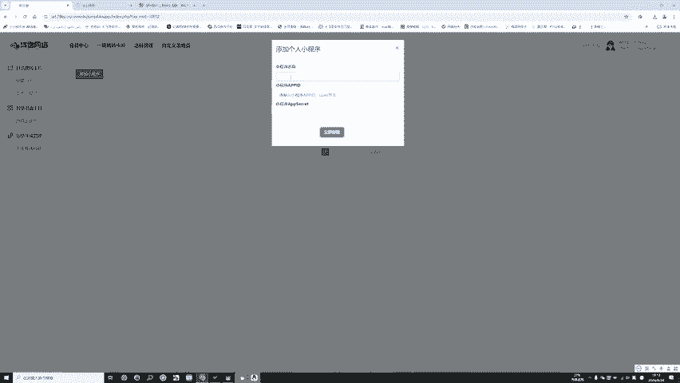

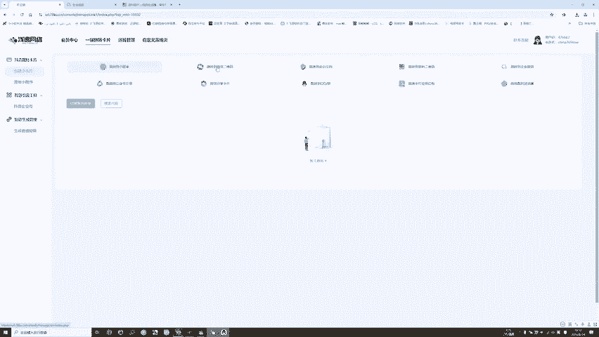

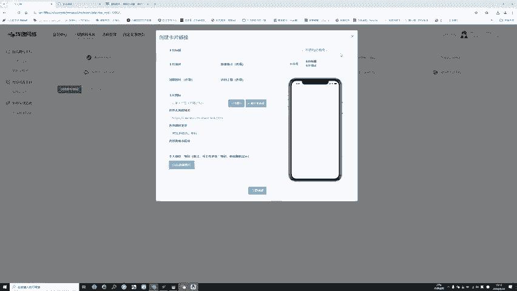

好，然后如果没有小程序的啊，可以通过金山文档或者是草料二维码来实现跳转啊，是一样的啊。如果你要是有小程序，可以直接使用这个来跳转就可以了。😊，呃，那么接下来通过一个金山文档的一个案例呢。

给大家进行一个展示。呃，首先呢我们在这里呢呃跳转到金山文档创建一个。😊，在这里选择它之后，点击创建跳转连接。

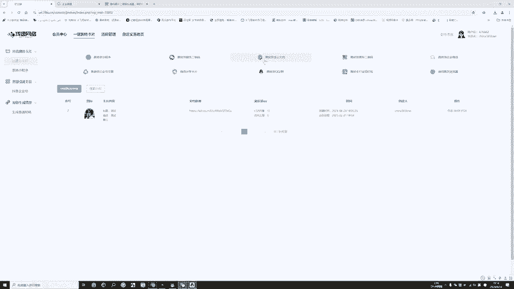

这个可以写一下卡片的标题啊。啊，飞哥。啊这个。软件。自习时。客服。微信。啊。这个长按。点击一下图片啊。长按。2A嘛嗯添加。客服。啊，那这个呢就是它的一个卡片的样式。啊下面呢是到期是一个时间啊。

这个呢不能大于我们会员的这个时长。我们的会员的时长啊，比如说一个月的啊，那你就是呃小于这一个月之内的。啊，比如说你可以呃添加啊你的会员的到期的那个时间啊，然后比如说我们这个就添加到25号啊。😊。

那后面的这个是访问上限，访问上限是什么意思呢？它就是说我们这个二维码这个卡片使用几次之后啊，它就失效了啊，比如说访问5次之后，它就失效了啊，不能再访问了啊。一般的话呢，我们这个就不设置啊。

因为我们让它这个在这个有效期之内呢都是有效的，嗯，就不设置。😊，然后这个连接备注呢可以选填啊，然后最主要的是我们可以给这里呢上传一个图片。这个图片呢是用于我们这个封面图啊。

我们可以选择例如我的这个个人的这个。😊，头像啊，那这个就作为一个卡片的一个头像来进行一个设置。好，然后这里呢有一个无风险域名，这个是做什么用的呢？就是在我们呃这个微信跳转的时候呢。

经常会有这样的一个提示给大家看一下啊。😊，呃，就是在给别人私信。找一下。啊，比如说我这个啊它的提示啊，你将访问第三方，第三方有这个未知的风险的这个提示。嗯，这样的话呢就是给人造成一种干扰吧。

就是不是很正规的网站啊，那么我们可以通过这个无风险项使用我们的这个无风险域名啊，就是一个添加一个二级域名，然后呢来忽略这个风险提示啊，但是这个呢也不是说永久的有效。目前这几个的话呢失效了啊。

然后这个还有效，然后就给大家测试一下。😊。

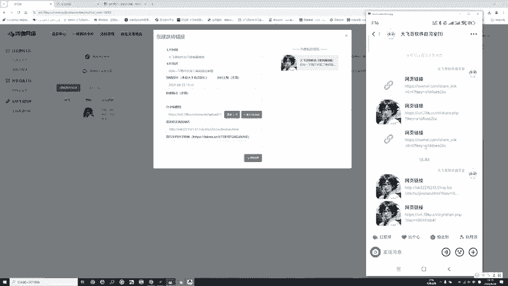

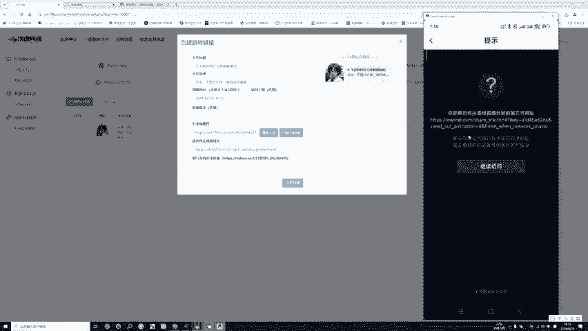

然后呢，我们去创建一个金山文档，嗯，金山文档怎么去创建呢？我们可以在手机上创建，也可以在电脑上这个小程序也是一样的啊。😊，呃，手机的话呢就是。

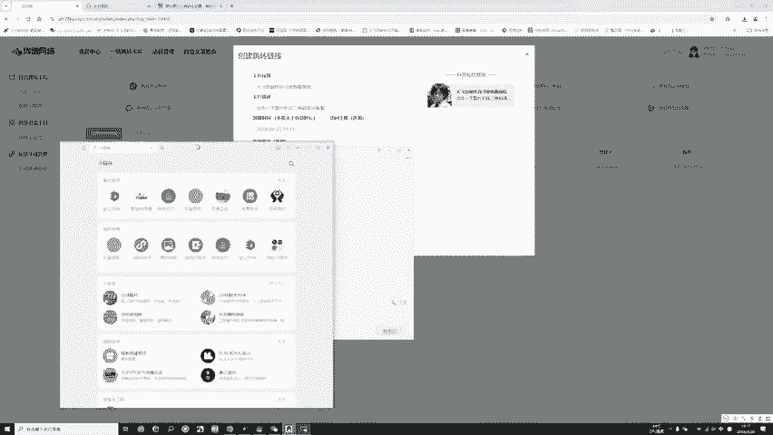

呃，在这个。

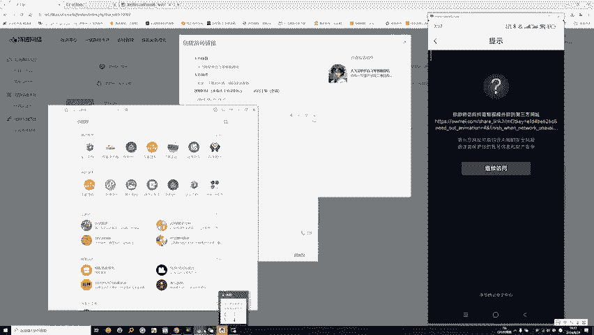

啊。我们的微信。呃，就是下拉啊，在这里去点击搜索金山文档。金山文档。啊，这样第一个就可以进去了啊，我们在在这里面去进行一个设置啊。如果我们在这个电脑上啊，就是点击这个小程序，现在电脑也有了啊。

然后我们可以在这里去搜索这个金山文档啊。因为这个我已经搜索过了，然后就选择这个金山文档。😊。

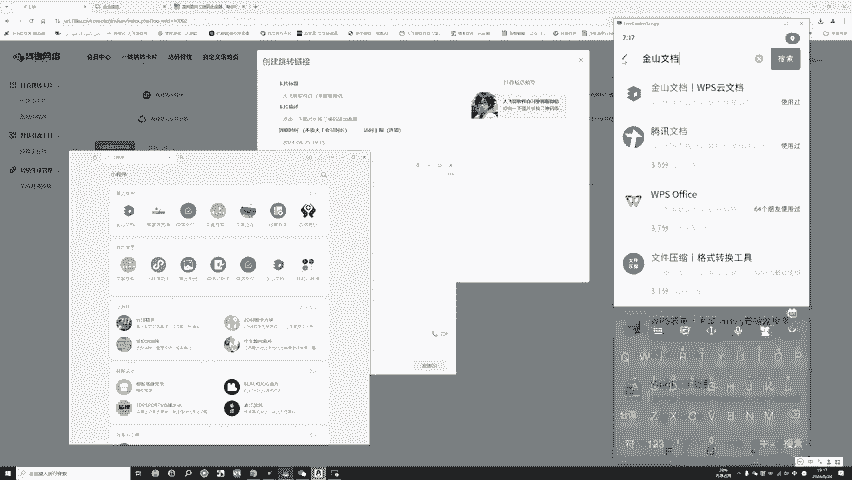

呃，选择完计删文档之后呢，用我们的微信啊进行一个登录。登录之后呢，就来到这个界面。然后呢，我们点击一个新建嗯，添加一个这个智能文档。😊，啊，然后我们这个可以给他写一个标题啊。长按。二维码。扫描。

添加客服。啊，然后呢我们在下边这里啊就是。给他。导入。啊，可以添加这个插入图片啊，可以在这里插入图片，上传我们的这个电脑上。这个我们个人的这个微信二维码啊，这个二维码的获取呢就是在我们手机上啊。

就是我们个人的这个微信。然后给大家看一下啊，就是这个打开，然后点击我啊就是点击这个我，然后呢，在这儿啊有一个二维码名片啊，我们在这里啊进行一个截图，或者点击保存图片就可以了啊。保存到这个手机啊。

发送到电脑也可以啊，或者是我们直接给这截个图啊。因为我用的是一个呃投屏工具啊，把手机呢投屏到我们电脑上的，大家可以直观的感感受到啊。好，然后我们还可底下的它这个好处是我们还可以插入一些正文啊。

就是呃写一些简单的一个说明。

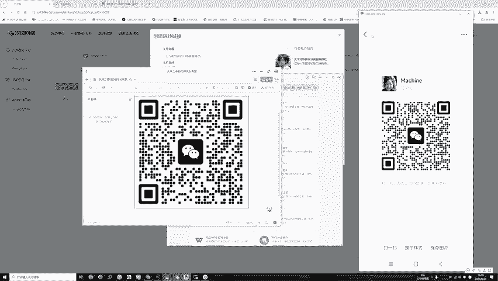

打飞哥。

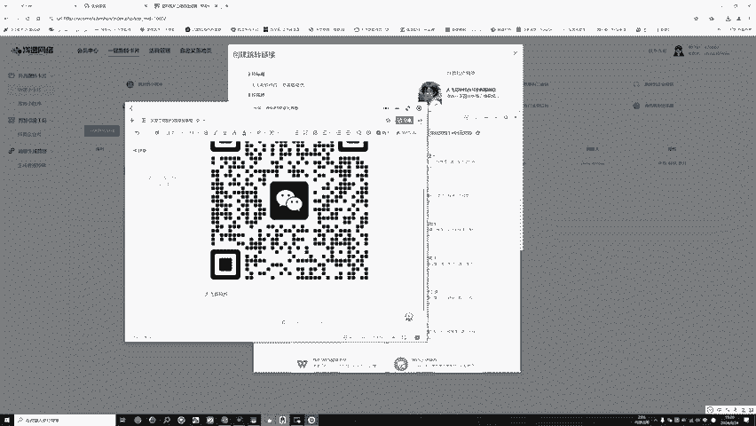

这试一试啊。你比如说把我的B站给它添进去。啊，添加到我们这个金拆文档里。嗯，浏览器内禁止啊，它只能是手动输入啊。好，然后我们点击这个分享啊。😊，点击分享，然后这个有一个和他人一起编辑和分享。

然后把这个权限啊开到所有人。嗯，这个呢编辑权限就不要给别人了啊，不然的话呢，别人呢可以对我们这个文档进行一个编辑和修改啊。我们嗯评论的话也不要了，我们直接点击查看就行了，只给他一个查看的权限啊。😊，呃。

然后我们点击复制这个链接啊，这个链接我们可以检测一下。然后呃我们看到前面呢它多出了很多的这个文字啊，我们把它去掉。啊，回撤啊，那这样一来这个是有效的啊，有效的。然后我们就呃把在这里进行一个添加。

很多小伙伴就直接啊把这个去掉了，去掉了，然后点击创建啊，结果呢跳转不成功啊，我们这里呢有一个填写啊，就是只要填写后面的内容就可以了啊，这里呢是重点啊，很多小伙伴把这个前面添加上了，不能使用啊。

我们把这个呃从杠后边啊给它删掉啊，只要这个就可以了，填一下这个立即创建。😊。

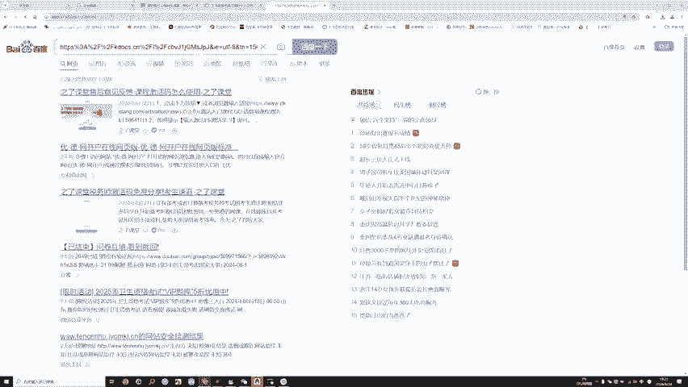

啊，然后创建完成就可以了啊，因为我这个呃现在如果是你们是这个适用用户的话啊，他只能是创建一条。

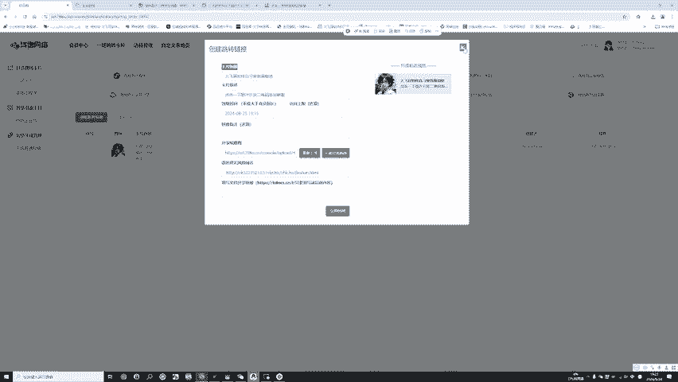

嗯。好，然后我们这里有一条了啊，跟这个是一样的。啊，我们可以把这个刚才创建这个换成这个啊，其他的这个。

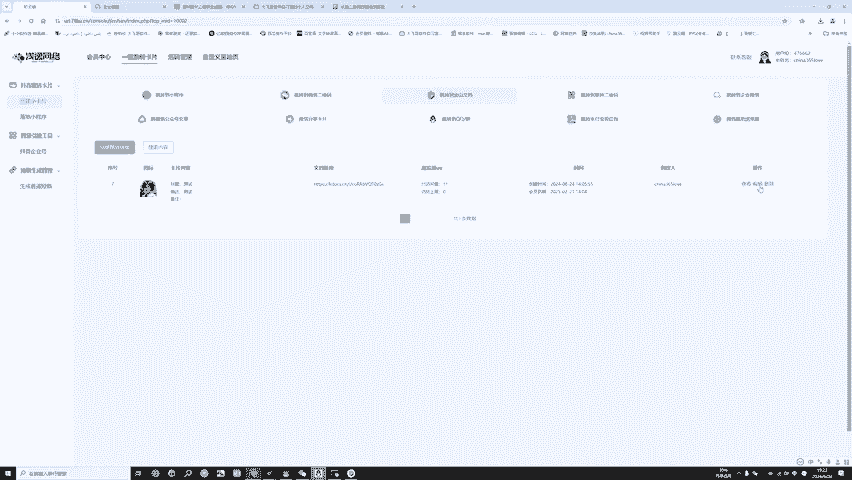

啊，飞哥嗯。は件。这形式啊。关注我。那我们这次啊就进行一个修改了啊，然后点击提交啊，那修改成功了。然后我们点击再去啊去把这个连接啊进行一个复制。然后呢，到我们的这个呃。抖音啊。

比如说我们这次发一个别人嗯。发送给他。哎，然后点击发送了，然后这个呢呃是普通的连接啊，普通的连接呢它没有这个。防那个啥的啊，它这个呢会有一个延迟啊，等延迟过来之后，然后它就变成这种小卡片了。

那直接发它就变成小卡片了。嗯，变成小卡片之后啊，然后我们就这个无风险，然后我们点击这个啊。点击之后啊，它就会进行一个跳转啊，然后我们打开。嗯，我们就会发现啊它会自动的跳转到我们的这个金山文档啊。

并且呢打开我们这个。打开我们这个图片啊，就实现了一个跳转。然后呢，我们呃点击一下这个图片啊，然后呢。先来点击啊，点击之后啊来识别这个图片中的二维码啊，就是点击识别之后呢，就可以啊添加这个好友了。

因为我和他呢是好友，已经是好友了，就可以直接发起这个对话了啊，直接可以在这个呃抖音里面实现呃这个微信的一个添加。嗯。如果扫描这个二维码的话呢，也是一样的。嗯，我们可以返回。然后通过抖音。好。

我们点击扫一扫啊，扫描我们电脑这个屏幕。啊，直接扫了之后啊，它就可以直接跳转的啊，也是一样的。嗯。好，然后我们长按啊识别图片中的二维码啊，它就可以跳转到我们这微信了啊。

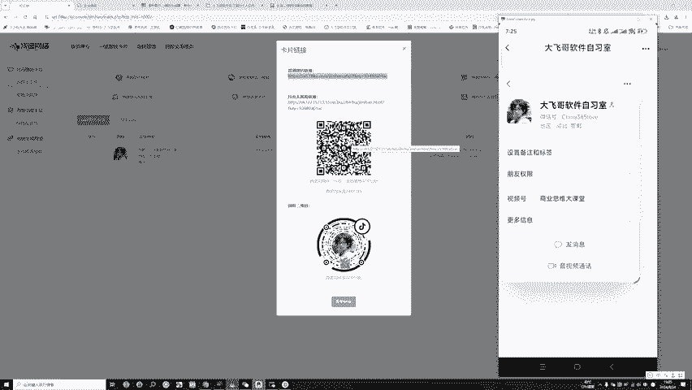

好，然后呢这个是金山文档。然后这个呢是材料二维码。

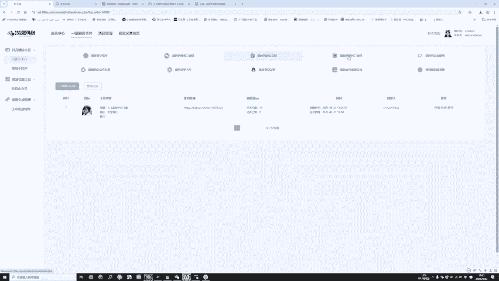

啊，这个添加的方式都是一样的啊，添加方式都是一样的。然后点击这个跳转添加啊卡片卡片名称。呃，这里就是唯一要说明的一点，就是我们这个把这个给它。😊，删除吧，然后给大家再来测试一条。然后我们这个是草药。

卡片名称啊。活满了。哦后2425啊，就是呃这个里呢可以呃我们这个它是有一个，因为咱们是网站嘛，它是有这个素材库的，相当于我们微信公众号里那个是一样的啊，除了可以上传本地的。

也可以呃从这个库中呢选择我们之前传过的一些图片啊。我们之前传过的图片呢，它都会在这个里面啊进行一个记录。我下次我们直接再从这个库里边选就可以了啊，这个是比较方便的。😊，然后呢呃这个无视风险的这个啊。

我们还选择这个。那这个呢就不是直接啊不是直接去上传我们这个微信的这个二维码了。啊，我们可以去通过这个草料二维码呢去生成一个活码。嗯，就是这个草料二维码呢，大家就是呃这个网址啊。

大家这个百度的话是直接可以找到的啊。草料。😊。

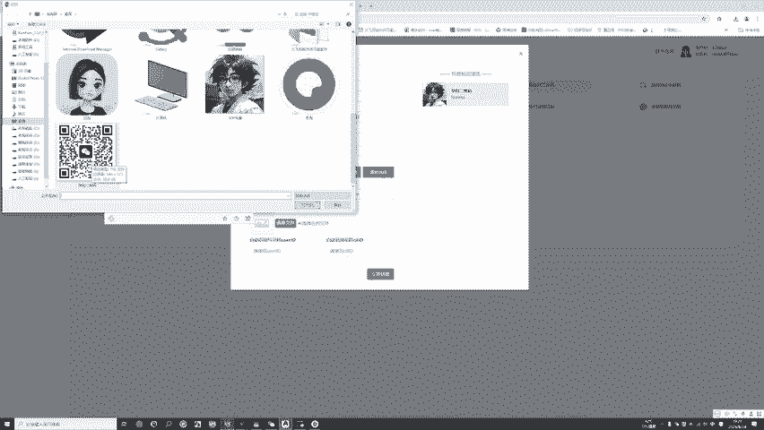

二维码你直接搜啊，记住这个有有这个小蓝帽的是它的官网啊，然后我们点击这个这个是官网啊，别别进错了。😊，然后呢，他这里有文本网址啊。还有那个呃图我这个链接，然后我们点击上传，比如上传我们的这个微信啊。

完呢，他给我们去生成一个活吧。这个也是需要注册和登录的啊，这个自己去注册就可以了。它这个呢是一个免费的啊，它活码活码有什么好处呢？就是说嗯比如说我们做的这个微信群啊，这个微信群它这个码都的都是有效期。

比如说是7天7天之后，然后这个。😊，码就失效了。然后呃码失效了，我们无需再去从这里边进行换码了。啊，我们直接还进到这个草料二维码的话呢，呃直接在这里面去进行一个呃这个重新啊，在它还是这个码。

这个码是基本码它不变。然后我们把这个码换掉就可以了啊，就是可以达到这让这让这个码呢长期有效啊，这个码可以不是长期有效的。而这个码呢是长期有效的啊，大家也不知道能不能能这个听明白。当然你还可以在这里面呢。

对这个二维码呢进行一个美化啊，它这它这里面颜色呀什么的，都是可以进行更改的啊，包括它的样式啊。😊，看这个色块，你比如说四个色块什么的啊，添加文字啊，都是可以进行美化的啊。那我这里为了节省时间啊。

就不美化了。然我们直接点击下载这个二维码。😊。

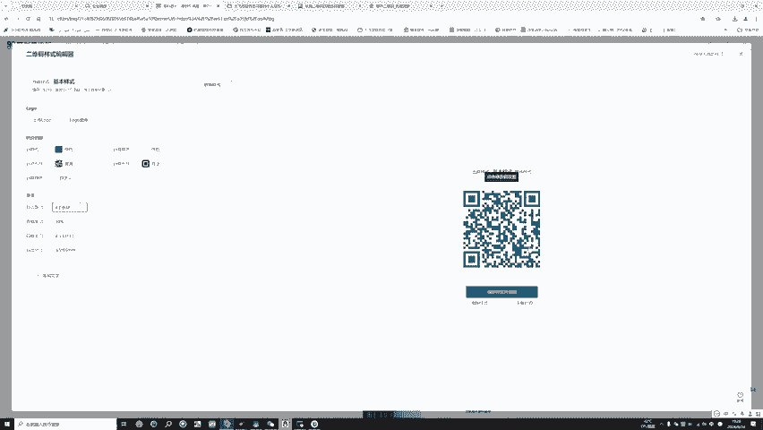

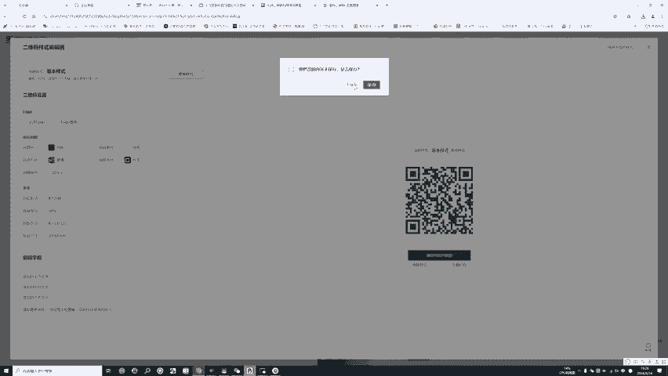

啊，这个呢是微信二维码啊。

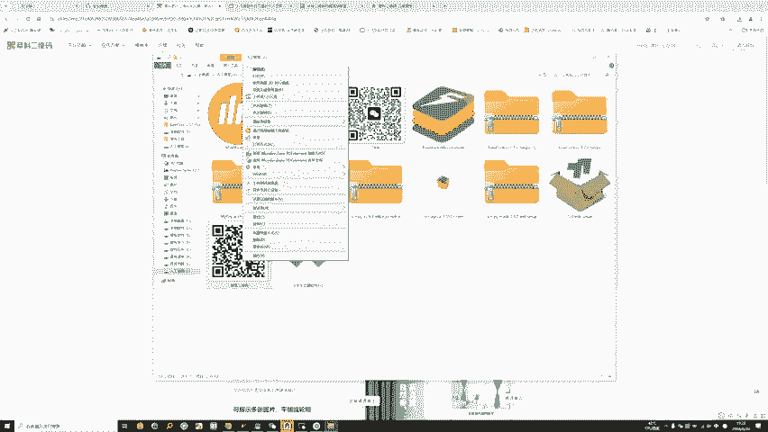

123456嗯，那这个的话呢是这个草料二维码嗯。嗯。然后我们呃去添加这个二维码。啊，这个二维码它在这个位置啊已经删除啊，我们给他看一下。

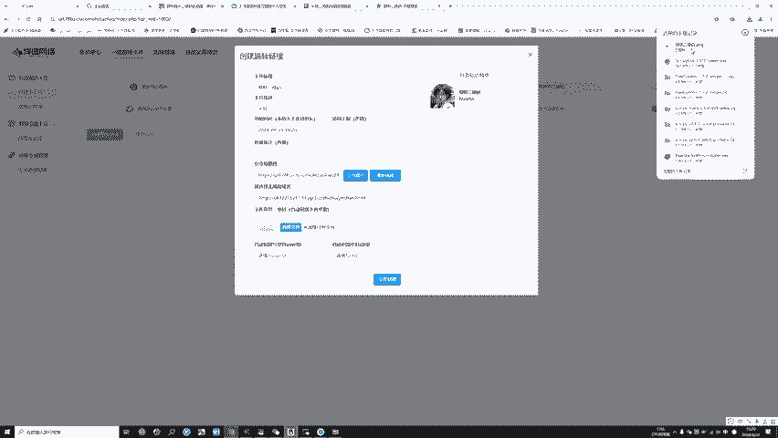

重新下载一下啊。呃，在人工智能里面啊，我们给它粘贴到桌面。

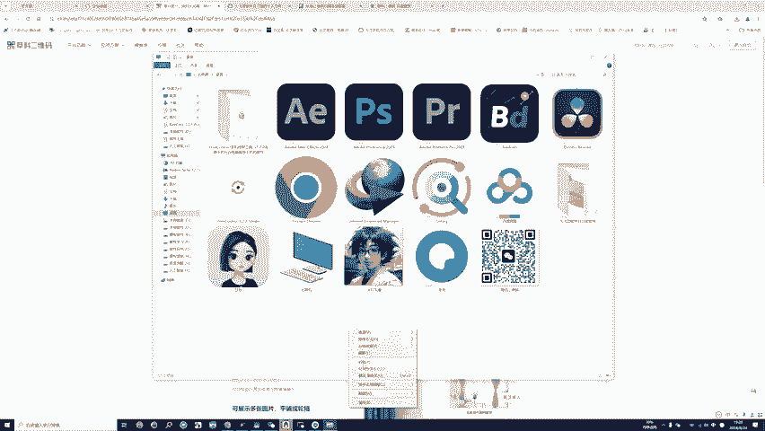

好，然后我们把这个。填进去啊，直接识别。啊，选择之后呢，这里它就会自动识别我们这个材料的这个ID啊，包括这个CID啊自动识别的。如果没有识别的话呢，网络卡的话呢，可以再重新上传一下就可以了啊。

然后呢点击这个创建啊，这下来就上传成功了啊，成功之后，然后我们就可以去测试了。我们可以扫码或者是把这个无风险连接啊，或者普通连接呢去发到我们那个。😊。

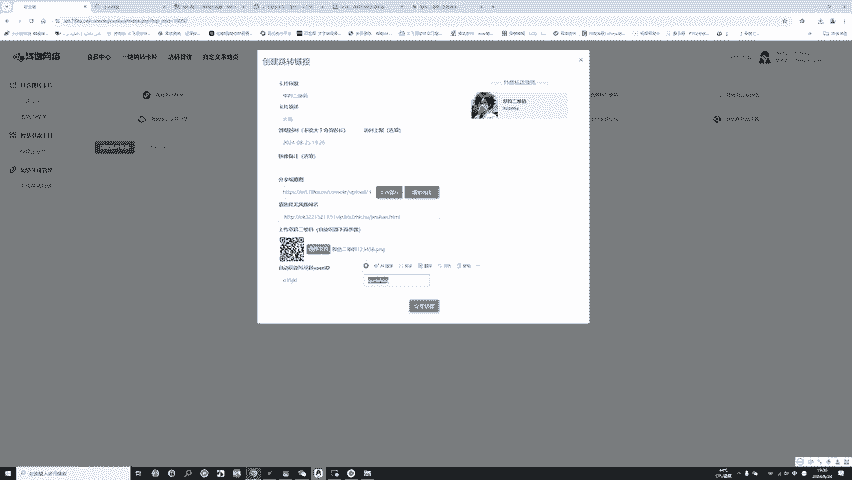

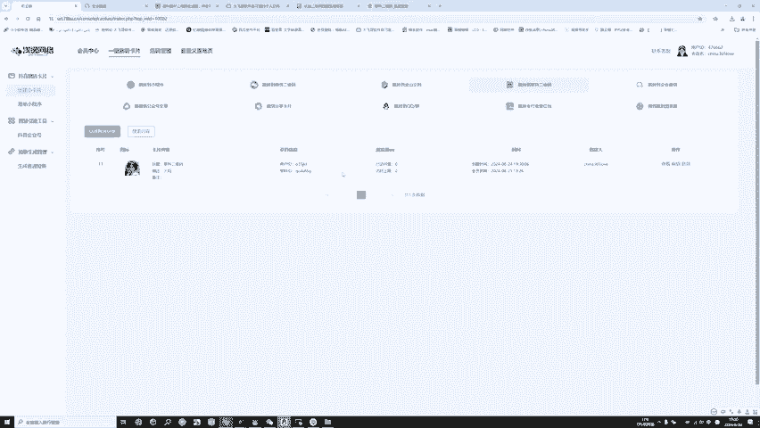

好，然后我们可以给大家看一下啊。好，然后我们来这里啊进行测试。啊，他需要等一下它这个缓存出来就可以了啊。然后我们点击来测试。嗯，他可以直接啊跳转。啊，他这个的话就不会跳转到这个金山文档了啊。

它就直接跳转到这个呃草料二维码了。然后我们嗯只需要这个长按这个二维码。点击一下啊点击一下它这个识别之后啊，就可以去。识别图成。啊，就可以去添加好友或者是呃发私信了啊。

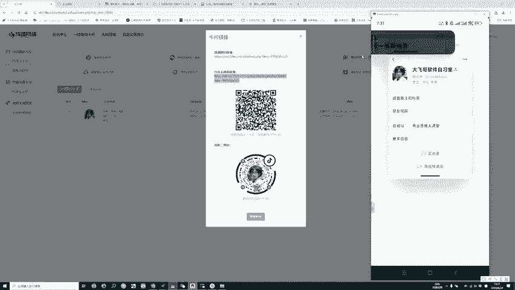

好。啊，这个呢就是这个呃还有一个是跳转到企业微信啊。

很多小伙伴啊，他也是这个里面呢有一些东西还是需要填啊，包括这个呃这个填写这个连接，这个连接是怎么得到的啊，给大家说一下。😊。

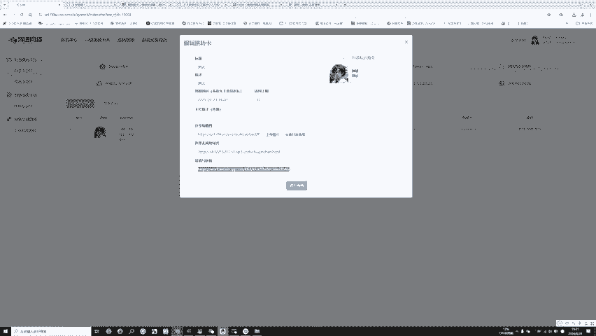

嗯，很多小伙伴不会添加这个企业微信，怎么去添加啊，然后我们先把它进行一个删掉啊。😊。

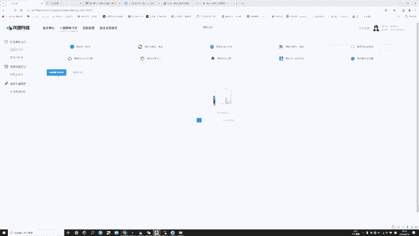

然后点击添。企业微信。客服。开片描述。点击。跳转。啊，当然这个时间啊，这就不用过多就不用说了啊。然后最主要的就是这个这个图片还是用之前的这个吧。嗯。然后这个企业微信啊就是。

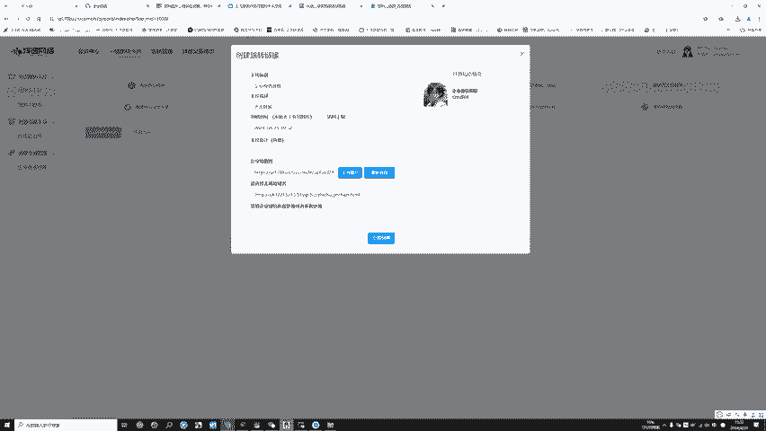

我们。这个登录啊就是扫一下我们这个企业微信的这个二维码，登录我们的这个企业微信。好的，然后我们扫描完成啊，点击登录。呃，登录我们这个企业微信之后啊，就是在电脑端登录了这个企业微信之后。

点击这个应用管理啊，这个应用管理。然后这里有一个微信客服啊，微信客服这里的话，如果没有的话呢可以在这里啊去添加一个啊，按照这个形式呢，去添加一个啊，这里节约时间啊，我们这里已经添加完一个了啊。

添加完一个，我们直接点击进去啊，然后这里有一个接入连接。😊。

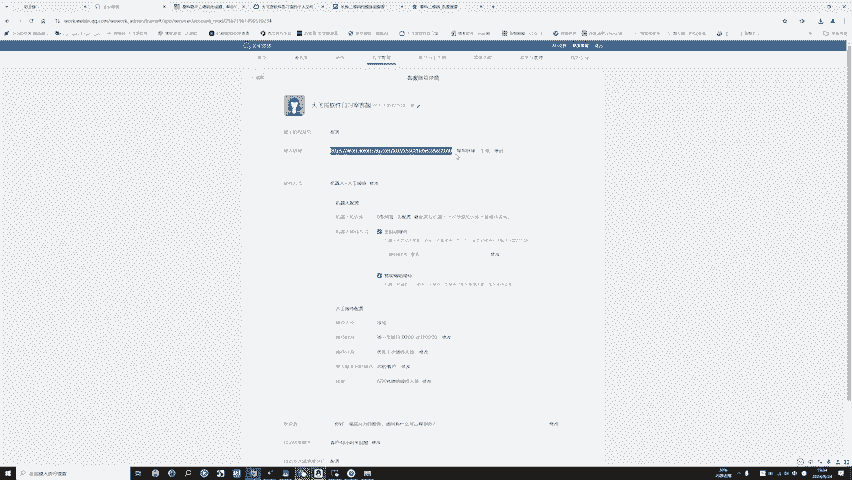

我们复制这个连接地址啊。然后呢，填入到这个里面来就可以了啊，顾客连接地址，然后立即创建。

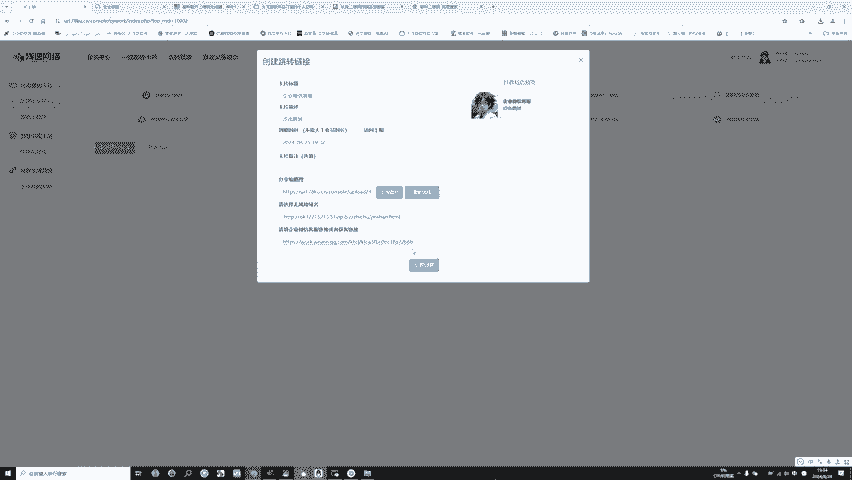

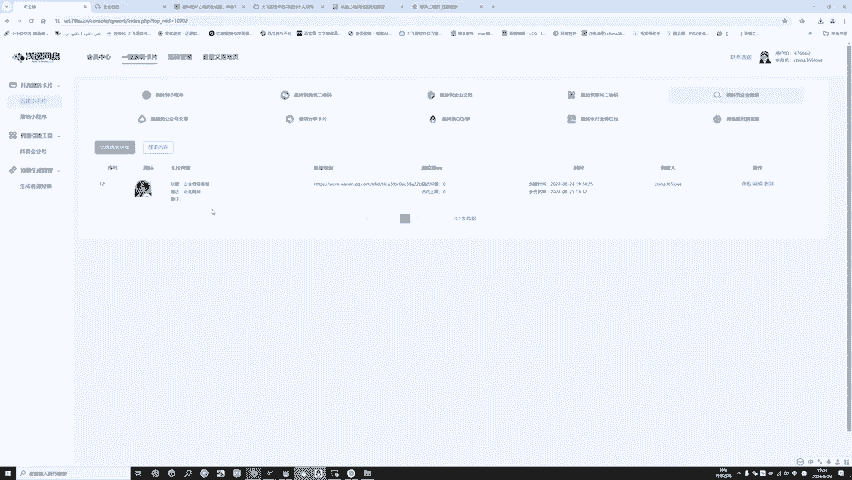

啊，这样一来就可以实现了。然后我们点击啊进行一个查看。然后把这个连接地址啊，这个发到我们这个还是微信上啊这个。呃。抖音上啊。把上一个给它关掉。好，然后我们来到这里。进行一个粘贴。啊。

这个呢就是我们刚才第一次给大家演示的那个啊，可以直接呃直接跳转到这个企业微信啊，给大家就是演示的这个。啊，就直接跳转到企业微信了，它可以在抖音上实现和企业微信的一个跳转连接。嗯，就可以在这儿啊打一些字。

然后我们的这个企业微信啊就可以收到啊，并以进行一个回复了。嗯，这个非常方便啊。

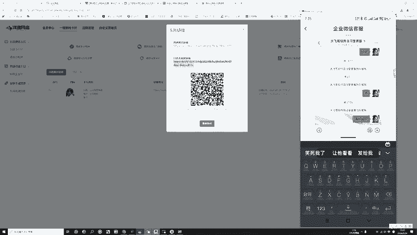

好，这个缓存过来就就就做就好了啊。好，还有一个。底下的这些啊就是也是一样的啊，跳转到比如说浏览器啊，可以这个是我跳转的一个呃分享标题啊，这个是跳转地址，比如说这个是我的淘宝地址啊，落地域名啊。

这个就提交就可以了。然后跳转到这个QQ和QQ群也是一样的啊，道理。然后这里注明的一点啊，比如说。

QQ。練習を。うん。然后还是这个头像。啊，呃这里呢是个人QQ嗯，就是个人QQ号呢，就是直接输入我们的这个呃QQ号就行了啊。例如我的这个QQ号，290306296啊，或者是QQ群啊。

直接把QQ群的这个群号啊给输进去。比如说我们这个QQ群啊，他非个软件自己的QQ群啊，QQ群的这个群号啊，只需要复制一下。😊，嗯，粘贴。然后立即创建。卡片描述啊必须。阿フ哥。这寝室。好。

然后立即创建啊创建成功了啊，那我们这个QQ群就是这样的啊，然后。😊。

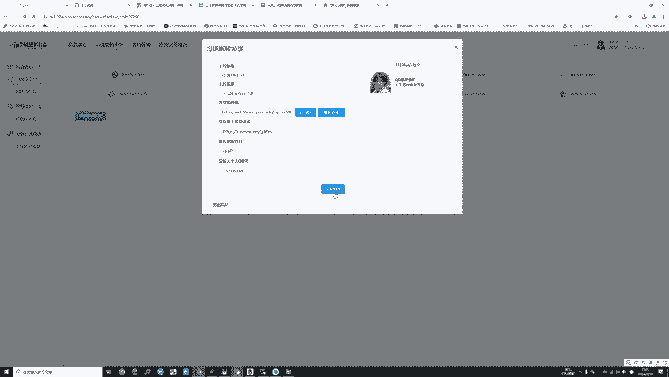

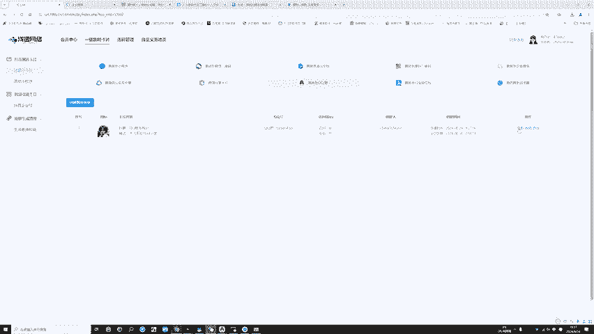

查看。啊，也是一样的啊，复制我们这个无风险的这个啊或者是扫码。

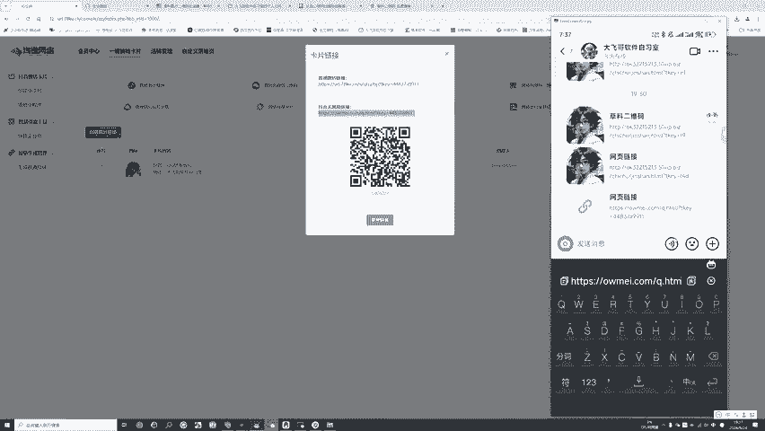

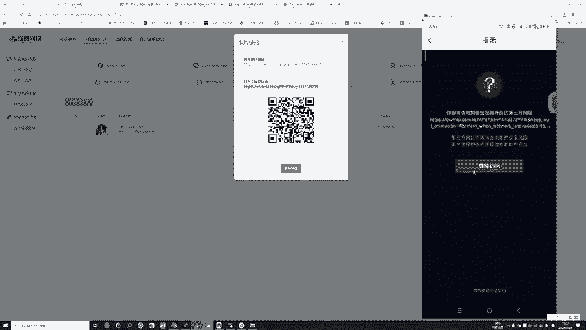

好，让我们测试一下啊。哎，你看这个如果有这个提示，让我们直接点击啊跳拽就行。你看它会直接跳转啊，跳转前往QQ啊。啊，然后输入密码，哎，你看它就直接跳转，然后让我们申请加群啊，我们就可以直接。

通过微信里边啊，这个不是微信啊，是我们的这个抖音里面啊。然后实现跳转到这个QQ加群哈，进行1个QQ群的一个营销。

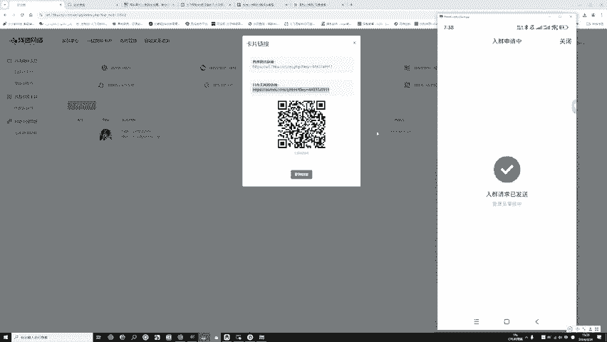

好呃，那下面呢给大家再讲解一下这个。😊，抖音啊抖音的它是有一个。呃，自动回复的啊，就是别人关注了我们之后啊，他是可以直接呃让他去自动回复我们这个卡片的啊，就是最终实现了一个什么效果呢？

就是嗯别人关注我们之后啊，你比如说他关注我们之后，我们回复一个关键词，然后呢，他就会自动把这个卡片发给我们这个顾客啊。😊，🎼当然了，我们这个账号呢要是企业认证过的这个账号啊。

就是我们的抖音号呢要是蓝为认证过的。呃，这个功能怎么去开通呢啊？就是点击我，然后呢，在这里有一个小三个三个小横杠啊，就是这个设置这里，然后呢有一个企业服务中心。啊，呃然后我们这里有一个往下走。

有一个私信管理啊，我们可以在这里啊进行私信管理。在私信管理这里面啊，把这个自动自动这个回复啊给它打开。😊。

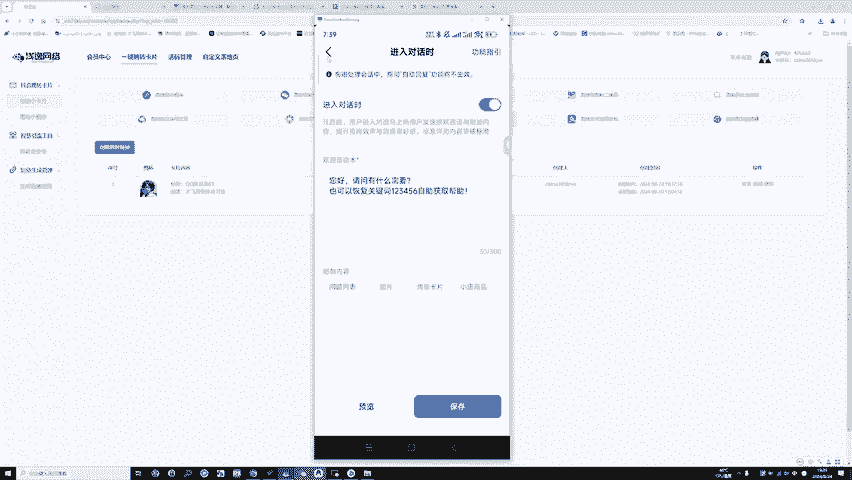

啊，把这个打开。然后呢呃我们把这个可以把这个连接啊。可以直接把这个连接复制一下。复制一下，然后粘贴到我们这个。这里啊。因为嗯直接粘贴到这里面来，然后呢等待我们保存啊，等待我们这个审核过啊。智能审核啊。

你可能有这个二维码者网页啊，然后就是通过这种形式呢来进行一个添加啊，然后我们可以提示它啊这个执证不让他不让放网址，我们可以提示关键词啊，我们可以通过关键词的形式来进行一个设置啊。

第一个呢是自动回复和第一条，然后我们第二个呢是设置关键词。嗯，关键词的话呢是把这个打开，然后打开之后呢，它可以添加100条自动回复啊，然后比如说这个是一条啊，没你好啊，是关键词，然后呢，自动回复，你好。

有什么可以帮助你的。那我们把这个刚才这不是设置了吗？第一条呢是请回复关键词，123456啊。然后然后我把这个。😊，呃，关键词这里啊可以进行一个新建关键词啊，比如这第一个关键词就是一啊，回复什么消息呢？

模糊匹配完全匹配啊，模糊匹配就是类似于一它都可以了。在这里回复的这个包括这个呃图片、文字、消息卡片啊，精音工具就可以进行一个设置了啊，我们可以。😊，呃，设置一下啊，看能否通过。然后就是。

把这个卡片啊添加进去，然后进行提交嗯。如果不行的话啊，我们就可以给他直接发二维码。嗯，可以使用这个二维码。

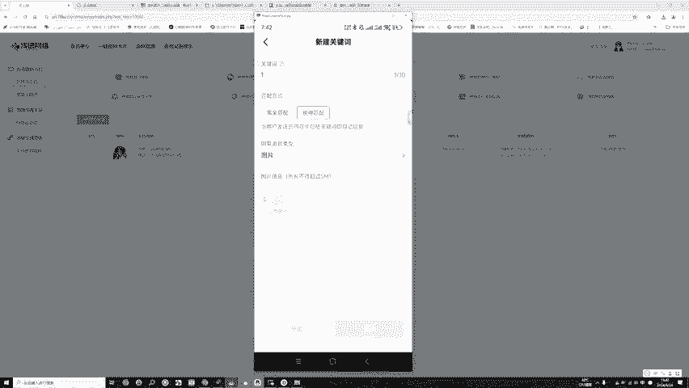

他这个抖音现在检测的比较严啊，然后图片另存为。

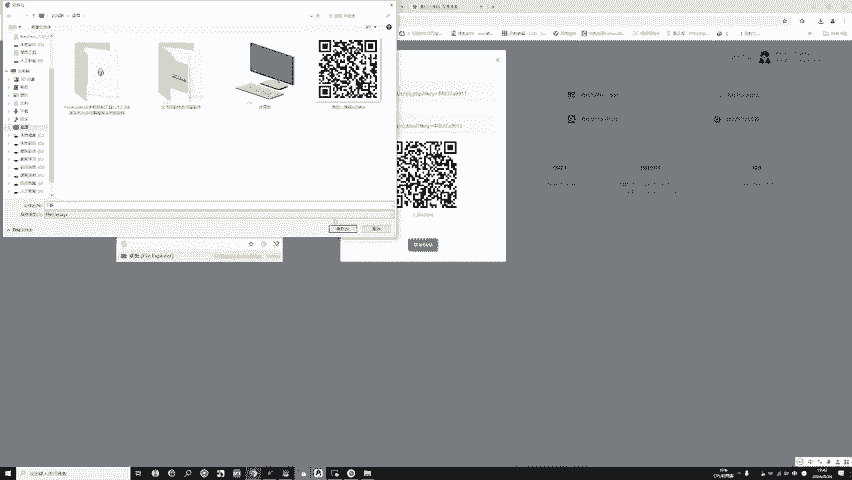

嗯。啊，我们就是把这个二维码啊，我发送到那个手机上啊。MA。嗯。啊，然后我们就忽略它就行了。我们直接点击提交啊，刚才那个也是一样，我们直接提交啊，有可能他就审核通过了啊。他那个通过之后啊。

就是我们刚才那个呃回复啊，比如说关键词2。😊，嗯，然后回复文字啊，这个文字的话就是我们的小卡片啊，然后提交，然后继续提交啊。好，这个就不搞它了啊，然后主要是实现这个跳转啊，这个呢就是做一个延伸。啊。

呃活码啊就是呃这个码的话呢，他是说呃就是跟我们刚才那个是一样。只不过它呢有一个这个码的一个统计，包括我们这个呃返问量呀，或包括那个比如说淘宝客啊。然后他这个就是对这个码的一个访问的一个统计的一种类型啊。

客服码。嗯，比如说你要是做这个淘宝客的话嗯。

就是这个可以呃把这个推广连接口令放到这个里面啊，然后把这些进行一个添加啊。添加之后呢，他他这个呢就是说呃比如说哪些码被进行了一个访问啊，而且呃成交量，比如说淘宝客成交量是多少啊。

都可以在这里进行一个显示，它比这种单一的跳转的就是多了这个数据统计的一些功能啊。

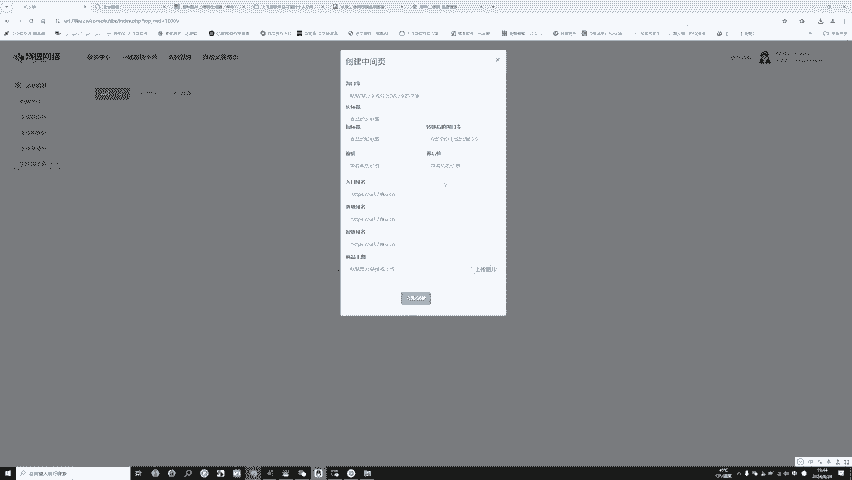

这个自定义这个落地页啊。他的就是说呃可以自定义的去跳转我们的一些网址啊，更灵活啊，包括我们这个跳转的方式更多样啊。

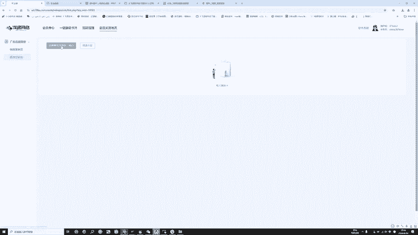

好，创建到这个微信啊。小程序的一些卡片啊，当然这个是自己的小程序啊，来推广自己的小程序，来抖音里边这个直接实现微信的小程序的一个推广。😊。

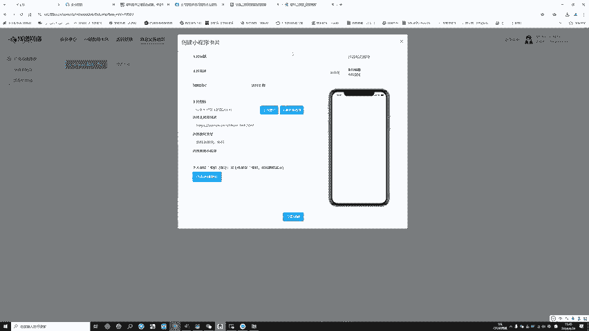

好，呃，那关于这节课呢就给咱们大家讲解到这里啊，谢谢大家的观看。😊。

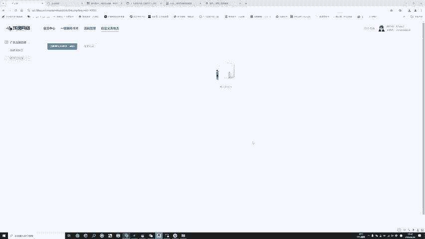