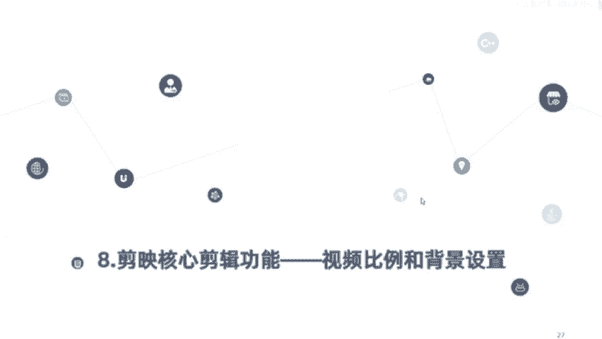
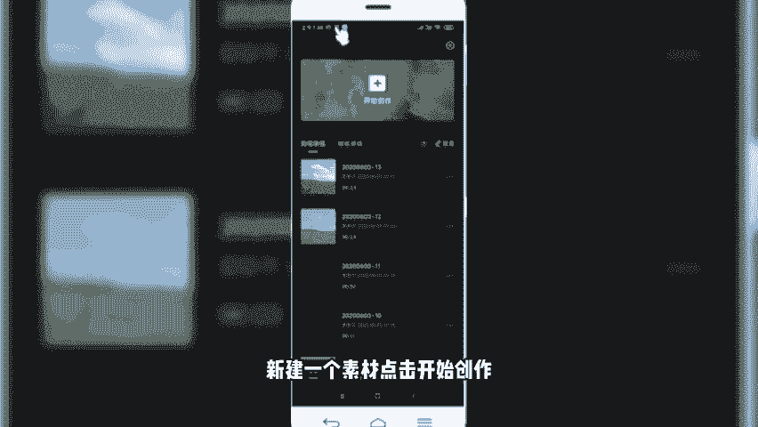
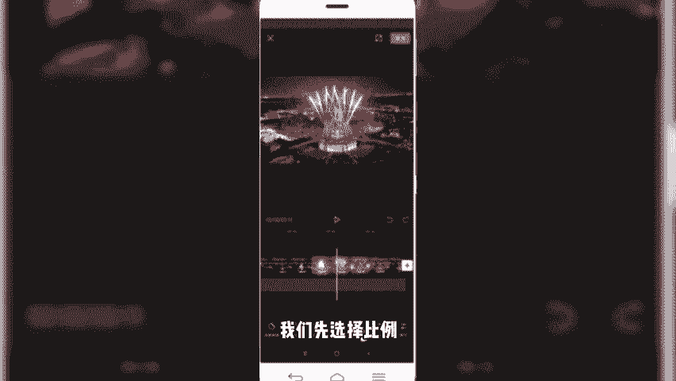
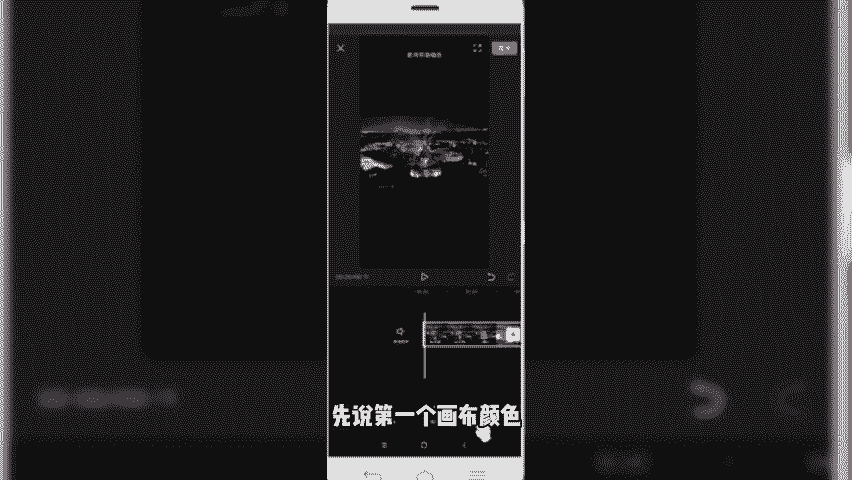
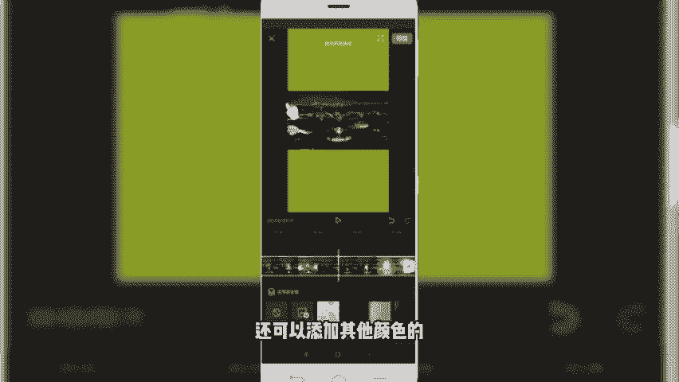
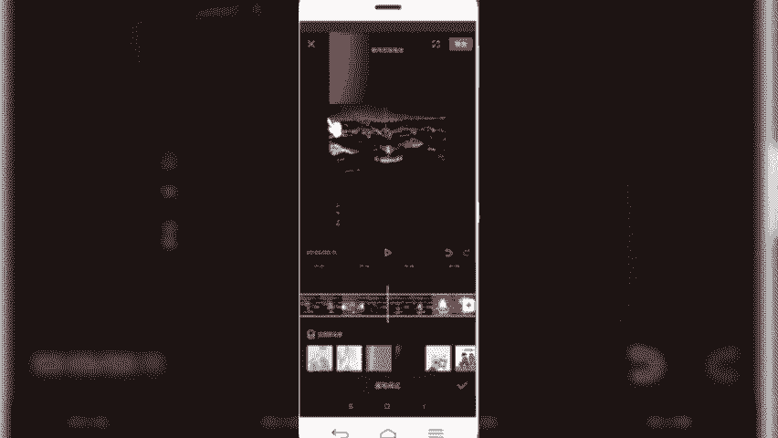
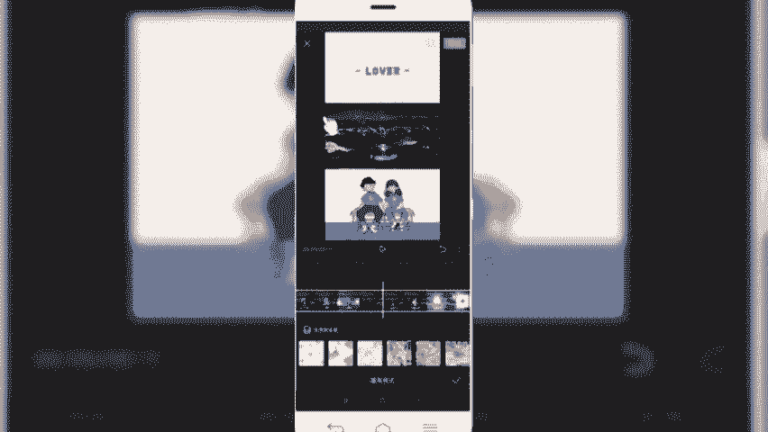
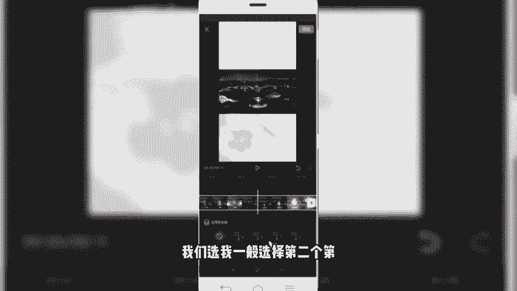
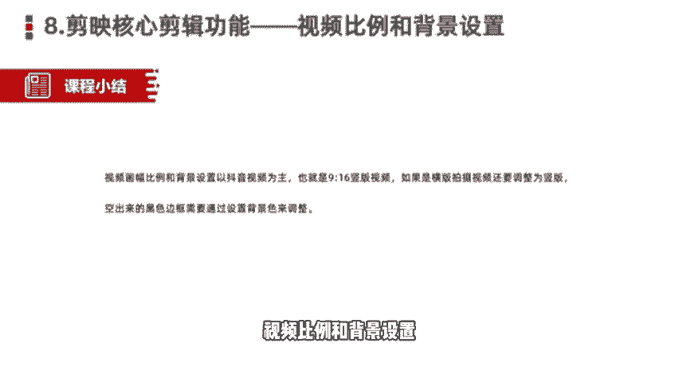

# 剪映手机版教学全新版本，学视频剪辑做视频号运营必看的剪辑零基础入门教程 - P14：剪映核心剪辑功能--视频比例和背景设置 - b财神保佑我 - BV1MasZeeEk9

我们今天呢给大家分享的是简映的核心剪辑功能，视频比例和背景的设置。在抖音和我们看到的快手视频当中，我们应该有一个共同的认识。那就是我们看到的视频几乎90%呢都是。竖屏的横屏的视频有吗？也有，但比较少。

那么我们在抖音或者是快手发布视频的时候呢，也是推荐大家以素屏的为主。那么我们了解了这个需求之后，当我们在后期通过剪映制作，或者是说剪辑视频的时候呢，就需要把我们的视频比例和或者说格式呢调整为竖屏的。

当然有小伙伴会提问到，如果我拍的视频是横屏的怎么办呢？老师啊不要担心，那么我们今天的这个法堂课会告诉大家，关于视频比例和背景设置这块的相关方法和技巧。

那视频的画幅比例和背景的调整呢也是属于剪辑的一个基础。如果画幅的比例和背景的设置错误了，那后期会影响到我们的视频一个推荐和播放效果。这是刚才给大家提到的。

如果说你是拍vlog视频那么那我我就建议大家拍什么横版的视频，然后呢上下黑边可以加上一个背景色。写上我们的标题或我们的相关核心关键词。那如果说我们拍摄情景剧美食或者是旅行的话。

那就建议大家呢拍成速版的视频，它的推荐效果可能会更好一些。那竖版的话也就是我们所谓的9比16，横版的话就是16比9。视频的分辨率一般是在1080P。60帧。但如果你有更高清的。

也可以2K的或者4K的剪映的话，目前在导出视频这块，它也是支持我们选择2K或者是4K的。好了，那关于视频比例和背景色的调整这块呢就先介绍到这里。那么接下来的话，我们进入软件当中。

详细给大家讲解如何呢设置视频的比例和进行背景的一个调整。好，同样呢我们首先是。新建一个素材，点击开始创作，然后呢导入一遍一片素材。

好，我们导入素材，首先来预览一下。微微晨光点亮着喧嚣世界。好，那这个呢我们看到的就是很典型的，它是一个什么横版的视频。那如果我们想要变成竖版的话，应该怎么样做呢？啊，这块儿就需要调整它的比例啊。

我们给它调整怎么样选择呢？在一级菜单往右滑，底部可以看到有一个比例，还有一个背景啊，这两个是挨在一块儿进行设容线选择比例。

然后呢，选择9比16。可以看到我们选择9比16呢，它就会变成这样一个竖版的一个界面，然后上下就变成了我们所谓的黑边。然后再来看一下效果。🎼微微晨光点亮这喧嚣世界，微微温暖融化昨夜的冰雪。

就是我们看到的这种。竖版的9比16比例的。视频。那么我们做出来之后可以发现啊它的背景色呢是黑色的。看起来太过于单调，那我们想让它变得更加丰富多彩，怎么办呢？就需要给它的背景色进行调整设置。

同样返回到我们上一菜单，然后点击底部的背景。点击背景。然后会出现三个，一个是画布颜色，还有一个画布样式，还有一个是模糊画布模糊。啊，我们挨个给大家讲一下，先说第一个花布颜色。

那么我们可以给它添加一个相应的背景色啊，比如添加个灰色。

那背景色就变成灰色，你要添加红色的话，它的背景色就变成红色了，可能看起来更加的喜庆。微微晨光点亮。啊，有很多颜色我们可以单独调整，就是画布颜色，我们可以给它加一个纯色的背景。第二个呢是画布样式。

我们除了添加纯色之外，还可以看下其他颜色的。比如说我们给下换个其他的。

变成这种或者是变成这样的。

还可以变变成这种。

啊，海报形式的背景创意。那这些呢都是抖音。画布样式当中自带的啊，我们在剪映当中可以随意的选择这些相应的画布。

那第三个呢叫画布模糊。画布模糊的话，我们经常看到有些视频呢。中间的视频播放呢是清晰的，然后呢，上下两个边呢它是模糊的这就是我们看到的画布模糊效果。啊，比如说我们选择一个画布模糊。它有4种效果。

从清晰到模糊，它的层级呢是强度，也是逐渐递升啊，我们选我一般选择第二个，第三个就够了啊，我们选第二个。

第三个的话，模糊太厉害了。那第二个再来看一下视频。🎼微微晨光点亮这喧嚣世界。微微温。🎼融化昨夜的冰雪。好，我们应用。那么很快呢我们就给这个视频呢，从刚才看到的横版的16比9的变成一个竖版。然后呢。

我们又给它的黑色纯色的一个背景色给它添加上这样一个。模糊的画布。那我们看到这个视频就变了。微微晨光点亮。好。那这一块的话，刚关于给大家分享的。视频比例和我们的。背景调整这块呢就给大家分享这块儿。

然后呢我们一块儿小结一下。

我们主要讲的是抖音视频。那抖音视频呢又以9比16的速版视频为例。所以我们调整的视频画幅也好，视频的背景设置也罢，都是以围绕抖音短视频为主的。也是我们要以速版的视频为主。如果说我们拍的是横版呢。

那首先是要把我们的横版视频呢调整为竖版，把空出来的黑边边框呢需要通过给它设置一下背景色来进行调整。那这样的话，我们视频可能看起来会更加的丰富多彩，提升我们一个视频的一个推荐量。好了。

本节课程关于简映的核心剪辑功能，视频比例和背景设置就给大家分享这里，我们下节。

