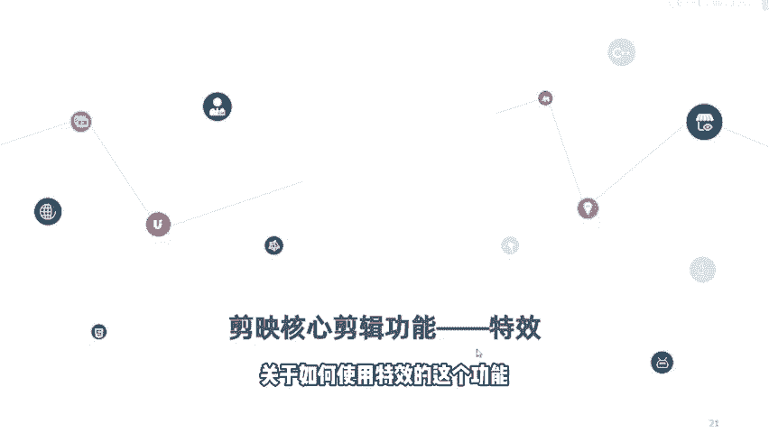
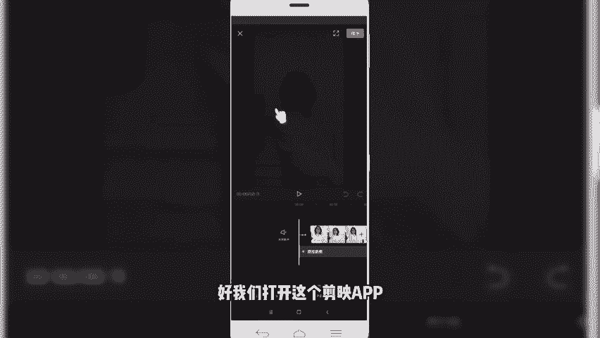
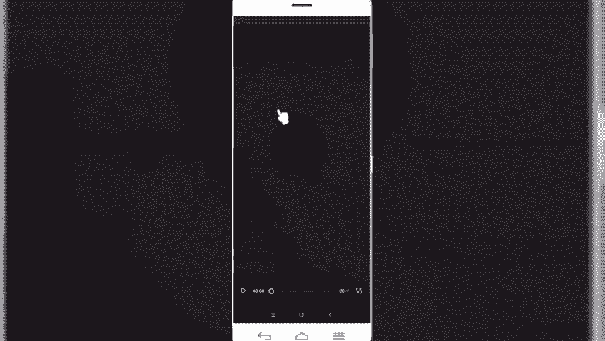
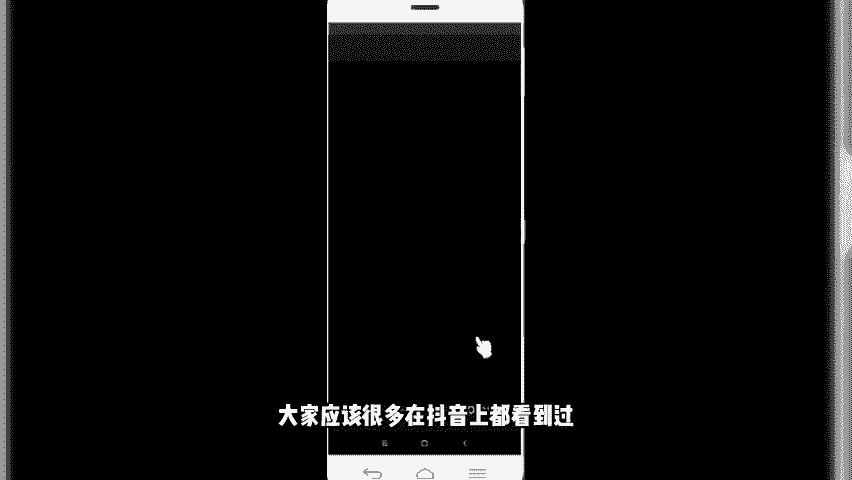
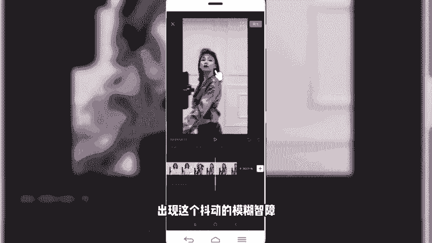
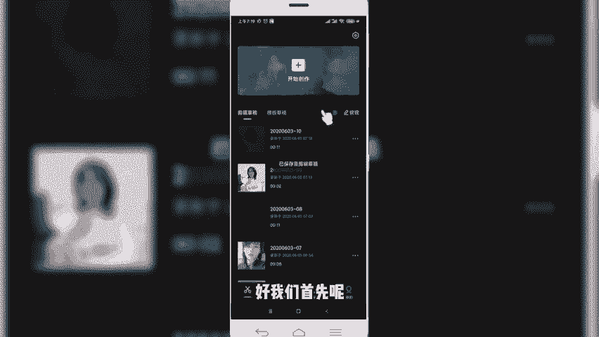
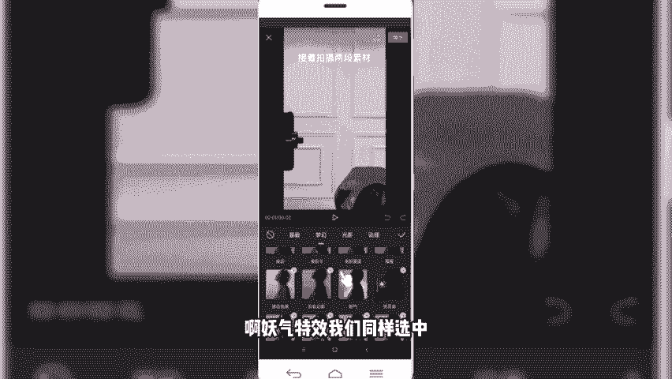
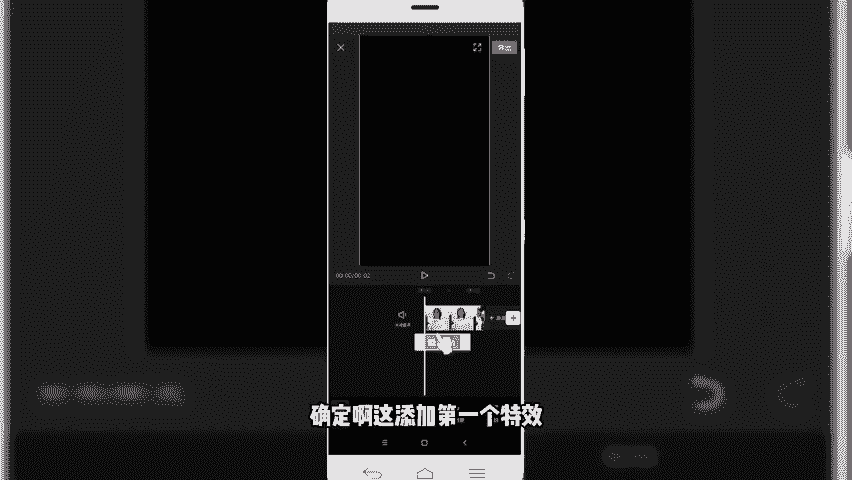
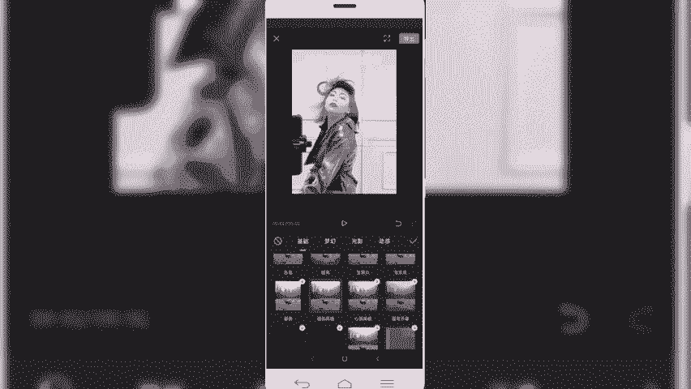
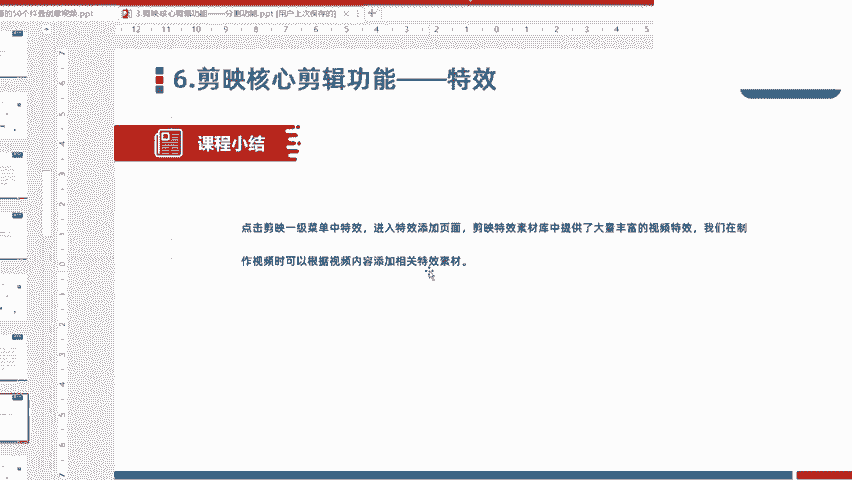

# 剪映手机版教学全新版本，学视频剪辑做视频号运营必看的剪辑零基础入门教程 - P16：剪映核心剪辑功能--特效功能 - b财神保佑我 - BV1MasZeeEk9

咱们今天呢接着给大家分享的是简映的核心剪辑功能特效。其实在期在玩抖音视频的小伙伴啊都会知道啊，在抖音当中啊，拍视频呢有很多拍视频的道具。那么我们在拍视频的时候。

借用这些道具可以拍出来很多搞笑有意思的这种视频。那么在剪映当中的特效也正式借鉴了这一元素。通过在视频当中植入一些特效的效果，让我们的视频呢变得更加的生动有趣。好。

那么今天呢就给大家分享的是关于如何使用特效的这个功能。

在剪映的特效功能当中啊，它加入了大量的一个特效素材库。那我们通过在视频当中植入相应的特效视频元素。可以。大幅度的提升我们视频营的整体的一个画面感觉和氛围，尤其是在做。一些变装类呀。

或者是反转类的视频当中了。可能会大力的运用到一些特效的元素。有有些专门做那种。美妆类的可能用的特效演组会非常多啊，因此对于我们想要学习简易剪辑的来，小伙伴来说的话。

学会运用特效对我们后期提升整体的一个视频效果来说帮助非常大。拿我们前段时间特别火的那个视频，变装甩头发。来历。美丽。当时这个视频也是非常简短，短短是一秒一个。换装的视频，然后呢。给人的效果耳目一新。

在这个视频当中就用了大量的一个特效的元素。好，那关于特效介绍这块，我们就先到这块。然后呢，接下来是跟大家一块进行一个实操的演练。好，我们进入剪易软件当中。好，我们同样首先呢是。先看一下这个成品。

啊，我们打开这个检验APP，然后呢先播放预览一下成品看看。

嗯，相信这个视频呢就是前段时间大家应该很多在抖音上都看到过。像这个视频当中啊，就运用了大量的特效元素啊，我们首先看开场这块。

那开场这块它是借用到了一个什么模糊变清晰这样一个特效元素。那紧接着第二个的话是他在这个跳舞的时候，背景运用了这个什么。啊，也是一个紫色这样一个特效元素。那包括最后啊出现这个抖动的模糊智障。

啊，这也是一个特效元素。那这个是怎么样添加呢？啊，大家不要着急，我们待会儿给大家演示一下。好，我们首先呢。

是打开。开始新建，然后呢我们选择一个相应素材。好，导入到项目当中。好，我们先预览一下。原素材呢可能是这种效果。那么我们。怎么样给它添加特效呢？首先是开场这块有一个模糊变清晰啊，点击底部的特效。好。

然后我们选择这块儿看到了没有？有一个基础类的特效变清晰。我们点击。好，那么就相当于给视频添加上这样一个模糊变清晰的一个特效，是第一个。然后我们接着再看，第二个就是我们看到的在跳舞的时候。

背景又添加了一个什么紫色的。啊，妖企特效我们同样选中。

啊，这第二个特效。好，我们挨个先添加第一个。变清晰。确定啊，这是添加第一个特效。然后呢，紧接着再给它再添加另外一个特效。

返回到我们的上一层菜单，然后新增特效再给它添加一个啊，添加一个什么。梦幻类别啊有一个叫邀请，就是他跳舞那一段。好，我们再添下第二个特效。那第三个特效呢，我们同样啊把这个时间轴拉长。

第三个时代呢甩头发这一块还有一个特效。我们再新增一个特效。那甩头发这块是用了一个什么？动感的啊横纹制造，我选择这个。智道。好，我们调整一下。调动下时长。来看一下基本的效果。啊。

基本上就我们想要的这种效果。当然我们这块还有一个少的，缺少了一个。什么呢？缺少了我一个背景音乐。如果说我们添加上背景音乐的话，那这个效果看起来就会更加的明了。

那那这一块的话就是我们看到的视频当中借用的大量的这种。特效。而且这个特效呢它是支持叠加的啊，我们可以反复的添加特效。你看新增特效还可以添加。啊，这块有很多特效，我们可以在创作视频的时候可以多尝试啊。

尤其是我们看到的，比如说基础类的开幕啊，变清晰变模糊、聚光灯、电影感放大抖动，这些都是我们看到的最常用的用的在抖音视频当中用比较广泛的。像闭幕。录像机噪点。相机方格等等，这些用的是非常广泛的。啊。

OK那这块关于。视频特效。

我们就介绍到这块。那接下来的话我们同样是。点击剪映的一级菜单中特效。那么我们进入特效的添加页面。简映APP啊本身关于特效素材这一块提供了大量的素材内容。我们可以根据相应的要求。

或者根据我们视频创作中的需求，直接选用相关的特效素材添加到我们的视频当中即可。这块呢建议大家小伙伴在后期创作过程中可以多尝试多练习。因为抖音本身也是在推不同的新的视频形式。

那么我们在创作的时候也可以进行大胆的尝试和不同不同的风格这样一个。练习啊，对于我们后期的创作视频来说是一个非常大的帮助。好了，本节课程呢关于简易的核心简易功能特效功能就给大家分享到这里。

我们下节课程再见。

