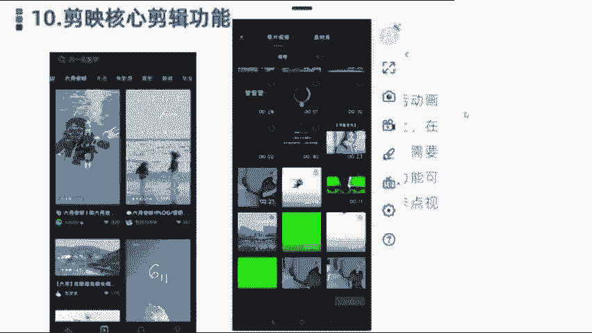
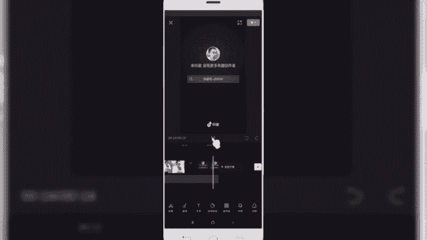
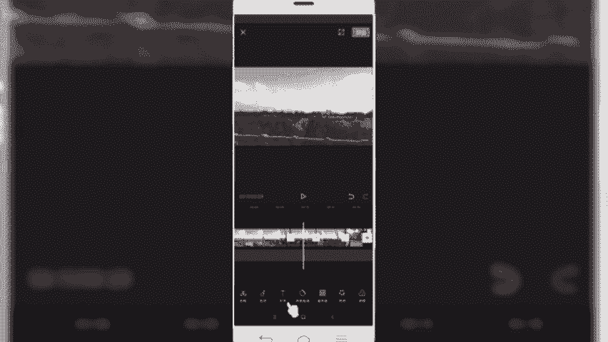
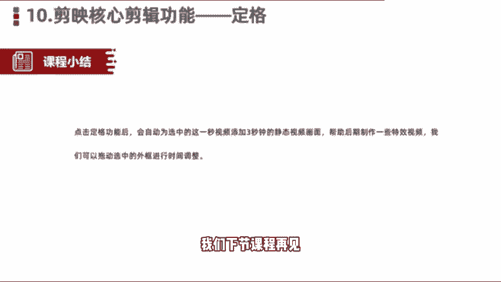

# 剪映手机版教学全新版本，学视频剪辑做视频号运营必看的剪辑零基础入门教程 - P19：剪映核心剪辑功能——帧定格 - b财神保佑我 - BV1MasZeeEk9

好，各位小伙伴们，我们今天呢接给大家分享的是剪映的核心剪辑功能定格功能。定格功能指的是啊我们在电影电视剧的活动画面当中啊，突然停止在某一个镜头画面上，在制作一些特效视频的时候啊。

就需要接触到这些定格功能，使用定格功能呢也是可以方便我们啊在剪映里边或者在手机上快速的制作出一些。卡点类比较绚丽的这种视频。那么我们讲这么多理论。

可能很多小伙伴还是在理解卡点功能和这个定格上有什么样一个这个表现或展示。那我们找几个案例可以看一下，或者我们找个视频，大家也可以来啊看一下这个效果。好，那么我们进入这个实操的环节。

打开我们手机上的这个剪音。然后呢，我们在顶部点击创作导入一些相关的一些素材。

好，我们找一段素材看一下。好，我们导入视频素材之后呢，接下来一块来预览一下，点击预览按钮。🎼飞上只有了下。早上。

好，我们在这块看到的个视频啊，视频每一个镜头切换最后一帧这一块其实就用到了一个定格功能啊，这也是在抖音上看到的前段时间比较火的这样一个万有引力卡点视频。那这个视频就是我们看到的使用了定格功能来创建的啊。

我们来简单看一下在镜头的最后一秒钟啊，我们把它拉大。先看第一个镜头啊。就是我们听到那个枪声那个卡点砰的一声之后呢，我们看到的视频镜头，它在下一个转场之间，就是把这个秒钟视频的静止。

然后就是添加了定格功能，然后添加到下一场，就是让用户看起来呢它有一个静止的这样的画像啊，就特别的炫酷啊，就像拍了张照片一样啊，就是这最后的一秒钟。好，那像这种的话是使用了我们介绍的就是定格功能。

怎么样做的话，我们同样是导一段视视频素材。然后导入那一段视频素材导入。好，比如说我们导入这段视频素菜，天空特别蓝啊。啊这个视频时间有点长，然，我给大家裁切一下。点击分根拆切，然后把前部分多余的删除掉。

那么我们想要给这个视频添加卡点。定格功能的话怎么样添加呢？选选中这段素材。然后的话我们在二级菜单。最后一个地方点击到格定格。啊，那这个方有个定格，然后我们点击定格。

那默认情况下就会把我们视频这段素材最后一个镜头给截出来，然后呢延长3秒钟，就相当于添加了这块，添加了一张静止的照片。那然后呢我们可以给这个视频呢这个照片呢，或者说我们的定格呢给它进行一个编辑。

比如说我们给它添加一个特效或者滤镜。像刚才看到的，我们是用了一个牛皮纸或者黑白褪色的，能找一个这样的褪色的。好，他是用了一个牛皮纸，然后呢我们同样啊再看一下这个效果。设置下这个时长。好，我们预览一下。

啊，看到没有？那这一段呢就变成了这样一个静态的那它本来是在火车上拍的一个动态的，然后到了这个镜头那就变成个静态的不动了。然后呢，天空变色，这是我们用的比较多的这种定格类的功能。好，选弄完之后呢。

我们同样还可以给它添加相应的滤镜啊，也可以进行它删除。

OK那么关于。剪映当中的定格功能。点击订购功能之后呢，会自动为选中的这一秒视频添加3秒钟的什么静态视频画面，帮助我们后期做一些特效的卡点卡点视频。啊。

我们也可以在呃拖动选框外的这个时间轴呢给它设置下来选框的定格时间。除了3秒就完，我可以可以单独给他设置。比如说一秒钟或者2秒钟也可以单独给他设置。那么好，同学们。

那么今天这节课呢给大家分享的剪映的核心剪辑功能，定格功能，我们就分享到这里，我们下节课程再见。

