# 剪映手机版教学全新版本，学视频剪辑做视频号运营必看的剪辑零基础入门教程 - P20：0基础快速学会刷爆朋友圈的抖音爆款视频 - b财神保佑我 - BV1MasZeeEk9

hello，小伙伴们，大家好，欢迎来到全智播客新媒体加短视频的营销课堂。从今天起呢，我们进入零基础快速学会刷爆朋友圈的抖音爆款视频课程。那么在正式讲课之前呢。

我们首先是带领各位小伙伴来看一下我们这课程的整体课程大纲。

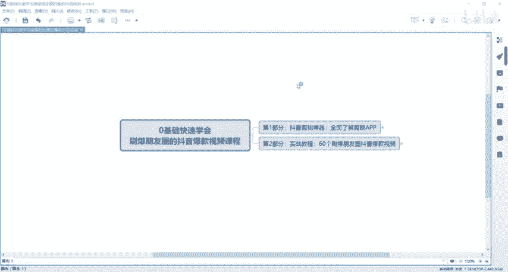

那么我们的课程大纲呢一共是分为两个部分。第一部分呢是我们的基础部分。在第一部分当中，我们主要讲解的是抖音剪辑神器，全面了解剪映APP。那么我们知道现在是进入一个短视频的时代。

很多小白或者说对短视频感兴趣的网友在刷视频的时候，会经常看到一些刷爆朋友圈的那些爆款视频，那些爆款视频是怎么样做出来的呢？对于那些没有剪辑技术，不会拍视频或不会剪视频，用户来说是一个非常头疼的问题。

那么这个问题怎么解决呢？学了我们这堂课程，了解了剪映APP之后呢，你也可以设计出或者制作出这样的爆款视频。这是我们讲的第一部分。在第二部分当中呢，又划分为三个小节。

第一节呢是带领大家快速的认识剪映APP剪映APP是什么？

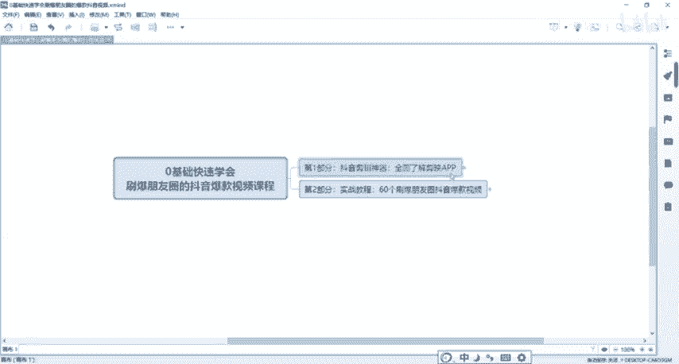

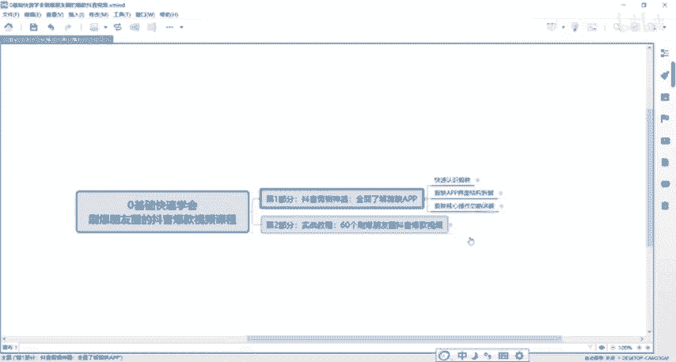

那通过剪映制作短视频的优势有哪些呢？第三个就是哪些人适合用剪映做短视频，这是我们第一小节。第二小节的话是跟大家讲解的剪映APP界面的一个结构拆分。那么我们要学习剪映的剪辑。

那肯定要了解剪映APP它的整体结构，它划分为哪些模块和功能，每个模块都包括了哪些啊，我们需要给大家拆分出来，然后给大家详细的介绍一下每个模块下的内容和功能。

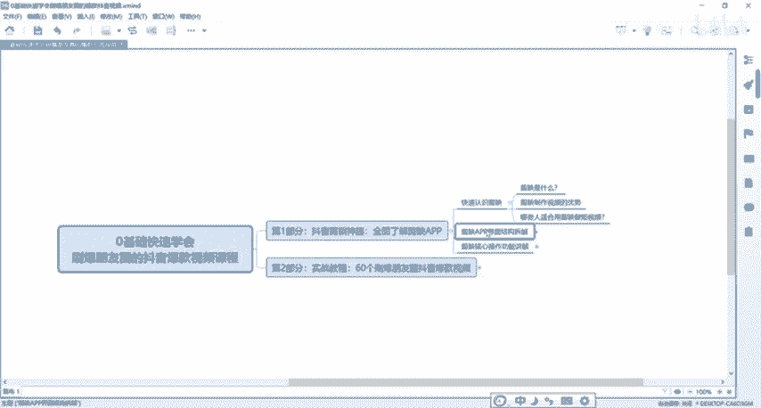

总的来说，剪映APP呢界面结构比较简单啊，一共是划分了4个部分。第一部分呢是我们常规的剪辑。在剪辑这一块的话，我们所操作的所有视频剪辑基本上都是在这个地方啊，也是我们整题课程当中的一个核心。

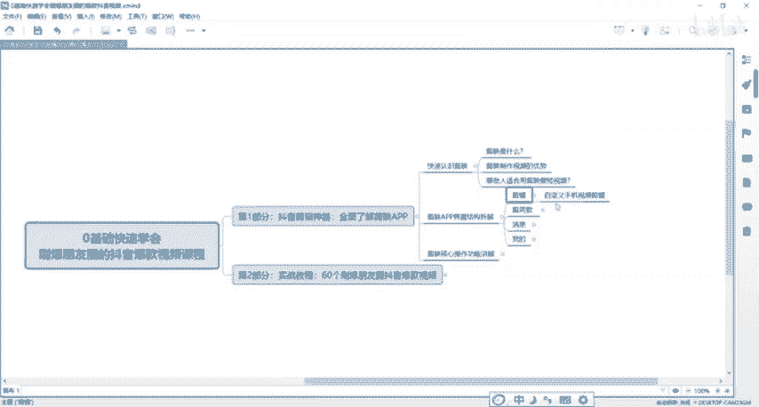

第二个呢是简铜款。

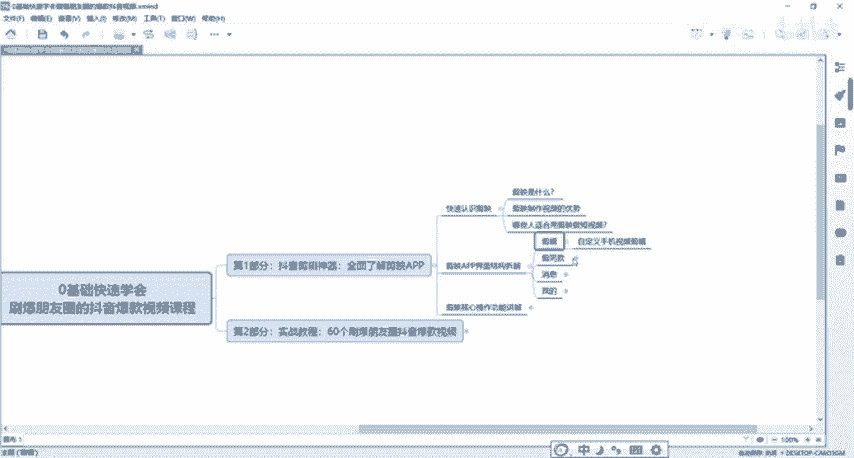

简同款是什么意思呢？我们在网上看到很多爆款的视频。那么对于小白或者是新手来说啊，他不会剪辑，或者说没有这样的一个剪辑的技术。那怎么办呢？我也想做这样一款爆款视频。那么好。

简验APP呢它推出了剪同款这样一个功能。也就是把一些市面上我们看到很多刷爆朋友圈的爆款视频，做成一个视频模板。那么我们只需要填充我们相应的视频素材进入到这个模板当中。

就可以一键快速的制作出这样的爆款视频。这是剪映APP当中一个非常nice的。技术点减同款。那么我们可以通过减同款之后呢，快速的制作出相应的。爆款视频。第三个呢是消息。我们知道剪映啊。

它是作为抖音官方推出的这样一个剪辑神器。那它必然是和剪。它必然是和什么抖音相关联的。当我们登录自己的剪映APP的时候，如果说我们授权登录了自己的抖音账号，那么就可以实现我们在抖音上的相关消息。

比如说官方发布的消息呀，你收到的点赞呀，粉丝的留言呀等等，我们是可以通过在剪映当中同样是可以看到的，这是这一块看到的消息。

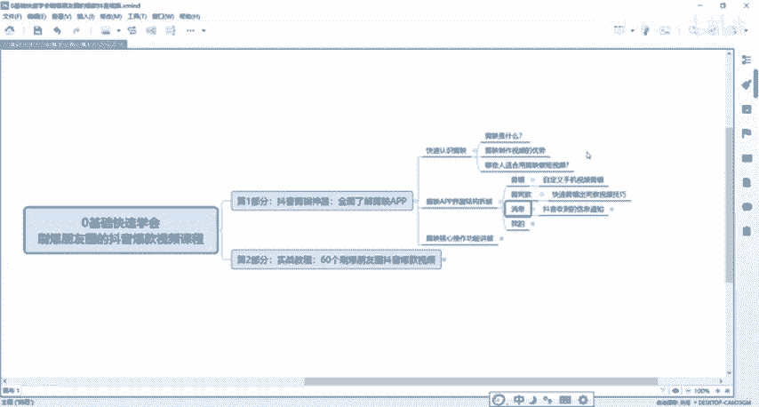

最后一个就是我的就是我们个人信息账号的一个展示。那这块的话，只有当我们把你的抖音号和你的剪易号打通之后，就是关联之后呢，我们抖音上的账号相关信息页内容也会在你的剪映上展示出来。

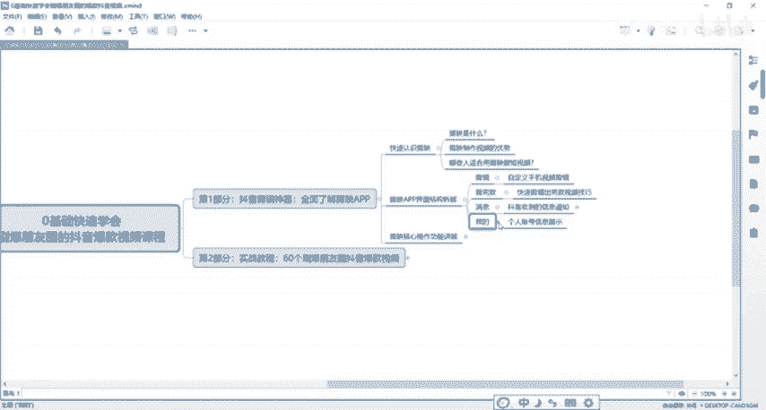

那，这块是给大家讲的第二小节，剪映APP界面的结构拆解。第三个小节的话，也是我们第一部分课程当中的重中之重剪映核心操作功能的详细讲解。那在这个部分当中呢，我们将展开来围绕剪映当中的剪辑功能。

把剪映当中核心的十五大功能，给大家拆开来。每个小节挨个给大家详细讲解每个功能的使用方法和技巧。那我们了解这些功能和技巧是方便各位小伙伴在今后我们开始创作的时候呢，才能灵活的运用这些功能。

才能明白这个视频制作的逻辑和原理。

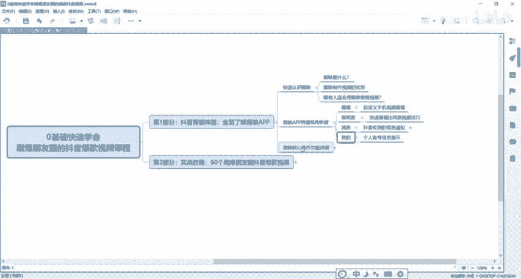

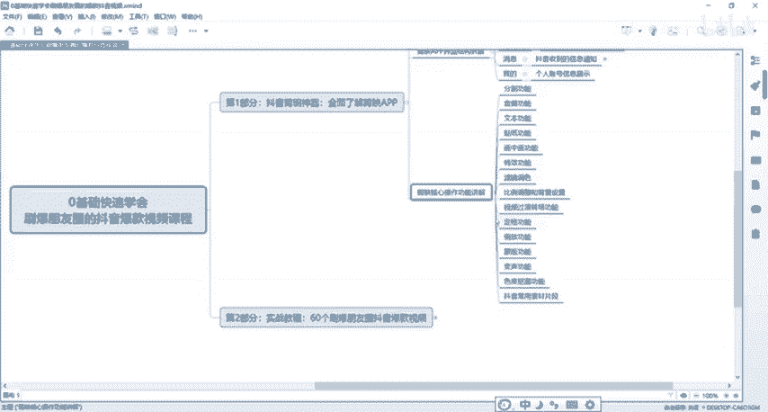

和他的方法。那如果说我们不了解这些功能和使用方法，那么后期即便老师在操作相应的实战案例当中，那你可能也不理解它的一个设计的原理和使用的方法。所以这一块我们讲解到核心操作功能的时候啊。

是我们各位小伙伴一定要重点去认真听的。

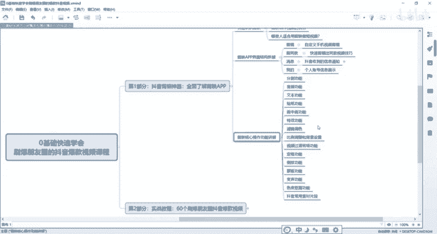

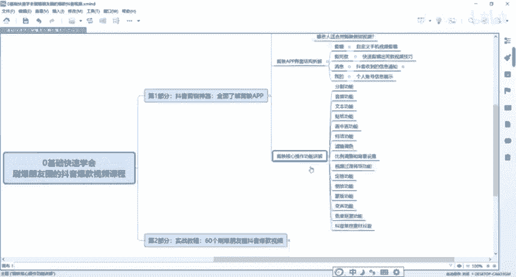

那在这块主要包括了剪映的十五大核心功能，分割音频文本、贴纸、画通画、特效、滤镜比例调整和背景设置，视频的过渡转场定格倒放蒙版变声色度抠图以及抖音常用素材片段的寻找。这是我们整理了市面上目前来说剪映。

剪辑视频过程当中运用最多最多的。

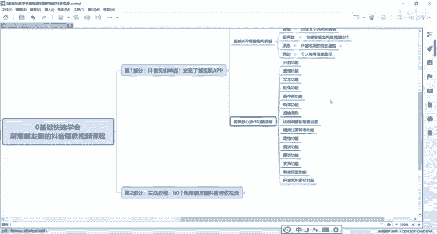

这15项功能。如果说我们把这15项功能掌握了，那么后期我们再制作各式各类。视频的时候呢，都可以得心应手的按照我们的要求和需求呢来使用其些功能来完成，或者说帮助我们制作出这样的视频。

O那这是我们第一部分关于抖音剪辑神器全面了解剪映APP这个部分呢给大家介绍的内容，一共是这三个小点。那第二部分，也是我们课程当中的核心亮点。

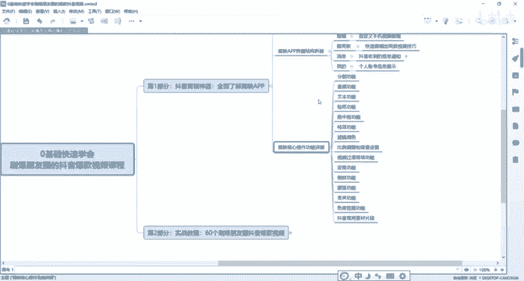

实战叫情。纸上得来终结权绝知此事要躬行。那么我们也是把市面上目前特别火爆的60个抖音爆款视频的教程拿过来跟大家详细分享和拆解这个视频的一个制作方法和它的制作的流程。那在这个环节当中呢，我们把每个。

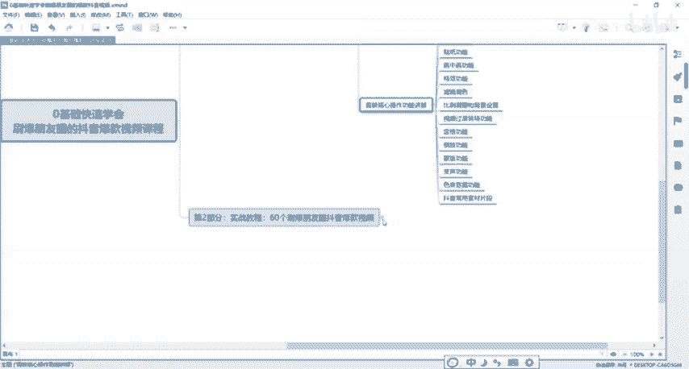

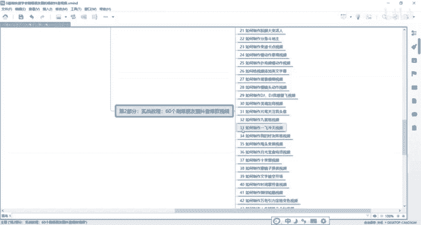

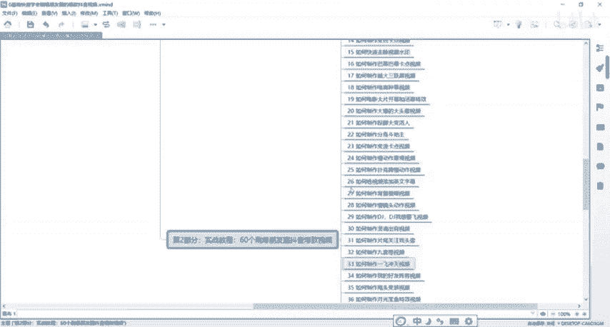

视频案例呢单独拿出来给大家详细讲解，拆分成小的案例，也是希望大家在学习的过程当中能够结合这些案例，然后呢融汇贯通。那么我们后期自己在拍一些或者是制作视频的时候才能得心应手。制作出我们看到朋友圈也好。

或者抖音上那些点赞量超级高的火爆视频是如何制作出来。那么通过这堂课，或者是通过我们整个零基础快速的学会啊，刷爆朋友圈的什么抖音爆款课程啊，尤其是我们第二部分这60个。

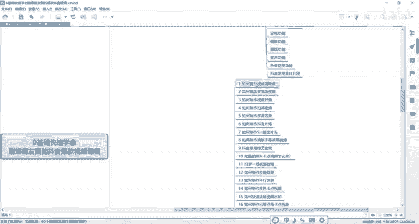

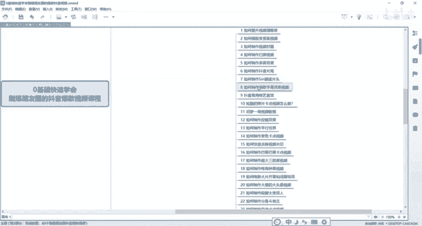

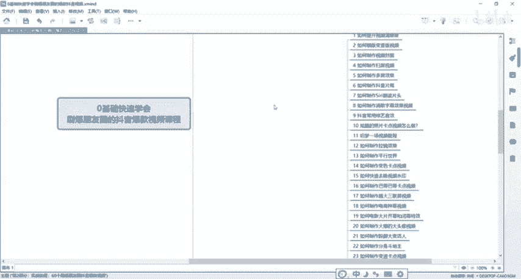

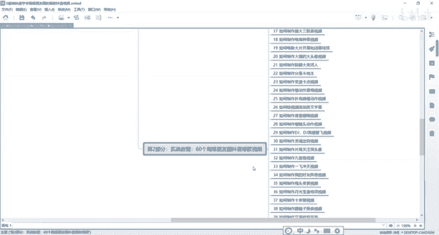

抖音爆款实战案例啊，比如说。如何横版变速竖版啊，如何制作视频封面啊是吧？如何制作扫屏的视频呀，如何制作这个siri朗读片头啊，还有包括呃绚丽的照片卡点视频呀，以及什么旧梦一场最近特别火的一个卡点视频。

还有我们看到的什么？

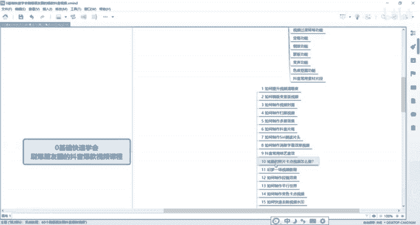

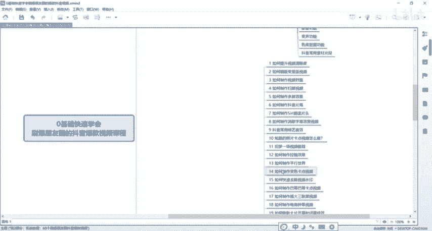

去除水印啊、变色卡点呀啊超火的三连屏以及什么电商种草类的视频，还有我们看到的分身斗地主啊等等等等这一系列的实战造程。那么我们相信各位小伙伴在学习过程中，如果说真真正正学会了这60个教程。

或者说这堂课程之后呢，我相信各位小伙伴也能成为。

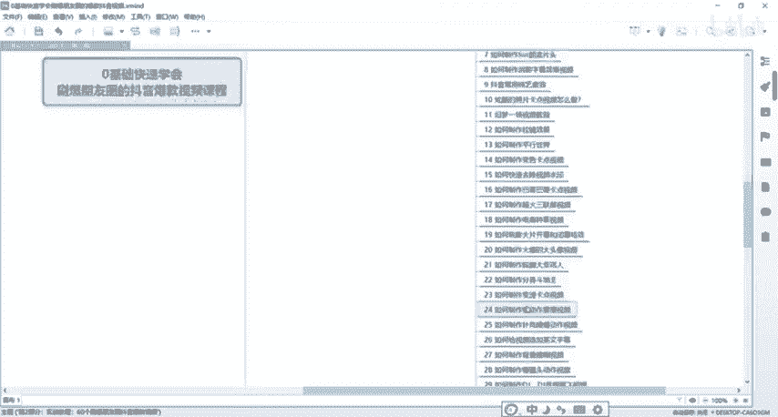

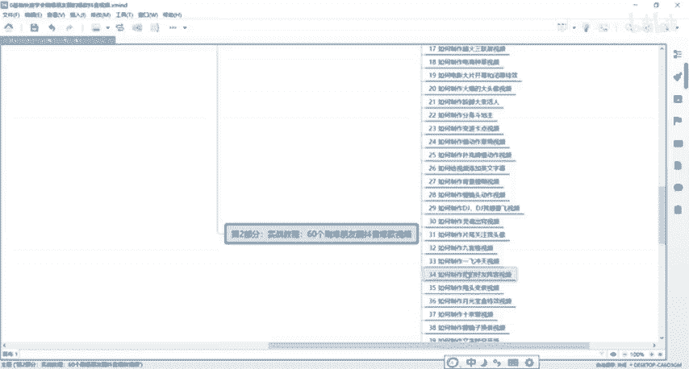

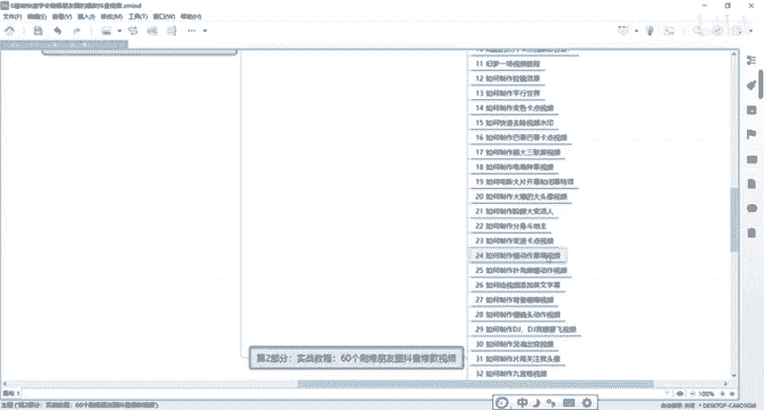

剪映剪辑高手，或者说我们看到的视频拍摄和剪辑的高手。对于那些特别想玩短视频，或者说想拍视频，在抖音上火的或者涨粉的来说的话，是一个非常好的啊这样一个课程。

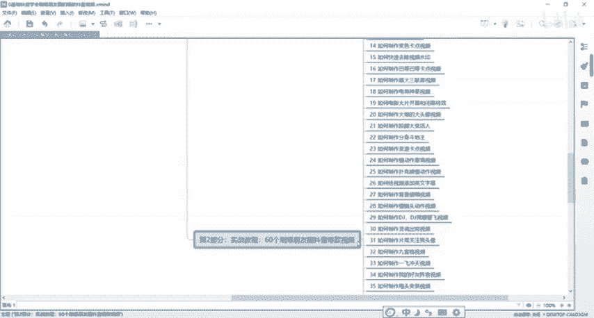

OK那这一块的话是给大家简单的介绍了一下我们整体课程的一个大纲结构内容。那接下来的话，我们将围绕这两部分内容展开来详细跟大家讲解。好了，本节课程的内容呢就跟大家分享到这里，好好学好好看，我们下期再见。

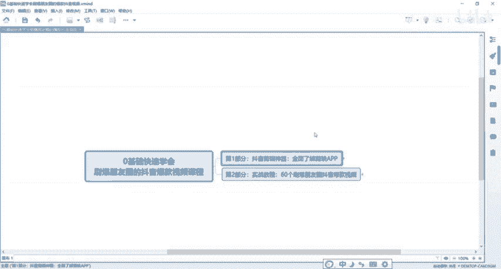