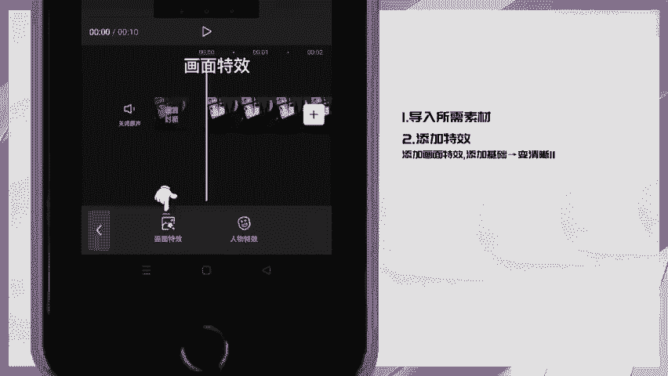

# 剪映手机版教学全新版本，学视频剪辑做视频号运营必看的剪辑零基础入门教程 - P25：4.【手机剪辑】特效卡点视频 - b财神保佑我 - BV1MasZeeEk9

🎼这种炫酷的效果是怎么做的？😊，🎼让我来教会你们。🎼首先导入一张图片，拉长至9。7秒，再开头点特效。

🎼画面特效选择基础里的变清新2，点击音频。

🎼选择抖音收藏的音乐。😊，🎼将音频多出的音乐分割删除掉，选择音乐点踩点自动踩点选节拍2、找到4秒后的小黄点点立镜，选择黑白里的江浙沪。😊，🎼分割滤镜删除前半段。🎼当前位置添加两个特效。

光里的发光和动感里的闪白，把闪白缩短。😊，🎼点击画众画。🎼导入花瓣素材，放大对齐照片，点混合模式。😊，🎼选择绿色。🎼一起看看效果吧。🎼不と。🎼りちゃと。嗯。

