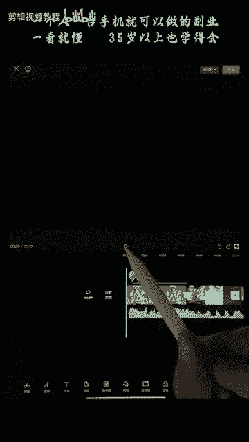
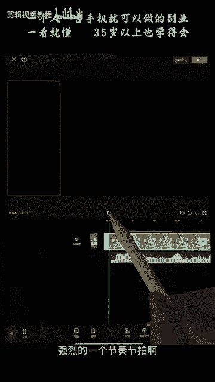

# 剪映手机版教学全新版本，学视频剪辑做视频号运营必看的剪辑零基础入门教程 - P44：【手机版】文字动画功能介绍 - b财神保佑我 - BV1MasZeeEk9

hello，大家好啊，我们这一节课呢是对我们的动漫分屏的一个加强训练加强训练。我们来看一下今天的一个实战案例。

啊，我们是专门为索隆对吧？索隆啊，就是我们海贼王里面的一个角色做的一个视频啊，后面呢就可以放他们打斗的一个对吧？这一个索隆的一个精彩画面放到后面来，后面来啊，那么我们前面呢也学过了，对吧？啊。

我们怎么操作呢？我们来给大家再演示加强一遍啊，我们首先点击开始创作啊，然后呢，将我们的这个动漫视频先给它导入进来，点击添加。然后我们去选取我们海贼王的这个片段啊，后面的就不需要了，后面就不需要了啊。

给它裁开。啊，后面这一栋我们不要了，删除掉删除掉。啊，那么这一个呢动漫角色的一个视频就被我们剪出来了。接下来呢我们就点击添加图片，对吧？点击照片，将索隆的4张图片啊给它添加进来。4张图片。

接下来呢我们将4张图片平铺在我们的这个横屏视频上面呢，每一张图片呢都需要1个5。8的一个比例，对吧？我们先选中这一张第一张图片，点击下方的编辑。点击下方的裁剪啊，然后呢去选择这个5。8这个比例。啊。

然后去移动调整这个人的位置啊，调整人的位置。好，给它勾选一下。第二张图片呢也是同样道理，点击编辑裁剪5。8啊，去调整它的位置，让人物居中一点啊，这张也是一样的，编辑裁剪5。8。

这里的话我们可以看到这个锁隆呢就靠右了，对吧？啊，这边的话我们不要这个人不要这个人，我们可以这样给它移动过来。好，点击勾选，我们看一下，我们就得到了这样的一张图片。还有后面的这里也是一样的，编辑裁剪5。

8。好，我们将锁隆放到中间来勾选，我们就得到了4张同样比例的一个图片啊，接下来呢就将它切换到我们的画中画白。啊，希望到我们的画动画。啊，切换画中画。啊，这些视频呢这些图片呢都去切画中画。

然后将它挪到我们的最前方那个地方来。啊，给他们排列好排列好。啊，这个时候呢我们四张图片就已经好了，对吧？哎，那我们刚刚看到我们的视频中呢，它是前面底部是黑色的，对吧？我们可以怎么操作呢？啊。

这个时候呢大家一定要灵活运用，灵活运用。我们可以先将这个图片啊，给它切到主轨道上面去，切换到主轨道上面去，点一下好，这个时候呢我们可以看到我们的后面呢就是黑色的背景啊，对吧？啊。

因为我们的图片呢切到我们的主轨道上面去了。我们的图片写到主轨道上面去，我们先给他们排好排好。啊，每个图片呢都按顺序去给它拍好。啊，给他们调整一个好的位置就可以了。

这里的话我们就不需要去啊啊这里就不需要去做一个层级的排列啊，层级排列我们只要把他们排列排班好就好了啊，给他们排好。啊，那么接下来如何操作呢？啊，我们也是同样的道理，对吧？啊，进入画中画啊。

对这一个图片添加一个动画。入场动画对吧？我们这里呢上节课是加了一个从上往下拖动的对吧？我们这里呢给他来一个更激烈的效果，激烈的效果。我们有一个。向右下甩入，看到没有？右下甩入。

我们也看到啊它有个很快的一个速度，我们来看一下0。5秒行不行？这里加错了对吧？啊，重新选一下啊，加错加成了动感放大，对吧？啊，我们可以重新点击点击就可以了，重新点一下就可以。我们来看一下效果。啊。

这样的话它就有一个这样甩进来的一个效果，对吧？甩进来的一个效果。同样的道理啊，为我们每一个视频呢都去加一个由向右下角甩入啊甩入。的一个效果对吧？像右甩入。动画。好，那么呢我们可以看到它是四个视频。

同时同时甩入进来的对吧？我们要按照这个音乐的节奏，对吧？啊，我们要按照一个节奏啊来对他们进行一个先后顺序的对吧？啊，有快有慢啊，有快有慢。好，那么我们先给它放大一下，放大啊，也是按照这一个顺序啊。

每隔10个F，对吧？啊？也就是我们时帧左右啊，时帧对吧？这里有时帧啊，从左到右啊，记得是从左到右啊，依次去甩入进来啊，接下来是这一个啊，接下来是这一个。啊，最后才是我们的这个图片是吧？Oh。

我们来看一下。对吧它就有一个依次甩住的一个效果。啊。我们后面的视频是有声音的哈，后面视频是有声音的，我听一下。啊，所以我们先给它静音一下啊，点击音量，给它音量调成0。调成0对吧？然后呢。

我们将这些图片去给它对好。啊，返回一下。给他们的长度呢给它对齐对齐。啊，接下来呢我们可以选择我们的音频，对吧？啊，将刚刚的那个视频的一个音乐给它提取进来，提取音乐啊，将这一段视频呢提取进来。好。

点击提取它的声音啊，将声音呢拖到我们的最前面来，前面这里没有声音的就给它去掉啊去掉。我们来看一下效果。这里呢我们可以听到音乐哈，听音乐一定要跟着音乐的节奏来。他这里开始唱歌了对吧？

我们前面是一个比较强烈的一个节奏节拍啊，然后到这个地方呢开始唱歌，我们再出现画面，这里一定要去调整好。

啊，多余的音乐呢我们就给它剪切掉就可以了。删除，然后大家还记得呢，我们给它加一个淡化，对吧？啊，淡出啊，这个前面也是有讲到的啊，就是音乐慢慢的变小声的一个过程。音乐慢慢变小声，对吧？就不会很突兀。好。

那么这一节课呢就是我们动漫分屏效果的一个加强的一个练习，加强的一个练习。希望大家课后去多多练习和练习。

