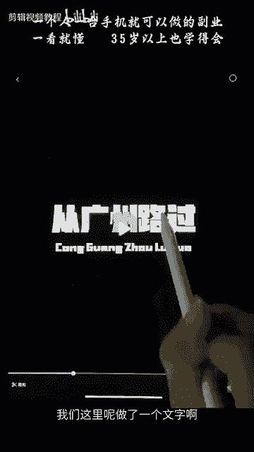
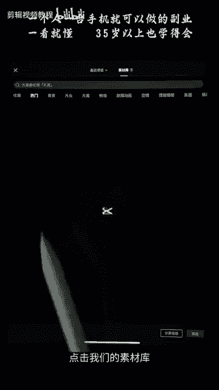
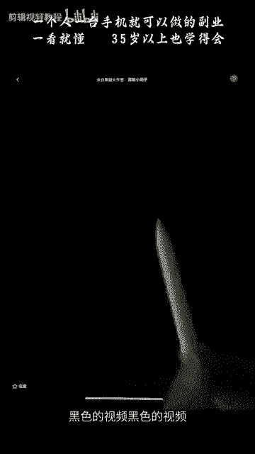
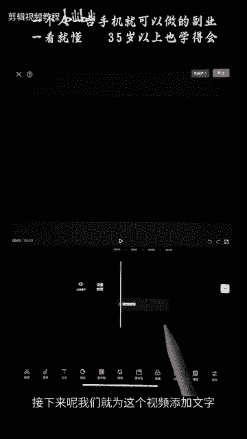
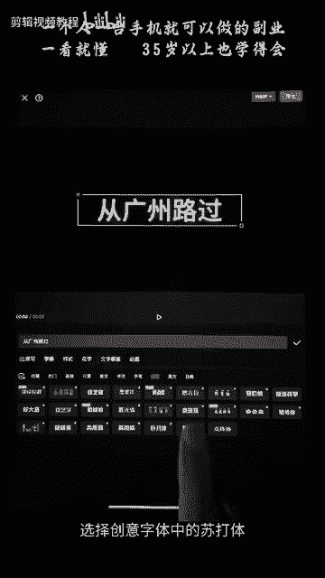
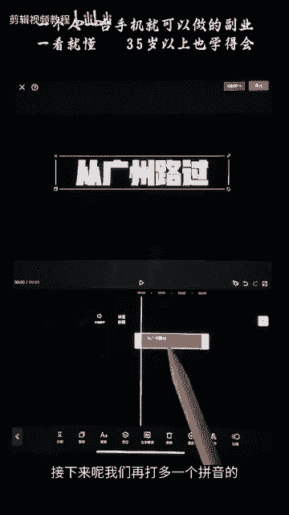
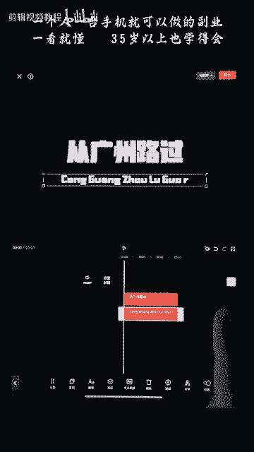
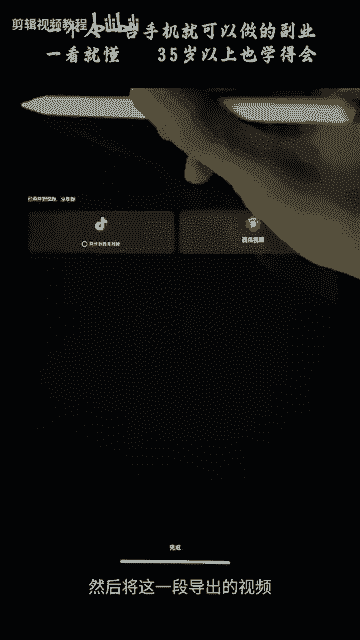

# 剪映手机版教学全新版本，学视频剪辑做视频号运营必看的剪辑零基础入门教程 - P52：【手机版】人物遮挡文字的片头效果 - b财神保佑我 - BV1MasZeeEk9

hello，大家好，欢迎来到我们画中画篇章第四节课的学习人物遮挡文字效果。我们来看一下这一个效果如何制作。人物呢从我们的这一个文字前面穿过去。我们来看一下如何制作。点击开始创作。

将我们人物走路的视频点击添加到我们的视频中来。选中这一个人物走路的视频。滑动我们下方的菜单。点击复制。好，这样的话我们就两段视频了，两段视频选择后面这一段视频。滑动添加我们的画中画。

将它变成我们的画中画图层。然后长按给它拖到我们的前面来。和上面的这一段视频呢对齐对齐。接下来呢我们选中下方画中画图层。点击抠下，点击我们的智能抠下。这个时候呢这里就显示正在抠项中。好，抠项成功。

我们勾选一下。这样的话呢我们就得到了我们选中这一个画中画啊，这样的话我们就得到了这样的一个人物被抠出来的一个图层。啊。接下来呢我们只需要把文字放在我们这个被抠出来的人的后面就可以了。我们点击新增画中画。

将我们的文字，我们这里呢做了一个文字啊，将我们的这个文字视频点击添加到我们的这个视频中来。

接下来呢我们只需要选中这个文字。点击层级。将这一个我们的画中画，将这个文字放到我们刚刚抠出来的这个人物，就是这个画中画这个人物的图层给他放到他后面去，对吧？这个让他在下面这个在上面。好。

勾选这个的话是我们前面篇章有学习过的层级关系。现在的话我们来看一下这个文字。啊，这里是一个人。选中啊，这里是文字。现在呢文字呢就是处于我们的人，这里是背景，这个是背景。

这一个是我们被抠出来的人被抠出来的人。我们可以看一下。没抠出来的人呆这。文字呢是在中间的文字是在中间的。然后我们只需要把这个人给它挪到了这里盖住它。这样的话我们就看出来是看起来是人物在这一个字体。

从这个字体前面穿过去的感觉。接下来呢我们看到这个文字呢，它是有一个黑色底的。我们选中这个文字之后呢。我们就放大一点先放大一点先。选中这个文字之后，我们这里下方有一个叫做混合模式混合模式。我们选中它。

选择我们的绿色。绿色呢就是把黑色过滤掉，留下白色。我们勾选一下，我们可以看到。现在的话文字就已经被抠出来了。文字就已经被抠出来了。它只留了这个白色的黑色部分呢。

已经被我们刚刚绿色混合模式中的绿色把黑色绿掉了。好，接下来的话我们只需要制作一个，我们先将文字拖到后方来后方。我们然后把。然后我们把时间轴拖到文字最前面这个地方，拖到文字最前面这个地方。

点击添加一个关键帧。然后拖到文字最后面的这个地方，将文字往后挪动，往后去移动它啊，不要移动到其他地方，选中文字去移动我们的文字，将它移出去。这样的话呢我们就获得了这样的一个动画。文字呢从右边走到左边。

然后搭配我们抠出来的这个人，这个人呢抠出来他是处于最上方的，所以就形成了这样一个效果。就形成了一个它从文字啊，好像文字是处于它下面的感觉。这就是我们第四节要学习的一个内容。

我们要了解的一个点就是图层的一个关系，图层的一个关系。人被抠出来的这个人物呢，他是处于最上方的最上方的。原先呢我们的人是走路是这样的。原先是这样走路的，我们加了个文字在它上方，在这个人物上方。

在背景的上方。接下来呢我们又抠多了一个人出来用智能抠下，抠多了一个人物。给它放到上面。那么看上去呢，就是他从文字的一个前方走过。好，我们还学习了绿色。就是将将黑色滤去留下白色。

我们刚刚这个视频呢是黑色底的白色的一个文字，那么它黑色就会被过滤掉。我们来看一下另外一种情形，如果这个文字呢它是黄色的，那么它就会被抠抠掉。这里的绿色呢仅限于我们的。黑白黑底白字，如果是其他颜色的字呢。

它就会被抠破。我们来看一下。我们选中这个视频给它替换掉，我们给它选一个黄色的字体。给他替换一下，我们看看。现在呢我们可以看到这个黄色的字体呢，它被破坏了。我们的绿色混合模式的绿色。

它只能使用白白字黑底白字黑底。如果是其他颜色的字体呢，它就会被破坏。这一点是大家需要掌握的。好，接下来呢我们的文字是如何制作的呢？我们在这个地方点击开始创作。点击我们的素材库。

选择一个黑色黑色的视频，黑色的视频给它添加进去。

好，接下来呢我们就为这个视频添加文字，点击文本。

新建文本输入我们需要的字体。比如说从广州路过。选择创意，我们点击字体，选择创意字体中的苏打体。

苏大题。将它大概放大一点点放大一点点。放到上面一点的地方。勾选接下来呢我们再打多一个拼音的，点击这个文字图层，我们可以给它复制多一层。

放到下面这个地方来。好，然后我们还可以编辑它，给它写成拼音的。好，将它缩小一点，缩小两只手滑动缩小啊。将它这两边呢对齐我们上方的文字，对齐我们双方的文字。勾选。勾选一下。

这样的话呢，我们的文字就制作完成了。接下来我们只要导点导出。然后将这一段导出的视频。

导入进我们刚刚导入进我们刚刚这个地方就可以了。接删除。新增画中画这一段呢就是刚刚我们在那里创作的一个字体。点击添加。好，我们给它移到前面一点点的地方。选中它点击我们的成绩。将我们的画中画呢放到我们。

将我们文字的画中画放到我们人物后面。勾选。接下来呢我们将这个黑底白字记住，一定是黑底白字，选择混合模式，选择我们的绿色。这个时候呢它绿色呢才能够不会破坏我们的字体勾选。好，给他放大一点。

大家跟着我一步一步来做。啊，我这里多打了一个啊，大家不要学我啊，路过啊过啊，这后面的话可能导出的时候出错。然后我们给它打上关键针。前面的时候字体是在右方的。选中字体，字体是在右方的。

对吧然后我们只要把后面。给它放到画面外去。然后呢，拖到字体的最后面这个地方，拖到最后面这个地方，将字体呢挪到我们的左边。啊，不要拖动人选中字体。将自己磨出去。那么我们的视频效果就完成了。

