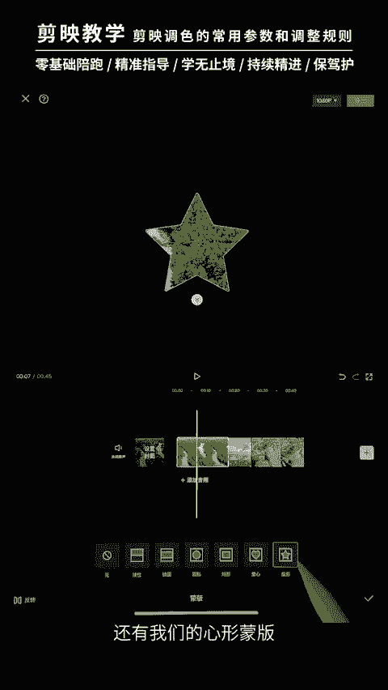
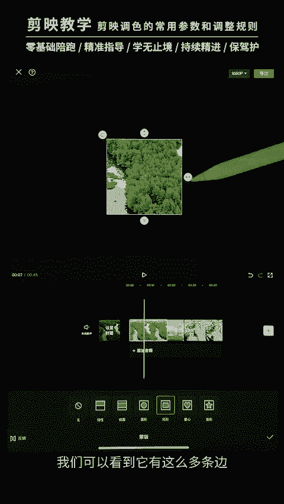

# 剪映手机版教学全新版本，学视频剪辑做视频号运营必看的剪辑零基础入门教程 - P54：【手机版】蒙版原理讲解：三分屏片头效果的制作方法 - b财神保佑我 - BV1MasZeeEk9

hello，大家好，这一节课的话我们来学习我们新的篇章蒙版篇章的一个课程学习。我们先来看一下我们蒙版的一个原理啊，并且做出这样的一个效果。好，我们来看一下这个案例是如何制作的。我们点击开始创作。

点击开始创作。将我们的视频中呢给大家提供了三个类型的视频。首先是我们的沙漠。还有我们的这一个草啊，我们的森林，还有一个是我们的冰山冰山。这样的话，它们的颜色呢对比是比较鲜明的啊，有沙漠，对吧？啊。

还有我们的这个森林。还有我们的这个冰山啊，三个颜色呢看上去会更搭配一点，更搭配一点。啊，那么我们来看一下什么是门板啊，我们先把这个沙漠放到后面去。啊，门板。首先呢我们选中这一个视频。

下面呢这个地方有一个叫做门板的。我们点击它。那么我们可以看到这里面有线性文把。镜面门板圆形门板、矩形门板、爱心门板，还有我们的心型门板。

看了我的演示之后呢，大家应该很能够清楚的看到门板呢其实就是加一个图形，将我们的这一个视频给限制在这个图形里面，外面呢就不显示，外面就不显示。好，这个就是我们的门板，那么门板它的一个作用是怎么样呢？

比如说我们添加一个矩形门板。我们可以看到它有这么多条边。

啊，它这里呢箭头代表着我们可以拖动左右去放大它。上面这个箭头呢，我们可以上下放大。这个呢是可以添加一个圆角的，我们来拉动一下它看看啊，拉大它就变圆角啊，拉小它就变尖。对吧那么下面这里呢拉大啊。

它的边缘呢就会有一个渐变的一个过程，由不透明变到透明的一个过程。啊，这个就是我们的羽化啊羽化啊，前面的课程呢也有给大家提到了对吧？啊，那么这节课呢我们用到的是这个镜面文板，镜面文板。

我们添加了这个门板之后呢，我们是可以去移动它的。移动啊，移动到你想要的那个画面，移动到大家想要的那个画面，我们也可以双手放在这个地方啊，对这个门板进行放大啊，对吧？放大还可以旋转，看到没有？

旋转放大旋转啊，旋转呢上面是这里会显示度数的。比如说我们这一节课要制作的就是我们的35度。啊，我们选择1个35的这个度数。然后呢，我们将这个视频放大。啊，一定要记得啊把这个度数把握好把握好好。勾选一下。

接下来呢我们将我们的冰山，还有我们的沙漠啊，将它们切换到我们的画中画来。啊，选中它。点击切画中画。点击。企业化动化。好，那么我们就得到了这样的三个视频。啊，将它们的长度呢先给它调成一致。

将它的长度都调成一致。啊，那么接下来呢我们将我们的冰箱啊，我们先把沙漠给它移移动啊，我们就得到了三个视频，对吧？他们是叠在一起的叠在一起的啊，接下来呢我们就对这个冰箱呢啊也去给它添加一个我们的门板。好。

点击添加我们的门板啊，选中它，然后点击下面这里有门板。啊，我们也去给它添加一个镜面门板啊，镜面门板啊，勾选一下。大家可以看到我们的这一个门板呢在这里在这里。啊，我们也去旋转它的度数。

门板的度数给它调整到我们的这个。35度啊，让他跟我们下面的这个视频呢是平行的，它的边是平行的对吧？啊，然后我们可以选取一下，比如说我想要多一点冰面呢，我们是可以在这门板里面去移动的。啊。

你要选取画面的时候，是可以在这个门板里面去移动的啊，然后放大一点，对吧？如果你在外面呢是移动的话，是整一个视频移动整一个视频移动。所以大家在门版里面去选取画面呢，一定要在里面啊这样去拖动去选择。

在外面呢拖动的就是整一个视频了，整个视频好，我们将它对齐放在这个地方。啊，放在我们的这个树林的上方。接下来呢这个沙漠呢也是同样的道理啊，给它加一个镜面门板，对吧？大家可以看到啊，我们先给它放到外面来。

放到外面来。啊，对这个门板呢也是进行1个35度的一个旋转。啊，这里不一定说全都是35度，但是要让他们三个的度数保持一致，保持一致啊，这个是比较关键的，不然的话它们的边缘就不会对齐了。好，给它勾选一下。

将它挪到我们的右下方这里来，右下方。啊，这样的话呢我们的一个简单的一个拼凑就已经完成了，对吧？我们的视频拼凑就完成了啊，第一步呢一定是先去做画面，接下来再来做动画，接下来再来做动画。好。

我们为这一个视频呢添加了一个入场动画。我们选择这里的一个啊。动感缩小啊，这里我添加的是一个动感缩小。我们来看一下。啊，动感缩小对吧？啊，然后将它的时长呢可以拉多一点。比如说我们拉到4秒。啊。

4秒左右对吧？啊，4。1也可以啊，4。1啊。你们精细一点的话，就去拉到4秒也可以啊。这个根据自己的感觉来。勾选一下。那么接下来呢就为我们冰商啊，它有一个从左右到啊从左到右的一个过程，对吧？啊。

或者说从上到下也可以，我们点击添加动画。给它加一个我们从啊向右滑动啊，向右滑动对吧？啊，时长呢也是记得去给它拉长啊，拉到我们的四秒啊，跟我们的都保持一致啊保持一致。啊，或者说再短一点吧。

这里感觉效果会更好一点啊。啊，4秒吧4秒吧，勾选沙漠呢也是同样道理。去添加一个啊，这个时候呢它是往左边移动，我们这里是从右向右滑动，这里就要向左滑动。我们给它选择一个向左滑动的。向左滑动。啊。

时长呢也是去给他拉啊，跟他们一样长，跟他们一样长4秒。那么我们就得到了这样的一个效果。对吧啊，接下来呢我们就去给他添加上它的音乐啊，这里的话音乐的话，我们这里有准备了一首音乐。

大家也可以根据自己的喜欢呢去添加。我们这里。啊，是这一个。啊，添加一首比较符合大自然的一个音乐啊，给它添加进来。啊，接下来呢我们就要添加一个文字了。

大家呢可以在我们的最最外面的这个里面呢点击一个这个贴纸啊，贴纸。搜索山海啊，山海我这里已经有搜索过了，大家可以输入文字山海。啊，那么我们就看到了这样的一个文字啊，点击一下。好。

那么文字呢就被我们添加进来了啊，这个贴纸就被我们添加进来了，我们可以给它放大一点。放到中间这个地方来啊，对齐中间。啊，然后去给它放大。啊，放大到这一个比较合适的一个大小，合适的一个大小，对吧？

有冇其他注重意啦。好，然后呢我们这个森啊我们这一个森林，还有这些呢出现到这里的时候呢，我们的文字就出现了，对吧？文字就出现了，我们来看一下。啊，这样的一个片头呢我们就做好了，对吧？我们还可以拉长一点啊。

这个上海的文字啊，制作好了之后呢啊我们怎么样呢？我们记得先去导出它，记得先去导出它。然后后面再去加视频，再去加视频啊。因为在这个地方呢加视频的话，我们加一些转场什么的，会受到影响。所以大家做好片头呢。

先去给它怎么样导出一下。

啊，先去给它导出啊，点这里导出啊，然后呢再去添加你们自己的后面的一些视频，后面的一些视频。好，这一节课呢我们就学到这啊，大家记得去掌握好门版的一个使用，门版的使用。

