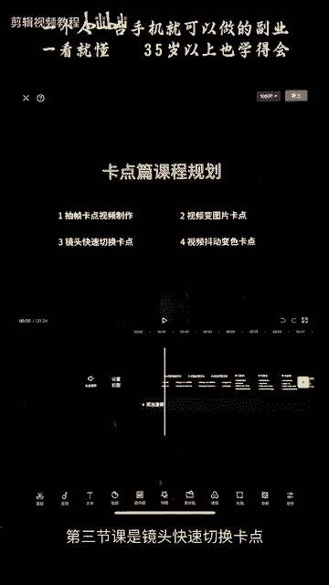
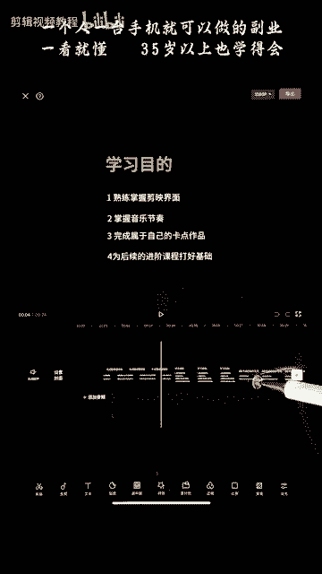
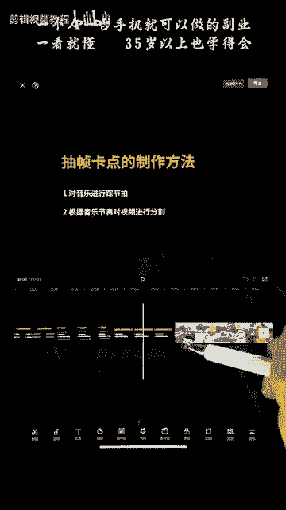
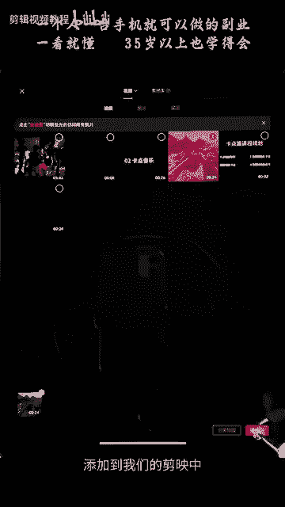
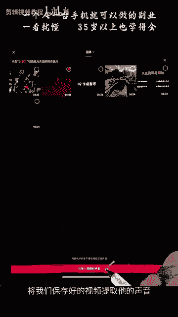
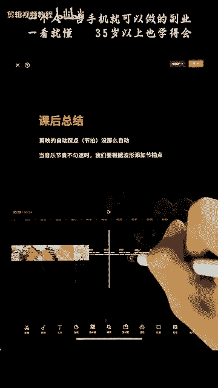
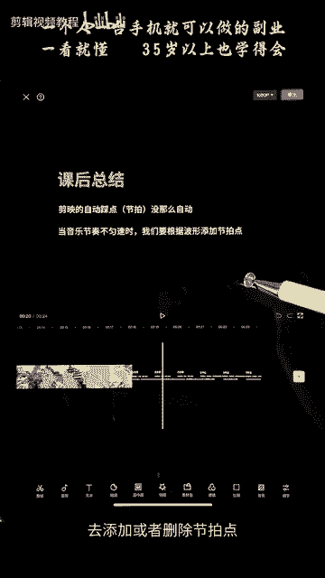
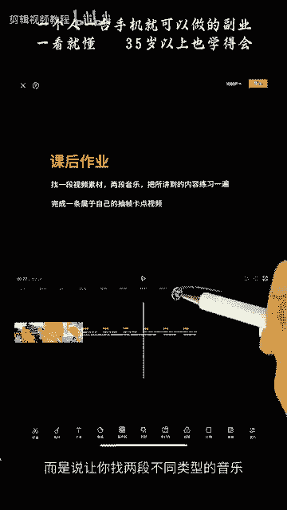
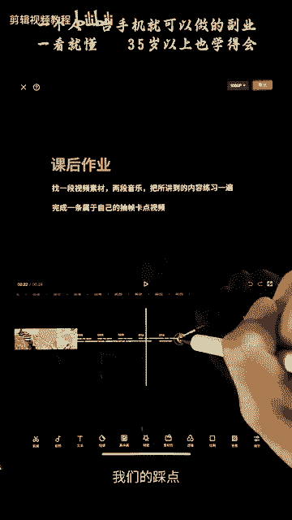
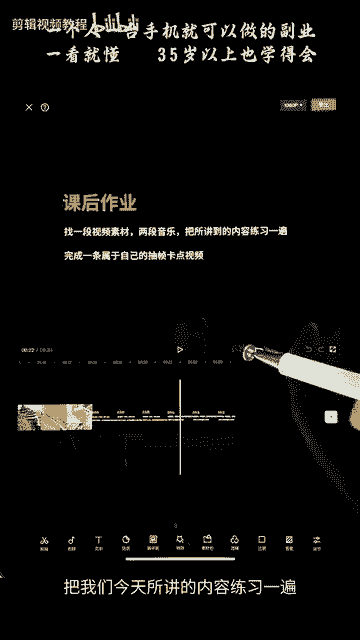

# 剪映手机版教学全新版本，学视频剪辑做视频号运营必看的剪辑零基础入门教程 - P55：【手机版】卡点抽帧的制作方法 - b财神保佑我 - BV1MasZeeEk9

hello，大家好，欢迎来到我们卡点篇章的课程学习。本次课程分为四节课，第一节课是我们抽帧卡点视频的制作。第二节课是我们视频变图片卡点，第三节课是镜头快速切换卡点。第四节课是我们视频抖动变色卡点。

希望大家能够通过我们卡点篇章的学习，熟练的掌握我们简映的界面。第二，掌握音乐节奏。第三，完成属于自己的卡点视频作品。第四，为后续的进阶课程打好基础。

那么我们来看一下我们本节课的主要学习内容，抽真卡点视频的制作。抽帧卡点视频的制作非常简单。第一步，对音乐进行采节拍。第二步，根据音乐节奏对视频进行分割。不懂没有关系。

我们通过接下来的一个实战案例教会大家。

我们先来看一下案例。首先第一步打开剪映，点击开始创作，将我们已经保存的视频添加到我们的剪映中。点击视频，一定要先选中视频才能点击音量，将音量调成0，点击勾选。那么我们的视频原声就没有了。第二步。

点击下方的添加音频，点击提取音乐，将我们保存好的视频，提取它的声音。

这样的话就把声音导入进来了。我们的音乐点击音乐，点击下方的节拍。就进入了我们自动踩点的一个节拍界面。点击左下方的自动踩点。系统就会自动给我们生成这些黄色的节拍点，系统生成的节拍点。

每一个的间距都是一样的，均匀的分布。我们可以看一下，这里有节拍一，有节拍2，节拍一的话就比较稀疏，节拍二的话就比较密集。我们可以看一下。接拍二都比较密集。我们看一下这个蓝色的这个波形图。

蓝色的这个波形图。最高峰的位置，波形图的最高峰位置就是我们节拍点的位置。我们可以看到我们这个音乐的节拍都是比较均匀分布的，所以我们就用系统生成的就可以。如果你的音乐不是匀速的。

你就需要自己去手动添加点或者删除点在这一个地方。这个的话我们下节课会加强练习。这里的话我们就用系统生成的这个节拍点。点击勾选。这样的话，我们的节拍点就会显示在我们的音乐上面。

第二步呢就是对我们的视频进行抽帧。首先将时间拖动啊，对准我们这个黄色的节拍点，然后对画面进行分割。然后再选择一段进行分割。选择的这一段呢，我们是需要删除掉的，就是抽帧。

抽帧的意思就是将视频中的中间片段删除掉，就是抽帧。抽帧之后呢啊我们点击删除。那么我们可以看到啊，它这两个画面呢就会有一个跳动的效果啊，刚好对上我们的节拍点，就是我们的抽帧卡点。好，对准下一个节拍点。

将这一个视频进行分割，选中跟我们刚刚删掉的那一段长度差不多的视频进行分割，然后将它抽除啊，删掉就是我们的抽针抽掉它。好，这样的话以此类推，一步一步的抽帧下去。啊，我们还有一个更快捷的方法。

就是选中这一个画面进行分割。我们比如要删除到这一个地方，我们可以这样拖动。效果跟我们刚刚分割之后删除是一样的。啊，比如说我们对准这一个节拍点，对这一个地方啊，选中这个画面进行分割。我们要删除这一段。

从这一个地方到这个地方的这一段，我们可以怎么操作呢？我们可以直接把这个地方拖动到这里，那么中间这一段就删除掉了。啊，然后这样的话会更快捷一点。我们选中这一个视频，对准分割拖动。以此类推。

将后面的所有视频画面进行这样的一个抽帧处理。选择视频进行分割拖动。好，然后将多余的视频分割删除掉，多余的删除掉。我们来看一下我们制作的一个效果。好的，这里呢有一个需要注意的地方就是。

我们的剪映自动踩点踩节拍没有那么自动。如果你的音乐不匀速的时候，就需要我们根据一个波形图去添加或者删除节拍点。这里呢给大家布置一个课后作业，找一段视频素材，两段音乐，把所讲的内容练习一遍。

并不是说两段音乐都是放在同一个视频里面，而是说让你找两段不同类型的音乐去进行我们的音乐节奏的卡节拍啊，我们的踩点。

然后完成一条属于自己的抽真卡点视频，把我们今天所讲的内容练习一遍。

