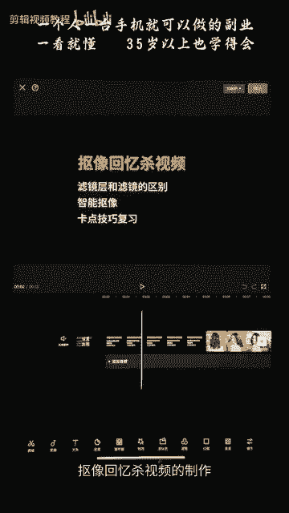
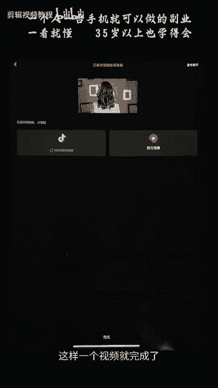

# 剪映手机版教学全新版本，学视频剪辑做视频号运营必看的剪辑零基础入门教程 - P57：【手机版】超火的抠像回忆杀玩法 - b财神保佑我 - BV1MasZeeEk9

hello，大家好，欢迎来到我们画中画篇章抠象回忆沙视频的制作。

今天呢我们要学习到我们滤镜城和滤镜的区别。还有智能抠像，以及我们卡点技巧的一个复习。我们先来看一下这一节课的一个案例。好，我们现在开始制作。点击我们上方的一个开始创作。

将我们的一个视频导入到我们的素材中来，选中它，点击添加按钮，点击。好，这样呢一个视频就被我们导入进来了。我只能先把它的原声关掉，连这里关闭原音，这样的话视频就没有声音。点击添加音频。点击提取音乐。

这样我为大家准备好的回忆杀视频啊，仅导入视频的声音，点击，这样的话就只有音乐被导入进来了。我们来听一下。我们这个画面呢已经是根据这个音乐的一个节拍，为大家剪辑好了。如果你们自己剪辑的话。

我们要根据音乐的节拍来做一个卡点，效果会更好。我们来听一下音乐。噔噔噔噔噔噔噔噔噔噔噔噔噔一声呢，我们就换一个画面，对吧？噔一声换一个画面。🎼噔等等等噔等等等噔等等等噔等等等噔等等等噔等等等。噔一声呢。

我们就换一个画面。好，这个就是我们卡点篇章的一个复习。接下来呢我们点击后方的添加按钮。将我们人物回头的一个视频导入到我们的视频中来，点击添加。好，点击选中这一个人物回头的视频。点击我们切画中画。

点击切画中画，这样呢我们就得到了这样一个上面主视频轨道的一个环境视频。还有我们画中画的人物回头视频。接下来呢我们要根据音乐的节奏，在音乐启示的地方，我们听一下音乐启示的地方。它前面是等等等噔等等噔。

开始的时候，我们将这一个人物视频切成两半。好，我们如何在这里我们看不到音乐的一个波形图，对吧？我们可以返回。返回返回主菜单这个地方，我们就可以看到音乐的波形图。放大它，双手滑动放大。我们可以看到。啊。

我们的音乐是在这个地方。在这个地方开始启示的噔等等噔啊，我们可以在这个地方把视频切成两半，点击我们的画中画，点击这个地方进入我们的画妆画。你们也可以点击下方的画中画，进入我们的画中画画面。

将这个视频一分为2，我们可以点击分割按钮。点击分割，这样的话视频就被分成了两段。接下来呢我们点击后面这一段视频。点击下方的抠下。点击抠像，点击智能抠像。好，这里的话就会显示正在抠像中。我们勾选一下。

这里有个勾选，点击勾选。接下来呢我们就可以看到我们的视频啊，人物被抠出来了，背景就出现了。是这样的，前面这一段呢不用添加智能抠像，后面这一段呢就要添加把人抠出来，就可以做出这样的效果。前面不添加抠项。

后面添加抠项。好，接下来的话呢我们就要为这个背景添加一个滤镜。我们添加滤镜的方法有两种。第一种是选择这一个视频。点击下方这个滤镜。我们选中我们滤镜中的黑白滤镜。添加一个好本滤镜。强度拉到100%。

点击勾选。好，这样呢是添加滤镜的一种方法。另外一种方法呢，我们返回一下，返回返回。好，返回到他没添加滤镜的时候。第二种添加滤镜的方法就是我们点击这里的返回按钮，返回主菜单返回。进入我们主菜单页面。

这里是主菜单页面长这样子。我们点击这里的滤镜。我们为画面添加一个黑白滤镜中的好本滤镜。将强度拉到100%，我们点击勾选。我们可以看到在主菜单上面点击的滤镜会生成一个滤镜图层，这个蓝色就是我们写着好本的。

就是我们的一个滤镜图层。那么我们可以看到现在的话，人物和画面都发生了颜色的变化。都发生了颜色的变化，这个就是我们主菜单的一个滤镜和选择视频之后去添加滤镜的一个区别。主菜单是。

主菜单上面的滤镜呢会生成一个滤镜图层。这个滤镜图层呢我们可以看到没出现的地方，它就没有添加滤镜。有出现的地方呢，他就为我们添加了这一个好本滤镜。第二种区别就是我们添加的好本滤镜。

它会作用于我们的画中画画面。这个人物就是我们画中画的一个画面，它也会被作用到。好，我们点击删除它。好，我们点击删除它。进入我们画中画。也就是说，我们选择视频之后去添加滤镜，它只会作用在这一个视频上面。

如果如果你回到主页菜单去添加滤镜，那么这个滤镜呢就会作用于我们整一个视频。这个就是我们单独去添加一个视频滤镜和主页菜单滤镜层的区别。这个是我们本节课要学习的一个重点。好，我们进入我们的画妆画画面。

选中我们这个视频，为这个视频添加我们刚刚的一个。黑白是滤镜中的一个好本滤镜。点击黑白滤镜，点击好本滤镜。将我们的一个强度拉到10%。点击勾选。接下来我们就要为这一个背景添加一个特效，我们返回主菜单。

返回主菜单。选择主菜单里面的一个特效。主菜单下面这里有个特效，点击特效。选择画面特效，画面特效。这里第一个就是我们的画面特效，点击它。在弹出来的这个画面呢，我们给它选择一个复古。选择一个黑色噪点。

复古中的黑色噪点点击。🎼勾选。这样呢我们的视频就添加了一个黑色噪点一个特效。现在我们的视频就添加了一个黑色噪点的特效。接下来呢我们还可以为画面添加多一个特效返回。画面特效。点知。

我们再为这一个画面呢添加我们投影中的一个车窗特效。投影选择投影。🎼选择我们的车窗椅点击。勾选。好，将这一个车窗影的一个特效呢，还有这个黑色噪点呢拉到我们整个视频上。因为我们可以看到啊。

如果你不拉到整一个视频的长度一样。那么没有这一个。没有这个黑色噪点涂层的地方，它就没有显示效果。没有显示效果没有显示车窗影和黑色照点的效果。有这个特效图层覆盖的地方，那么它就会出现这一个车窗影的效果。

好，这一个就是我们特效图层的应用。我们要将它拉到整一个视频的长度一样。将它的视频长度拉长。好，那么这样的话我们视频就初步完成。我们来看一下。好，我们可以看到后面人物呢消失了，我们可以返回返回。

返回我们的主菜单，主菜单长这样子。我们可以进入我们的画中画中。将人物对吧？素材的话长度不够，对吧？没办法拉动它了，拉不动。那么我们可以选择这个人物，给他点击一下变速。变速的话，后面我们会详细讲解。

这里呢我们初步的应用一下。点击常规变速。将常规变数变成0。8。点击勾选，相当于将这个视频放慢0。8倍，也就是我们的慢放。好，这样的话呢，我们的视频就变长了，我们将它剪短一点点。跟视频对齐。好。

返回主菜单，我们来看一下最终的效果。这一节课呢我们学习了三个点。第一个呢我们进入画中画来。第一个就是我们滤镜的使用。首先你选中一个视频，在下方的菜单栏选择添加滤镜。那么这个滤镜呢只会作用于这一个视频。

选择这一个去添加滤镜。它就只会作用于这一个选择这一个去添加滤镜，就只会作用的于这一个。接下来第二个是我们滤镜图层，返回主菜单页面的滤镜，你去添加滤镜的时候呢，会生成一个滤镜图层。

滤镜图层呢它会覆盖于整一个视频上面。就是你画中画呢也会受到影响，画中画也会受到影响。好，我们撤回一下。这个就是滤镜和滤镜涂层的区别。接着我们学习了我们的特效，选择特效，学了我们的画面特效。

画面特效呢是可以叠加的，你可以添加多个特效。特效图层呢会作用于覆盖到它的画面。如果你没有覆盖到的地方，它就没有显示这一个特效。这个就是我们特效图层。前面有覆盖到就会有效果，后面没有覆盖到就没有效果。

我们看一下背景素材。背景素材的卡点如果还不清楚的，我们可以看一下我们第一篇章的卡点篇章。好，接下来呢我们就可以点击我们的导出了，点击导出。这样一个视频就完成了。

