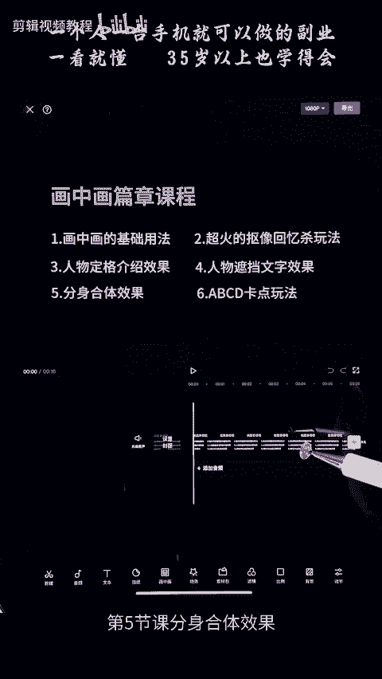
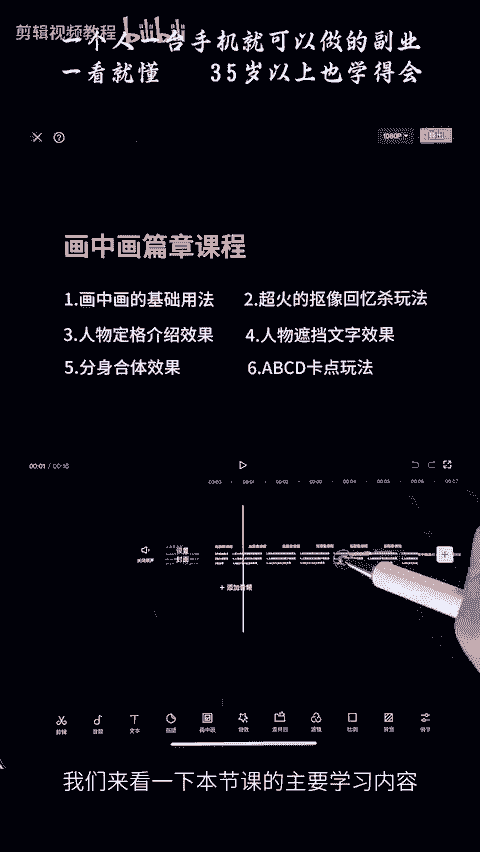
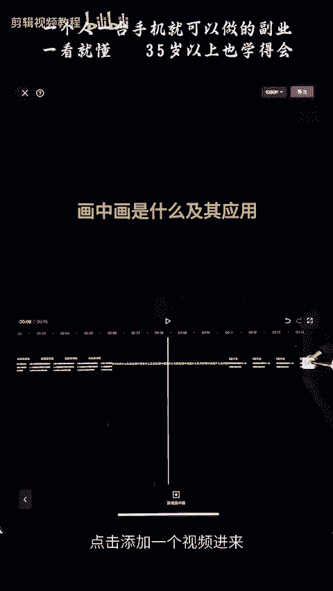
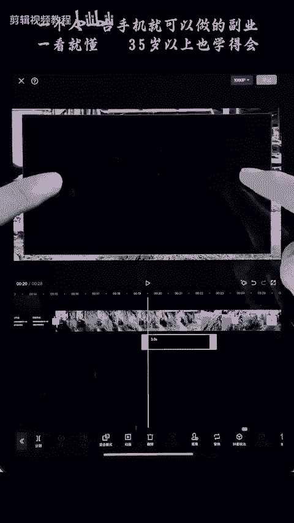
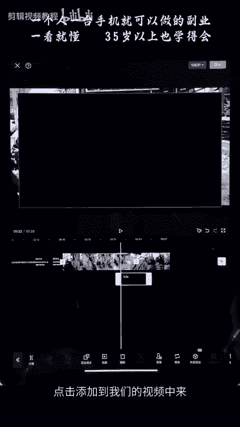
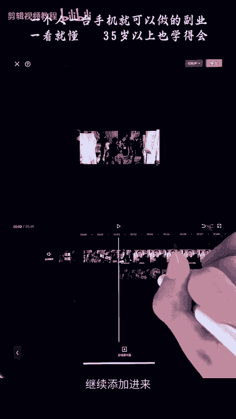
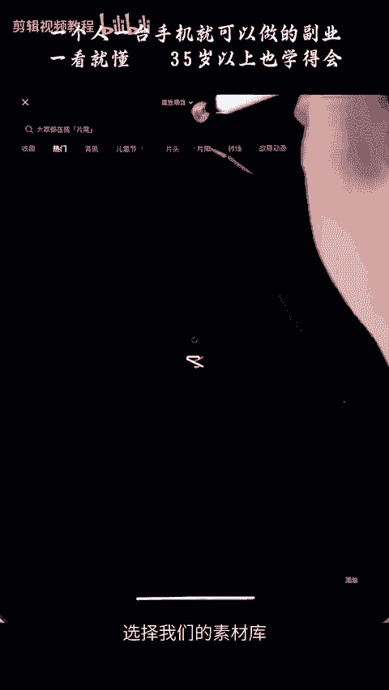
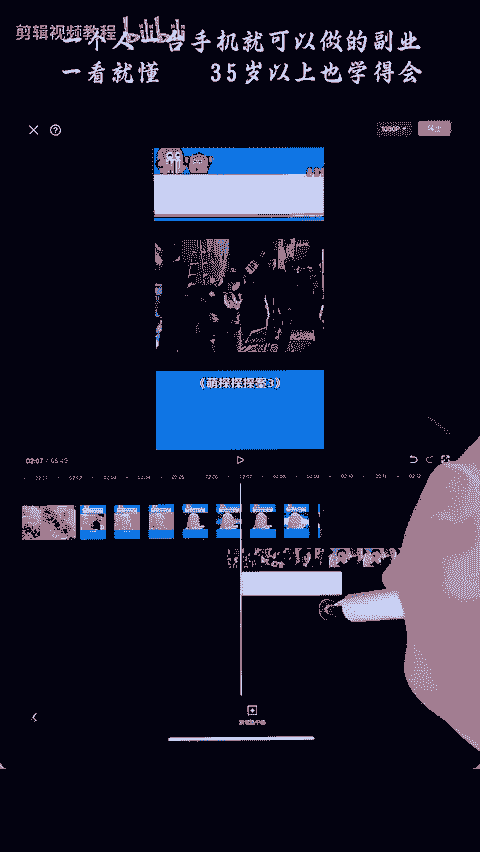
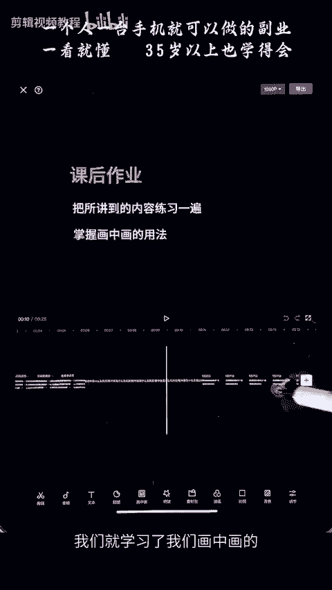

# 剪映手机版教学全新版本，学视频剪辑做视频号运营必看的剪辑零基础入门教程 - P60：【手机版】画中画的基础用法 - b财神保佑我 - BV1MasZeeEk9

hello，大家好，欢迎来到我们画中画篇章的学习。本次篇章呢分为六节课。第一节课是我们画中画的基础用法。第二节课是人物抠像回忆杀玩法。第三节课人物定格介绍效果。第四节课，人物遮挡文字效果。

第五节课分身合体效果。第六节课，我们的卡点玩法。

我们来看一下本节课的主要学习内容。我们画中画是什么，还有它的应用，点击添加一个视频进来，选中它，点击添加。然后呢，我们在下方这一个地方啊，选中视频的话，这里是我们的视频工具栏。

你们点返回返回可以看到我们这外面的一个工具栏，这里有个画中画，点击画中画，点击新增画中画，选中我们要导入进来的视频，点击添加。那么我们的视频呢就会添加在这一个画面上面，这个的话就叫画中画。

话筒画呢我们最多可以添加6个，我们还可以选择啊返回去点击添加画筒画，可以选择多个画面导入，最多可以添加六层，最多可以添加六层。画中画呢有一个用法，比如说我们要把这一个视频放到最上面这一层来，不会被挡住。

那么我们可以选中这里的层级。可以拖动可以拖动，摁住拖动这一个视频，把它放到最前面。那么我们的视频就不会被刚刚那个视频挡住了。主轨道永远是处于我们的最下方的。

我们可以调整的只是主轨道上面的画中画的一个层积关系。比如你把这一个视频，你想放到最上面来，那么你可以选择置顶或者直接拖动到它前面来，选择置顶或置顶啊，这里有置顶啊，它就在最上面了。我们可以看到。好。

那么我们的画中画呢，还有另外一种方法可以添加画中画，就是切换我们主轨道上面的视频。比方我们把这一个视频分成两半，我们想把这一段视频放到它下方来，变成画中画。你拖动呢是没办法达到的，你要选中它，然后呢。

这里后方有一个叫做切换画中画，切画中画，点击。那么我们可以看到我们这个视频呢就会被放到下面来了。我们可以缩小一下，看看这个视频呢就是变成了画中画的视频。我们也可以选中画中画中的视频。然后呢。

点击我们的切主轨道，那么我们的画中画视频就会去到主轨道。点击。好，这个的话就是我们画中画的一个主要用法。那么它可以应用在什么场景中呢？我们来看一个例子。我们可以点击画中画，点击新增画中画。

选择我们素材库中的黑场视频。点击添加。

好，然后将它放到下方来。然后选中这一个画中画，点击复制。将它拖动到我们的画中画下方，我们的画中画呢是可以拖动的，互相拖动。那么我们可以把这一个黑色的遮幅放到上方来。

那么我们这样一个有黑色遮幅的视频就制作完成了。主轨道的缩放是不会影响我们这个遮幅的。不会影响我们画中画的大小。好，这个是一种用法。第二种用法呢，我们可以作为一个人物头像使用。怎么操作呢？我们可以看一下。

我们新增一个画中画。点击添加我们的视频，击添加我们的视频。我们可以为这一个。视频添加一个。门版我们点击添加门板。点击添加圆形门板，这个时候呢我们可以选中吴彦祖的头，点击勾选。

那么我们经常在直播中经常在直播中看到的一个主播效果呢就出现了，对吧？我们可以缩小一点。啊，比如说游戏主播对吧？他的头像会出现在视频的左上方出来解说，会答吗？你会答有个屁用啊啊，可以做出这种效果。

我们也可以给这一个头像添加一个。白色的边怎么添加呢？我们可以新增画中画，点击选中我们的一个白场视频，选中它。点击添加百场视频，然后呢给这一个百场视频也添加一个蒙版，圆形蒙版，点击勾选。

然后我们可以把这一个圆形门板啊给它缩小一点。选中它缩小。然后将它放到我们的视频下方来啊，视频下方现在的话挡住了，对吧？我们可以怎么样调整它的层级，选中这里的层级。将这一个呢置到底。

至底也可以去拖动这个视频的往前面来。那么这样的话我们的一个头像就会在这一个白底的上面，我们可以调整它的大小，这样的话就会有一条白边。好，这个是我们的另外一种使用方法。我们还有一种使用方法。

就是我们可以给视频添加字幕，我们先点击删掉。点击将这些删掉。我们还可以点击新增话中画，选中我们的黑场视频。点击添加到我们的视频中来放大。

将它拖到底部。这个时候呢你们可以把主轨道调上面一点点。可以在下方这里新增我们的字幕，点击返回我们的主页面。添加文本，我们可以新增文本。字幕。字母位置。点击勾选，调整我们字幕的大小，将它放到我们下方。

可以制作我们的视频字幕。我们来看一下我们画中画的另外一种使用方法，三分屏打吗？你会的这种如何制作呢？首先我们点击创建我们的视频。将我们需要三分屏的视频添加到我们的视频中来。然后点击我们下方的比例。

点击下方的比例，将比例换成我们的9比169比16，然后选中这一段视频。

点击添加化妆法。添加画中画，点击新增画中画，将这一段视频继续添加进来，继续添加进来，然后前面对齐。

然后选择复制多一层，选择复制多一层。好，我们应用我们刚刚学到的知识点，可以将这一个视频拖动到我们的最下方来。好，对齐我们的画面，对齐我们的画面。这个时候呢我们就有两个画中画。

我们可以去调整它的位置和大小。调整它的位置和大小，让呢让他这个视频呢对吧？三分屏均匀的分布在我们的视频中来。好，这样的话我们的三分屏视频就制作完成了。我们来看一下我们画中画的另外一种使用方法。

我们经常可以看到我们综艺类的抖音视频会有这种边框，我们可以新增画中画。点击新增画中画，可以将我们的视频。放到这个边框里面，放到我们的视频。我们还可以去添加一个白色的视频，将它这一个遮住。

我们可以怎么样新增画中画。再增加多一个化妆法。选择我们的素材库，将白色的这一块视频添加进来，然后去遮住它，去遮住它。

好，我们可以给这一个加一个。啊，增加一个门板。选择我们的。矩形门板啊，这个时候我们可以去拖动可去变换它的位置。然后呢，将它挡住这些字体。这样的话，然后我们可以去打上属于我们自己的文字。

打上属于我们自己的文字，这里呢可以多复制多一层。

复制。按到下方来可以拖动。啊，下方呢也给它挡住。然后这个时候你们可以在上面添加我们自己的文字。比如说添加我们的文本，点击文本，点击新建我们的文本。我们这里说啊吴彦祖吴彦祖。然后呢啊给他换一种颜色。

给他换一种颜色啊。换成我们的红色啊红色。然后去调整它的位置啊，比如说放到上面来好，具体的使用方法就是这样。我们来看一下本节课的主要学习内容。本节课呢我们就学习了我们画中画的几种使用方法。

这节课的内容呢相对比较简单，但是希望大家能够去操作一遍，你才能知道自己掌握了没有。

