# 剪映手机版教学全新版本，学视频剪辑做视频号运营必看的剪辑零基础入门教程 - P61：【手机版】进阶练习：抖音超火的钢琴曲卡点教程 - b财神保佑我 - BV1MasZeeEk9

大家好，这节课的话我们来学习一下蒙版课程的第六个章节，钢琴曲卡点的一个效果。我们先来看一下一个实战案例。这一节课呢也是运用一到一个门版的一个简单的原理啊，将我们的视频切割成像我们的钢琴键一样。

然后运用这一个音乐的卡点来对这一个视频进行优化。我们先来看一下如何制作。我们点击开始创作，我们这一节课呢用到了三张图片，三张图片，啊，分别是我们的森林，还有我们的这一个沙漠，还有冰川啊。

我们可以先将这个森林啊，给它导入进来，点击添加门版，添加门板。这样的话呢这个森林的一个视频就给我们添加进来了啊，我们先啊给添加一个音频进来，点击提取音乐，我们点击提取音乐，将我们的音乐提取进来啊。啊。

我们这里呢我们首先对它进行一个踩节拍，踩节拍啊，就是我们的卡点，我们选择音乐，点击节拍。然后呢，我们根据这里的点，对吧？我们来对它进行一个手动就可以了啊，这里手动就可以了。噔噔噔噔噔噔噔啊，我们停一下。

啊，这里总共有多少个点呢？12。3。4。哦。6。7对吧，我们听一下。噔等噔噔等等等啊，总共7个点，对吧？啊，那么这样的话呢，我们就将这一个呢给它分成割成7份就可以了，对吧？分割成7份。

那么这个呢如何操作呢？啊，我们先给它返回一下啊，勾选。好，我们先将这一个视频给它分成7个啊，我们也运用了到了一个技巧，对吧？啊，就是我们可以通过我们添加文本，点击添加文本，将这一个呢画一些线出来，对吧？

我们这记得不啊，前面两节课都有讲到的，新建文本，对吧？我们输入呢英文字母的I，对吧？啊，我们7啊7个的话，7加一等于多少？8个，对吧？输入8个I3个45678好，确定。好，那么然后呢我们进入样式里面。

在这个排列呢，将它的字体间距给它拉大。啊，我们可以看到啊，这里的话有个空格键，对吧？啊，给它删除一下。我们重新输入一下。2345678。吓。然后呢，将这一个间距呢给它拉大。啊。好，就到这。

1234567对吧？现在的话均匀的就被我们分成了7份7份啊，然后呢，接下来呢我们就对这一个图片进行绘制门板，绘制门板，选中它，点击我们这里的门板，点击我们的门板啊，然后呢我们将它添加一个矩形模板。

然后呢将它放大。好，缩小一点啊缩小。好，将它缩到我们的I的这个位置，挨着这个位置啊啊不要太粗不要太粗啊，刚刚好处于这个I字母的中间再往偏右一点点啊，这边的话偏左一点点啊。

这样的话到时候留下来的黑色缝隙呢就比较均匀勾选一下。好，接下来呢我们只要对这一个啊进行一个复制。复制对吧？然后呢将它切换到我们的画中画来，点击切画中画。

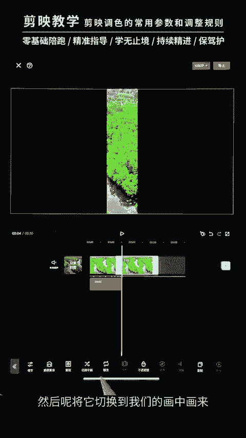

好，将它放到我们的前面这一个部分来。

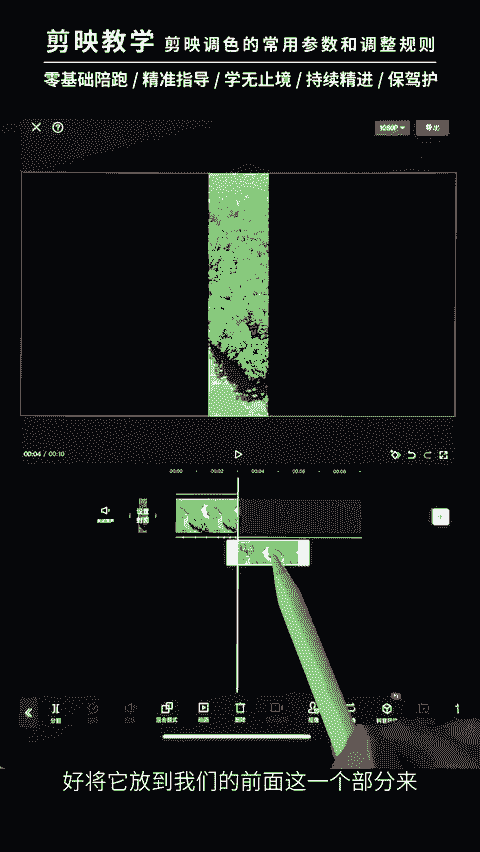

我们总共是需要7个，对吧？我们先复制多啊，现在两个了，再复制多5个，对吧？

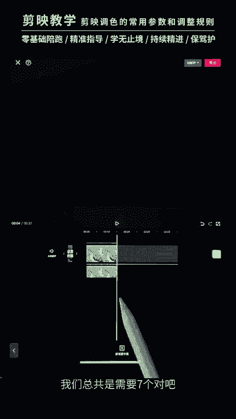

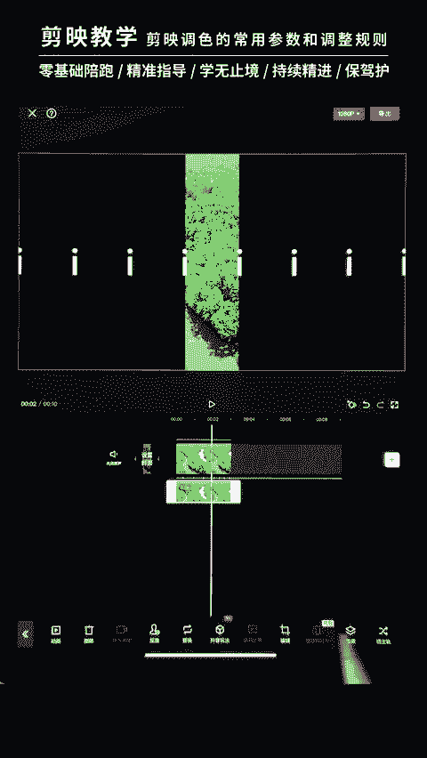

哎，我们点击它点击复制。

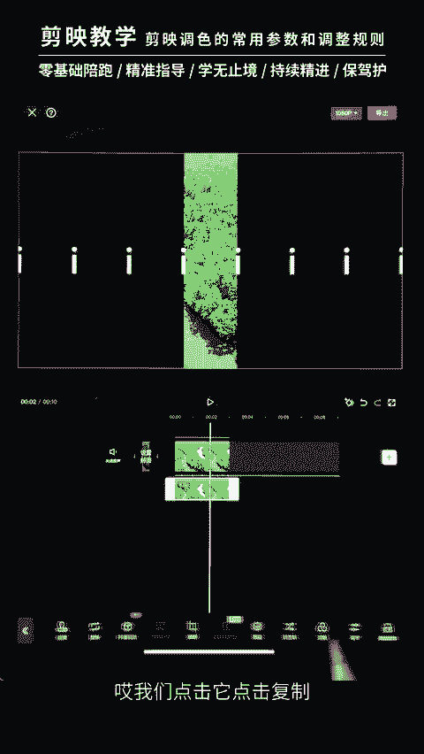

3个。

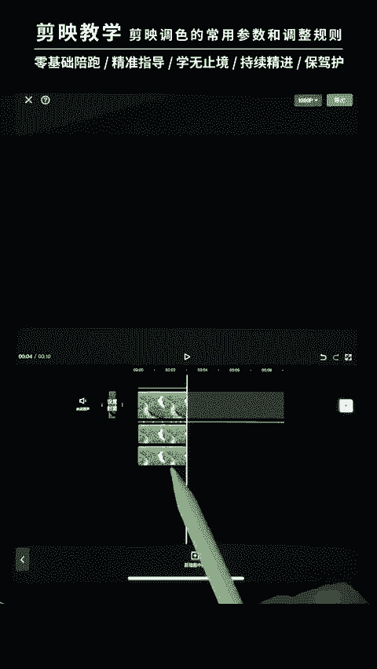

4。

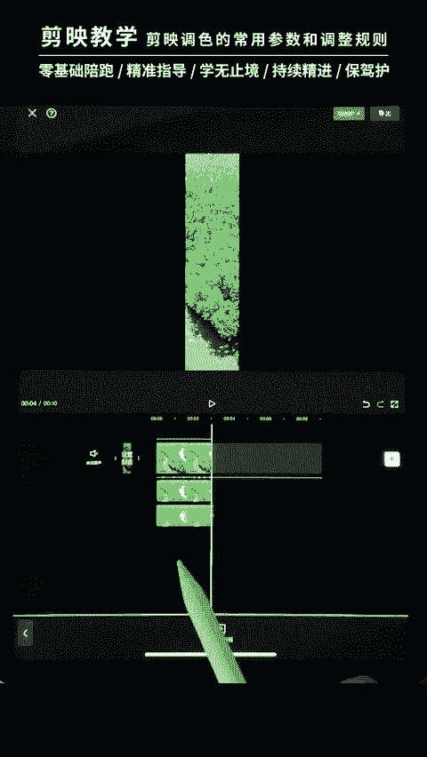

哦。

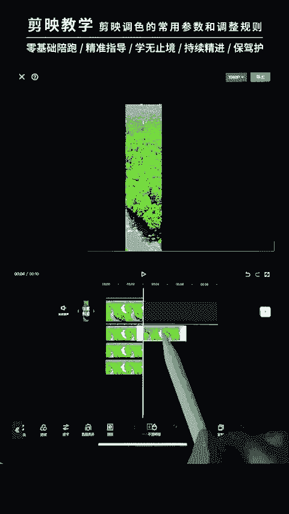

六。

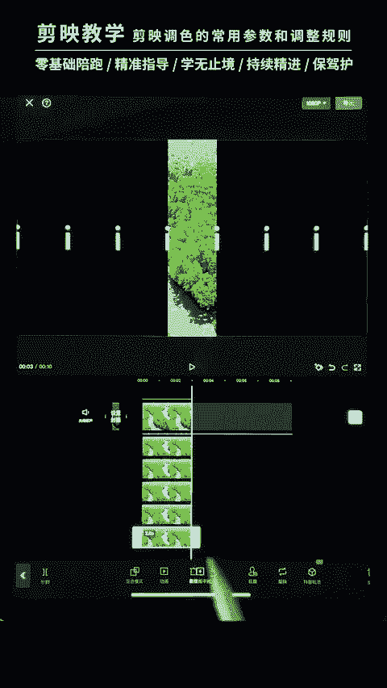

次。对吧这样的话呢，七个图层我们就已经给它做好了做好了啊，接下来呢我们就去调整他们的一个门板的位置，门板的位置啊，这一个的门板呢大家一定要去理解用透它，理解用透它，经常都会使用到的。好，我们将它排过来。

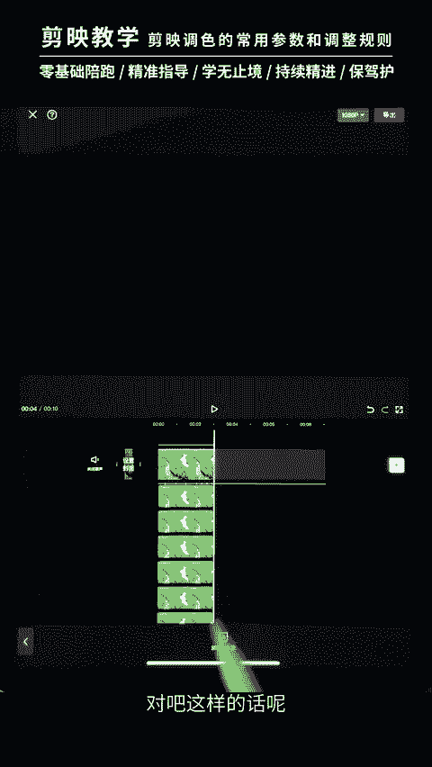

啊。位置的话，大家一定要仔细的去调整，仔细调整。让他们呢每一条缝隙呢都是一样的。最后一个门板。我们将它移动过来。好啊，稍微再调整一下啊，稍微再调整一下。这里的话我们还可以再往这边一点点。啊。

让他们尽可能的啊保持这个中间的黑色的线呢是一样粗细的对吧？一样粗细。好，勾选一下勾选一下。好，然后呢将我们的这个啊我们的字体呢就可以去掉了，删掉啊，删掉了。接下来我们怎么操作呢？

我们只要根据它的一个卡点，对吧？等等等等等等等，分别出现这些图片就好了，对吧？我我们返回一下。进入这个画中画来进入画中画。好，我们首先是第一张图片是我们的这一个森林，对吧？首先是这一个森林。然后呢。

接下来呢我们就是要将其他的啊，比如说那个沙漠的出现，怎么去出现呢啊，也是非常简单的，这里呢就需要用到我们的这个替换替换啊，比如说呢我们可以怎么操作呢？第一个点，对吧？我们第一个点要在哪里出现呢啊。

比如说我们可以是第一个好吧，第一个出现啊，我们先对准这个卡点。然后呢，将我们这个视频给它分割一下。接下来呢将后面这一个段呢啊进行一个替换就可以了。我们可以点击这里的替换。替换呢有一个需要注意的点。

替换的图片必须得跟我们这个森林的图片比例是一样的，大小是一样的。啊，不然的话，后续的话你们替换呢就会出错啊，我们可以给大家展示一下啊。比如说我们现在导入这个沙漠啊，替换呢它是正确的对吧？我们返回一下。

如果你去替换这一个啊，比如说我们这里有一艘船，对吧？那么它替换出来，大家看到这两条黑边呢就会变得特别的大啊，这一个就是比例不对，大小不对导致的。我们返回一下。我们将它替换成我们的这个啊沙漠。啊。

接下来呢去对准我们的第二个音乐的点。啊，我们想这里出现对吧？然后这里这里这里啊一左一右一左一右对吧？那么我们可以啊从最左边最左边给它分割一下。啊，点击替换。啊，选择它之后呢，点击替换。

将我们的沙漠呢再给它替换一遍。啊，后面呢也是一样的操作啊，比如说我们现在是要在这一个对吧？倒数第二个，那么就是这一个给它分割啊，分割一下。分割，然后呢将后面这一段呢也是去替换成我们的沙漠啊。

然后再往后一个卡点，往后一个卡点啊，我们去替换第二个啊第二个这一个。进行一个分割啊进行一个分割，然后呢再进行我们的替换。听完好，后面呢也是一样的操作啊，很快速的操作一下。啊。

我们这里的话一个长度呢啊刚开始没有设置好啊，所以大家的话呢，你们这个长度呢一定要先去给它拉长，对吧？拉长啊，避免说后面再来拉长啊，这里的话我们就啊操作顺序没有对啊没有对。

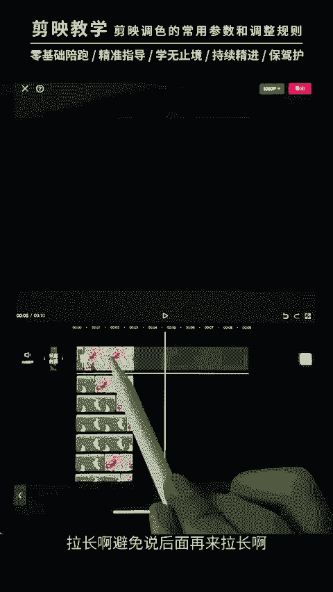

好，没关系，我们重新给他拉一下，重新拉一下。拉到音乐的结尾。拉到音乐的结尾。让他们呢去对齐就好了。啊，对齐。你们做的时候呢，开头啊就先把这个森林的这个视频去给它拉长啊，这个图片。

后面呢替换起来呢长度就可以正确正确。好，那我们来看一下刚开始制作的一个效果啊，我们还有一段没有替换啊。先选中最后的这个卡点，将它分割，然后将它替换。好，我们来看一下效果。好。

后面的话呢噔噔噔噔啊跟这里的原理是一样的。我们只需要对音乐啊去音乐将它进行一个卡点，进行一个卡点啊，然后呢进行一个分割替换啊，然后呢图片是必须是比例啊，还有大小是一致的。

这样的话避免替换之后呢出现错误啊。原理都是这样的，大家要掌握它的原理，就是我们根据音乐的一个卡点来做这些蒙版的一个动画，蒙版的动画对吧？啊，大家呢要懂得啊懂得拿到其他音乐之后呢，能够自己去卡点。

自己去做喜欢的门版，可以是排成横列的，也可以排成数列的这一个更重要，这个更重要。好，希望大家能够课后去多多的练习，掌握。

