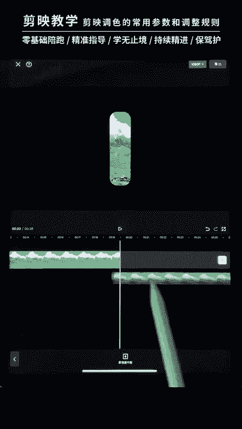
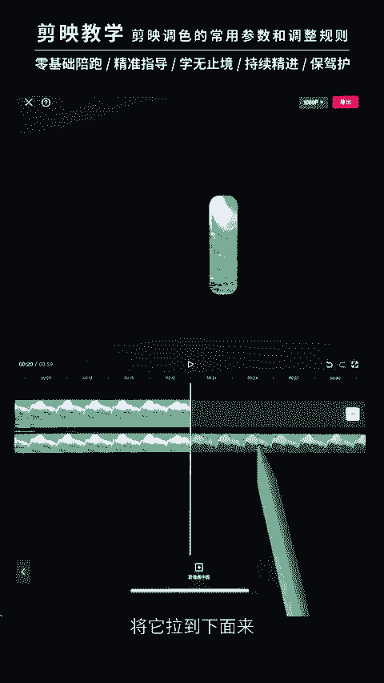
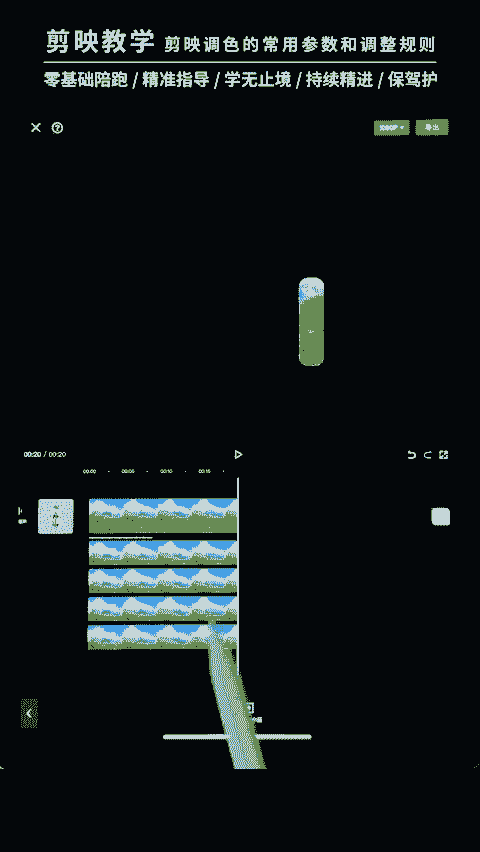
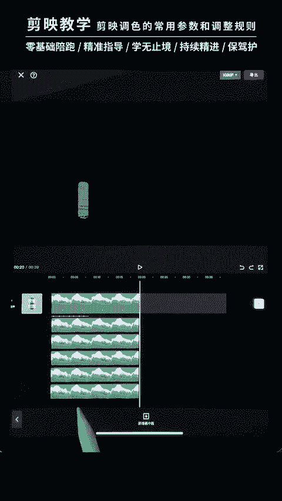
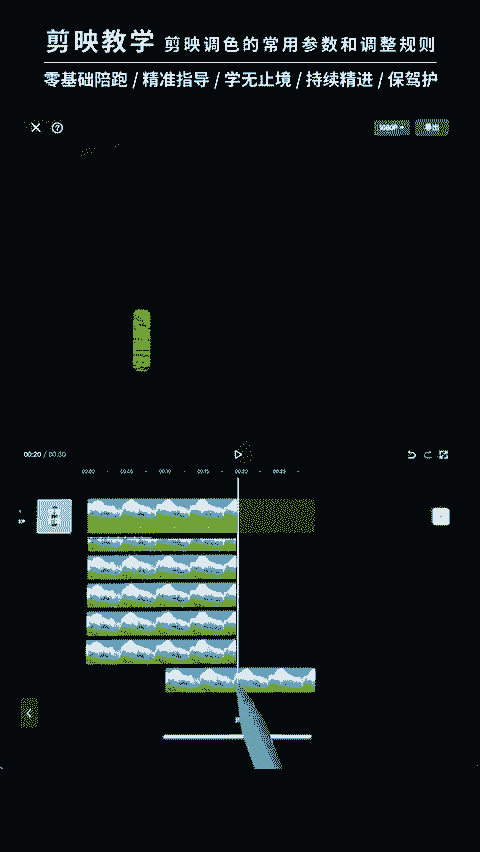

# 剪映手机版教学全新版本，学视频剪辑做视频号运营必看的剪辑零基础入门教程 - P62：【手机版】进阶练习：七分屏卡点片头的制作方法 - b财神保佑我 - BV1MasZeeEk9

hello，大家好，这一节课呢我们来学一下七分屏偏头的一个卡点。我们来看一下。好，这个视频呢也是运用到我们的音乐，对吧？我们利用音乐的一个节奏呢缓慢的去出现这些啊，排成一个三字形，对吧？

排成一个三字形啊，也是运用到我们的门版，运用到我们的门版。我们先来看一下如何制作啊，如何制作，我们点击开始创作，点击开始创作。首先我们将我们的这个啊素材给它拖进来，点击添加我们的这个三个素材。

这个三个素材。啊，接下来呢啊我们首先怎么操作呢？我们先将将它放小一点啊，缩小，我们先将它缩小一点啊。缩小哈。缩小啊缩小到一个合适的位置啊，大概呢上面留一些边，下面留一些边，对吧？啊。

大家学着我这个粗细就可以了啊。接下来呢我们给它添加一个音乐，添加一个音乐。点击添加我们的啊提取音乐啊，提取音乐将我们的这个背景音乐呢给它添加进来。听到厉害。好。

我们首先第一步对它这个音乐进行一个卡点卡点，我们听一下。啊，它是一个比较简单的音乐，对吧？我们听一下它的节奏就可以了啊，自己手动去给它卡点，手动去给它卡点，我们点击节拍啊，听一下。对吧噔的一声呢。

我们就出现一个对吧？噔噔。灯我们听一下。对吧这里有一个很小声的对吧？然后呢，后面三个也是可以啊，可以，对吧？啊，我们这里呢就去做一个简单的踩点就好了啊，不一定要很严格的遵循严格的遵循。

只要看着画面舒服舒服就可以。我们先勾选一下。接下来呢我们先将背景给它换成白色的啊，那怎么操作呢？返回一下返回主菜单，主菜单，我们点击背景，点击画布颜色啊，给它选个白色的背景，对吧？勾选勾选一下。好。

接下来呢啊我们这个三我们再给它缩小一点啊，再给它缩小一点点。再缩小一点点啊。好，接下来呢我们对这一个图片给它添加一个蒙版，对吧？添加蒙版怎么操作呢？啊，也是同样的道理。我们点击门版啊。

给它建一个矩形门板矩形门板。大家有一点要注意的，我们看我们的门板呢拉大它是会有边界的啊，这个边界呢是取决于我们的这个图片的大小，对吧？啊，看到没有？超过这个图片大小的啊，这个视频大小的这个边缘呢。

它就是没有出现，对吧？没有出现啊，所以门板是只能在这个视频或者说图片里面去进行操作的啊，这个点有什么用呢？啊，比如说我们现在啊给它缩小一点。缩小我们现在做一个圆角啊，给它做一个圆角，对吧？做一个圆角啊。

如果你们不小心呢啊滑到下面了，大家看到没有？下面这条边呢就会变得很直很直，对吧？因为它超出我们的边缘了啊，这个的话是大家需要注意的点啊，或者说超过上面的啊，我们先返回一下返回啊，然后呢。

我们首先对这一个啊给它建一个门板啊，细一点。啊，稍微啊不要羽化啊不要羽化。稍微窄一点点砸一点点就好了啊。好，接下来呢我们进行啊第二个的操作啊，怎么操作呢？啊，也是同样的道理。我们先选择这个视频。

点击我们的这个复制按钮。然后将它切换到我们的画中画来。

在画中画去建立7个不同大小的这个啊要对称啊，七个不同大小对称的这个啊对称的这个门板啊门板。我们怎么操作呢？啊，先选中这一个啊，我们一个一个来这一个一个一个来，我们点击我们的门板啊。

选中它之后点击我们的门板。将它啊给它缩小一点就好了啊，对这个门板进行缩小，对吧？缩小缩小之后呢，我们将它调整过来啊，放到右边这里啊，右边这里注意下方呢尽量让它们保持持平啊。

就是说你这一个下方呢啊跟这边是一样的啊一样的。这样就会比较规整，中间呢留一条简单的一个细小的白色缝隙，细小白色缝隙。好，做好这个之后呢，我们再进行啊，第二个的一个复制，进行第二个复制。

再复制多一个将这一个小的去进行复制，这样会更快。为什么这么说呢？我们直接复制。将他拉到下面来。

把们缩小一点啊缩小一点。好，这个呢我们就是复制出来的，我们仅需要点击门板。然后呢，将门板直接往这边移动啊，就可以制作出第二个一样大小的对吧？对称的对称的一个视频出来好啊。

白色的边呢尽量保持它们是同相同的啊，保持相同。啊，大小不要差太多就可以大小不要差太多。好，接下来呢我们继续进行一个复制啊，一个一个的去进行一个复制，缩小复制拖下来。好，然后进入他的门板。

进入我们的门板里面去将这个门板进行一个缩小啊缩小。它是越往后越小的一个状态，越往后越小的一个状态。我我们给它放到这边来。啊，然后啊再给它勾选一下，再复制多一个，放到我们的这个左边。复制。

白色的边啊，这个下面的边呢尽量保持持平持平啊，然后上面的啊就是这一条白色的边啊，去尽量把它摆好看啊。我们首先第一步要先给它摆好看啊，摆好看好，我们先勾选一下，再进行一个复制，对吧？

我们现在有多少245对吧？还差两个啊，差两个我们再复制多一层。将它放下来。我们再线进行一个缩小啊，点击门板再进行一个门板的一个缩小缩小。好，然后啊将它放到这里，对吧？啊，调整的时候呢，大家一定要注意啊。

注意这一个啊缝隙的大小，缝隙的大小。然后再复制多一层，放到我们的右边去，放到右边去。选择门版，记记得一定是先选择门版之后再去移动。如果不行，不然的话你看啊，不然的话视频就会割裂了，对吧？啊。

我们一定要先点击门版，我们是在门版里面去移动的啊，是在门板里面去移动的。哎，重新操作一下。

一定要先点击门板，然后再去移动，这样就不会出错。这样呢能让他的视频看起来是拼接在一起的啊，拼接在一起的。啊，而不是相同的片段，不是相同的片段。翻过来一点。好，那么这样的一个简单的三字呢。

我们就制作完成了，对吧？它呢这些视频呢你大家可以看到它是拼接在一起的，拼接在一起。这个山脉是拼接在一起的。接下来呢我们怎么操作呢？我们还可以给它输入一行字啊，输入一行啊字对吧？点击我们的文本。

点击我们的文本啊，大家可以输入一些比较文艺一点的文艺一点的对吧？啊，比如说我们可以输入什么文艺的文字呢，对吧？啊？生活对吧？我们可以答一些比较生活，还有诗和远方，对吧？啊，类似这种话，然后呢。

我们将它的这个样式样式呢给它怎么样？缩小一点啊，字号缩小一点，字号缩小。然后呢，将它的这个排列的一个字间距给它拉大，拉大到跟我们的这个。啊，跟我们的山脉是一样宽度的一样宽度啊。大家如果看不清的话。

你们可以把这一个字体的颜色对吧？字体的颜色给它改一下，我们这里可以选择一个不要那么啊不要那么白色的对吧？看不清啊，我们可以选择这一个棕色啊，棕色对吧？然后呢将它放到下面来放到下面来。啊，居中啊居中啊。

大家可以看一下。好，这样的话呢就会比较好看啊，你们也可以去选择一种花字，对吧？可以去选择一种字体样式啊，对吧？啊，样式。去给他选择一个好看一点的字体也可以啊，好看一点的字体也可以啊。

我们这里就用原本的就字体就可以了啊。原本的字体好，我们勾选一下之后呢啊接下来呢就是要对它的这个画面进行一个动画。啊，我们先拉长，接下来呢就是对这个画面进行一些动画，对吧？怎么操作啊。

我们首先进入我们的这个画中画来返回进入画中画。好，接下来呢我们就是将每个视频去添加一个入场效果啊，点击第一个啊，我们从中间开始出现的动画。出我们选择一个入场效果的一个向上滑动。啊，向上滑动啊。

速度呢不能太快，对吧？我们一定要慢啊，比如说我们可以选个3秒左右，我们看一下。🎼啊，3秒是可以的哈，我们选择一个3秒。🎼好，下面的视频呢分别都去选择一个入场动画，对吧？入场动画。啊。

全部去给它添加一个向上滑动的一个效果。时长呢都去选择一个3秒。我们快速的添加一下快速添加一下。🎼添加好动画之后呢，我们再对它进行一个卡点，对吧？啊，根据音乐的一个节奏去出现这些东西啊，出现这些东西。

对吧？好，我们先来放到它对准我们的这个音乐的节奏，对准音乐的节奏啊，第一个就不用操作了啊，让它直接出现就好。好，第二个节奏点呢我们就开始出现两边的这个了，对吧？记得哈一定是去拖动它的长短。

而不是整一个视频往后挪，不能整个视频往后挪的。先选中它，然后将这个去拖动拖动对齐。对齐我们的这一个点节奏点啊，后面呢也是一样的道理啊，我们先两边。然后呢，再更小的对吧？更小。

然后再去出现这一个啊再去出现这一个。下面的这个对吧啊。后面的啊几个卡点呢，我们可以不用管它啊，不用管它，我们返回可以为这个字体呢也去添加一个驻场动画啊，让这个字体呢最后跟着我们这两个小的对吧？

两个小的这个东西呢出现啊。啊，我们刚刚没添加到动画啊，我们先返回一下。啊，为我们这两个小的去添加一个入场动画啊，入场动画选择向上滑动啊，刚刚没添加到。🎼选择3秒啊3秒勾选。好。

这样的话呢就已经初步完成了，对吧？아 저거 안잖나。好，然后再将这个文本呢也去添加一个动画，点击编辑，点击我们文本的动画啊，也去给它加一个啊向上动就可以了啊，向上露出来，对吧？这里有一个。

时长呢我们也去给它拉长一点啊拉长一点。🎼让它缓慢的出现。好，确定，然后让我们最后这个商脉出现的对吧？我们这最后两个小的出现，我们的文字再跟在它后面出现，再跟在它后面出现就好了。我们看一下。好。

就这样一个效果，我们看一下。啊，这个呢刚刚没调整好时长，对吧？我们刚刚没调整好时长啊，每一个呢这个动画的一个时长呢一定是要3秒钟3秒钟，对吧？🎼确定一下啊，刚刚动画呢时长好像都变化了啊。

都去给它调到3秒钟。好，我们看一下。看一下这个效果。好，这样的话呢一个片头的一个效果我们就制作完成了。

