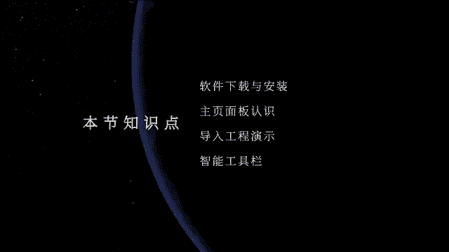
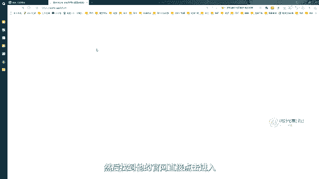
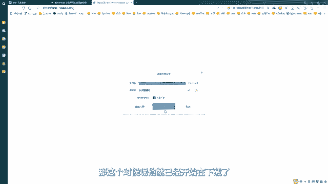
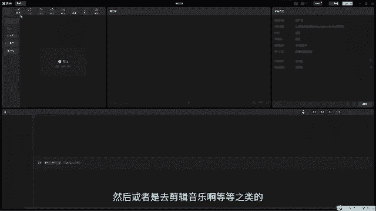
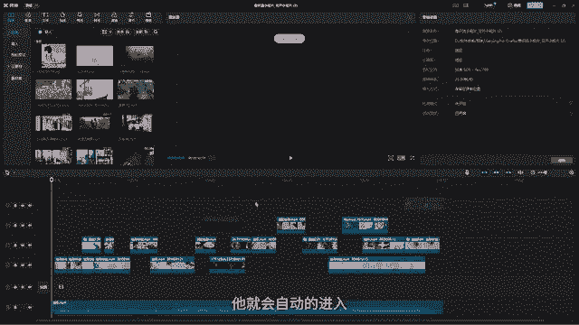
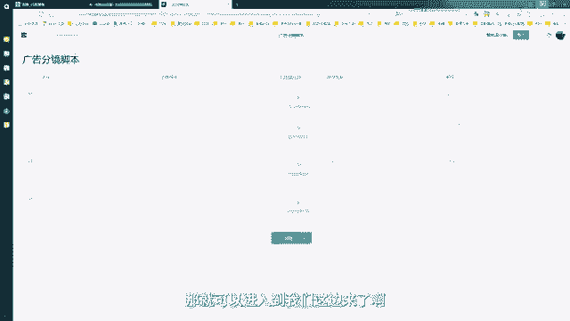
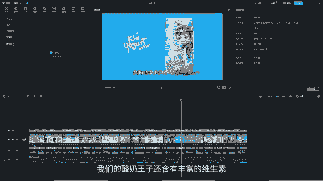

# 剪映手机版教学全新版本，学视频剪辑做视频号运营必看的剪辑零基础入门教程 - P63：P1【电脑版】认识剪映 - b财神保佑我 - BV1MasZeeEk9

欢迎来到PC版剪映课程。那么今天第一节课我们先来安装一下软件。首先我们先打开我们的网页，在网页上搜索剪映。然后找到他的官网，直接点击进入。

那这个时候呢，它就会进入到我们检验的官方网站里面。它上面的话呢有很多的版本。这里面的话呢，我们选择专业版，点击一下下载。

那这个时候呢，它就已经开始在下载了。那我们等它下载完了以后，然后呢直接去安装它就可以。OK那么我们下载完以后，大家可以看到这个是它的应用程序，双击应用程序。然后呢。

这个时候如果你的电脑有安装我们的电脑管家等等之类的，它会告诉你不允许安装，我们点击允许安装。好，然后呢，这个时候跳出来，我们直接点击立即安装。

那我们直接等它安装结束呢就可以了。OK安装完了以后，我们直接点击一下，立即体验。那这个时候它就会自动把我们的剪映软件呢就给它打开了。我们稍等一下，剪映打开了以后。

那这个面板的话呢就是剪映它的一个主页面板。那么我们现在啊一起来认识一下它的整个主页。首先我们先看一下左侧那左侧的这个地方的话呢，相当于是我们个人的一个面板。那这个上面的话呢，如果你有抖音账号的话。

你可以在这上面去登录一下你的抖音号。那这个时候如果你在抖音里面发现好听的音乐，你可以收藏起来。那我们的这个PC版剪映，它会自动的去链接你的抖音账号，然后呢，你就可以在你的电脑上去直接引用你收藏的音乐。

O那这个是我们的账号啊，那我们可以看一下下面的话呢，主要的话就是啊像这些那这些的话呢，就是我们抖音目前比较火的一些模板。那如果我们在制作的时候。对我们的一些视频制作没有灵感的话。

我们可以直接调用上面的这一些模板来进行一个制作。那这上面它的风格和类型呢有非常多啊，你根据自己喜欢的，然后呢，在上面去选择呢就可以了。好，然后这里的话呢是云空间，这个云空间是什么意思呢？

它就相当于是我们这个自己的一个空间磁盘，然后你可以在这里面去放一些你喜欢的音乐，比如说你在电脑上下载了一些音乐，然后呢，你想引用到你的抖音账号里面，或者是呃你想在其他的电脑上。

然后在登录你的呃剪映账号的时候呢，也要引用这些素材或者音乐，你就可以放到这里。比如啊我们这里找一个音乐，我们给大家演示一下。O比如说我现在这里面下载了一些这个音乐。然后呢。

我现在想把我的这个音乐放进去啊。那这个也是比较简单，你直接给它拖过去就可以了。哦，按住这个左键不动，给它。脱那这个时候呢它就会出现一个呃蓝绿色或者是青色的一个框框，告诉你说松开后就可以上传。

我们松手OK那这个时候呢它已经开始在上传了。然后呢，这个素材呢，就在这里面啊。那我们之后讲到我们剪映的面板里面的时候呢，会给大家去调用这个素材来引用。那这个是我们的云空间啊。

我们可以储存我们的文档储存视频，储存我们的工程文件，还有照片，还有我们的音乐音效都可以啊。O然后呢我们再往下看，这个是我们的小组云空间，这个的话呢，跟我们上面这个是一样的。

只不过这个的话呢是我们在跟小组一起共同创建项目的时候，然后会用到比如说我们会用到一些共用的素材，包括音乐音效画面视频等等啊。然后呢我们都可以放到这里面来。那这个的话你可以去创建啊，需要多人去。节作啊。

那我们现在是单个，那我们就可以不用去管它。OK下面的话呢还有一个叫热门活动。那这个热门活动，如果你是自己做自媒体的话，你可以多看一下这个热门活动，它都会去提示你，然后呢去参加这些活动的话呢。

可以得到抖音官方的一个推流。O那这个我们就先不用去管它啊。ok那我们现在左侧的这个面板呢，我们就已经熟悉完了，那我们再来看最大的这个面板。首先我们先看一下上面的这个这个叫做开始创作。

那当我们点击这个加号以后，我们就能进入到剪映的创作面板里面来，那么我们就可以在这里面去剪视频。然后或者是去剪辑音乐啊等等之类的。好，然后呢点击菜单，我们继续回到首页上啊。O那这个是我们的呃开始创作啊。

那下面的这几项的话呢，就比较有意思了啊。我们待会再来跟大家讲。

现在我们先把下面的这些先熟悉一下。那下面的这个的话呢是什么意思呢？这个就相当于是我们制作的项目。那你做了什么样的项目，它会自动的帮你存在这里面，然后呢不需要你再单独的储存成单个工程文件啊。

就是你做的所有的项目，你只需要保存一下，它会剪映会自动的帮你保存在它的主页面板上。那这个的话呢，我们比如说你制作了很多项目，你就直接这种去拉开它，然后呢去调用你喜欢的项目，或者是你要再重新制作的项目。

那就可以了。比如说我们去找一下啊我之前制作的这个案例，你直接选中它，然后呢，好，然后这个时候它就会自动的进来了，对不对？哎，就不需要我们再去重新创作。

或者是在电脑上或者在我们的磁盘上再去找到对应的项目了。好，那这个是我们的一个相当于是我们的项目啊，项目啊，制作的各个项目。那大家。注意啊，在剪映里面项目它称之为草稿啊。

就相当于是你就像我们在制作草稿一样，对不对？哎，他把我们的项目叫做草稿啊，所以啊草稿等于项目。这里面大家自己明白呢就可以了。好，这里有一个叫导入工程。这个导入工程是什么意思呢？

我们可以把鼠标放在这个上面，然后呢，它下面会有一盘小文字叫做支持导入PR工程，支持属性包含基础剪辑音频视频基础属性文本内容。那其实我们剪映现在的话它可以直接跟我们的PR软件去做一个联合。

比如说很多时候我们会在PR里面去进行剪辑。但是呢PR的插件转场效果，还有我们的一些特效效果，相对来说是比较少的。那这个时候我们就会进入到剪映里面去加特效。所以啊我们可以在PR里面做完。初剪。

然后呢再把工程导入到我们的剪映里面，再去加特效。比如说我现在在PR里面已经剪完了一个小片子啊，O我们可以看到我在上面是给它加了一些，比如说加了关键帧做了一些小动画啊啊，当如当初的动画。

然后同时还加了一些呃交叉溶解的这个效果，然后呢，这个小短片的话呢，大概就是有50秒这样子啊，那我是在PR里面剪辑完的。但是呢PR里面的特效面板特别少。

那这个时候我就想把我的这个小片子给它放到我们的剪映里面去，然后去进行一个剪辑。好，那这个时候呢我们直接在这里面点击导入工程。然后呢找到我们之前PR的工程文件啊，然后呢。

我们直接给它放找到我们的这个位置啊，对吧？直接选中我们PR的工程文件，直接点击打开。那这个时候剪映它会自动的去识别。啊，我们P2的这个剪辑啊，然后呢把我们的工程导入到剪映里面再去操作。OK那这个时候呢。

因为我们PR里面会有很多的工程啊，或者是会有很多的这一些文件夹呀，素材也比较多。然后呢，他就会告诉你要选哪一个，那一般我们选最大的这个就是它这里面有很多啊，但是我们选最大的这个就可以了，点击打开。

那这个时候它就会自动的进入到我们这个面板里面。然后呢，我们P2的这个工程呢就进来了。大家可以去对比一下啊，对比一下他们两个的这个工程。

OK我把它拉上来。😊，对不对？哎，我们的这个唉PR里面它是什么样的一个样子，然后呢进入到我们这边就是什么样子。但是呢这个时候呢大家会发现一个问题，就是我们在PR里面给它添加的这些关键帧动画。

还有我们的转场效果啊，然后呢进入到我们的剪映里面，它是不能识别的。因此如果我们要让两个软件之间做这种无缝衔接的话呢，我们在PR里面剪辑的时候，大家尽可能的不要加这一些转场效果。

我们可以全部都进入到剪映这个软件里面去添加O那进来以后，那么我们是不是就可以哎大概浏览我们的视频，然后呢就可以在这上面去添加它的一些啊特效啊转场啊。

或者是我们去调色啊等等之类的那我们弄完以后直接点击导出，那我们的整个片子呢就已经全部结束了。好，那这个是导入工程啊，大家可以去尝试一下。O那现在整个。面板的话呢，我们大概已经跟大家去讲完了啊。好。

那么我们现在来跟大家一起讲一下我们上面的这几个功能。首先我们先来看一下这个上面的这四大块它的一个作用是什么呢？那剪映这个软件的话呢，它是一款相对来说非常简单并且很快捷的一款视频剪辑软件啊。

那么它上面运用了很多AI的呃内容啊，比如说我们可以自己让它创作脚本，就不需要你自己写。那我们很多同学在学习的时候，有一个很大的困扰，就是觉得自己的文笔不好呀啊。

剪辑的时候找不到合适的音乐啊等等之类的那我们如果在剪映里面的话，我们就可以完全的依附于剪映来给我们去完成。首先我们先看第一个叫做创作脚本。那我们这个是什么意思啊？我们先点击进来啊，创作脚本的话呢。

那其实它就相当于我们可以立。用剪映来制作我们的分镜头脚本。比如说我们可以在这个上面，对不对？好，然后呢在这里面的话呢，我们可以给它取一个名字啊，那它现在是叫做它会自动去识别你的这个工程啊，工程。

那今天是差不多是这个时间，我们可以去给它改一个啊，改一个你需要的一个呃名称。比如说我们就叫。啊，文本创作啊文本创作。对吧然后呢呃你可以在这上面去给你呃搞一个，比如说你要去拍一个宣传片啊。

或者是拍一个广告啊，比如说我们就叫广告，对不对啊，广告封镜。OK然后呢那这个时候你就可以在这里面去添加啊，那大纲是什么，对不对？大纲是什么？那我们这个广告它要拍的是什么？你要拍的是化妆品啊。

或者是我们的美食啊，或者是我们的一些产品啊等等之类的，你就可以在这里写它的一个大纲。然后还有它的一个拍摄内容啊，那拍摄内容，比如说我们这个镜头拍的是什么画面你就可以用文字去给它进行一个描述啊。

那这里面镜头描写，对吧？哎，这个是比较专业的一个分镜头脚本。那如果以后大家做项目的话，你可以利用剪映来完成你的分镜头脚本的一个创作啊，那做完了以后直接点击导入，那就可以进入到我们这边来了啊。好。

那这个就是我们的创作脚本呢，非常的方便啊。那这个的话呢就是我们的第一个选项，那第二个选项叫做一起拍，我们可以点击一下。那这个时候呢我们来看一下它会是有什么样的画面。O一起拍的话呢，其实它就相当。

对不对？哎，你可以跟你的小伙伴一起来拍视频，大家注意，这里面的话呢是相当于是线上实时的一起拍，或者是一起看，对不对？一起看。那你可以去邀请一个你的好朋友啊，你把你的这个相当于是你的这个钥匙啊。

房间钥匙给它复制，发给你的好朋友呢，他接到你的这个秘室以后呢，他点击进来，然后呢，就可以啊，你们两个就可以在一个房间里面，那你们可以一起啊开着麦克风，然后呢一起去聊天，也可以开着摄像头一起视频啊。

或者是你们可以一起看电影啊，在线观看电影啊等等之类的，都可以，对不对？那这个是一起拍啊，相当于是我们微信的视频啊，我个人理解是这样啊，那这个的话，因为我现在是台式啊，他没有装摄像头。

所以这个地方他会有一个怎么样？哎，有一个感叹号，告诉我说没有找到摄像头，然后呢，大家如果有摄像头的话，你们可以自己来试一下啊。那我们现在先关掉。啊，回到我们这边来OK然后呢我们的第三个按钮叫做智能比例。

那这个就比较有意思了。我们可以点击进去啊。好，然后呢，什么叫智能比例？那我们很多时候啊，我们拍摄的画面，它是一些什么，它是竖版的，或者是它是横版的，但是呢我们要去把它剪辑，比如说我们要发抖音。

那我们是不是就需要竖版的让手机用户看着会更舒服一些？那这个时候我们就需要把我们的图片放到这里面，然后呢要重新去给我们的画面去进行构图，比如说像我们这个视频啊，我们可以来看一下啊。啊。

我们可以看到这个它是一个横屏的视频，对不对？那如果我们要把它放到剪映里面去，要让它重新构图，把它变成我们的竖版，那这个时候呢我们就可以把我们的这个视频啊，我们在这里面去点击导入啊。

然后呢把我们的这个呃位置复制一下啊，ctrl C，然后呢给它好放到这里啊，放到这里cttrolVOK然后呢找到我们刚刚的这个镜头，是不是这个好，点击一下打开。那这个时候呢它就进来了啊。

那大概的一个视频呢是这样子的。OK然后呢，这一边的话就是这个比例你要选成什么样？比如说9比16就是我们抖音的一个画面，对不对？它就会自动的帮你去把我们的画面给它选进去啊。那大家可以看到啊。

我们这个框它会随着我们的人物啊，它会自动的去调，看到没有？它会自动的去调我们的这个视频，让我们这个人物尽可能的保持在我们的画面的中间啊。🎼啊，大家可以看到对不对？啊，它会自动的去调我们的这个位置啊。

那这是9比16，那你也可以弄16比9啊，还有1比1，对不对？1比1那1比1的话呢啊它也没有很大一个调整，大家可以看到它会自动的这种去调啊，对吧？好，那比如说我们就选择这上面还有很多啊什么2比1啊。

然后会更更小的或者更小的。🎼那么比如说我们就选一个9比16的啊，就我们抖音最常用的这个比例，然后呢点击一下怎么样导出。那这个时候呢，它就会呃放到，比如说我们就把它导出出来，然，放到桌面上啊，点击导出。

好，保存对吧？那这个时候呢它就已经在导出了啊，我们可以一起来观看一下啊，它导出是在哪里。比如说它现在导出就是这样子的那我们哎导出的画面看到没有？它就是一个这种竖版的。那么我们在发抖音的时候。

是不是就可以更方便啊。好，那这个是我们的呃智能转比例。那你可以去你可以转比例，你也可以给它导入到我们的草稿箱里面啊，那这个时候呢它就进入到我们的呃剪映里面，你就可以在剪映里面。

再给它重新进行剪辑或者是加特效啊。那再重新在剪映里面导出，那也是一样的啊。好，然后呢那我们继续啊回到我们的首页上啊，这个是智能比例，智能转比例，相对来说还是比较的常用啊。

尤其是我们发抖音或者是我们的一些镜头，是运动镜头的话，那就不用我们自己手动的去K它的画面了啊。好，然后呢旁边这个叫做文字成片。那它的这个功能的话呢，我自认为是非常非常牛逼的一个功能啊。

哎它可以去实现我们自己写文的这么一个功能。比如说我们点击一下进来好，然后这一步的话呢，就相当这个地方它要输入文案，对不对？输入文案，那你可以在这里面去写一些啊简单的，比如说简单的关键词，然后呢。

让它自己去帮你写文案啊，这里面它有个智能写文案，看到没有？好，我们点击一下，那我们现在就在这里面去想，然后比如说写营销文案，营销文案的话，我们就写，比如说我们卖的是什么呢？啊，卖的是酸奶，对不对？

名称我们就叫酸奶，对吧？好，它的特点是什么呢？还口感好好，然后还有什么呢？呃这个便宜，比如说我们价格便宜，对不对？OK然后呢还有这个什么好喝。对不对？好喝，然后呢，营养。价值高。好。

那我们弄完以后点击一下这个地方。那他现在就开始在创建了，我们稍微等待一下啊。OK然后那现在呢它就已经出来了我们这样的一个文案啊，大家可以看到，对不对？好，然后什么你是不是再寻找一款什么口感好。

价格便宜又营养价值的酸奶啊苦恼呢？哎他就给你写了一堆，那这种的话，相当于我们再去发那种公众营销号啊，或者是发头条等等之类的。然后呢，我们是不是就不需要我们自己手动去写了，你只要把这个产品的名称。

还有特点写上去以后，那剪映它会自动的把你写，那写完了以后，我们点击确认，对不对？比如说这篇你不满意的话，你可以再点击下一个好，我们再找到下一篇啊，然后呢，比如说这一篇我看着就很不错。

我们点击确认那这个文案是不是就进来了，对不对？哎，我们的这个文案就进来了。那文案进来了以后，你不仅可以把这个文案怎么样contrl C给它复制出来。啊，比如说这个是啊你新建的一个文案。

那我们给它怎么样好，复制出来啊，粘贴到这里面。对吧那这样的话，文案是不是就写好了？那如果你写你不仅要写文案，你还需要干嘛呢？还需要做视频，那我们可以直接点击这里面有一个叫什么生成视频。

然后直接点击它会自动的用你写好的这个文案去帮你去剪视频。那这里面有一个叫心灵鸡汤。它指的是我们的这个配音的一个选择啊，你可以去听一下啊预览。您是不是喜欢喝酸奶？OK您是不是喜欢喝酸奶？

您是不是喜欢喝酸奶？那比如说我们就用第一个对吧？心灵鸡汤这个，然后我们来看一下它是怎么帮我们生成成视频的啊。OK点击生成视频。然后呢，这个时候呢他说素材要怎么去选，对不对？OK我们这里选成智能匹配素材。

就相当于它自动帮你找素材啊，找音乐好，点击，然后这个时候他就帮你生成视频了，我们等待一下，看看有什么奇迹发生。OK那么我们现在可以看到它已经自动的帮你剪好视频，并且做了配乐啊，还有配音。

还有字幕啊都弄完了。然后他告诉你已经弄好了，那我们点击知道。那我们现在可以一起来看一下这个用剪映自己写的文案，然后自己做的片子它是什么样子。🎼您是不是喜欢喝酸奶，但是又怕甜度太高，影响健康呢？

现在我们为您推荐一款口感好，价格便宜，营养价值高的酸奶。酸奶王子酸奶王子采用了最新的工艺技术。🎼不仅保留了酸奶的原有营养成分，还添加了更多的天然水果，口感更加浓郁香甜，让您一饮而尽，回味无穷。

同时我们的酸奶王子价格也非常实惠，只有普通酸奶的一半左右，让您在享受美味的同时，也不会让您的钱包受到过多的压力，最重要的是，我们的酸奶王子还含有丰富的维生素和矿物质，不仅可以促进肠道健康，提高免疫力。

还可以为您的身体提供更多的营养价值，不要再犹豫了。

🎼快来购买我们的酸奶王子，让您的口感和健康双重受益。OK然后呢我们可以看到啊，这个就是我们电脑或者是我们的AI自动帮我们配的音啊，自动帮我们写的文案，然后呢自动帮我们剪辑的视频啊。

它里面要配了很多的画面非常丰富啊，有实拍的，然后甚至是有图片啊，我们可以看到啊，还有它会根据文案的内容。比如说这里讲到钱包，然后呢，它就会自动的匹配一些哎钱包空空的箭头呢，就非常非常的这个智能啊。

那这样的话，那如果以后我们要去做一些简单的像这种类似于信息流这样的一些广告片，或者是一些哎引流片的时候，我们是不是就可以不用再去花大量的时间再去思考文案，或者是去请人写文案，请人去配配音。

然后呢再去请人剪辑了，对不对？那只要你会剪映啊，只要你直到剪映。只要你去能把我们的产品的内容，然后去提取它重要的信息，我们直接交给AI，然后让。AI自动帮我们去做这些事情。

是不是就可以大大的提高我们的工作效率。同时也可以给我们的这个节省我们的一个时间的成本，还有我们的这个付出的成本啊，OK那这个就是剪映的这个地方啊，我们的文字成篇。

这个功能的话呢也是非常非常的呃神奇的一个功能啊，它可以自动帮你剪篇，也可以自动帮你写文案，对不对？好，然后呢大家可以自己去尝试一下啊。OK那么我们整个软件啊关于我们主页面板的一个认识的话呢。

就先到这里面啊。那我们下一节课的话呢，会直接进入到我们的剪映的面板里面，然后呢直接给大家去讲解它的整个软件的一个使用。O那么我们下一节课再见。

