# 剪映手机版教学全新版本，学视频剪辑做视频号运营必看的剪辑零基础入门教程 - P66：P4【电脑版】字幕库 - b财神保佑我 - BV1MasZeeEk9

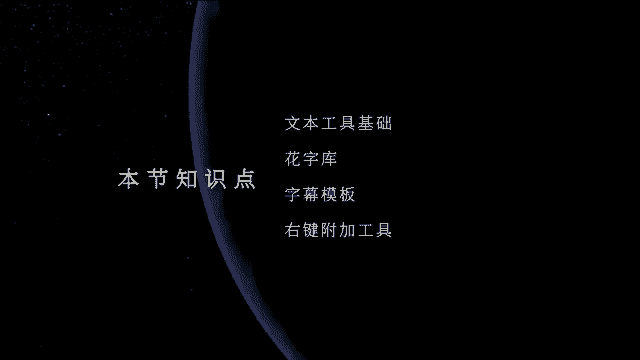

hello大家好，那我们今天继续来学习我们的PC剪映课程。OK那么我们在做片子的时候，很多时候呢，我们都需要运用文字来对影片进行包装。比如说我们一起来看一下我现在剪辑的这个小短片。🎼。

OK我们可以看到这是一个小意识流泪的影片啊。我们可以看到整个影片里面的话呢都是一些用一些各种不同的画面，然后呢组结成我们的一个小短片。那像这个短片的话呢，我们如果需要去给它加一些文字去包装啊。

包装一下的话呢，让它更加的整体影片的一个质感，还有画面呢会更加丰富一些。那我们要怎么去操作的那这个的话在我们的剪映里面去呃添加这一些文字包装的话呢会比较的方便。

首先我们可以先看一下我们菜单郎这边的第三个选项文本。O打开文本以后，那我们可以看到这里面它下面会有一些对应的，就是它有很多自己对应的一些这个模块啊。那我们先来看第一个默认。那默认的话呢。

其实就是相当于自定义文本。你可以自己输入啊。那你可以在这里面比如说你添加到轨道。

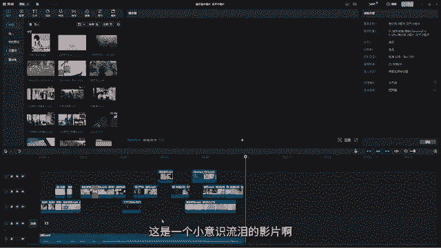

上那这个时候呢，它就会根据你的这个滑块的位置，然后给你添加一个文本。比如说你你想在这里加一个文字，对不对？啊？比如说我们就加一个眼睛，然后呢是吧？哎我们就这种加一些这这种这种文本。那这个文本加了以后呢。

你可以选中这个文本啊，选中文本，然后呢就可以在我们的呃右侧啊，这边的话呢，就可以去选择它的一些字体字号，那比如说这里它的字体选的是系统，那你可以上下拖动它的这个滑块去更新它的一些字体。

O那你也可以在这里改变它的字号啊，比如说你可以弄大一点，对不对？好哎，这种睛哎，比如说就做一些这样的一些文字的包装啊，那这个太大了不好看啊，或者是放到这边来，对吧？好，这里是加粗。

然后呢这个是加它的下划线啊，这个是倾斜啊，好，然后呢这个可以更改它的颜色，你喜欢哪个颜色。然后这下面。有很多这个色块你可以直接去选，那你也可以在上面，然后呢自己去调啊，在这里面哎，想要什么颜色。

你就在这里面去调O然后呢，下面这个的话呢是我们的字间距。那像我们的文字的话，它默认是零啊，我们可以把它的字间距调宽一点，或者是把它给它调近一点哎，调近一点啊，就变成这样啊，那我们很多时候调的时候呢。

不能太宽也不能太窄啊，那合适就可以行间距的话呢，是比如说有两行。那比如说像在这个文字，我在下面我再给它加一行啊，我给它加一行这个拼音啊，眼睛很好看啊，加长一点。ok然后呢这个文字。

然后给它放到这里面来啊，那像在它的一个行间距的话有这么宽，那你就可以通过改变它的这个行行间距啊，是吧？哎让两个字不要分那么宽或者是给它哎拉宽一些啊，那这个是它的行间距，还有这个是它的一个对齐方式啊那。

下是居中，那你也可以一起左对齐或者是右对齐或者是上上下对齐，对不对？上对齐啊，竖版的都可以啊，那自己看你自己的一个喜欢，还有下面的话就是它的样式，这个的话相当于去给它添加一些文字的呃描边啊，好。

我们可以看到现在我们是没有加任何的样式啊，它是这个对不对？好，没有加任何样式，你可以在这里加描边啊，各种各样的这个文字的包装啊，哎，就随以你喜欢你喜欢哪一个，你就加哪一个啊。好。

然后呢这里调的是它的大小啊，整体大小。好，这里还有可以去调它的等比缩放啊，还有居中啊，这里居中，大家注意这里的居中跟我们这上面它是不一样的。这上面对齐的话指的是两个这两个文字的一个对齐方式啊。

然后呢下面的这个呃对齐的话呢，它指的是我们的这个画面，就是这个我们文字在我们画面中的一个。对齐方式。比如说你是这里左对齐，它就会靠近画面的左边啊，明白吧？哎，那我们的文字左对齐的话，它就是左边对齐。

右边对齐的话就是右侧对齐O那我么我们下面这个对齐针对的是我们这个文字在我们画面当中的一个位置对齐啊。好，然后居中就放到中间来，对吧？好，这个是右对齐顶端对齐中啊这个中间对齐或者是我们的下面对齐啊。

所以这个的话就你也可以自己手动的去调它的一个位置。OK下面的话这就调它的不透明度啊，不透明度，O然后呢可以给它加一些描边啊。呃，或者是给它加一个背景框啊。好，然后呢下面还有给它加一些发光。唉。

这个发光啊，那你可以在这里去调它的这个发光的模式，对吧？哎，强度太强了哈，哎可以弄一弄小一点。好，阴影的颜色，那它现在是蓝色，你可以去调啊，比如说你喜欢啊喜欢什么颜色，你就给它调成什么颜色啊，好。

那这个是我们的哎其实说白了就是相当于我们整个面板，你可以自己去给文字去做一些你喜欢的效果啊，那除了我们基础，这里那这里它还有一个叫气泡，这个气泡其实就相当于是对话框啊，啊，我们说话的时候。

比如说这种对不对？哎，说话的时候，它是这种啊对话，对不对？哎，这种去对话的这种形式啊，那我们在做一些视频，比如说人物有人物的对话，或者是啊这种漫画型啊，啊，抖音上有很多很火的那种像漫画一样的对话。

那那一种的话呢就。是用我们的这个哎这种气泡来制作的那目前我们现在是不是很合适啊，所以我们就不要用它啊。那这里面花字。这个花字的话呢，跟我们这个花字它们两个是一样的啊。

他们就是其实就是给我们的文字去套一些模板啊，就设定的模板。刚刚在基础这边我们给文字加了一些样式，然后甚至给它加了它的阴影啊，发光呀。那这些是我们手动自己去调的那有些时候我们可能自己调的没有那么好看。

那这个时候我们就会哎借助它已经设定好的这些模板，比如说我们要用这个粉粉的字，那我们可以加这个对不对？哎，这种的话人家已经做好了，我们就不需要自己再去做一遍啊，直接引用别人制作好的这些花字呢就可以了。

同时它的种类呢是非常非常的多啊。那这个花字你想要在我们的控制面板这边添加，或者是要在我们的就是它的这个文字。🎼模板这边来添加呢都一样，它们都是一样的。哎，大家可以看到啊。

只不过是你在这边就是你在我们的呃它的这个文字模板这边来添加的话，你可以预览这个文字在画面当中的一个作用啊，就你可以去预览啊，那在我们的是吧？哎在我们这边去添加的话呢，哎你直接作用在我们的文字上就可以了。

所以它一边是模板啊，一边是我们的呃预设啊。好，那这个就是我们文字，对吧？花字部分啊，它的一个模板的制作啊。好，那比如说现在我们这个文字你就给它加到这里面来啊，加到这里面来。那这个文字它一个出现。

我们觉得它不是很好看，那你可以在动画这个地方啊，那这个动画的话呢，其实就是给文字做一个出场入场的一个动画，对不对？好，那比如说我们现在哎这个啊这个文字不是很好看啊，我们给它随便取一个，比如说就叫意时。

对对，因为我们这个片子是易识流嘛，易识流小短篇啊，就是哎哎呀我们用一些中文加上我们的呃英文，然后呢让它的画面会更好看一点啊。好，我用这个易时。留啊，然后呢小短篇对吧？OK好，然后在里面我们再加一个啊。

哎，就是包装一下啊，film就是我们的短篇的意思，对不对？好呃，OK那弄好了以后。啊，我们给它调整一下它的这个大小，在基础这边啊调一下它的。把它的间距我们给它调一下。哎，现在哈间距的话呢是有一点点近了。

就不是很好看啊。对吧好，我们可以当选上面的这个部分，然后呢给它哎调大一点，然后让它的整体。好，下面这个你直接去选，然后呢我们就可以啊给它缩小一点，对吧？哎，做一个文字的包装，好，间距啊，文字间距的话呢。

现在是太。好啊，太太宽了，我们给它挨在一起。好，那像这个是吧？哎我们。OK然后呢那像我们的这个文字对不对？文字一时留小短篇，这个它的这个花字不是很好看，我们再给它换一个，哎，感觉这个还不错是吧？

跟我们的影片的整个格调呢还不错啊。那么我们现在看一下，我们给它放到哪里啊。呃，感觉这个我们还需要手动的再调一下。哎就。哎哎或者是。好，或者是我们哎把后面的这个。好，后面这个哎我们可以单独的去调了啊。

没有必要全部去调，对不对？好，那这个意识两个字啊，我们再笑一哎弄让它让它有一点点这种设计感。O然后哎整体再小一些。好，那现在我们这个这个文字已经添加好了，我们给它找一个哎合适的地方给它放上去，对不对？

好，比如说一开始的时候呢，它就已经有了，对不对？那我们的影片在一开始的时候，它是黑色的那它出场是黑色的那我们可以在动画这里给它加一个荡入当出的一个效果啊。我们现在可以看到这上面有好多这种效果，对不对？

好，这里是入场，好，还有一些是这种循环的那我们看一下入场和出场，入场的时候我们来给它找一个荡入当出啊，晕开，哎，感觉这个晕开还不错是吧？好，哎看一下。对不对？哎，好多唉，好多，你看一下唉哪一个你喜欢。

哎，那我们就要这个旋转着进来的这个吧，你直接选中它就行，你不用给它拖过来啊，选中它就可以。然后呢，我们在它的下面这里调一下它的时长，哎，让它出来慢一点，对不对？好，那我们接下来看一下。🎼是吧哦哎。

那他这个时候哎比如说他现在进入到眼睛这里面的时候，我们就让它出去，哎，就不要那么长了啊，那么长。好，那我们在在我们的动画这里面，然后在出场这个地方再给它找一个让它飞出去的一个呃动画啊。🎼好，缩小对不对？

哎，这里面是缩小，哎，慢慢的缩，对不对？好，哎就要这个缩小O也是样我们可以拉长一点。🎼好。🎼对不对？哎，加一个这样的小动画啊。好，那我们这个花字是不是就加好了，哎，飞出来，然后呢好再慢慢的缩小啊。

就转场啊。好，那这个的话就是这里面是入场和出场。那这个的话就是相当于入场和出场，你可以分开来处理啊，分开来添加。那这里的循环的话，就是我们的文字在画面当中的一个动画循环，你要给它哪一个。好。

比如说我们现在这个它是没有这个动画的。好，您可以给它添加上。那这个时候这个文字在画面中就一直闪了，看到没有？🎼哎呀飞进来以后响响响响响，对不对？

那还有很多啊唉比如说我们在做一些哎那种比较节奏感很强的画面的时候，哎，你就可以在上面像蹦迪一样啊。那这个的话就是我们的循环啊，那就是有我们的入场出场，还有循环OK然后呢你都可以去呃自动的去调啊。

那这个就是我们的花字库啊，花字库，还有我们的文本的一个基本调整。好，那这个的话呢，我们就先加到这里啊。那我们下一个我们再来看我们的文字模板。那文字模板的话呢就是相当于我们给它做一个片头和片尾。

或者是在我们的画面当中需要去加一些唉小文字，然后呢来做一些包装。好，比如说它这里是我们是自己做的，对不对？呃，刚刚有这个文字的输入，还有文字的一些它的外表或者是描边，然后甚至是它的动画。

都是我们自己手动去添加的那有同学就是说老师我可不可以直接调用，我就不想去动脑子去去想，那可不可以呢？可以，对不对？可以啊，那这里面有文字模板。那文字模板的话，我们就可以直接调用这个它里面制作好这个模板。

然后直接去用就可以了啊。好，比如说像这个地方，对吧？这蒲公英飞起来，哎，我想在这个地方再加一个文字。好，那像这个对吧？还，我们看一下这个。🎼是吧还就飞起来可不可以呢？哎，可以，对不对？哎，这里面好。

我们直接给它拖进来，对不对？拖进来，你想放到哪里，你就放到哪里。好，拖进来。那这样的话它就哎飞起来了。😊，🎼对吧哎呀，而且很好看，颜色也很好看啊。然后呢，我们只需要选中这个模板。然后呢。

在我们的控制面板这边，我们可以看到它有第一段文本，第二段文本。哎，我们直接给这个给它去更改我们想要的文字呢就可以了。比如说我们刚刚这里我们加一个什么好，飞舞啊，蒲公英它不是飞起来的嘛，对不对？好。

飞舞好飞舞，然后呢我们在沙滩这里我们给它加多肉。多肉对不对？好，然后呢这里hello啊飞舞和多肉是不是就变成我们自己喜欢的了？然后呢缩放你可以整体哎给它缩小一点，对吧？好，缩小一点，哎。

我们可以移一下位置，哎，让它怎么样，甚至你可以把它的这个旋转放一点，哎，让它跟我们的这个画面的一个导向呢，有点点相似。好，它给它放到这里面来。好呃，甚至是它的这个对齐，这些你都可以去调整啊。

那我们刚刚是放到这里，对不对？OK那我们可以来看一下啊，它的这个。😊，对吧哎，然后这个是它的一个模板，然后它下面还有很多很多啊，那这个模板的话呢就比较的有意思啊。哎，你在任何时候。

比如说七夕啊或者约会啊，或者是我们剪一些有关爱情的一些片子，我们就可以用这种粉粉的冒泡泡的这种效果啊。然后甚至是你要包装文字的时候，哎，那像这些对不对？像这种就哎就怦然心动啊，或者是好。

我们可以给它放到这个这个玫瑰花这个地方，我们来看一下合不合适。🎼对吧哎我们可以给它拖拖下面来，然后呢甚至给它弄小一点。好，给它放到这里来啊，怦然心动或者是直接放到画面正中间啊。对不对？

那这个就是我们的文字模板，就添加非常快啊，直接运用它做好的动画，那直接来做就行了。那第一种花字的话呢，需要我们自己写文字，然后只需要我们自己去选它的它的颜色啊后描边，甚至呢它的一个动画啊。

我们都需要手动去操作。那一个是花子，一个是文字模板啊，好，那我们再来看一下我们的第三个叫做智能字幕，这个的一个作用是什么呢？这个智能字幕的话呢，其实就是我们更多时候是用来添加我们的字幕的。

我们再看电影电视剧或者是看一些有剧情，有对话的片子的时候，哎，它下面会有对应的字幕。那这个字幕要怎么去做呢？那其实我们在剪映里面去做这个字幕是非常非常方便的啊。

那我现在啊保存一下我的这个然后呢我们重新新建一个新的面板。然后呢来给大家去讲解一下我们这里面的智能字幕，还有识别歌词。O那比如说我现在这边准备。一些字幕，然后我们可以听一下啊，宴会我们来听一下。

在一次宴会上，马克吐温与一位女士对坐，出于礼貌，说了一声，您真漂亮。那位女士却不领情，高傲的说，可惜我无法同样来赞美您马克吐OK那像这样的一些这种配音啊，这种配音。那我们如果在做片子的时候，对吧？

很多时候呢我们会哎我们直接把这个拉进来啊，啊拉进来，在一次宴会上，对吧？那这个时候我们会给这个画面啊，或者是给我们的这个配音，好，然后呢我们给它先放一个画面，对吧？

比如说我们现在就放一个这样的一个画面啊，然后呢我给他呃ok给它呃改变一下它的速度。然后呢呢像我们要把它的这个字幕给做出来，那要怎么去做呢？哎，最笨的一种方法就是用我们刚刚一开始的那种方法，哎。

这里面默认，然后呢一句一句的给他打出来，听着我们的这个配音，一句一句打出来，那显然这种方式很麻。麻烦的那这个时候呢我们就可以用这里智能字幕。然后呢，我们可以在里面。

它说自动的识别我们的字幕OK选中我们的字幕，然后呢在里开始识别。那这个时候我们稍微等待一下时间呢就可以了。大家可以看到它会自动的把我们的字幕给它识别出来，同时它会对应在我们的这个字幕配音上。

我们现在一起来看一下，再一次宴会上，马克吐温与一位女士对坐，出于礼貌，对不对？是不是我们现在就相当于我们已经给我们这个视频加了一个字幕了。那像这个文字的一个动画，你也可以哎在这边去给它调整，啊。

比如说我们之前去在这里去添加的，对不对？哎，出场或者入场，你想想它怎么出来。好，比如说我们用这个对不对？那我们现在就来看一下，再一次宴会上，马克吐温，然后呢，就每一个我们都给他去添加上呢就可以了啊。

那我们现在显然我们不需要啊O。

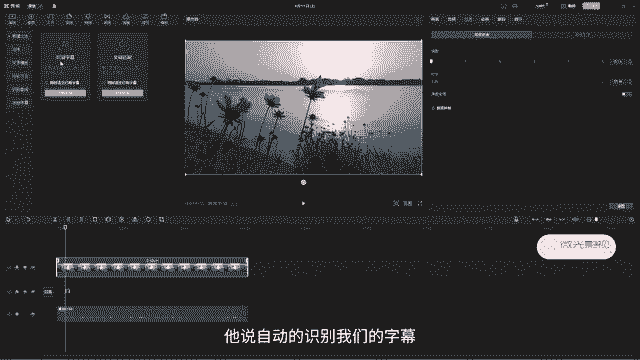

然后呢，那我们这个文字的话也可以去改变它的花字啊，比如说我们现在这边好花字，我们就给大家选一个字体。大家注意啊，我们的这个字幕的话呢，它现在虽然看上去它有很多条字幕。但是呢我们只需要选一个话。

它会自动的同步啊。比如说我们选的是这个对不对？然后呢，大家可以看到马克图温，哎，我们后面所有的这个字幕呢都发生了改变啊，好，再选一个哎选一些你喜欢的，然后呢就可以了啊。好，比如说就选这个然后呢。

我们所有的文字呢，它就已经全部都变成了我们想要的这个颜色或者是花样啊，O那这个是我们的智能字幕，就是它旁边这里有一个叫做文稿匹配是什么意思呢？文稿匹配的话呢，很多时候呢会用在我们的一些比如说宣传片啊。

或者是我们的电影解说啊，电影解说的话呢，很多时候呢都是由我们的文案策划，它把这个整个电影看了以后呢，它。把文案写出来，那写完文案以后，然后呢再剪映给它自动配音。配完音以后，然后呢我们再来做字幕啊。

那这个时候我们在做字幕，你可以直接识别。但是呢这里面这个它自动识别的话呢，有一些语气词，或者是有一些会出现错别字的情况下啊，那这个时候如果你直接有文稿匹配的话。

那就可以去避免掉我们刚刚前面担心的有语气词和错别字的情况啊。比如说啊我这里面哎这里面有一段。好，大家可以看到啊，这个是我找的一个电影解说的一小段啊。那像这种的话，它是已经有文案写出来。那文案的话呢。

出现错别字的情况呢是非常小的，这个几率是很小的那这种情况下，对吧？呃，我们这里是已经有了配音的那我这个时候我就可以把配音怎么样？先给它放到我们的画面上。好，那这一些的话我们先可以先给它整体的加一。

我们先给它隐藏掉啊。那我们可以听一下今天给大家讲一部问情催泪电影。然后呢哎它这里面的话大概的话呢是非常当初从曾祖父为了好，然后呢看一下直接跑出来加门，对不对？是不是就这一小段啊。

然后呢这个是已经配好音的。那我们现在要去给它加上字幕怎么加了，我们只需要把这一段文本怎么样？好，ctrl C复制一下啊，然后呢进入到我们的文本，然后这里文稿匹配开始匹配。好。

然后呢把刚刚的这一个文本给它张贴进来。那现在我们直接开始匹配。OK让我们可以看一下它是怎么去匹配的啊，我们可以稍微等一下时间。😊。

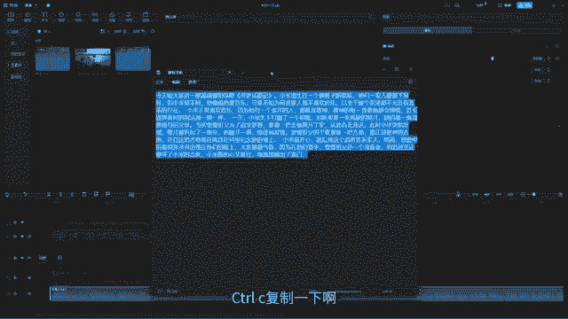

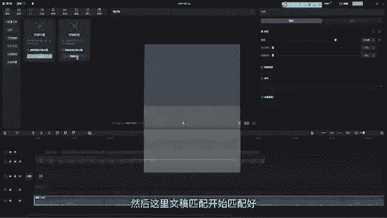

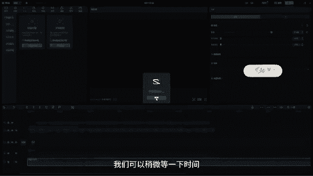

好，那现在它是不是就已经匹配好了，然后我们可以来听一下啊。今天给大家讲一部问情催泪电影寻梦环游记。小米出生在一个做鞋子的家庭，他们一家人都善于止鞋，对不对？是不是就已经做好了啊？好。

然后那这个就是我们的文稿匹配啊。那我们现在来看一下我们的这个的话呢叫做识别歌词。😊，这个识别歌词的话呢是比较有意思的啊。比如说我们现在啊我导入一首歌，然后呢，我们想要把这首歌给它哎做成视频，然后呢。

想要在我们的视频上面去加他的这个歌词。好，比如说我现在找一个嗯好哎，比如说这首音乐啊，这首音乐好。🎼对吧这个贵阳图啊，那我们现在来看一下它如何去识别我们的这个歌词。OK然后点击开始识别。好。

那我们可以稍等一下啊。

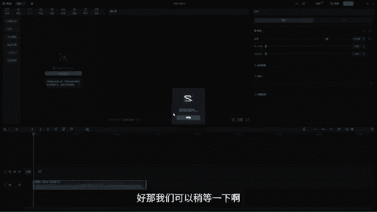

🎼OK那这样可以看到，现在已经好弄好了。然后呢我们一起来看一下它识别的一个结果如何。🎼孤城浅纤笑未赠。Oh。🎼我山之满想。🎼对吧哎，然后我们听一下他唱的这个部分。🎼小遥。🎼为不。🎼都如。🎼共身体对不对？

唉，然后只不过是它这上面会有一些错别字啊，比如说这里感念母恩受辱，这里面的话应该是这样子的啊，受受辱应该是乳是乳汁的辱啊，乳。授辱弓这里弓着身体对不对？哎，授辱它是要呃躬鞠躬的躬啊。

这里面这个躬应该是鞠躬鞠躬的躬啊，躬身体对不对？授乳躬身体啊，所以这个就是如果它智能去识别这个歌词的话，就很快。但是呢我们要去检查它有没有出现这个错别字的情况啊。

它这里的智能识别歌词跟我们上面这个识别字幕它是同样的一个原理啊，O那这个是我们的识别歌词啊，那这里还有一个叫本地的字幕，那这个是什么意思呢？

我们可以看到选中它后这里面会有什么支持SRT啊LRC然后ACCC字幕啊，这个是什么意思啊？那其实我们的一个文本的输出它的一个格式啊，文本的一个格式的话呢，就是我们的SRT啊。

那比如说有的时候我们的字幕是已经做好了啊，但是呢比如说字幕对不对？像我这里这个它就是一个SRT。

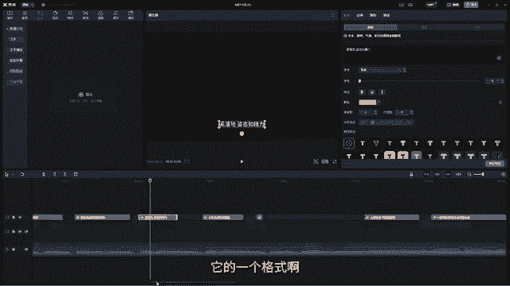

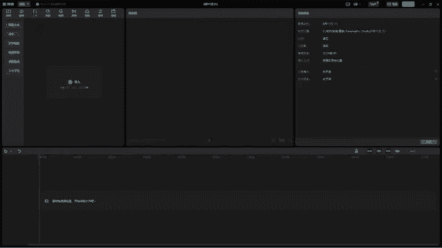

的一个字幕啊，我给他啊呃放放过来。对不对？呃，这个它就是已经呃是1个SRT的。然后呢，相当于是别人已经帮你做好字幕了。好呃，大概它的一个工作原理是这样子的。比如说你小A跟小B两个人，对不对？

然后呢哎小A是负责剪辑视频的。然后呢，小B负责来做字幕啊，这个剪的是视频，这个是做的是我们的字幕，对不对？好，字幕啊，然后呢，那他们两个在不同的电脑上去完成。那最后的话呢，哎小B的字幕已经做好了。

它要如何给到小A呢，那这个时候它就会输出一个文字格式啊，叫做SRRT那这个SRT这个文字格式的话呢，它可以去在小A的电脑上去更改它的错别字，或者是去更改这个文字的，它的一些样式啊，就比较的容易去操作啊。

那我们现在SRRT还有我们的这个文本，我们一起给它放进来啊。好，比如说我们现在就一起放进来。

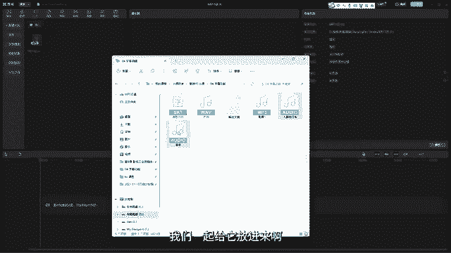

O然后呢，在媒体这边啊，然后呢直接给他。放进来，对不对？OK那我们现在把这个拖下来。那现在这个的话呢，它是配音已经有了。然后呢，我们的这个文本SRT的话，我们直接给它拖进来，就是别人已经做好了。

我们直接拖过来拖过来以后呢，让它的头跟我们原本字幕的头呢给它对齐就可以了。好，然后呢，现在呢就已经弄好了，对吧？那我们来看一下人骑自行车两一小时只能跑10公里左右，那这个SRT字幕的话。

我们不仅可以拖进来，我们还能改变它的位置。把当句你都可以去改变它的位置，对吧？好，甚至可以在这里给它加花字啊，比如说这个花字加上好，然后呢甚至啊加一个夸张一点的。

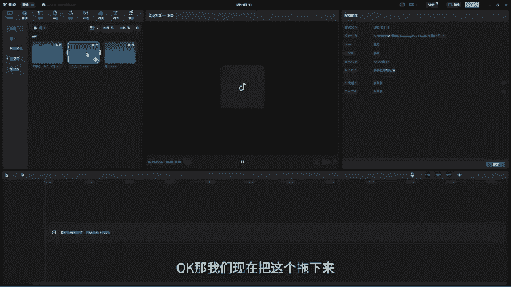

OK啊，或者是放这种好看一点的okK然后呢甚至可以去调它的呃大小，对不对？给它让嗯大一点自行车两脚使毽踩，然后呢是不是就做好了。哎，这个速度就很快，那就省得我们自己在这里再识别一遍啊。那这种方法的话呢。

就是在多人协作的情况下，我们可以一起啊就用这种导入SRT字幕的这种形式。然后呢快速的出篇啊。那这个的话就是我们今天要学的所有知识点。哎，关于我们的字幕。好，那今天的课程就到这里，我们下节课再见。

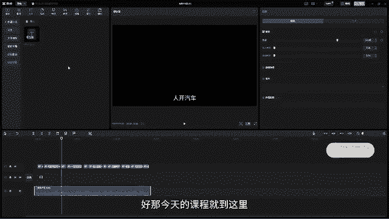