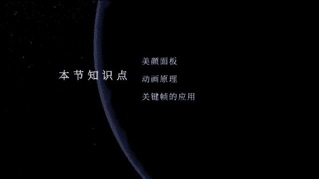
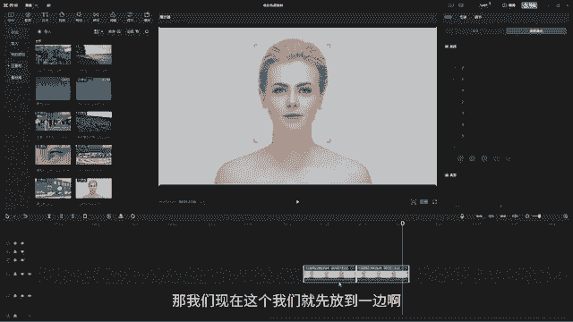
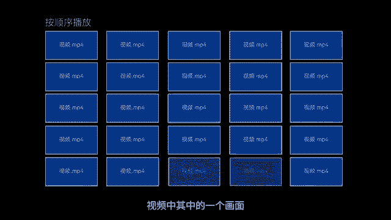
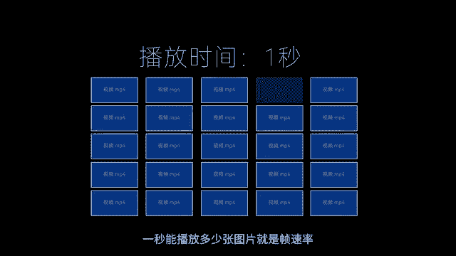
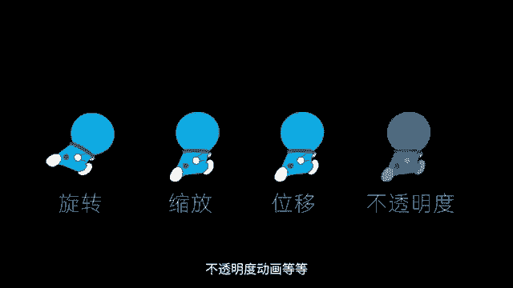
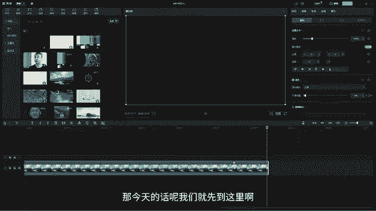

# 剪映手机版教学全新版本，学视频剪辑做视频号运营必看的剪辑零基础入门教程 - P68：P6【电脑版】关键帧的应用 - b财神保佑我 - BV1MasZeeEk9

嗨大家好，欢迎来到剪映PC教程。那上一节课的话呢，我们已经学习了我们的调节面板，还有我们的调色面板啊。那剪映PC版还有一个非常非常牛的一个功能，叫做美颜美体。那今天的话呢我们就开始来学习我们的美颜美体。

我们可以看到在我们的视频控制面板的基础面板这里它有一个叫美颜美体。好，我们直接点击进去，那这个环节的话，就是这个美颜媒体的话，大家注意它只针对有人物的画面。那如果你是一些伤呀水呀。

或者是一些就是一些手特写等等之类的那它是没有办法识别的这个美颜媒体的话，它是去识别人物的一个五官，通过识别人物的五官，然后呢来去制作我们的一些比如说给它去进行啊美颜磨皮或者是加大眼睛等等之类的。

这个功能的话呢，对于女孩子的话就很香啊。那我们一起。来看一下。好，首先我们先打开美颜。那打开美颜以后，那这个时候大家可以看到它会自动的去追踪我们人物的一个脸。那我们可以先让他先把手给拿掉啊。

那么我们现在这个人物整体的一个颜色的话呢，我们可以给它先调一下啊。比如说让他的肤色给它均匀一点。那我们唉你这种去调，看到没有？哎你这么去调，然后呢它就会发生一点点改变，然后呢再丰云一点。

大家注意它的观察它的面部啊，它是不有一点点发生一点点改变啊，好，再来给它加一个磨皮，对不对？哎，那这样肤色就会更加光滑一些啊。好，然后呢还可以再把我们的这个什么法令纹给它取消一下啊。

然后呢眼袋哎也给它呃整一掉。好，美白啊让它肤色更加亮一点，更通透啊。那现在因为它没有效，所以牙齿啊调不了。如果你的模特然后它笑的时候是露齿的话呢，你可以调下它的牙齿O那这里肤色的话，你可以给它换一个皮。

肤比如说它有这个肤色不是很好看。好，你可以给它变亮一点，或者是给它加啊像这种冷白皮的。好，然后或者是加其他的对吧？哎，加更黑啊，那么比如说我们就喜欢这种冷白皮的。

那你还可以让它哎可以手动的再去给它加一点点。好，往这个暖冷暖这边去偏。比如说哎往冷这边去偏就是那种欧洲那边的人，他们的皮肤是不是属于那种非常白，对不对？白种人啊，那就往冷这边走，那如果是亚洲的话。

亚洲的话呢就会偏暖色调，偏我们的黄皮肤啊，OK那我们给它稍微加一点点白。好，这个程度的话，你可以高一点，或者是哎哎减一点啊，那就有你完全有点控制啊。那这样的话我们的美颜地方就弄完了。好。

我们再来看一下还有没有其他的啊，好，它的这里美形那美形的话呢，面部我们可以给它瘦一下脸。😊，哎，比如说我们说哎给整个小V脸对吧？好调个小V脸调到100好，下额骨收一点，哎，收一点，是不是瞬间变成小V脸。

好，额骨太宽了，再收一下啊，那这个上面瘦脸有点夸张了啊，有点不太真实啊。好，我们稍微加一点就行了。好，额骨这里收一下，对吧？好，那下方的长短，比如说我们现在觉得它有点太短了，我们可以加长一点，对不对？

好，哎哎收一下或者是加长啊，加长哎，加一点点就行了啊？哦，那短脸呢你可以把脸给拉长啊，那短脸就会显幼态一点，然后长脸是不是显得高级一点。哎，如果你喜欢长脸短脸让它右态一点，我们就往回收一些啊？好。

流畅脸哎哎拉一下啊，随便每一个都拉一下啊，上庭下庭中庭好，中庭收一下啊，上庭哎下来一点点。😊，好，发际线太高了啊，我们可以再往下收一下啊。OK然后呢这里除了还有眼部。

眼部的话我们可以眼睛怎么样大一点大一点，对不对？好，眼睛大一点稍微一点点就行了，不用太宽啊，好，眼距收一点或者是远一点啊，那我们给他用正常就行。因为我们这个模特她的脸还是比较标准的啊。好。

那你还可以给他开个眼角，让我们的眼睛更大一点，好，高低眼呢你可以调一下，对不对？啊，整体调一下O然后呢鼻子也可以去调啊，好，瘦鼻哎，让鼻子更小，那这个就不是很合适。因为我们的模特鼻子已经很好看了啊，好。

高低鼻，然后什么伤根好可以让他高一点，鼻的大小也可以哎给他收一点点，对吧？O嘴巴嘴巴太哎可以哎怎么样大一点或者是好嘴一点。那其实我觉得用我们模特自己的嘴型呢就可以了啊。好，高低嘴或者是微笑唇哎，加一点。

看到没有？😊，来那好，加一点，看到没有？O稍微加一点点就行了。好，那眉毛也是一样，对吧？眉毛眉间距啊，眉间距可以哎可以过来一点点，好，高低眉调一下啊，好眉峰哎，让它高一点哎眉这个鞋骨，哎这个太高了啊。

就用标准的就可以了。那这样的话我们的哎模式人物这一边是不是就调完了，大家可以对比一下，跟我们一开始一开始的这个调节是不是一样的啊？好，那弄完以后我们还可以在下面来看一下，对吧？好，这里手动瘦脸。

这里相当于就可以自己去捏了啊，拿这个手，然后呢你可以这么去捏，哎，等一下啊，对吧？哎，你可以拿着这个手啊，拿这个手好，你可以这么去捏。看到没有？哎，自己去捏啊的技术，就是如果你的这个技术非常好的话呢。

你可以捏，但是呢我不太建议我们自己手动去捏啊，O然后呢我们直接用它现成的美妆它这里还有什么套装，对不对？😊，好，我看一下好，看一下其他的，比如说这些看一下啊它适合哪一个妆容，哎，每一个都点一下。对不对？

你喜欢哪一个妆容直接弄，它会自动的去识别你的五官啊，并给你画出相对应的一个妆容来啊。对吧？好，我们来看一下哎，哪个比较合适。我刚刚看这个，我觉得这个还挺好看的，去选这个okK口红的颜色哎。

口红的颜色你可以选多一点啊，选红啊，这个颜色你可以自己去选，对不对？那我们用它呃原来的这个颜色就可以了啊。那这个眉毛也是一样，对不对？OK啊，这些眉毛啊，眉眼好，那我们其实用它原来的那个就行了啊。

眼影也是一样。好，眼影可以加一下。😊，OK然后用原来的就就比较好。好，那媒体对不对？媒体那像我们有一些是比如说我们是一整个人啊整个人，然后我们可以调他的身高好，还可以给他调他的腰型。

伸圳的话还可以去给他调一下他的呃，比如说他的脖子啊，对不对？呃？比如说像在肩太宽了啊，我们收一下啊，收一下肩啊，收一下肩。那因为我们这个模特她的肩还挺正常了啊，手臂的话看不见，对不对？天鹅颈哎。

哎样的呃的收一点点就行了，太夸张了，就有点失真了啊。好，瘦身。对不对？好瘦身，因为我们现在这个模特她只是上半身啊，只是半身，所以她看不到啊。如果是全身的话，你们可以看一下，会把人物。

比如说他可能有160斤，然后呢直接给它降到了90斤啊，可以这种去调，对不对？那下面的这些的话呢，其实就是全身的一个调节。那这个调节的话呢，现在就不太适合啊，大家可以去哎拍一个自己的全身照。

然后呢调一下就行了。O那现在这种调完了以后，我们可以对比一下。我们调之前调之后人物发生了什么改变。好，这个是我们调之前的，这是调之后的调之前调之后调之前调之后是不是人物瞬间变得很漂亮。

而且大家可以看到它会自动去追踪他的脸型，当你的手升起来的时候，它是不会去破坏他的妆容的，就不会出现创帮的。你导出的时候呢，这个妆就像是我们人物直接画上去一样啊，就很神奇啊。

所以这个是剪映专业版里非常神奇很牛的一个地方。O那。看完美颜以后，那我们今天还有其他的知识一起来学习啊。那我们要学习的就是我们的动画关键帧。O那我们现在这个我们就先放到一边啊，那什么是关键帧？

那我们在了解和制作关键帧之前，我们需要先了解我们的动画原理。OK那么我们先来知道一下什么是帧，我们都知道啊，视频是由无数个静止的画面组成的那把这一些静止的画面加速播放后就形成了我们看到的视频。

视频中其中的一个画面就是我们所说的帧。

一秒能播放多少张图片，就是帧速率。比如一秒能播放25张图片，那么这个视频的帧速率就是25帧每秒。市面上常见的帧速率是242530到60帧。那什么是关键帧呢，通俗理解就是在需要的地方打上关键的点。

以此来记录画面的变化过程，那这个点就是关键帧啊。比如说我们一个人跑步啊，那一开始它是在起点，起跑之后，经过一段时间，它会跑到终点。那么我们可以在它的起点处打一个关键针，当这个人跑到终点的时候。

我们再打一个关键帧。那么人从起点跑到终点的这个过程就被我们记录下来了。那这就是我们通过关键帧所制作出来的动画，它的原理的话呢，其实很简单，我们在关键的地方打上关键的点，软件会。

自动帮我们补齐空缺中的帧。那明白关键帧的一个底层逻辑之后，我们就可以利用关键帧来制作各种想要的动画效果。比如说我们的旋转动画，缩放动画或者是我们的位移动画不透明度动画等等。

那我们现在直接打开剪映来给大家去演示啊。O那在剪映里面，我们的所有的素材，比如说贴纸啊文本还有特效模板等等之类的，都可以用来做关键帧。比如说我们就来用这个小猪的镜头啊，对吧？那这个小猪的镜头。

那现在的话呢它是在我们画面的这个地方。那我们可以给它做动画啊，我们可以看到我们选中这个小猪呃，在我们的控制面板这一边，只要看到我们的属性后面有这个棱形的小方块。

那就说明我们的这些功能都是可以打关键帧的首先我们可以先看一下它的这个缩放。那我们。

可以在一开始的时候，这个小猪它有这么大好，打上一个关键针啊，我们把这个滑块拖到最后。好，拖到最后的时候，我们把这个缩放给它缩小。那我们小猪从大变小的这个过程就被我们记录下来了。对不对？哎，就变小了啊。

那我们也可以给它加一个动画。比如说我们在我们一开始的这个位置，我们把小猪给它移动到我们的左侧。O我们在左侧的这个地方打上一个关键针。好，然后呢等到我们的小猪，然后呢，我们把这个滑块移动到我们最后的时候。

我们把小猪给它移到我们的右边来。那这个时候呢我们小猪它就会由从左侧，然后呢慢慢的哎移移动到右侧，并且有一个放大缩小的这么一个动画啊，那同理我们下面的这一些啊旋转的话呢，也是一样可以打关键针。哎。

我们可以在好一开始的时候打上一个关键针，O然后到最后。的时候，我们让它旋转多少度呢？哎，我们让它旋转360度。哎，那这样的话我们来看一下啊，那我们这个小猪它就会有一个唉旋转的这样的一个动画啊。好。

那这个就是我们关键帧的一个啊整体的一个使用方法。那关键帧在我们的整个的一些视频当中的话呢，也是非常非常的常用啊。还有一些比如说像素材。好，我们直接在啊我们的素材库这里面，然后呢找到我们的这个素素材。

那很多时候的话呢我们会直接用我们的这个素材啊哎用这个素材，然后呢来做一些动画。比如说我们的不透明度一开始的时候，我们会在怎么样在这里面把它的不透明度调低O然后呢，当它到一定的时长的时候。

我们再把不透明度调高。那我们就可以手动的做一个渐渐引出来的这么一个动画啊，那关键帧的话，你也可以去移动它的位置。那当它的关键帧的两点之间的距离越长。

我们的动画就越慢OK我们可以看到现在我们的关键帧是不是就会好变得会更加慢一些。好，然后呢那到结尾的时候，它结束的时候，好，那又打一个关键帧O然后呢等到我们唉唉结束的时候，我们又把我们的不透明度降低。

那这样的话，我们的视频就在结束的时候，有一个渐渐引黑的这么一个效果啊。那我们的关键帧的话呢。除了以上的这些，它还可以做很多很多的效果啊。然后呢，比如说我们可以做啊抖动的效果呀，或者是去做这种小动画呀。

或者是再去做一些哎以后我们做特效的时候呢，会合成啊，做特效合成。那这个的话呢在下一节课会给大家来一个非常进阶的演示。那今天的话呢我们就先到这里啊。那我们下节课。

