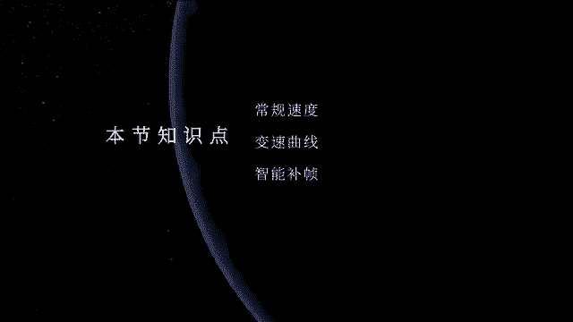
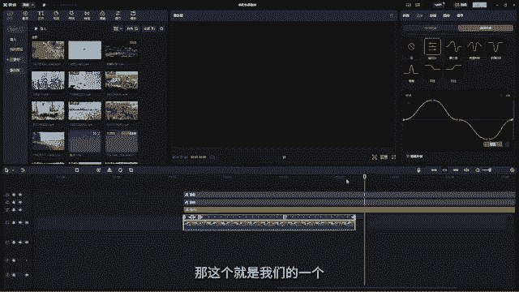
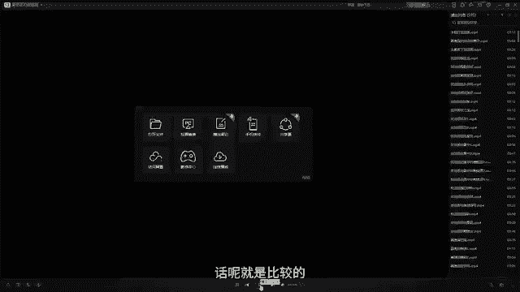
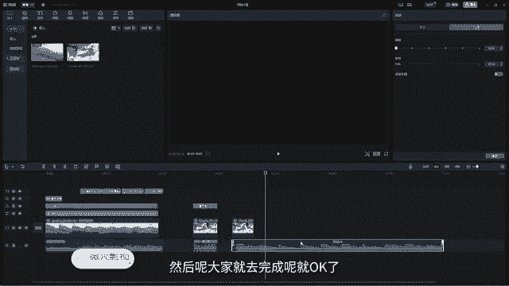

# 剪映手机版教学全新版本，学视频剪辑做视频号运营必看的剪辑零基础入门教程 - P72：p10【电脑版】如何控制视频节奏 - b财神保佑我 - BV1MasZeeEk9

嗨大家好。那今天这一节课的话呢，我们就来学习我们的速度。那我们都知道我们在我们的一个视频啊，我们在正常的一个速度的话呢，它是这样子的，我们先来看一下。

对吧它的一个速度就是比较正常的那我们在看到一些片子的时候呢，它是会速度它会突然变得很快，然后呢又变得很慢啊。那那种速度的话，我们应该怎么去调O那这个变速的话呢，我们就需要来学习。

我们今天在我们的效果空间面板。这里的第二个功能叫做变速。那我们打开变速以后，这里面它有两个选择，一个叫做常规变速，一个叫曲线变速。那我们先来看一下常规变速。常规变速的话呢，比如说我们现在的一个视频啊。

它现在的一个速度的话呢，是这种比较正常的那我们可以给它变为更慢的速度，或者是把它改为更快的速度。比如说我们的这个这里有一个叫倍速。那现在它是1。0的情况下。

那就说明我们的速度是趋于正常的那当你把它往低于一。0那就调慢速度，同时它的时长会发生改变。比如说它现在1。0的时候呢是15。4秒，那你把它改成0。5。当你改成00。5的时候，我们的这个视频，然后呢。

它的速度会变慢，相当于在原来的基础上，然后呢变慢一倍。然后呢，它的一个时长也会发生改变。大家可以看到啊，时长现在已经变成了30。8秒。那我们可以一起来看一下我们的这个速度，它的一个播放速度是什么样。

我们可以看到现在我们的整个画面的一个速度呢已经很慢了，尤其是我们的这个车，对不对？已经很慢了啊，非常非常慢。那如果你再给它改成更小的呃，比如说在0。1，那这个时候它的一个时长呢已经达到了154秒。

那这个时候我们可以看到画面的速度呢几乎是一帧一帧的在进行啊。所以像这种情况的话呢，就是去改变速度，比如说视频的一个速度把它改成慢速啊，慢速非常慢非常慢啊。所以我们的这个常规情况下是一啊，就是11。0。

那就是正常的速度就是低于1。0，那就是慢速度，那如果高于1。0呢，比如说我们把它改成1。5。好，那我们改成1。5的时候呢，它的时长从原来的15。4秒变成了10秒。那我们接下来看一下它的一个速度变化。

大家可以看到我们的速度好像有点呃变得有点点快了，对不对？但是不是很明显啊，那我们再来变啊，比如说啊三倍。那这个时候我们的视频时长从15秒，然后呢已经变成了5秒。然后我们来看一下。

是不是这整个画面都像是加速了一样，对不对？同时我们的视频时长呢也会发生改变啊。那么这个就是常规速度，就是改变视频的快和慢啊，快速度或者是慢速度啊，O那这个的话就是比较常规的这种速度调节方法。

那有些时候我们在剪辑的时候，我们想要跟着我们的音乐，然后去加速我们的视频。那这个时候我们要怎么去改呢？其实在我们这里面有一个叫曲线变速，我们可以看到哈这里面有很多很多的这种呃预设啊。

比如说我们选择蒙太奇。那当我们选择蒙太奇以后，我们可以看到它的这个时长，哎，变成了11秒，然后呢，同时它的速度呢是有像这个曲线一样发生改变。我们可以来看一下啊，看一下。OK速度比较正常，然后呢慢慢加速。

然后加速，然后又呃慢回来，然后呢又趋于平稳，对不对？那这种是不是我们在做片子的时候，有时候我们会结合音乐的一个节奏感，是不是就可以给它做出这种啊，突然变速，然后呢又慢慢转过来的这种感觉。

那这个在我们的一些vlog拍摄，或者是我们的一些旅拍当中非常常用啊。那这个是蒙太奇，还有一个是英雄时刻，大家可以看到它的曲线呢是这样子的。好，速度变得很快，然后呢又慢慢慢回来了，又突然加速。

OK然后呢又慢慢回来。这里面大家注意这个曲线啊，这个曲线要怎么去观察它。大家注意我们这个曲线它中间会有一个哎一，然后呢，往上是10X往下是0。1X。然后呢，我们的这个曲线。

这个曲线哎波形最高的地方就是我们的速度最快的地方。那大家注意它的这个波形是要往上哎往正速1。0这边啊就往十这边走的时候，哎，它是加速，然后呢往下走的时候，它是减速，那大概的一个它的一个曲线的。

它的曲线值的话呢，是这样子的。我们可以这么去理解它趋于平稳的时候，比如说中间这个就是我们的一呃一对不对？我们的1。0啊，1。0X就是正常的速度，那我们的曲线如果是这样走的话啊，一开始啊然后是这样走。好。

然后呢啊往下。OK那这个时候我们的曲线它的速度是什么样子呢？因为往上的话呢，它速度就是10好，10X。然后呢往下就是0。1X。所以我们的速度在这个波峰最高的这个点点的话，我们的速度是从1。0加速到10。

然后呢又从十0慢慢慢的降到我们的1。0。OK那我们从零这里的时候呢，它又慢慢的降速，降速就是变慢，对不对？降速，然后呢降到我们的0。1，然后呢又慢慢提速提到提到我们的正常速度，然后呢又加速啊。

所以我们的波波峰最高的地方就是我们的速度最快。或者是最慢哎。我们的这个波谷啊，如果它是朝上面的话，就是最快，朝下面就是最慢。那这样的话我们就呃理解了这个逻辑以后。

那我们是现在是不是就可以很快就很清楚的去知道我们的这个速度的一个调整了，对不对？OK那这个是王太极，那英雄时刻，它的一个曲线是这样子的。好，子弹时刻是这样子的，我们再来看一下。好，非常快L突然变得很慢。

好，又加速又变得很快，对不对？那这个子弹比如说子弹在空气中飞。好，它飞到这里的时候，哎，来一个超慢镜头，哎，让我们看清子弹的样子。然后呢又好速度非常快的。然后呢呃就是弄过去。好，这个是叫跳楼啊，跳楼。

然后我们来看一下。应该是掉跳楼，对吧？哎，它是一直很慢很呃，趋于这个相对于比较慢的一个速度，在1到0。1之间，然后呢突然加速好，非常快，然后呢又慢慢慢慢的回来，对不对？

然后它的一个速度就到这个地方时不是突然加速非常快啊，那这个是快进。对不对？快进哎，突然进，然后呢又好趋于正常啊，这个是闪出。好，慢慢慢慢慢慢的突然啊慢慢慢的，然后呢要突然闪出去，非常快出去，对不对？

OK那这个的话就是我们的它的这里的一些曲线变速的一些相当于预设。那你调速速度的时候，就不用手动去调。那如果你想调成自己喜欢的速度呢，你可以点击自定义。那这个时候的话呢。

在我们的这个素材上面就有对应的一些点，你可以直接在这里去调。那我们都知道我们的速度往上是怎么样，是加速往下是减速，对不对？那么我们可以哎哎，比如说我就往往上面去调。然后呢中间的话你也可以给它加点啊。

比如说在这个地方，中间你可以加一个好，加一个点，对不对？好，然后呢给它往下。哎，那你可以调成这样，那我们来看一下。好，突然变，然后呢又变得很慢，对不对？OK然后呢我们又好把这个哎往上调。好，在这中间。

然后又加一个。O我们大概都在这中间加一个，然后我们来调一个。好，这个往下。这个晚上。OK这个往下对不对？那我们来看一下我们的一个速度，它是怎么样子的。好，很快又变得很慢。然后呢，又。非常快。

然后就一直快骂快骂。对不对？那这个就是我们的一个速度啊，就是我们可以自己自由的去调整我们的这个速度。那如果你不喜欢的话，你就重置OK重置好，重置了以后，速度就没有了。然后呢。

你就哎整体比如说我们整体往上调好，然后呢又整体往下调。那我们可以看一下它的一个曲线是这样子的。OK然后呢又这种往上走，对不对？往上走。好，那这个就是我们的一个速度曲线的一个调整。

那我们可以看到这里有一个叫补帧。哎，这个补帧是什么意思呢？就是我们都知道啊呃我们在调整速度的时候，呃，其实就是去呃让加速我们的这个帧率，我们都知道帧率是什么是帧率啊，就是一秒可以播放多少张图片，对不对？

那我们在前面讲的时候也讲过啊啊，一张这样画面就是一帧，那既然是这样子的话，那么我们的25张啊，25帧，对不对？25帧啊，这个呃KK。

BPS啊，那25帧每秒对不对？25帧每秒，那当我们去加速的时候，其实就相当于把25帧给它怎么样。哎，在这中间，然后呢把它变得再加一些帧率，再加帧，让它变得更多挤压型啊。比如说我们的呃给大家画一个这个。

OK然后呢，我们是哎一帧一帧的，对不对？我们的图片是一帧一帧的。好，然后呢，那我们去加速的时候，那就把我们的这个怎么样，哎，把帧率它之间的空隙就变变弱，哎，变小，对不对？变小啊。然后呢。

那这样的话我们的速度播放的时候是不是它是不是就变快。同时我们的时长也也变短了，对不对？那如果减速减速的话呢，哎就是它就它就加长我们帧与帧之间的距离，OK比如说它到这里对不对？它做这里应该是一帧了。好。

现在它就变成这样哎，加大了它帧与帧之间的距离。😊，OK那加大了帧与帧之间的距离，那我们中间空的太久，那我们看到画面的时候，它可能就是一顿一顿的就有点卡帧，对不对？有点卡帧，就没有我们播放那么流畅啊。

那这个时候呢我们就需要智能去补帧，把它啊让它把中间这些给补上，哎，至至少它在变慢速度的同时，然后我们看着画面的时候，能够让它的画面更流畅啊，不至于非常的这种出现卡顿的这种情况啊。

那这个时候我们就怎么办呢？哎我们可以点击一下这里的智能。比如说我们现在把它整体啊，用这个我们OK然后我们把它整体给它好，降的很慢，对不对？好，那我们的这个速度，我们给它降的很慢。好，这个我们加起来。

OK那现在我们的一个速度哈，它现在就就很慢。😊，对不对？达到这个点的时候，或者是我们可以好，我们可以把这个。O然后我们可以在这里面加一个点是吧？好，在这中间啊，在这中间。OK那这样的话。

我们的这个视频它是怎么样？哎，达到这个地方的时候，它的速度就会变得很慢。大家可以看到，现在它是不是一顿一顿的那这样它是这种一顿一顿的那这种一顿一顿的其实是会很影响我们的光感的。

那这个时候我们可以点击一下下面的智能补针。唉，让它把我们中间一顿一顿的这个地方补上我们对应的一个帧O我们可以点击一下智能补针。好，然后呢这里有一个帧融合，然后呢有一个光流法。

大家注意我们的这个帧融合的话呢，它补的会更快一些。但是呢它的这个效果呢不是很好。因为它的这个计算方式呢相对来说会比较的简单啊。然后我们可以用光流法光流法的话呢是最常用的一种补帧方法。

我们直接用光流法O光流法的话，大家可以看到我们的处理时间会需要更久。但是呢它补帧出来的画面呢会更流畅。所以我们啊在用的时候呢，大家可以尽可能的花一点时间，我们直接用光流法的话呢就好了。

那像我们等它处理完以。😊，后我们可以再来看一下我们的画面，它的一个结果是什么样子。OK那这在它显示已经补正完成了，然后呢我们一起来看一下它补完以后的效果是什么样子啊。那我们可以看到。

它虽然画面已经变得非常非常的慢，但是并没有像刚刚一样一卡一卡的，对不对？那整体看上去就是那种所谓的超级慢动作的这种感觉啊，然后呢再慢慢慢慢的起来。好，然后呢速度在回归于正常。好，然后呢现在又开始加速。

对不对？哎，那这个就是我们的一个变速啊，变速。那通过变速的话，我们可以做出很多很多炫酷的效果啊。OK那比如像我们的这个案例的话呢，就是通过我们的变速变速调节，然后呢再结合我们的音乐。

然后呢做出来的这个效果，我们一起来看一下。对不对？那这个效果的话呢就是比较的。

好，那现在的话呢我们就一起把这个案例呢操作一下。OK那么我们现在把我们的这个素材啊，我们把这个素材再拖到我们的时间线上。好，拖到现时间线上以后呢，我们再把我们的这个音乐给它拿过来。那这个音乐的话呢。

我们直接用我们的这个案例音乐呢就可以了好。复制1个okK然后呢复制过来。那我们现在可以看到我们这个音乐的话，它现在是这样子的。😊，对吧然后呢音乐弄过来了以后，然后呢大家一定要去注意啊。

我们一定要给它去在这里面给它加一个踩点。大家注意节拍。2，那我们要通过它的这个节点，然后呢来哎再结合我们的这个速度，然后呢来调整画面的一个呃曲线速度啊。好，那么我们现在啊直接啊我们来看一下，对一下。

🎼对不对？是不是他在里叫这里的时候，我们我们就要给他怎么样，哎，要给他加速。好，到这里啊，有人呃叫起来的这个地方，然后就要加速。好，那我们直接进入到自定义里面。O然后在这个地方。

大家可以看到我们在这里的时候，好，这里有一帧。好，哎，加上一帧啊，加上一帧。好，然后呢加上一帧以后，我们把它往旁边哎旁边这里再加一帧，看到没有？

哎把它这个中间再加一帧O然后呢那在我们的大家注意是在我们音乐的这个就是叫声起来的，这里加一帧。好，然后呢，然后呢加完一帧以后，我们再往前面加一帧，然后呢就相当于又在这个中间。

然后呢再加一帧O加完一帧以后，我们就可以把中间。😊，好，把中间的这个我们就可以提起来了。哎，这种提起来。好，我们来看一下。🎼对不对？然后呢，这在他提起来以后，我们看。😊，好，他有一点点这个不太对。好。

我们可以往后移一点。O。🎼对不对？然后现在我们可以看到。对不对？然后呢又到这里面啊。🎼好，他这里要叫了。好，它这里又叫了，然后呢，我们再OK好在在它叫的这个地方。OK然后呢。

在这里又给它对一个OK然后呢往旁边啊，旁边，然后呢又加一个。😊，好，加一个，然后呢再往这边，然后呢又加一个ok加完了以后，我们把中间的这个给它拉起来。大家注意这个时候你拉的时候。

你因为你的视视频时常会发生改变啊，因为视频时常会发生改变。所以我们的这个点啊这两个点之间是不是就会错开。那这样的话，你可以你可以把我们的这个什么哎我们整体的这个这个给它往后移。好，哎，放到这里面。

我们可以哎移到后面去。哎，只要他的这个对齐呢就可以了。好。哎，移一下啊移一下ok那我们来看一下。😊，对不对？然后呢，这个啊这个有点点歪了啊，有点点歪，然后呢大概调整一下。🎼对不对？然后呢。

这里又有1个OK然后在这里面也是一样啊。好，前面加一点，后面再加一点，然后呢注意调节啊，注意调节的时候一定要对齐。因为你在调的时候，它的速度是会发生改变的啊，发生改变。所以我们再调调完了以后。

我们还需要去哎它现在的这个叫声对不对？是在这里啊，所以我们要把整体给往后移。😊，哎，要把它移对啊，就是我们的这三个点哎，加速这三个点，然后呢，要跟我们的音乐啊在在一起。对吧好，那我们来看一下啊。😊。

对不对？那这个时候我们的这个就是这个语跟着我们的音乐加速的这个效果呢，是不是就做好了？好。😊，对不对？然后后面还有很长的音乐啊，我们可以听听。好，然后呢后面的这个音乐的话呢，就就当做这个作业。然后呢。

大家就去完成呢就OK了。那我们的这个变速的话呢，对我们视频剪辑，还有最后我们的一个节奏感，哎，节奏感的一个提升，对于整个影片的一个整体节奏的和把控也是非常的重要啊。所以大家一定要多去练习。

那一定要熟悉的去运用啊。OK那么我们今天这节课就先到这里，再见。

