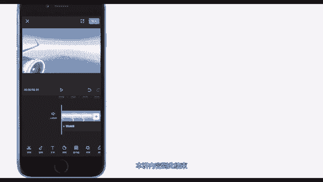

# 剪映教程 从零开始学剪辑教程手机版（适合零基础小白学习）剪映新手剪辑！（2024全套新手入门实用版） - P13：1.剪映功能面板介绍 - 视频号运营新手 - BV1jK22YEE8y

一讲主要是带领大家了解剪映各项功能面板，熟悉剪映的剪辑流程。本讲很简单，没有难点，所使用的工具是剪映2。6。1，当前最新版本。好，开始今天的讲解吧。剪映是抖音官方剪辑app。

它不是市面上功能最强的剪辑app，但却是目前最好用的那一款，打开剪映可以看到起始界面由三部分构成。第一部分是创作区域点击开始创作就可以开始剪辑视频。

点击右上角出现项目初始设置页面，可以设置视频输出分辨率，是否添加PA尾，是否需要水印。第二部分是草稿区域，包含剪辑草稿和模板草稿。顾名思义就是你所有未完成的项目文件都会保存在这里。但需要注意的是。

已经剪辑完成的视频在保存到本地的时候，同时也保存到了草稿箱。下面是功能区域。解辑就是对应的初始界面。解同款里面有一些教程和模板。方便用户快速上手。消息是系统消息。我的是个人信息页面。回到简辑。

点击开始创作，选择视频或者照片，点击添加到项目即可成功导入。进入编辑界面后，我们可以看到预览区域、时间线区域和工具栏区域在预览区域此处表示，当时时间和总时长，点击此处可全屏播放。点击此处可以预览视频。

当你操作失误，可以点击这里撤销操作或者恢复操作，中间是时间线区域。这里是时间刻度，这条固定的白线是时间轴，我们可以在时间线上任意滑动视频。时间轴对应到时间刻度的时间，就是当前时间。在视频轨道下面。

我们可以增加音频轨道、文本轨道、贴纸轨道、特效轨道、音频文本贴纸轨道可以有多条。特效轨道只能有一条。在这个位置，双指捏合就可以缩放轨道时间线大小，点击这个喇叭就可以开关视频中的所有原声。

如果您还想要添加其他素材，点击加号导入即可。接下来看工具栏区域，点击相应按钮，可以进入二级工具栏。好了，本讲内容到此结束，希望大家坚持学习下去。

