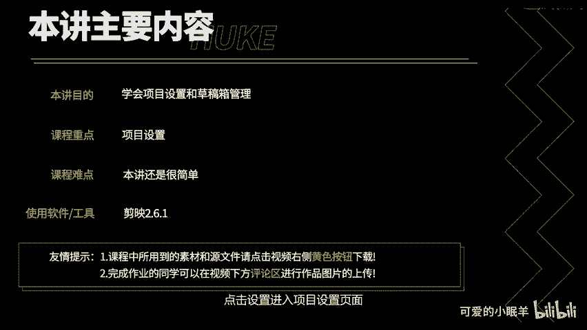
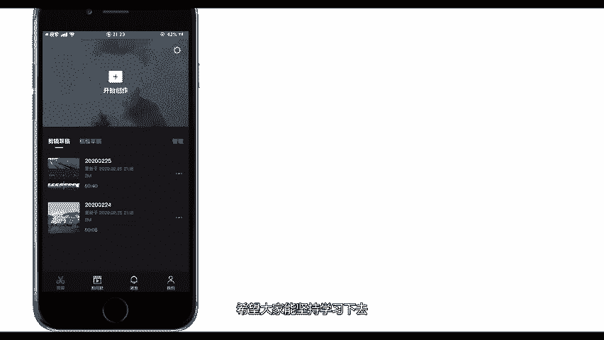

# 剪映教程 从零开始学剪辑教程手机版（适合零基础小白学习）剪映新手剪辑！（2024全套新手入门实用版） - P14：2.项目设置和草稿箱管理 - 视频号运营新手 - BV1jK22YEE8y

过本讲你将学会如何对项目进行设置以及草稿箱管理的方法。虽然很简单，但是很实用。现在开始今天的讲解吧。

点击设置进入项目设置页面，简映提供了两种视频分辨率，1080P和720P。当前，国内视频平台支持的主流分辨率为1080P，所以尽量将你的视频设置为1080P。点击这里设置是否添加偏尾。片尾是这个样子。

我推荐你不要这个片尾。点击这里设置是否需要解同款水印，由于不支持自定义水印，所以我也推荐你将水印关掉。点击叉号退出，项目属性已经设置完毕，接下来设置草稿箱。草稿箱包括剪辑草稿和模板草稿。

剪辑草稿里面的草稿来源自点击开始创作后，你一步一步剪辑完成的视频。模板草稿里面的草稿来源自剪辑同款里面套模板剪辑而成的视频。点击管理，你就可以将它们选中删除。不过有时候发布后的视频出现问题还需要修改。

这个时候就需要用到草稿箱里面的草稿。所以说我推荐大家，假如手机内存足够的话，将这些草稿文件保留。好了，本讲内容就到这里，希望大家能坚持学习下去。

