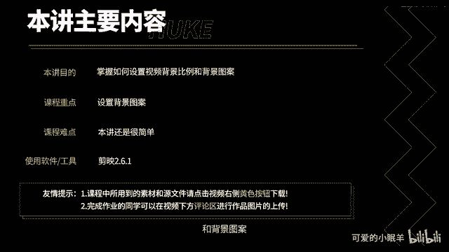
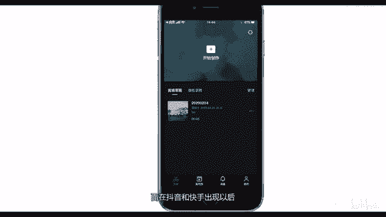
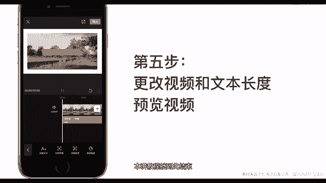

# 剪映教程 从零开始学剪辑教程手机版（适合零基础小白学习）剪映新手剪辑！（2024全套新手入门实用版） - P15：3.设置视频背景比例和背景图案 - 视频号运营新手 - BV1jK22YEE8y

将通过一个案例来让大家掌握如何设置视频背景比例和背景图案。

在开始之前，我们来了解一下传统视频平台和先性视频平台视频比例的区别。在抖音和快手出现之前，我们习惯于看横向视频。而在抖音和快手出现以后，竖向视频开始流行。

今天我们就通过一个案例来给大家演示，如何通过剪映来设置视频比例和视频背景，点击开始创作导入素材，剪映的视频比例由第一个素材决定。比如这里第一个导入的素材为16比9，所以这个视频的比例就是16比9。

点击比例抖音提供了5种视频比例9比163比41比14比3和16比9。下面学习如何设置视频背景，设置之前将第一个视频素材缩小，选中素材双指捏合，缩小素材。视频缩小后点击返回。点击背景。简映提供了三种背景。

画布颜色、画布样式和画布模糊。点击画布颜色。可以设置重色背景，颜色都还不错。点击画布样式，在画布样式里面，我们可以选择本机图片，也可以使用检验提供的图案。检验提供了很多好看的图案供大家选择。

选择好合适的背景，点击确定推出。点击画布模糊，可以看到有4种模糊程度供你选择。点击应用到全部可以将背景应用到全部片段。现在我们已经学会设置视频比例和背景了。接下来我们制作一个可爱的视频背景。

但是由于每个人的审美不同，所以说我尽量做的好看一点。第一步，双指在预览区域分开，将边框设置为合适宽度。第二步，将边框设置为纯白色。第三步可以发现四个白边宽度不等不太好看。所以说需要通过裁切素材。

将四个白边设置等宽。第四步，添加文本。新建闻等我的第一个视频点击确定。然后设置文本格式。在这里我设置一个气泡格式。关于文本，我后面会详细讲解，添加动画。在这里我添加一个收拢动画。更改视频和文本的长度。

便于更好的预览，点击预览。好了，本奖教程就到此结束。

