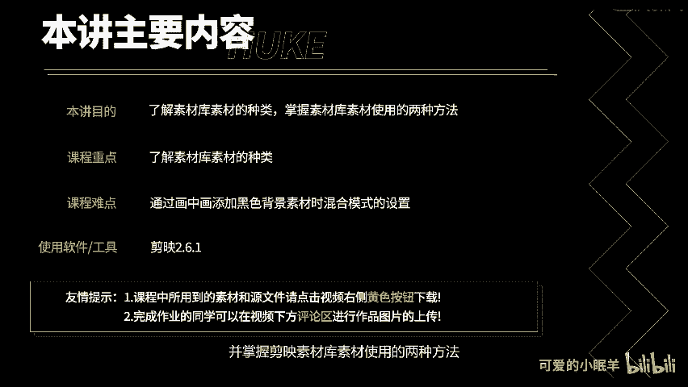
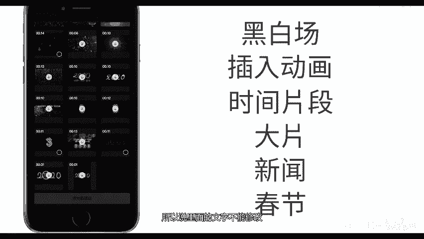
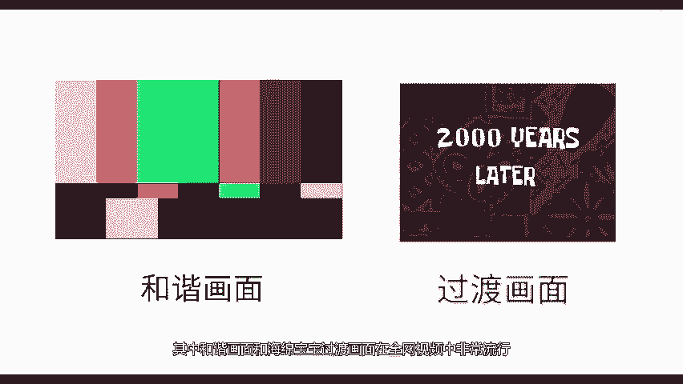
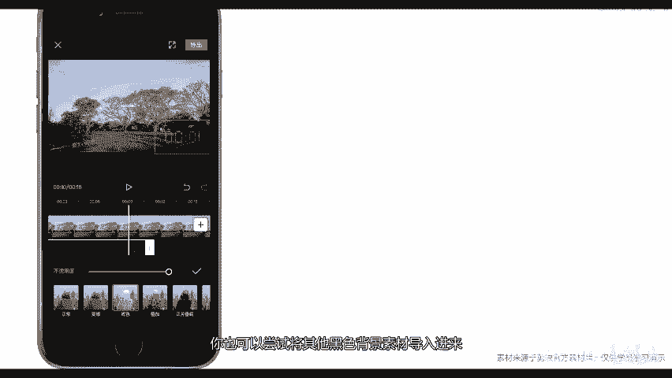

# 剪映教程 从零开始学剪辑教程手机版（适合零基础小白学习）剪映新手剪辑！（2024全套新手入门实用版） - P16：4.素材导入 - 视频号运营新手 - BV1jK22YEE8y

主要带领大家来了解剪映素材库素材的种类，并掌握剪映素材库素材使用的两种方法。点击开始创作。之前已经讲过如何导入本机素材，在这里不再讲解，点击素材库，剪映素材库内置了丰富的素材，主要有黑白场插入动画。

时间片段、大片新闻。春节。但是由于它们是一些视频片段，所以说里面的文字不能修改。其中和谐画面和海绵宝宝过渡画面在全网视频中非常流行。下面我们来演示导入素材故素材的第一种方法。雪中素材。

点击添加到项目素材出现到时间线上。预览素材。2000 years later。素材成功导入。接下来我们来演示导入素材库素材的第二种方法。点击开始创作，导入本机素材。调整素材持续时间。点击画中画。

点击新增画中画。可以选择素材库中黑色背景的素材导入进来。在这里我选择了10秒倒计时素材，调整素材大小，并将素材放到右下角。点击混合模式，点击绿色，点击预览，可以看到神奇的事情发生了，黑色背景被去除。

只保留了红色数字。这就是素材库素材使用的第二种方法，你也可以尝试将其他黑色背景素材导入进来。现在给大家留一个作业，就是制作一个光斑的效果。这个光斑的效果在素材库里面有，你只要稍微一找就能找到。

