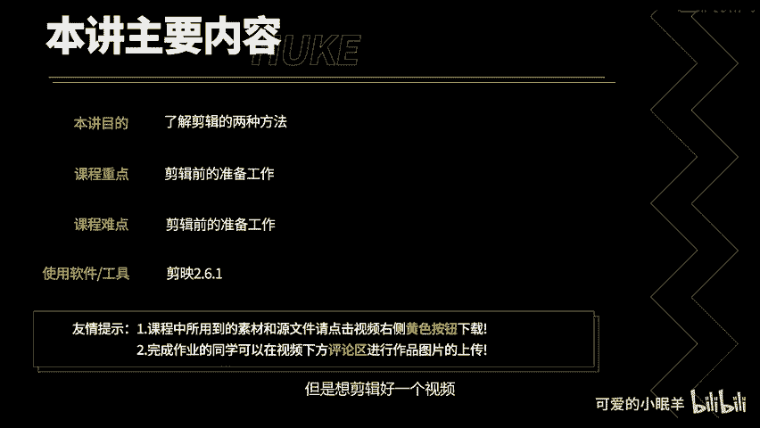
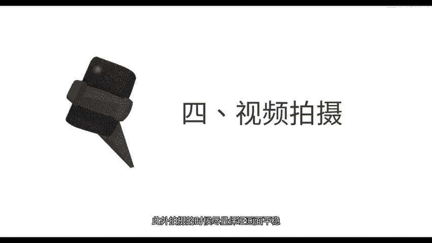
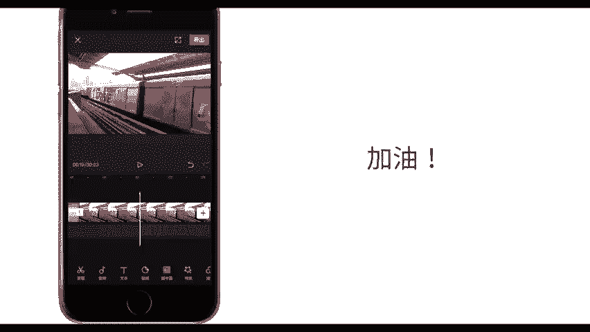

# 剪映教程 从零开始学剪辑教程手机版（适合零基础小白学习）剪映新手剪辑！（2024全套新手入门实用版） - P17：5.剪辑的两种方法 - 视频号运营新手 - BV1jK22YEE8y

想给大家讲解解辑的两种方法，内容很简单，但是想解辑好一个视频，光会解辑还是不够的。最重要的其实是解辑前的准备工作。第一，做好选题。

尽量选择一些有趣的能调动观众情绪的内容。第二，准备好脚本，脚本就像写作文一样，接来让你的内容有开头、发展、高潮、转折、结局等环节的内容。简单来说，尽量让你的故事有头有尾，有过程，这还有那么一点点曲折。

第三，设计分镜头起码得在脑子里有一个大概的印象，你的视频镜头应该怎么拍？景别尽量涵盖近景、中景、远景。拍摄同一动作组合镜头往往比长镜头看起来更高大上。按照你前三步的准备，开始拍摄优点也很明显。

拍摄效率高，不会在剪辑的时候发现漏掉镜头。此外，拍摄的时候尽量保证画面平稳，假如有手机稳定器的话更好。

做好以上准备工作，我相信你一定可以解辑出来一个非常棒的视频。

下面给大家介绍剪辑视频的第一种方法，粗剪。粗解只需要用到4个基础操作，拖动分割、删除和排序。这四个功能学会以后，其实你解辑已经入门了，点击开始创作，选择素材，点击添加到项目，选中素材。

拖动尾部即可删除或者恢复尾部的视频。同理，拖动开头也可以调整。再比如这个素材中间部分我不想要可以使用两次分割工具，将一个片段解集为三个片段，然后将中间的片段删除。就把我们不想要的片段删除掉了。

选中并长按素材，所以素材变成如图所示的小方块，这个时候就可以对视频进行排序了。将素材移动到合适的位置，松手即可。通过对素材排序，将你的素材按照脚本顺序排列，这样你就完成了视频的粗检工作。

接下来我们来学习视频经简。放大时间线就可以对素材进行精细剪辑。简映知识的最高剪辑精度为4帧画面。低于四帧画面无法分割，等于或者高于4帧画面可以分割。不过也没有关系，这个精度已经能够满足我们大多数需求了。

值得注意的是，拖动首尾剪辑视频可以达到逐帧剪辑。通过视频粗解和视频精简，你已经能够完成视频的剪辑工作。好了，本讲内容就到此结束。

