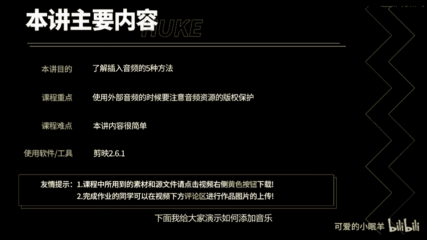
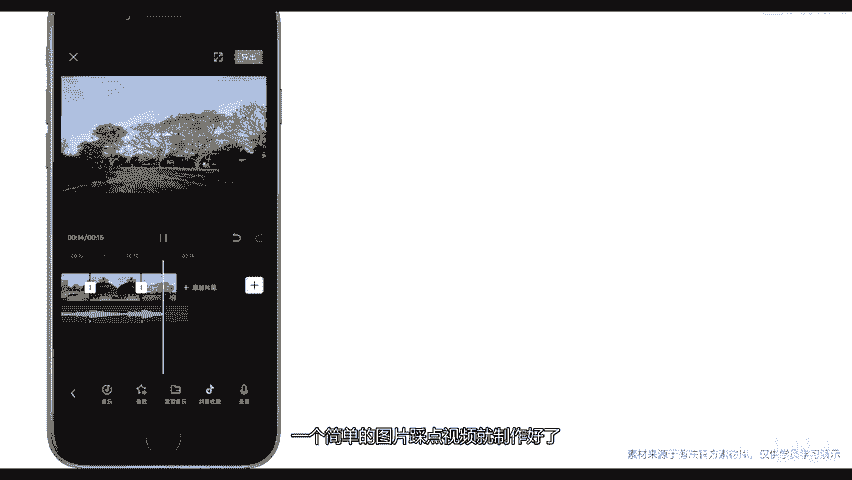

# 剪映教程 从零开始学剪辑教程手机版（适合零基础小白学习）剪映新手剪辑！（2024全套新手入门实用版） - P18：6.插入音频的5种方法 - 视频号运营新手 - BV1jK22YEE8y

通过本讲，你将了解到如何在剪音中添加音频。此外，本节还将给大家带来抖音很火的卡点视频制作案例。下面我给大家演示如何添加音乐，将素材导入时间邂后，点击音频，出现二级工具栏，点击音乐出现音乐库。

里面的音乐特别丰富，系统推荐了一些音乐。

使用前需要点击下载，下载完成后才可以点击使用。我的收藏里面是解音音乐库中的收藏音乐，抖音收藏里面是登录账号后同步过来的抖音音乐库里面的收藏音乐。导入音乐里包括三部分内容。

点击链接下载可复制其他音乐平台的音乐地址，比如网易、云音乐或者抖音等。粘贴地址后，点击这里可以下载音乐。随着国内版权意识的不断增强，使用外部音乐的时候，请尽量使用一些别版权的音乐。第二个。

提取音乐可以将本机的视频背景音乐提取出来。第三个，本地音乐需要通过itunes同步音乐比较麻烦，适合已购买正版歌曲的用户点击插后返回，下面学习如何添加音效，点击音效，解映内置了种类繁多的音效。

合适的音效能够提升你的视频效果，添加方法和添加音乐相同，需要下载后才可以使用。点击使用音效出现到视频下方，提取音乐和抖音收藏。刚才介绍了，现在就介绍最后一个录音。点击录音，按住红色按钮即可录音。

松手录音结束，点击对号，录音出现在视频素材下方，学习完了如何添加音频，现在来学习，如何对音频进行剪辑。点击音频，点击音量默认音量为100，最高支持雅贝音量。点击淡化淡化是音量剪辑中经常会用到的一个功能。

通过添加淡入淡出，可以让你的音频开始和结束不再突兀。点击分割可以将音频分割成两段。点击踩点可以添加点踩点功能，待会儿会通过案例详细讲解，点击删除，可以将选中的音频删除掉，点击变速，可以对音频进行加减速。

复制功能可以复制一个当前音频。音频操作部分大概就这么多，下面我带领大家制作一个简单的踩剪视频。点击开始创作导入素材。选择添加到项目。点击音频。点击音乐。第一四制作彩蝶视频，推荐大家使用一些舒缓。

但是节奏明显的音乐。我在这里使用了一首我提前找好的简单音乐。点击音乐。然后可以点击添加点，手动的对音频进行标记。也可以将光标移动到点的位置。把点删除掉。🎼新手，我更推荐大家使用自动踩点功能。

检验提供了三种踩点方式，踩节拍一踩节拍二踩旋律。当你制作踩点视频的时候，你可以将三个踩点方式挨着听一遍，选择一个最适合你的。🎼我感觉采节拍的效果非常好，就这个了。裁点操作完成后。

现在需要将素材的长度进行设置。简单来说就是让素材刚好在点的位置进行切换。当你拖动视频尾部的时候，素材会自动吸附到我们的点位上面，非常方便。同理，对以下素材进行长度剪辑，使它匹配于我们的踩点。

使用同样的方法，使余下素材对齐我们的点位。然后再预览一下。🎼，🎼一个简单的图片裁剪视频就制作好了。

