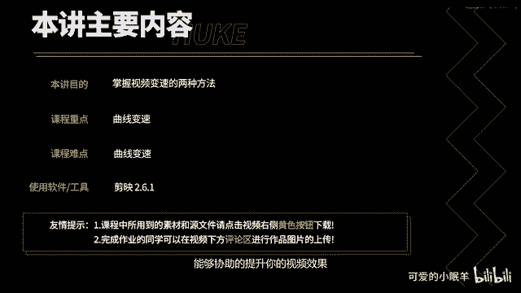
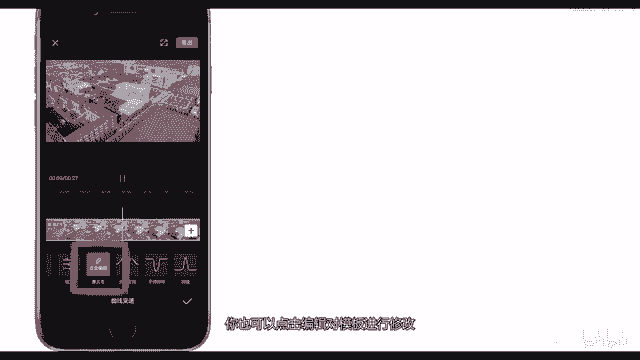
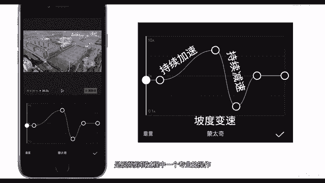
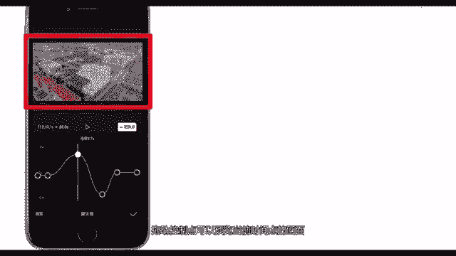
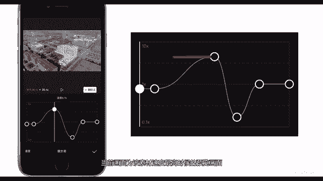
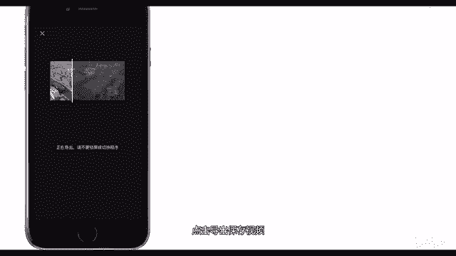
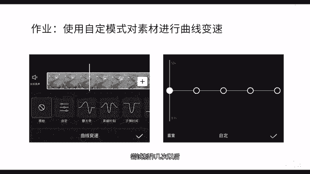

# 剪映教程 从零开始学剪辑教程手机版（适合零基础小白学习）剪映新手剪辑！（2024全套新手入门实用版） - P19：7.曲线变速 - 视频号运营新手 - BV1jK22YEE8y

过本讲你将掌握视频变速的两种方法，其中的曲线变速是很多剪辑大神喜欢的一个功能，搭配合适的镜头移动技巧，能够协著的提升你的视频效果。

点击开始创作，导入素材。选中素材点击变速剪映提供了两种视频变速方式，一种是常规变速，一种是曲线变速，常规变速和其他剪辑app相同。剪映支持最低0。1倍速，最高100倍速，点击声音变调可以更改音调。

点击对后返回选择曲线变速。检验内置了6种变速模板。选择蒙太奇模板，选择模板后，简验会自动预览变速后的效果。假如你对变速后的效果不满意，你也可以点击编辑，对模板进行修改。上升曲线代表视频在持续加速。

下降曲线代表视频在持续减速。这种持续的曲线变速方式又被称为坡度变速，是视频剪辑过程中一个专业的操作。很多大神的视频里面都会用到这一技巧，视频的忽快忽慢，可以增加我们所谓的仪式感。

我们可以移动速度控制点的位置。也可以在曲线空白处点击添加点，增加控制点，同理将光标移动到控制点的位置，可以点击删除点。这里代表素材初始长度和变速后的长度，点击重置可以恢复默认设置。

拖动控制点可以预览当前实界点的画面。

当前画面为该素材速度最高时候的预览画面，使用曲线变速的一个技巧是，假如你想给一个物体特写，你可以移动最低速控制点，直到预览画面中，该物体出现在画面最中央，现预览一下，可以看到当前预览画面有点卡动。

因为当前版本是测试版本，所以这个问题后期有可能会修复。

当然，这也和我的手机性能有关。点击导出保存视频。

最后我们来对比一下。可以看到变速以后的视频效果确实提升了不少。最后给大家留一个作业，使用字恋模式进行素材的曲线变速。尝试制作几次以后，我相信你一定能够制作出比我更优秀的作品。

